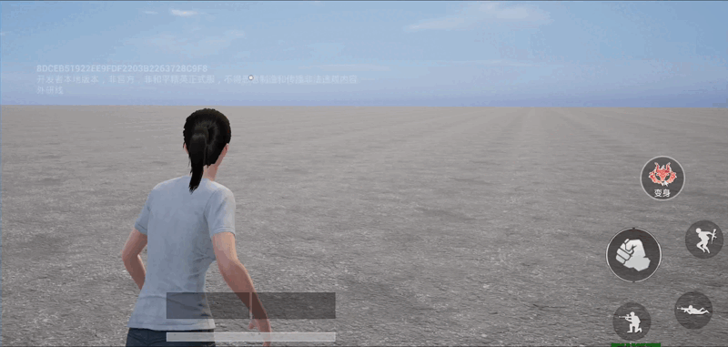
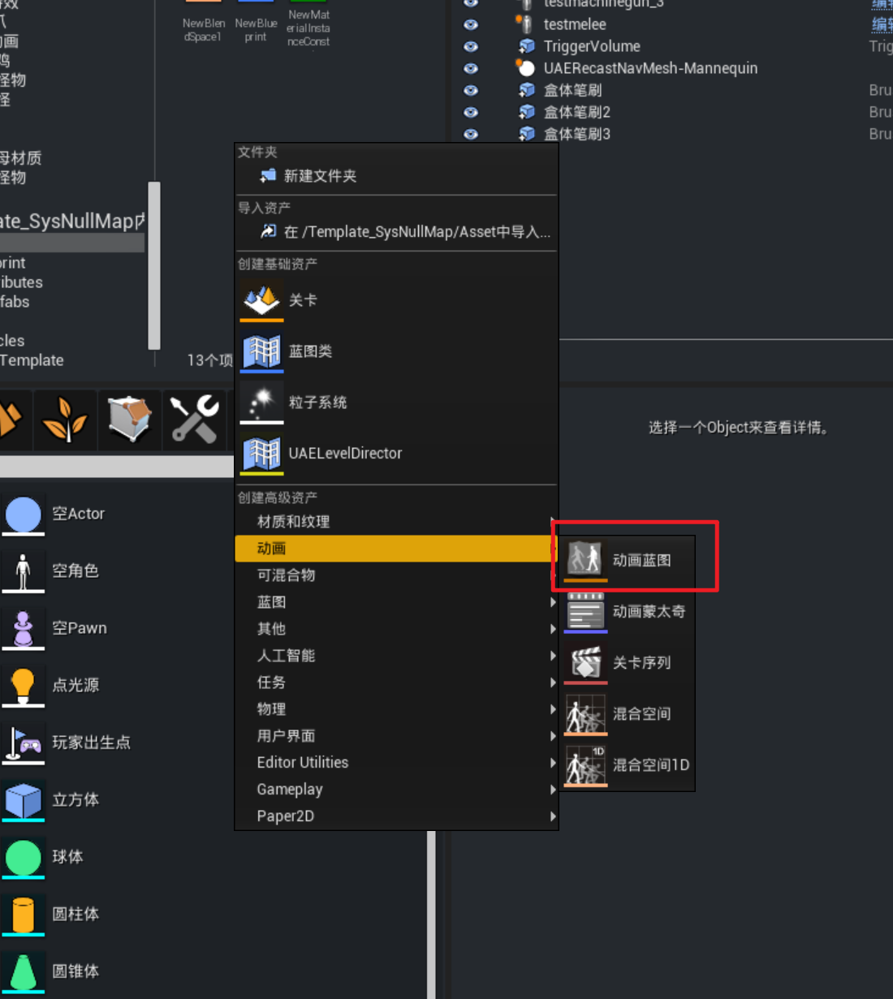
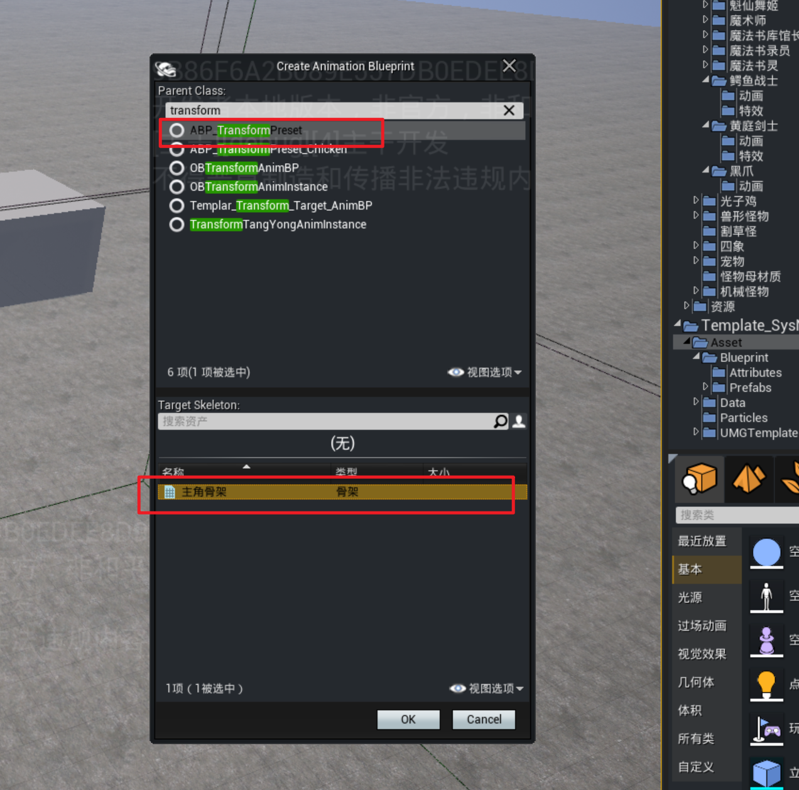
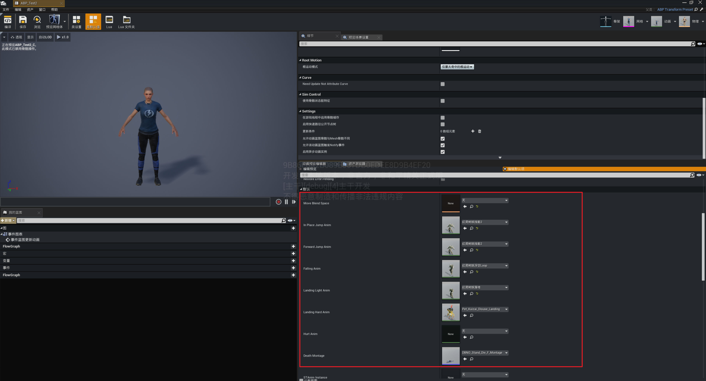
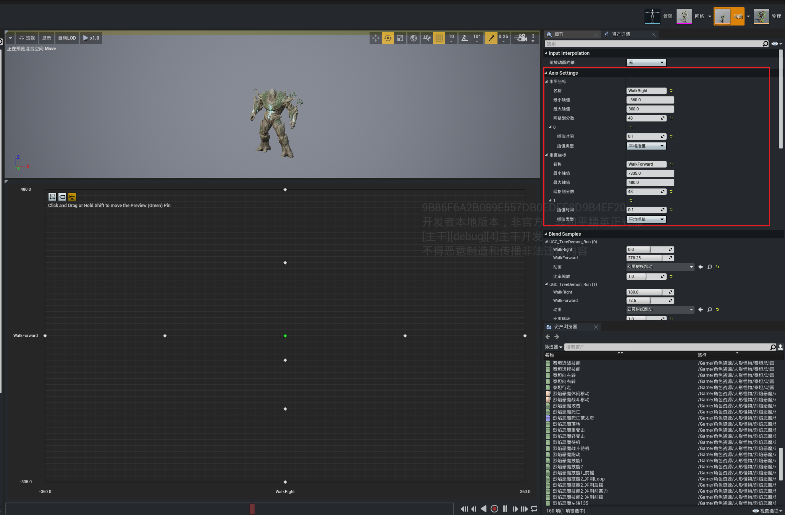
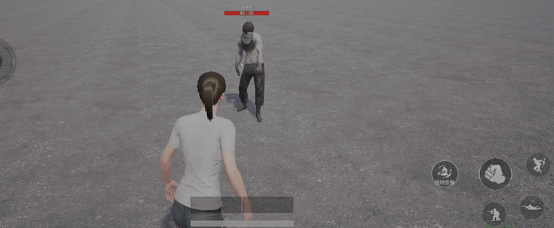

# 变参Buff模板

Buff编辑器提供了部分特化制作的功能型Buff模板，通过参数的形式提供效果设置，方便开发者直接配置应用。

## 隐身

获得持续6秒的隐身效果。

|属性名|属性说明|
|-|-|
|Invisible Material|隐身的材质|
|Self Alpha|主控端视角下隐身效果的透明度，0~+∞|
|Enemy Alpha|敌方阵营视角下隐身效果的透明度，0~+∞|
|Friendly Apha|友方阵营视角下隐身效果的透明度，0~+∞|
|Invisible Color|隐身透明效果的颜色|
|Enemy Visible Distance|透明度变化阈值，与敌人距离小于该值时，透明效果将从 ``Enemy Alpha`` 变为 ``Friendly Alpha``|

## 被透视

透过障碍物揭露在指定目标的视野中，持续8秒。

|属性名|属性说明|
|-|-|
|Occlusion Highlight Color|透视效果的颜色|
|Occlusion Highlight Type|透视效果生效的目标类型  - 仅Causer透视：透视效果仅对Buff的释放者生效 - Causer及其队友透视：透视效果对Buff的释放者及释放者的队友均生效 - 所有人：透视效果对所有人生效|

## 变身-静态模型

角色变身为指定的静态模型，该模型无动画，但可以正常移动。

|属性名|属性说明|
|-|-|
|Extra Health|变身状态下获得的额外生命值，启用后生效|
|Enable Extra Health|是否启用额外生命值|
|进入变身时间|进入变身的过渡时间，该时间下人物无敌且无法操作|
|退出变身时间|退出变身的过渡时间，该时间下人物无敌且无法操作|
|变身技能模组|变身后角色获得的技能组，如果变身前角色装配了技能，则将强制替换为配置的技能组，且变身结束后还原|
|变身模型和动画类型|目前支持静态模型（Static）、主角骨骼模型（Pawn）和怪物骨骼（Preset）三种 变身为静态模型时，会自动隐藏携带在身上的头、包、甲、武器等外显模型|
|Mesh Relative Transform|静态模型基于角色坐标点的位置偏移/旋转偏移/缩放|
|Collision Type|静态模型的碰撞体类型，支持碰撞盒（Box）和胶囊体（Capsule）|
|Box Extend|静态模型碰撞盒的大小，针对 ``Collision Type`` 为“Box”时生效|
|Capsule Radius|胶囊体的半径，针对 ``Collision Type`` 为“Capsule”时生效|
|Capsule Height|胶囊体的半高，针对 ``Collision Type`` 为“Capsule”时生效|
|Hide Material|隐藏头、包、甲等外显模型时使用的材质，保持默认即可|
|Fade in Speed|变身过程中相机变化淡入淡出的速度|
|Offset|相机跟随目标点的偏移|
|Spring Arm Length Additive|角色弹簧臂的变化量|
|Sprint Arm Rotation|角色弹簧臂的旋转|
|Additive Offset Fov|相机FOV修改量|
|Transform Static Mesh|变身的目标静态模型|

## 变身-主角骨骼

角色变身为指定的带主角骨骼类型的怪物模型，具备角色完整的动画功能，可正常移动、攻击等。

|属性名|属性说明|
|-|-|
|Extra Health|变身状态下获得的额外生命值，启用后生效|
|Enable Extra Health|是否启用额外生命值|
|进入变身时间|进入变身的过渡时间，该时间下人物无敌且无法操作|
|退出变身时间|退出变身的过渡时间，该时间下人物无敌且无法操作|
|变身技能模组|变身后角色获得的技能组，如果变身前角色装配了技能，则将强制替换为配置的技能组，且变身结束后还原|
|变身模型和动画类型|目前支持静态模型（Static）、主角骨骼模型（Pawn）和怪物骨骼（Preset）三种 变身为静态模型时，会自动隐藏携带在身上的头、包、甲、武器等外显模型|
|骨骼模型|变身的目标骨骼模型，模型的骨骼必须为 ``主角骨骼``|
|Transform Scale|变身后骨骼模型的缩放大小，包括碰撞体和胶囊体等|
|主角动画列表|变身后需要替换的 [姿态动画](../../怪物系统/20251_怪物动画.md) 列表|
|获取的武器ID|变身后获得的武器物品ID|
|Fade in Speed|变身过程中相机变化淡入淡出的速度|
|Offset|相机跟随目标点的偏移|
|Spring Arm Length Additive|角色弹簧臂的变化量|
|Sprint Arm Rotation|角色弹簧臂的旋转|
|Additive Offset Fov|相机FOV修改量|

## 变身-怪物骨骼

角色变身为非主角骨骼类型的怪物模型，具备角色完整的动画功能，可正常移动、攻击等。

|属性名|属性说明|
|-|-|
|Extra Health|变身状态下获得的额外生命值，启用后生效|
|Enable Extra Health|是否启用额外生命值|
|进入变身时间|进入变身的过渡时间，该时间下人物无敌且无法操作|
|退出变身时间|退出变身的过渡时间，该时间下人物无敌且无法操作|
|变身技能模组|变身后角色获得的技能组，如果变身前角色装配了技能，则将强制替换为配置的技能组，且变身结束后还原|
|变身模型和动画类型|目前支持静态模型（Static）、主角骨骼模型（Pawn）和怪物骨骼（Preset）三种 变身为静态模型时，会自动隐藏携带在身上的头、包、甲、武器等外显模型|
|骨骼模型|变身的目标骨骼模型，模型的骨骼为非主角骨骼的其他任意怪物骨骼|
|Mesh Relative Transform|骨骼模型基于角色坐标点的位置偏移/旋转偏移/缩放|
|Collision Type|骨骼模型的碰撞体类型，支持碰撞盒（Box）和胶囊体（Capsule）|
|Preset Box Extend|骨骼模型碰撞盒的大小，针对 ``Collision Type`` 为“Box”时生效|
|Preset Capsule Radius|胶囊体的半径，针对 ``Collision Type`` 为“Capsule”时生效|
|Preset Capsule Height|胶囊体的半高，针对 ``Collision Type`` 为“Capsule”时生效|
|Preset Transform Anim|怪物模型对应的动画蓝图，参考设置光子鸡 ``ABP_TransformPreset_Chicken`` |
|Fade in Speed|变身过程中相机变化淡入淡出的速度|
|Offset|相机跟随目标点的偏移|
|Spring Arm Length Additive|角色弹簧臂的变化量|
|Sprint Arm Rotation|角色弹簧臂的旋转|
|Additive Offset Fov|相机FOV修改量|

### 动画蓝图ABP使用说明

对上述Preset Transform Anim动画蓝图进行说明

首先创建动画蓝图

动画蓝图创建时，选择

创建后动画蓝图后，需配置动画蓝图的默认参数进行动画列表的替换——即控制变身的模型在执行对应行为时播放什么动画。

（注意，建议只修改动画蓝图这里的动画列表相关参数，不用轻易修改其余配置项，否则可能出现配置项不正确的情况。）

MoveBlendSpace：代表变身模型移动时使用的移动动画资产。是一个BlendSpace资产。

该移动BlendSpace的创建需要遵守一定的规范

|参数名|参数说明|
|-|-|
|水平坐标名称|需要配置为WalkRight，且取值范围需要配置为真实速度的取值范围，运行时，实际会将真实速度在角色右朝向的分量传进来（比如此时角色朝左运动，则此时传进来的值为-[移动速度]，朝右运动，则此时传进来的值为[移动速度]）|
|垂直坐标名称|需要配置为WalkForward，且取值范围需要配置为真实速度的取值范围，运行时，实际会将真实速度在角色前朝向的分量传进来（比如此时角色朝前运动，则此时传进来的值为[移动速度]，朝后运动，则此时传进来的值为-[移动速度]）|
|Blend Samples|根据实际的需要，将左走、右走、前走、后走等不同动画配置到不同的位置即可|
|InPlaceJumpAnim|原地起跳使用的动作|
|ForwardJumpAnim|向前起跳使用的动作|
|FallingAnim|在空中滞空的Loop动作|
|LandingLightAnim|轻落地动作|
|LandingHardAnim|重落地动作|
|HurtAnim|被攻击时播放的动画。该动作需要是一个叠加类型的动作资产|
|DeathMontage|死亡时播放的蒙太奇。该资产需要为一个蒙太奇。且该蒙太奇的最后一个阶段需要为循环且卡在死亡动画的最后一帧（这是为了保证死亡过程中死亡动画播完且目标还未销毁时，目标最后可以保留在一个静止的死亡Pose）|

## 怪物变身

怪物变身为静态模型或者其他骨骼类型的怪物模型，具备怪物完整的动画功能，可正常寻路、攻击等。

|属性名|属性说明|
|-|-|
|TransformMeshType|StaticMesh/SkeletalMesh，变身后的模型是静态模型还是骨骼模型|
|Mesh Relative Transform|骨骼模型基于角色坐标点的位置偏移/旋转偏移/缩放|
|Preset Capsule Radius|胶囊体的半径，针对 ``Collision Type`` 为“Capsule”时生效|
|Preset Capsule Height|胶囊体的半高，针对 ``Collision Type`` 为“Capsule”时生效|
|怪物动画替换列表|变身为新怪后，新怪每一对应的动画行为，对应需要被替换的动画|
|进入变身时间|进入变身的过渡时间，该时间下人物无敌且无法操作|
|退出变身时间|退出变身的过渡时间，该时间下人物无敌且无法操作|
|Extra Health|变身状态下获得的额外生命值，启用后生效|
|Enable Extra Health|是否启用额外生命值|
|变身技能模组|变身后怪物获得的技能组，如果变身前怪物装配了技能，则将强制替换为配置的技能组，且变身结束后还原|
|BehaviorTree Settings|变身后怪物的行为设置，可以替换怪物变身后的行为树，且配置行为树的参数，变身结束后，怪物的行为还原|
