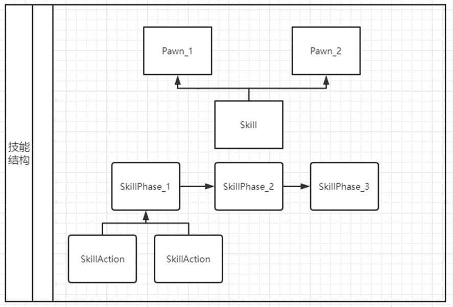
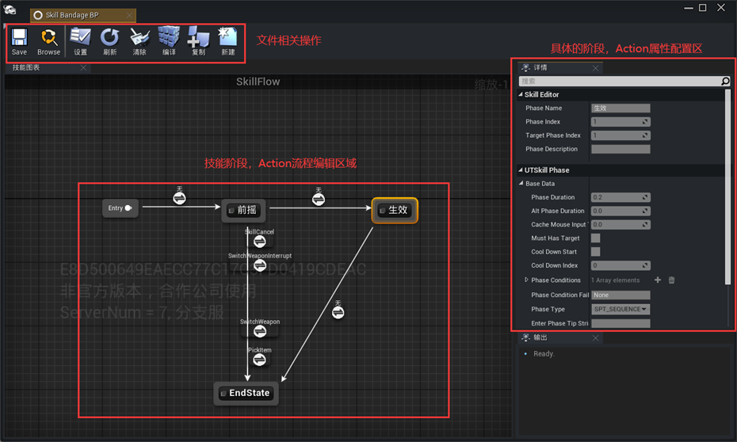
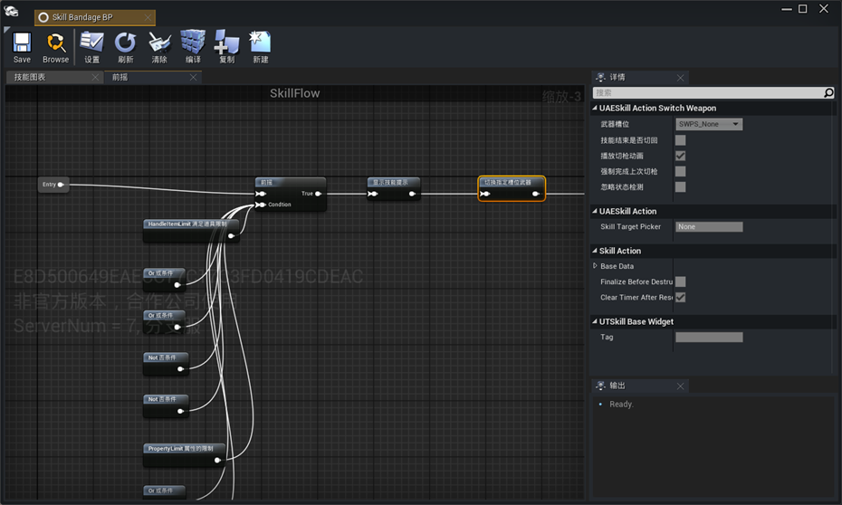
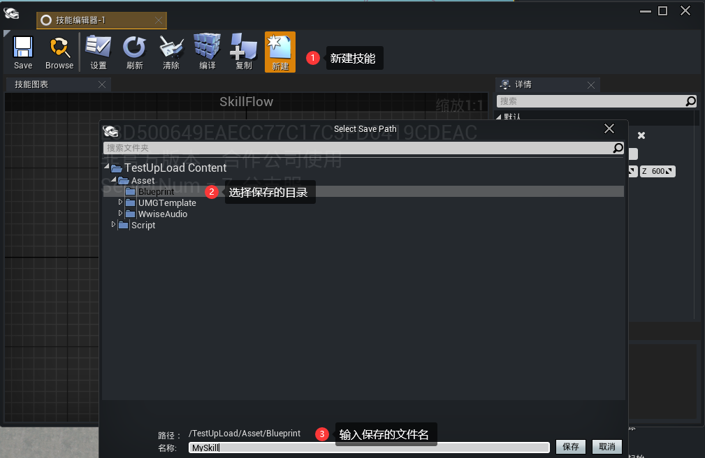
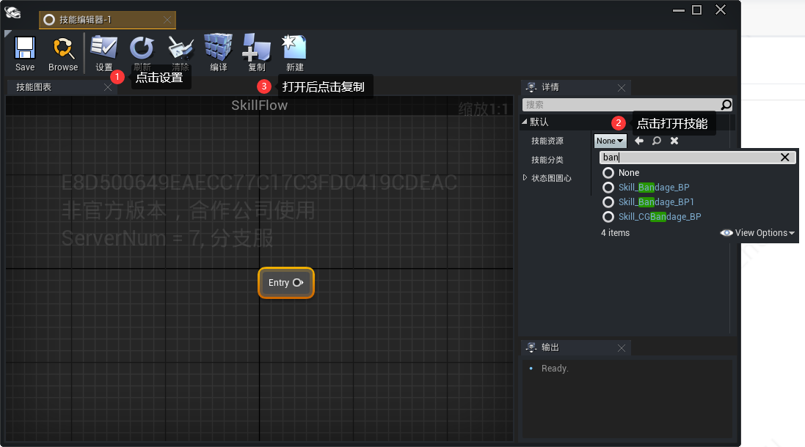
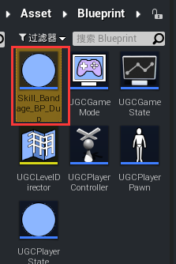
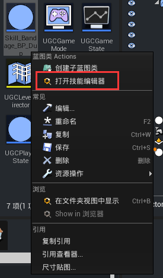
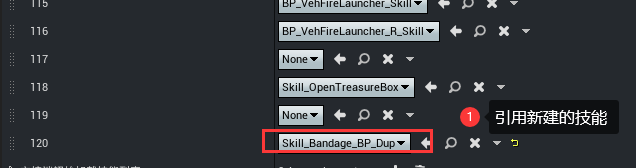
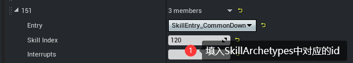
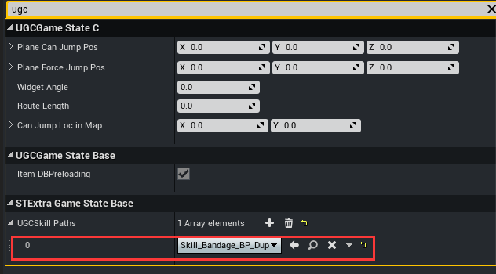

#  快速入门

## 技能框架简介
-  <span style="color: #ff0000">技能为模板，不同角色共用一份技能实例</span>
- 一个技能包含多个SkillPhase（阶段）
- 默认情况下，每个阶段是顺序执行的，但可以指定条件跳转
- 每个阶段中包含多个SkillAction（行为）
- 行为组合成一个技能最终的效果<br>


## 技能编辑器简介

### 主界面介绍

- 上方区域：基础操作按钮，保存，编译，设置，复制，新建等
- 中间区域：状态机区域，显示整个技能的状态流程和逻辑
- 右边区域：细节面板，根据选中节点显示不同的细节内容以提供编辑<br>



## 创建新技能

 **直接新建**：打开技能编辑器，点击新建,选择保存的目录已经输入文件名。

 

**基于现有技能复制**：打开技能编辑器，选择要复制的技能打开（以绷带技能为例），点击复制，编辑器自动创建蓝图，基于现有技能复制也是需要手动保存到指定目录下Asset/Blueprint 。




**快速打开技能**：选中技能蓝图，鼠标右键点击打开技能编辑器



## 给角色配置技能

在UGCPlayerPawn蓝图，找到下面的UAESkillManager，分别在Skill Entry Configs中，以及SkillArchetypes中增加配置。

<span style="color: #ff0000"> 注意：技能关联PlayerPawn后，如果技能改名或者转移目录，需要手动在PlayerPawn中重新关联一次，不然会导致技能加载失败。</span>

### 配置玩家技能数据

`SkillArchetypes`中新增配置，引用新建技能。

 

`Skill Entry Configs`中新增配置，Entry填入`SkillEntry_CommonDown`,`SkillIndex`填`SkillArchetypes`对应的id。



### 配置玩法技能数据

`GameState`中`UGCSkillPaths`中新建项，引用新建技能。



## 在代码中释放技能

调用函数释放技能。

<details open>
<summary> <font face="楷体">示例：在PlayerPawn中调用技能</font> </summary>

```lua
--获取技能管理器
local SkillManager = self:GetSkillManagerComponent()
if SkillManager ~= nil then
	--释放120号技能
	SkillManager:TriggerEvent(120, UTSkillEventType.SET_KEY_DOWN)
end
```

</details>
