# 技能编辑器

技能是塑造特色玩法、丰富角色成长以及提升玩家体验的核心要素，一套优秀的技能体系通常具备多样性的技能种类和效果，为角色的能力和战斗提供平衡的数值体验，同时良好的扩展性为延续游戏生命周期提供支撑。

技能编辑器提供了一套可视化的配置方案和通用框架，通过蓝图参数化配置和基于序列播放器的行为组合的方式，简化技能制作的复杂性，为开发者提供高效构建游戏技能体系的能力。

## 技能概述

### 技能机制

通常一次技能释放的周期需要经历准备、释放、执行和结束等阶段，各阶段触发一系列的动作行为，例如目标检测、角色动画和粒子特效的播放、技能效果的应用等等。为了保证技能框架的通用性和可扩展性，技能编辑器通过状态机的形式拆解和实现技能，即每个技能由一个或若干个可以在特定条件下进行跳转的状态组成，每个状态下按编排的规则执行若干行为逻辑，这些状态和行为构成了技能完整的生命周期。

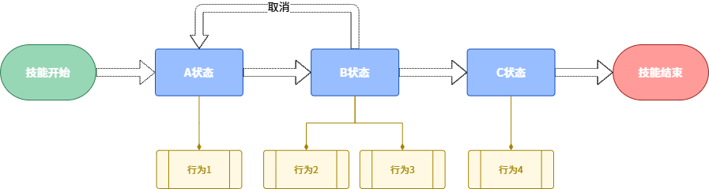

以和平精英的手雷为例，投掷手雷也是通过技能实现，简化的流程如下（仅做学习参考，非实际流程）：
1. 点击手雷物品，首先进入准备状态，播放角色手持手雷的前摇动画，出现投掷按钮，等待玩家下一步输入
2. 按下投掷按钮，进入选取状态，接收玩家选取目标区域的输入，同时播放角色拉保险销的动画，并启动爆炸倒计时
3. 抬起投掷按钮，进入执行状态，播放角色投掷动画，并向指定区域投掷手雷
4. 读秒结束，手雷发生爆炸并执行伤害结算，技能结束

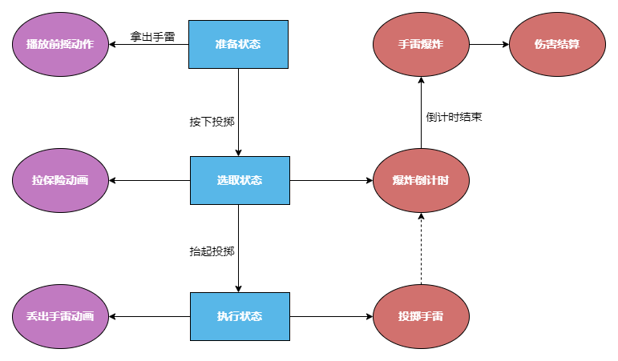

---

### 技能类型

技能按触发方式的不同可分为主动技能和被动技能，主动技能需要玩家主动触发释放，被动技能在符合指定条件下自动触发，通常主动技能包含三种类型：蓄力类、选取类和直接释放类，被动技能可细分为事件触发型和状态触发型两种。

**主动技能**

【蓄力类技能】

该类技能含有一定持续时长的蓄力阶段，蓄力完成后根据蓄力时间的长短执行不同的技能效果。

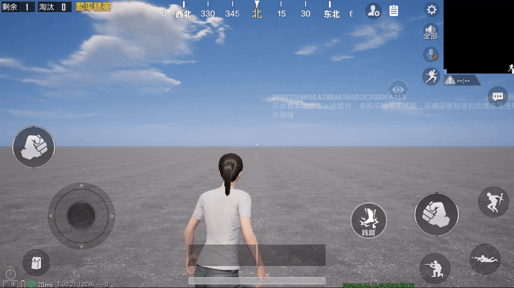

【选取类技能】

由玩家选择指定的位置/方向/目标对象，针对性地触发技能效果。

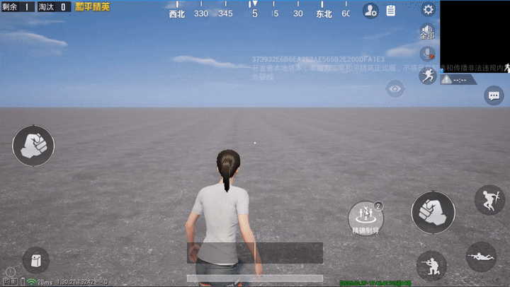

【直接释放类技能】

玩家按下技能按钮后直接触发技能效果。

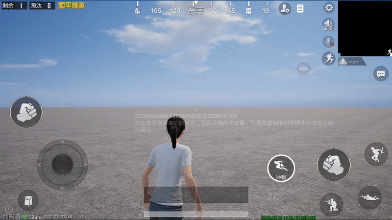

---

**被动技能**

【事件触发型】

当指定的事件发生时，立即触发一次技能效果。

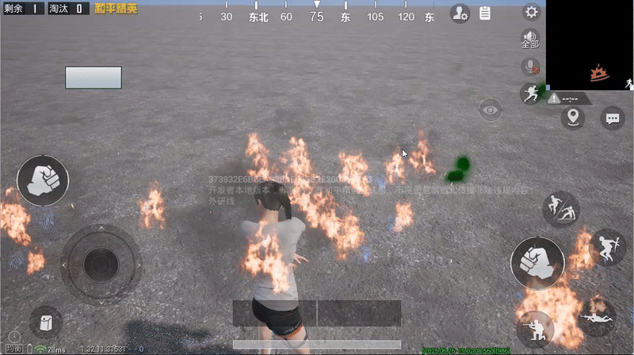

【状态触发型】

当角色属性满足条件或者符合某种状态时，可以持续性/周期性触发技能效果。

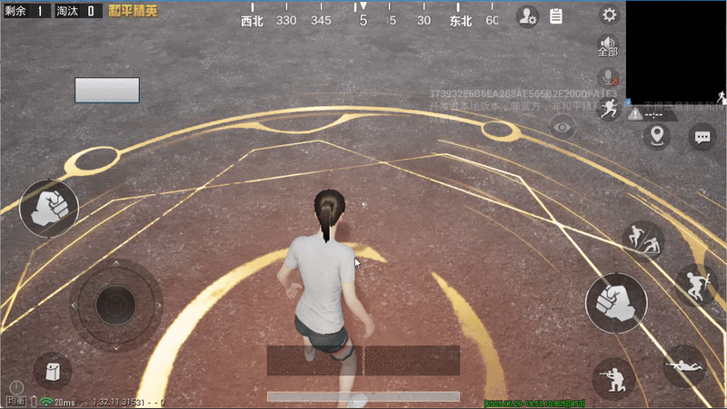

## 编辑器界面

点击绿洲启元编辑器菜单栏的【技能编辑器】按钮，将打开技能编辑器的操作界面，主界面分为多个可操作区域和视图窗口。

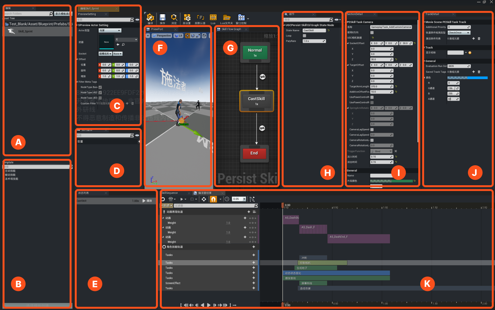

**A. 工程技能资源**

此处为开发者已经创建并保存之后的技能蓝图，如需继续制作亦或修改，可在此处双击打开对应技能蓝图并继续操作。

**B. 技能模板**

编辑器已经预制了一批技能模板和技能示例供开发者参考和使用。

**C. 预览设置面板**

方便开发者预览技能释放效果的参数设置，例如给角色指定部位添加一个武器/装备Mesh。

**D. 蓝图变量**

可以在蓝图上创建变量，供脚本和属性绑定使用，具体可参考 [属性绑定](../20108_技能属性绑定.md) 部分内容。

**E. 状态列表**

技能配置的所有阶段，每个阶段可以创建对应的序列播放器，搭配 [技能状态图](./20152_技能状态图.md) 使用，同时具备阶段预览功能。

**F. 技能预览窗口**

该窗口可以预览技能释放的效果，包含角色动画、粒子特效等，方便开发者调试技能。

**G. 技能状态图窗口**

基于阶段节点通过可视化的方式编辑技能整体的阶段跳转流程。

**H. 技能基础参数面板**

技能的基础配置，包括技能的外显信息、技能的CD或能量消耗配置、技能操作类型等等；当查看技能状态图时，将展示阶段节点或者跳转条件信息。

**I. Task参数面板**

编辑器提供了丰富的技能Task供开发者使用，每一类Task具有相应的属性配置项，具体可参考 [Task查询手册](./20094_技能Task查询手册.md)。

**J. 轨道参数面板**

显示轨道的激活条件配置信息。

**K. 序列播放器**

通过时间轴的方式编排此阶段要执行的一系列动作，如 [生成特效](./20094_技能Task查询手册.md#技能Task-生成特效)，[生成actor](./20094_技能Task查询手册.md#技能Task-生成Actor) 等等，时间轴的长度代表当前阶段持续总时长。

## 技能模板

技能编辑器内置了四类技能模板和多个主动/被动技能示例，开发者可参考技能示例的实现，其中被动技能示例可以参考 [被动技能](./20110_被动技能.md) 文档。

**蓄力技能模板**

蓄力技能模板是一个带有两段蓄力阶段的技能，当按下技能时首先进入 ``Charge`` 阶段，依据长按时间的不同决定进入 ``Action`` 阶段（普通蓄力）或者 ``FullAction`` 阶段（满蓄力）阶段，不同阶段下执行的技能效果不同，执行阶段完成后技能结束；如果不满足长按条件，则直接结束技能。

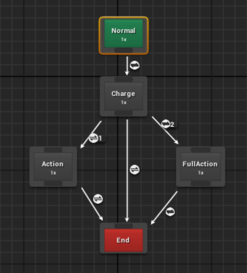

**直接释放技能模板**

直接释放技能模板仅带有 ``CastSkill`` 阶段，在此阶段配置释放技能的所有行为，释放完成后技能结束。

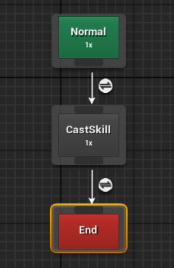

**选取技能模板**

选取技能模板是具有 ``Indicator`` 和 ``CastSkill`` 两个阶段的两段式技能，``Indicator`` 选取阶段用于选择技能的释放区域、方向或者具体目标，选取完成再次点按将进入 ``CastSkill`` 释放阶段，释放完成后技能结束；如果选取阶段主动取消，则直接结束技能。

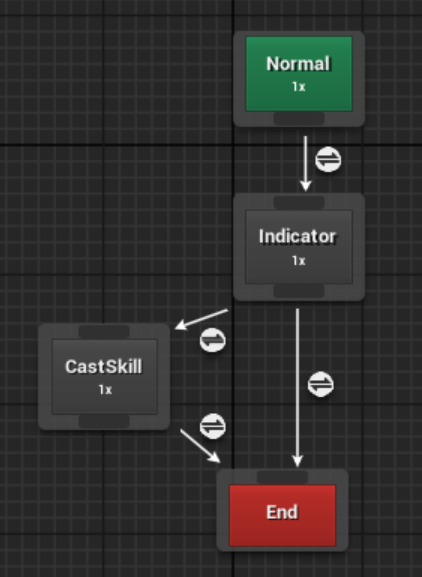

**空技能模板**

空技能模板不具有任何预设阶段，需要开发者自行添加技能阶段，利用 [技能状态图](./20152_技能状态图.md) 或者脚本逻辑控制技能的执行流程。

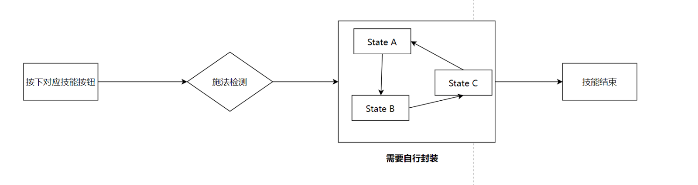

## 技能创建流程

### 新建技能蓝图

开发者可以基于技能模板或者技能示例创建技能蓝图，以创建直接释放型技能为例：

1. 从“技能模板”窗口中选择直接释放技能模板，下方“选择模板创建”按钮将高亮显示，并更名为“以 ``直接释放技能模板`` 为模板创建”

	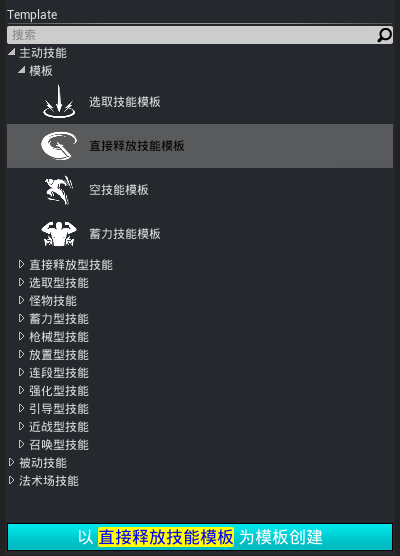

2. 点击“以 ``直接释放技能模板`` 为模板创建” 按钮，弹出输入名称弹窗，输入技能名称并点击确定

	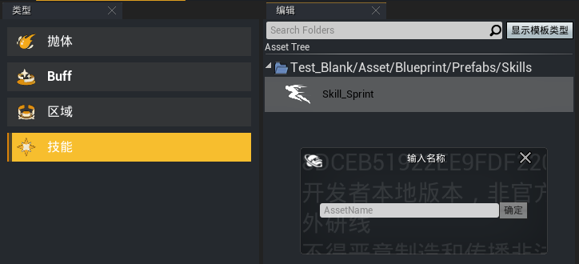

3. 新建的技能将显示在“工程技能资源”窗口中，且技能蓝图创建于 ``Asset/Blueprint/Prefabs/Skills`` 路径下

	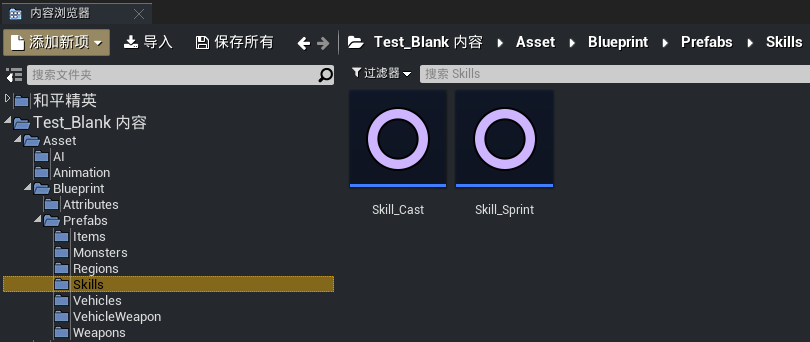

---

### 配置技能蓝图

#### 技能基础配置

技能的基础配置包含 ``通用基础属性``、``3C设置``、``技能预设槽位``、``CD/能量消耗``、``技能消耗``、``激活条件``、``技能外显信息`` 和 ``技能操作与激活``。

【通用基础属性】

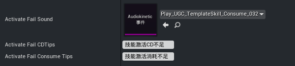

- Activate Fail Sound：技能激活失败时播放的音效
- Activate Fail CDTips：因CD未结束导致技能激活失败的tips
- Activate Fail ConsumeTips：因消耗不足导致技能激活失败的tips

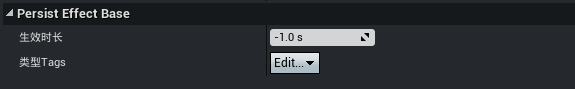

- 生效时长：技能的生命周期，自技能挂载起开始计时，达到时间后强制卸载技能资源，设置<0的值代表无限时长
- 类型Tags：通过 [GameplayTag](../../20102_Gameplay标签.md) 标记的技能类型，适用于筛选和分类场景，遵循 [GameplayTag匹配规则](../../20102_Gameplay标签.md#GameplayTag匹配)，例如 [``GetSkillsByTag``](https://developer.gp.qq.com/api/#/searchContent/UGCPersistEffectSystem?classDetailShow=true&path=class%2Fdetail%2F%E5%92%8C%E5%B9%B3%E5%85%A8%E5%B1%80%E6%8E%A5%E5%8F%A3%2F%E6%8A%80%E8%83%BD%E7%B3%BB%E7%BB%9F%2FUGCPersistEffectSystem.json&isSelect=1&apiEnc=%5B%22%E7%B1%BB%22%5D&apiLabel=UGCPersistEffectSystem&autoJump=GetSkillsByTag:~:text=UPersistEffectSkill%5B%5D-,GetSkillsByTag,-(AActorTargetActor)) 利用标签过滤获取角色身上的技能

【3C设置】

该属性用于控制角色释放技能过程中，是否需要调整视角、Pose姿态或者空手状态。

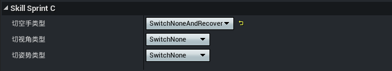

|属性名|属性说明|
|-|-|
|切空手类型|是否切换空手状态<br>- 不切空手：释放技能时不收起武器<br>- 切空手且不还原：释放技能时收起武器，且释放结束后保持空手状态<br>- 切空手且还原：释放技能时收起武器，且释放结束后手持武器|
|切视角类型|是否切换视角<br>- 切换无状态：不切换视角<br>- SwitchFPPWithRecover：切换至第一人称，且技能结束后还原视角<br>- SwitchFPPWithoutRecover：切换至第一人称，且技能结束后不还原视角<br>- SwitchTPPWithRecover：切换至第三人称，且技能结束后还原视角<br>- SwitchTPPWithoutRecover：切换至第三人称，且技能结束后不还原视角|
|切姿态类型|是否切换角色的Pose姿态<br>- 切换无状态：不切换姿态<br>- 切换站立并恢复：切换至站姿，且技能结束后还原姿态<br>- 切换站立不恢复：切换至站姿，且技能结束后不还原姿态<br>- 切换蹲伏并恢复：切换至蹲姿，且技能结束后还原姿态<br>- 切换蹲伏不恢复：切换至蹲姿，且技能结束后不还原姿态<br>- 切换趴下并恢复：切换至趴姿，且技能结束后还原姿态<br>- 切换趴下不恢复：切换至趴姿，且技能结束后不还原姿态|

【技能等级配置】

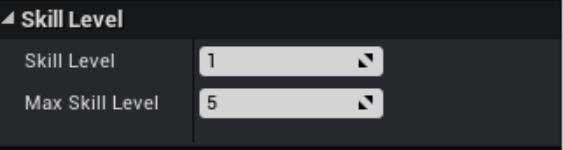

- SkillLevel：初始技能等级
- MaxSkillLevel：最大技能等级

**使用说明**

技能等级本身不影响技能等级框架的任何功能。要使得技能等级发生实际作用，需要在具体的技能里，以以下几种方式进行扩展：

1. 利用Getter或是公式计算，在代码里获取技能等级数据影响技能的伤害、范围等实际效果值

```lua
-- 该函数需要和造成伤害节点进行绑定
function testTr:ComputeDamage(DamageContext)
    local Damage = 100 + 20 * self.SkillLevel
  	return Damage
end
```

2. 利用技能条件轨道，动态控制某些节点的执行

比如我们有时候会让技能升级后，解锁一些额外效果，比如添加一个Buff，造成一次额外伤害等等。那么则可以让这些节点对应的轨道绑定一个轨道条件。

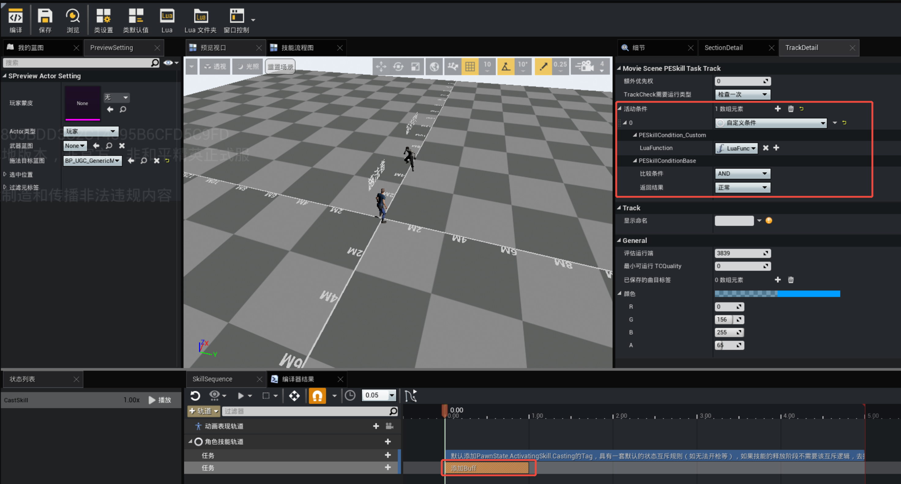

在该条件里，可以利用技能等级做判断

```lua
---@return boolean
function testTr:LuaFunction()
    if self.SkillLevel < 5 then
	    return false
    else
        return true
    end
end
```

3. 在技能的OnSkillLevelChange_BP事件中，执行一些对应逻辑

```lua
function testTr:OnSkillLevelChange_BP(OldSkillLevel, NewSkillLevel)

end
```

4. 修改技能等级的接口

```lua
-- 先用接口获取到对应的技能实例
SkillInstance:ModifySkillLevel(3)
SkillInstance:SetSkillLevel(5)
SkillInstance:SetMaxSkillLevel(10)
```

【技能预设槽位】

技能编辑器引入了虚拟技能槽的概念，有别于技能栏上的UI槽位，虚拟技能槽可以理解为技能栏上的特定技能位，其本身没有实际的实体或者UI表现，是开发者对于技能特性的概念性定义，例如有多种英雄角色，每个英雄都有“普通攻击”和“终结技”，那么“普通攻击”和“终结技”就是2个虚拟技能槽。

虚拟技能槽将输入层与技能实体层解耦，方便对玩法技能体系拓展，例如RPG类游戏中通常随着人物成长，技能的属性数值也随之变化，甚至解锁新的词条特性，此时只需动态将虚拟技能槽映射的技能替换为成长后的新技能，就可以便捷实现技能模组的替换。

<div style="text-align: center;">
	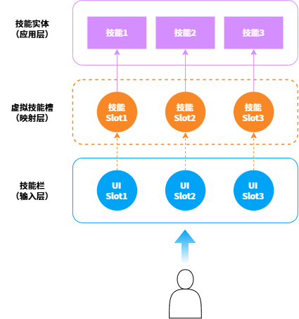
</div>

虚拟技能槽通过 [GameplayTag](../../20102_Gameplay标签.md) 的形式表达，技能编辑器已预置了6个虚拟槽位的标签，开发者可以自行扩展和修改，但顶层标签必须保证为 **``Slot``**。每个主动技能都需要设置一个默认的槽位，如果多个技能配置同一个槽位，则该槽位只对最新配置的技能生效。
> 技能组件上的 **初始化技能槽位** 优先级大于预设槽位

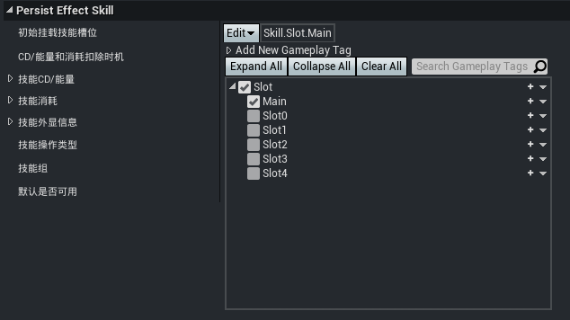

【CD/能量消耗】

通常释放一次技能后会存在冷却时间，以此来限制技能的释放频率，俗称技能CD，该部分属性控制技能CD的形式和可释放频次。

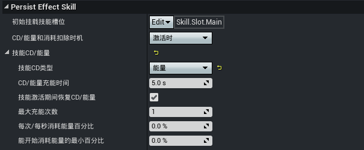

|属性名|属性说明|
|-|-|
|初始挂载技能槽位|允许为每个技能分配组别，方便设置技能组合，通过 [GameplayTag](../../20102_Gameplay标签.md) 标识技能组|
|技能CD类型|- 空：可无限制地使用该技能<br>- 计时：技能释放后，需要等待指定的时间后才能再次施放<br>- 能量：技能释放后，需要等待能量恢复到一定程度才能再次释放|
|CD/能量充能时间|技能CD的时长，两种CD类型含义不同：<br>- 计时：下一次可以使用技能的间隔时间<br>- 能量：从0能量充能到100%能量需要的时间|
|技能激活期间恢复CD/技能能量|技能激活生效的期间，是否允许计时/恢复能量，决定启动CD的时间点|
|最大充能次数|每当CD计时完成/能量恢复结束时，会为技能存储一次使用次数，该属性影响技能存储使用次数的上限，即最多允许几段释放|
|每次/每秒消耗能量百分比|【针对能量CD类型的技能】<br>扣除时机为激活/结束：每次释放技能消耗的能量百分比<br>扣除时机为激活期间/自定义：每秒执行一次能量消耗的百分比|
|能开始消耗能量的最小百分比|【针对能量CD类型的技能】<br>允许释放该技能的最低能量值|
|CD/能量和消耗扣除时机|技能启动CD的时机或技能的消耗实际被执行的时机<br>- 激活时：在技能激活时执行<br>- 结束时：技能完成释放后执行<br>- 自定义：需要手动在技能的时间轴上配置 [技能Task-消耗](./20094_技能Task查询手册.md#技能Task-消耗)，否则不会执行|

【技能消耗】

除了技能自身的能量消耗，还允许为技能释放设置额外的属性/物品消耗。
> 物品消耗兼容 [物资编辑器](../../物资系统/物资编辑器1.0/185_概述.md) 与 [物品编辑器](../../物资系统/物资编辑器2.0/20101_物品编辑器.md)

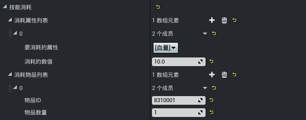

|属性名|属性说明|
|-|-|
|消耗属性|- 要修改的属性：预置血量、能量、信号等和平角色的基础属性，也支持绑定 [自定义属性](../../属性与伤害/20098_通用属性系统.md#自定义属性)<br>- 消耗的数值：要扣除的属性值，固定为 **减法运算**|
|消耗物品|物品ID：消耗的物品ID<br>物品数量：消耗的物品数量|

【激活条件】

支持添加技能激活的条件组，当满足触发要求的条件时才允许激活技能，各类型条件的说明及参数详细信息可参见 [技能Condition查询手册](./20111_技能Condition查询手册.md)。

- 全部满足：所有的条件全部判定成功才允许触发
- 满足任意一个：任意一个条件判定成功即可触发

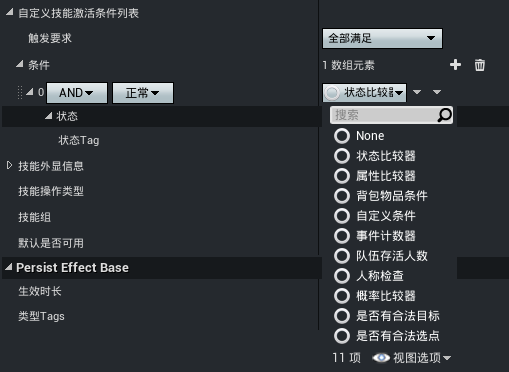

【技能外显信息】

技能显示在UI界面上的名称、图标及使用的UI槽位等配置。

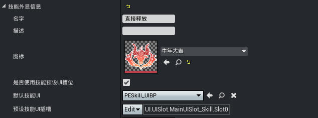

|属性名|属性说明|
|-|-|
|名字|技能的名称|
|描述|技能的描述|
|图标|技能的icon图标|
|是否使用技能预设UI槽位|是否使用预设的UI槽位，否则开发者需要自行实现UI关联技能的逻辑|
|默认技能UI|技能编辑器内置了一个名为 ``PESkill_UIBP`` 的控件蓝图，开发者也可以自行实现技能UI和触发技能的逻辑<br>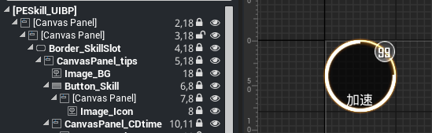|
|预设技能UI槽|技能放置在哪个UI插槽上，编辑器预设了3个固定位置的技能UI插槽可选，通过 [GameplayTag](../../20102_Gameplay标签.md) 绑定<br>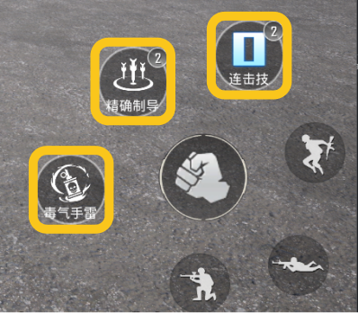|

【技能操作与激活】


- 技能操作类型：触发技能的方式
	- 点按：按下技能按钮时立即触发
	- 按下抬起：按下技能按钮时激活，持续按住保持激活状态，抬起后技能取消
- 技能组：该属性已废弃，如需控制技能激活的互斥效果，请使用 [状态互斥](../20106_状态互斥.md) 实现
- 默认是否可用：技能是否被装配后就可以使用，否则需要在脚本中调用 [``EnableSkill``](https://developer.gp.qq.com/api/#/searchContent/UPersistEffectSkill?classDetailShow=true&path=class%2Fdetail%2FOthers%2FUPersistEffectSkill.json&isSelect=1&apiEnc=%5B%22%E7%B1%BB%22%5D&apiLabel=UPersistEffectSkill&autoJump=EnableSkill) 先激活该技能才能使用

【技能时长与类型】

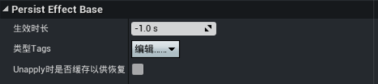

- 生效时长：技能的生效时长（-1则代表无限时长）
- 类型Tags：仅用于对技能分类、打标记的Tags，本身无实际作用，可以利用该Tag对一个角色身上的技能做过滤，需要配合接口 [``GetSkillsByTag``]() 使用，接口传入的Tag对应配置的Tag
- UnApply时是否缓存以供恢复：在该技能卸载时，是否会缓存CD、使用次数这些技能实例数据，下次再次装载时，会使用缓存的数据写到新装载的技能上

#### 技能阶段配置

一个技能允许存在多种阶段，每个阶段的执行逻辑基于时间轴编排的动作，完成当前时间轴的动作后跳转进入下一阶段。技能编辑器将全局阶段的跳转设计为环状结构，因此，每个技能的初始阶段也是结束阶段。

<div style="text-align: center;">
	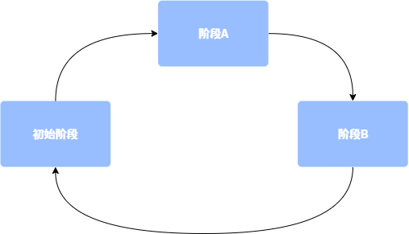
</div>

各阶段具有状态属性和对应序列播放器的播放属性，默认 ``Normal`` 阶段初始不带有序列播放器，当添加过序列播放器后即会启用播放属性；状态属性及阶段的跳转均通过 [技能状态图](./20152_技能状态图.md) 来配置。

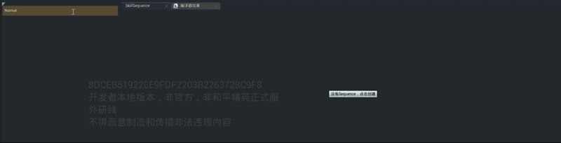

#### 序列播放器配置

序列播放器与技能阶段关联，当阶段内无实际要执行的逻辑时可以不配置序列播放器，但每个阶段最多仅有一个序列播放器，点击“创建Sequence”即可新建序列播放器。

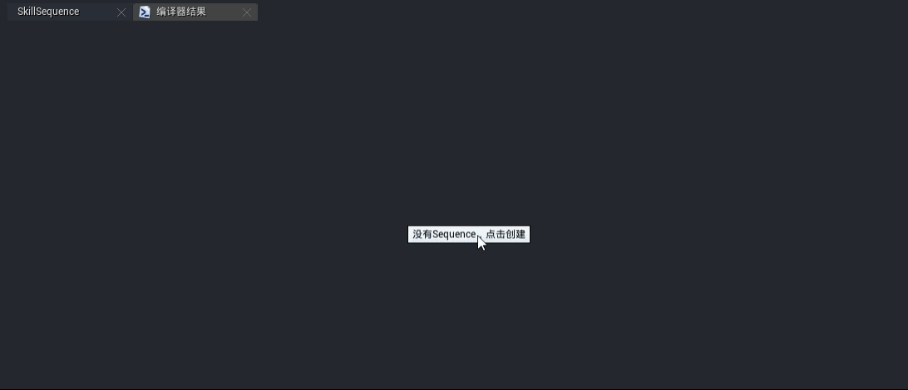

【基础使用】

序列播放器分为轨道和时间轴两个核心区域：
- 轨道：执行特定动作的行为容器，可以添加多个并行的轨道并组织行为逻辑，创建时默认预设了动画表现轨道，该轨道用于配置技能的动画，也可以添加技能Task
- 时间轴：非线性的编辑环境，包含每个轨道的水平区域，各轨道上可添加动画资源或者技能Task，时间轴代表一个完整可播放的时间单元，有效的时间段包含在开始（绿色）和结束（红色）标记内

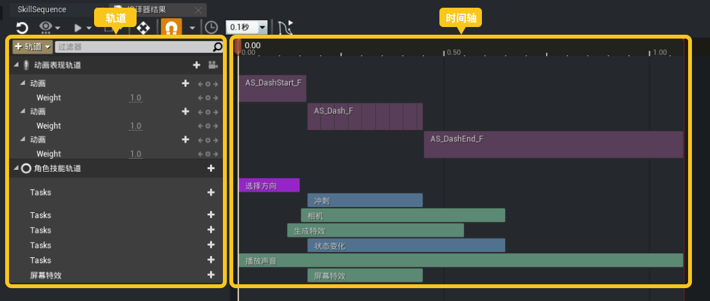

点击【+轨道】按钮可以添加新的音频或者技能Task轨道，也可以添加文件夹对既有轨道进行分类组织，选中目标轨道右键可删除该轨道。

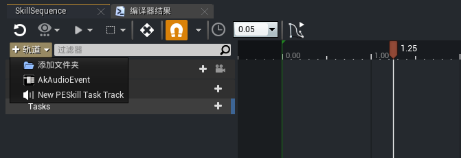

每条轨道右侧的“+”可以为轨道添加具体的动作，例如添加一个 [技能Task-相机](./20094_技能Task查询手册.md#技能Task-相机) ，即会在右侧时间轴对应的轨道上添加该动作，按住该动作左右拖拽可以调整该动作执行的时间位置。
> 时间轴上各Task遵照从上至下，从左至右的顺序执行

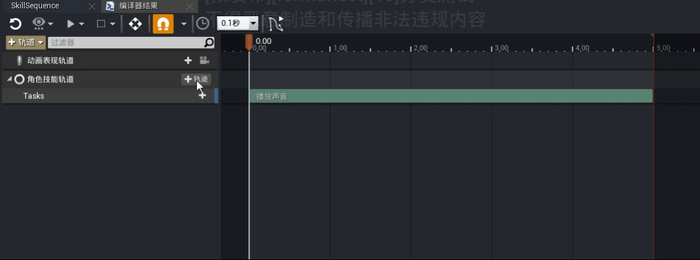

序列播放器支持预览播放及调试效果需要的播放控制，详细的操作说明可参考 [Sequencer编辑器](https://dev.epicgames.com/documentation/zh-cn/unreal-engine/sequencer-cinematic-editor-unreal-engine)。

---

【技能轨道与动画轨道】

通常一个技能由多种行为逻辑、动画表现和特效效果复合组成，为了方便开发者组织与管理动作，序列播放器将编排动作的轨道划分为动画表现轨道与技能轨道两类。

**技能轨道**

技能轨道用于编排各类行为逻辑与特效效果，也即所有的 [技能Task](./20094_技能Task查询手册.md) 都在此类轨道上编辑，点击【+轨迹】按钮可以选择需要添加的Task。

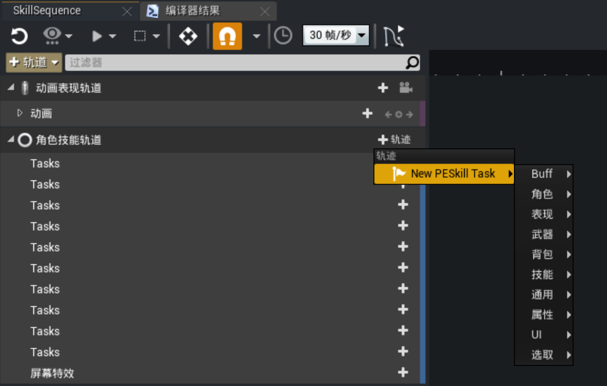

**动画表现轨道**

动画表现轨道专用于编辑动画相关资源，点击【+轨迹】按钮可以选择以哪种轨道方式添加动画资源，对应不同的动画Task类型，目前支持 ``基础动画`` 和 ``技能动画`` 两种类型。

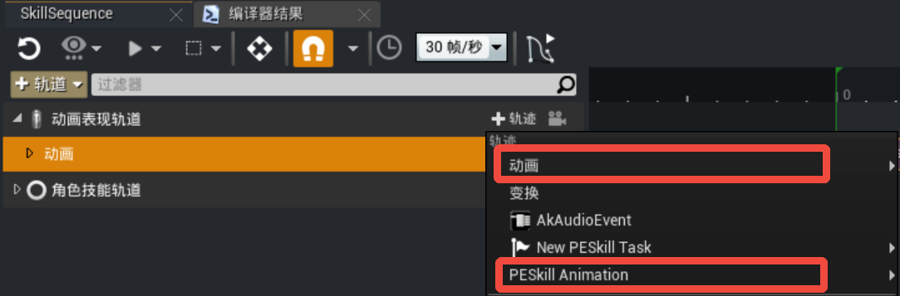

- 基础动画轨道：该类型的动画Task具备播放速率、播放槽位和混出时间等基础属性，适用于简单的动画配置，不支持轨道激活条件设置
- 技能动画轨道：在基础动画轨道上进行了功能扩展，支持更复杂的动画槽位与轨道激活条件配置，具体的属性说明可参见 [技能动画Task](./20094_技能Task查询手册.md#技能动画Task:~:text=混出时间-,技能动画Task,-使用 技能动画)

**Actor轨道**

Actor轨道，即可以在技能里添加一个其他的Actor进行控制，并可以利用技能的一些其他Task播放该Actor的动画，以及控制Actor的位置、旋转等。

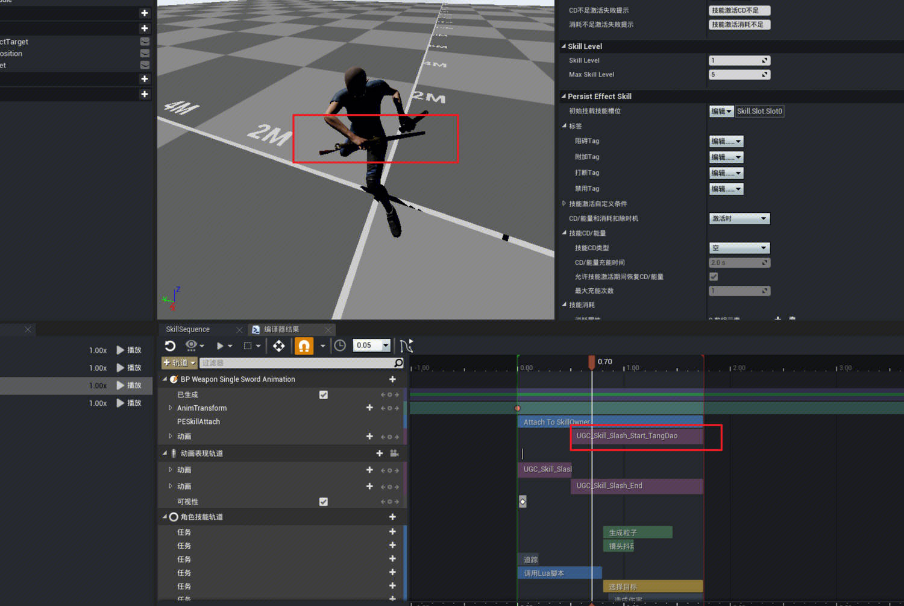

使用方式：直接将Actor蓝图拖到技能Sequence里，将在对应技能Sequence里添加该Actor轨道

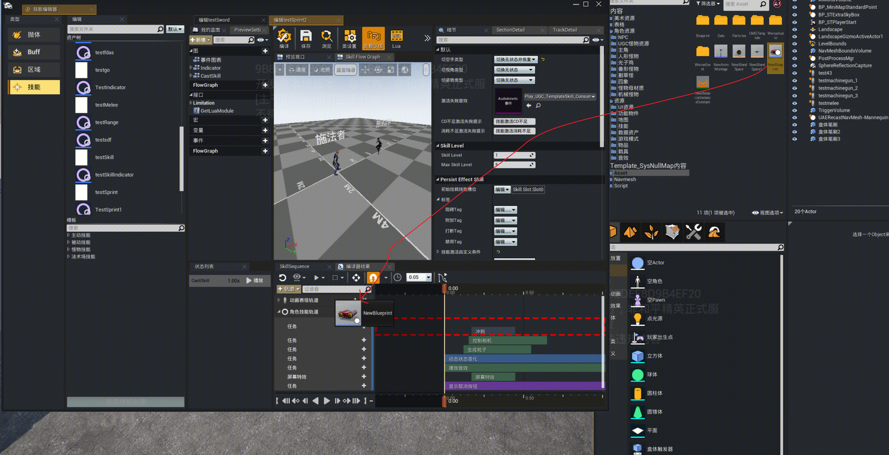

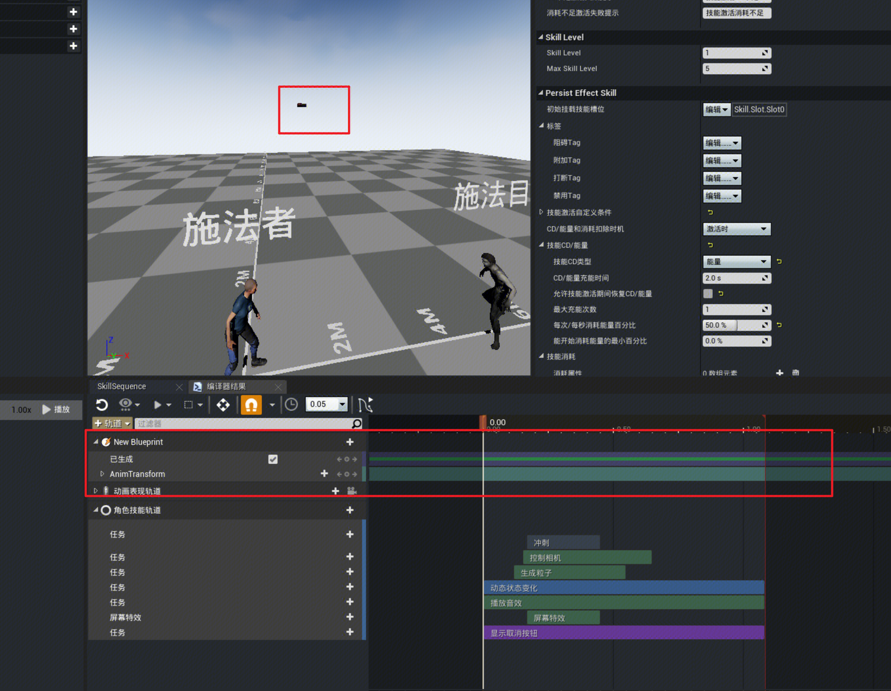

目前Actor仅支持由技能进行生成，生命周期直接由技能管理。拖进来时，Actor轨道默认是该状态，此时需要K已生成属性的关键帧，用于控制生成的Actor的生命周期。

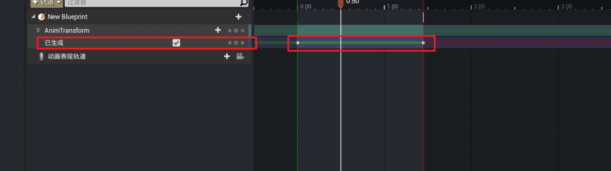

可用于Actor轨道的三种Task：

- AnimTransform：可在AnimTransform轨道上，添加相应关键帧，调整Actor的位置、旋转等。从而用于控制该Actor的Transform动画效果
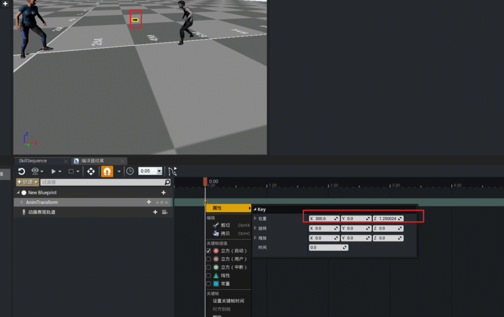
- PESkillAttach：配置后，可将生成的Actor，挂载到角色的某个骨骼挂点上
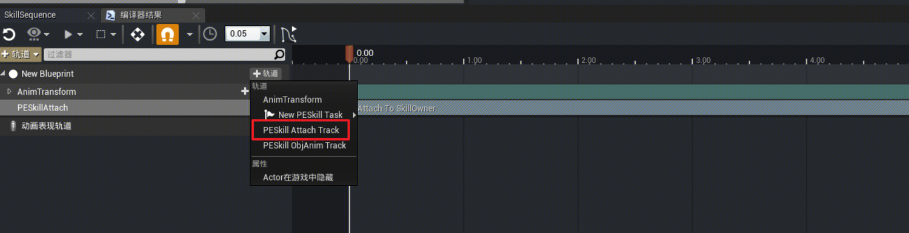
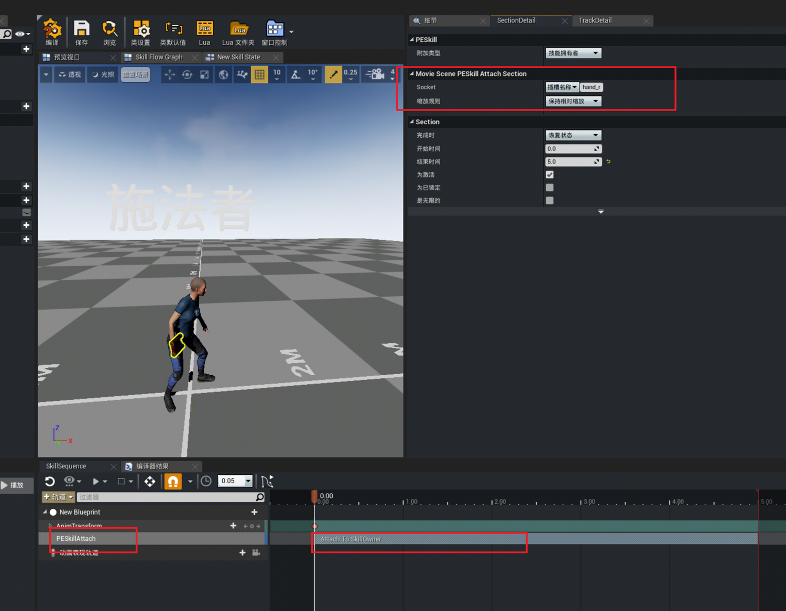
- PESkillAnimation：配置后可让该Actor播放一个动画
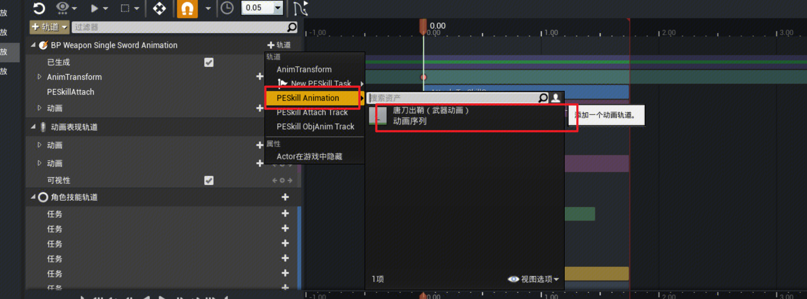
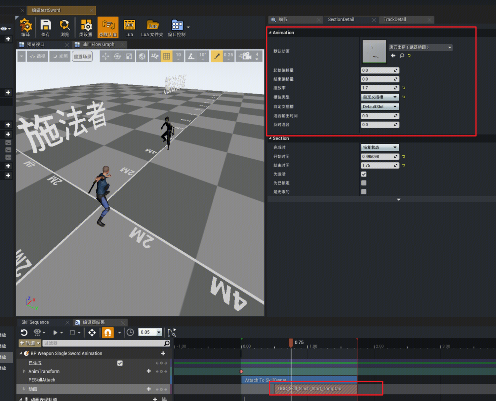

---

【轨道激活条件】

技能轨道与动画轨道均支持设置激活条件以控制轨道上Task的执行，例如在近战技能模板中有站姿和蹲姿两种姿态下的释放技能表现，实现上可以添加两条动画轨道对应两种姿态的动画，通过激活条件控制当前姿态执行对应的动画Task。

> 动画轨道仅 ``PESkill Animation`` 支持设置激活条件

选中目标轨道将高亮显示，并在【TrackDetail】面板中显示可编辑的属性项。

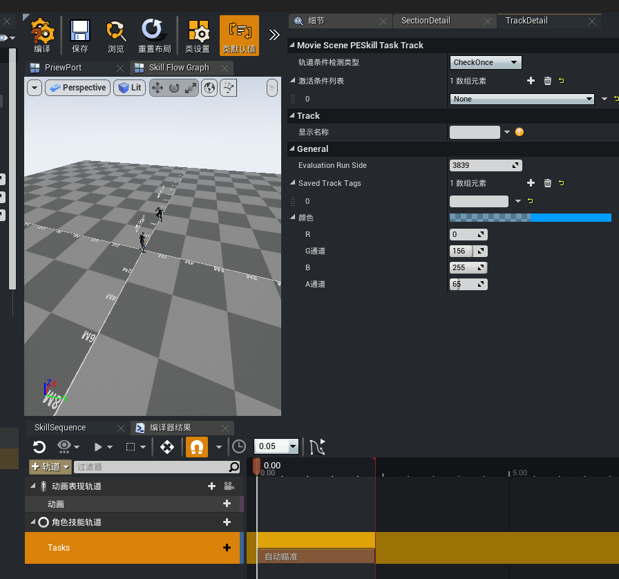

|属性名|属性说明|
|-|-|
|轨道条件检测类型|- CheckOnce：单次检测，在该轨道激活时进行一次性检测，如果不满足条件，则该轨道上的Task不会执行<br>- CheckPerFrame：每帧检测，在该轨道随时间轴运行过程中逐帧检测，如果条件持续满足，则会持续执行Task；当条件在某一帧不再满足时，则后续不再执行Task|
|激活条件列表|支持配置多组 [技能Condition](./20111_技能Condition查询手册.md) 条件|
|显示名称|可自定义轨道的名称，动画轨道默认显示“动画”，技能轨道默认显示“Tasks”|

#### Task参数设置

每个技能Task即是一段预设的行为逻辑，技能编辑器已内置一批技能Task供使用，各Task有独立可编辑的参数，在时间轴上选中指定的Task后，【SectionDetail】面板会展示该Task可编辑的属性项，修改后点击【编译】按钮将保存设置。

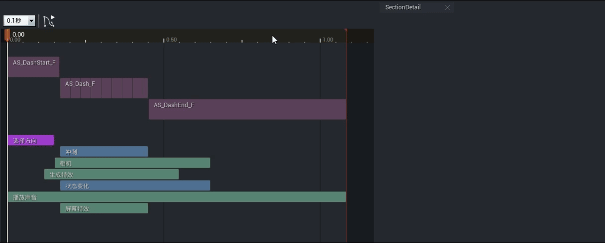

可使用的技能Task类型及各Task的属性详细信息可参见 [技能Task查询手册](./20094_技能Task查询手册.md)。

#### 状态列表

状态列表显示技能通过 [状态图](./20152_技能状态图.md) 配置的所有阶段节点，点击阶段名显示对应的序列播放器面板，且状态图将自动定位到该节点上，点击右侧【播放】按钮可预览该序列播放器的执行效果。

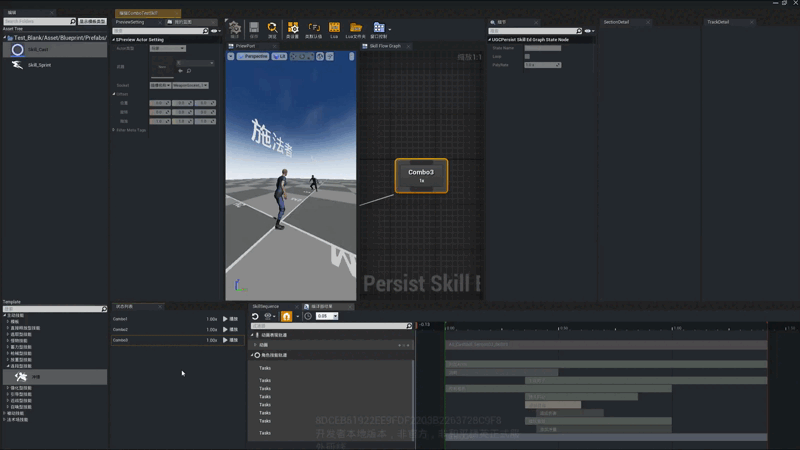

如果选择多个阶段点击播放，则按顺序依次播放各阶段的序列播放器。

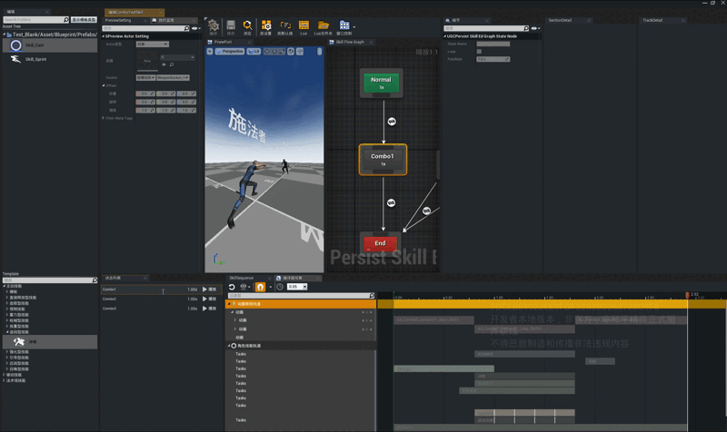

> 预览的播放速率取决于状态图阶段节点的 [播放设置](./20152_技能状态图.md#状态图基础配置)

#### 技能预览

技能编辑器提供了序列播放器预览的功能，同时也提供了便于调试的参数项。

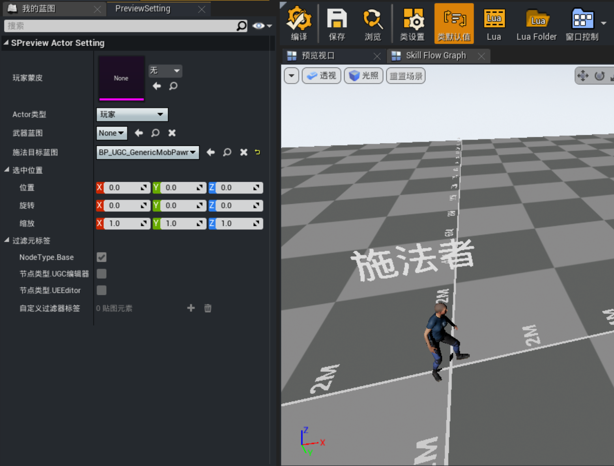

|属性名|属性说明|
|-|-|
|Actor类型|预览的技能释放主体，支持玩家/怪物/法术场|
|玩家蒙皮|当施法者为玩家时，需要指定正确的人物骨骼模型才能保证技能动画预览效果一致，仅针对 ``Actor类型`` 为“玩家”时生效<br>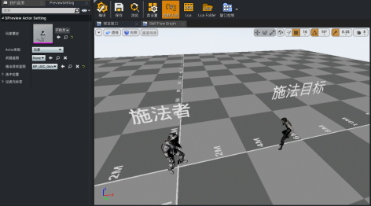|
|怪物蒙皮|当施法者为怪物时，需要指定正确的怪物骨骼模型才能保证技能动画预览效果一致，仅针对 ``Actor类型`` 为“怪物”时生效<br>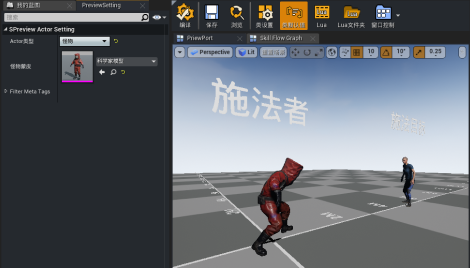|
|法术场类型|当施法者为法术场时，指定对应的 [法术场](../20217_法术场.md) 蓝图类，仅针对 ``Actor类型`` 为“法术场”时生效<br>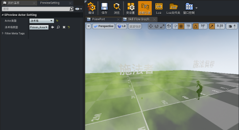|
|武器蓝图|支持为施法者附加武器类（枪械/近战武器）物品，添加后施法者将自动持有武器，仅针对 ``Actor类型`` 为“玩家”时生效<br>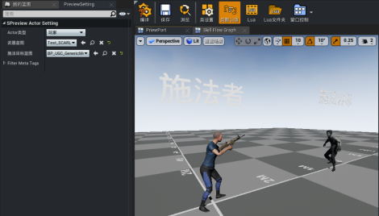|
|施法目标蓝图|切换施法目标的蓝图类，以预览技能对不同目标施放的效果，仅针对 ``Actor类型`` 为“玩家”时生效<br>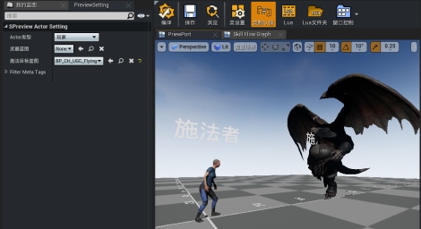|
|选中位置|调整选中位置的偏移量，必须依靠选择目标和选点来实现<br>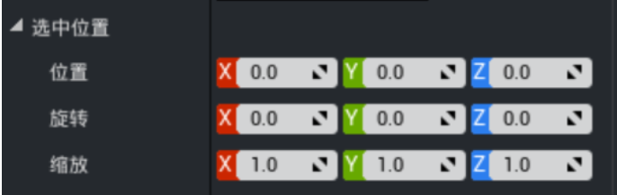|

视口中集成的 [工具栏](https://dev.epicgames.com/documentation/zh-cn/unreal-engine/viewport-toolbar?application_version=4.27) 包含变换工具、坐标系切换、摄像机速度等功能按钮，左侧视口选项支持 [视口类型](https://dev.epicgames.com/documentation/zh-cn/unreal-engine/viewport-basics?application_version=4.27#%E8%A7%86%E5%8F%A3%E7%B1%BB%E5%9E%8B) 和 [视图模式](https://dev.epicgames.com/documentation/zh-cn/unreal-engine/viewport-basics?application_version=4.27#%E8%A7%86%E5%9B%BE%E6%A8%A1%E5%BC%8F) 的切换，其中 ``Switch Tpp Camera`` 可以将视口中的相机视角切换至第三人称以方便调试技能的播放效果。

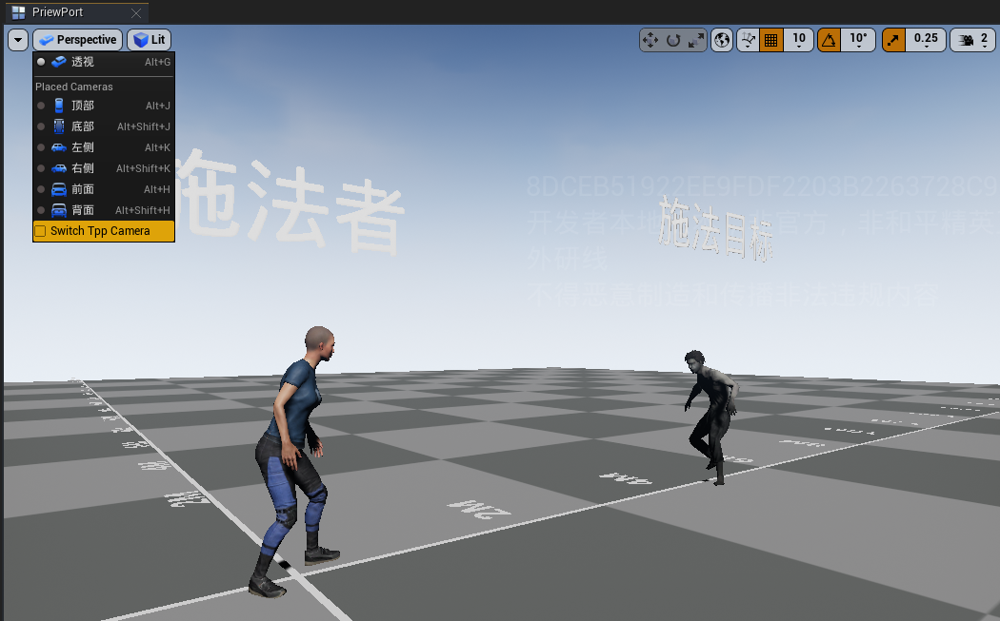

#### 自定义蓝图变量

在“我的蓝图”页签里可以创建自定义的蓝图变量，设置好变量的类型和默认值后，通过 [属性绑定](../20108_技能属性绑定.md) 功能可以由该技能蓝图下的其他事件或者行为引用，方便管理运行时的动态数据。

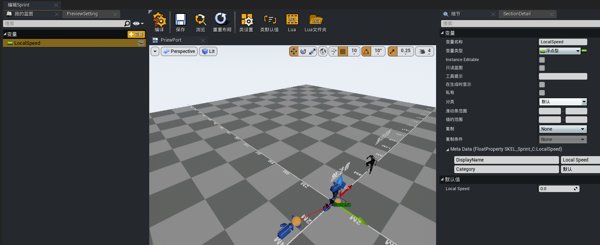

蓝图变量也能够在技能蓝图类的脚本中引用，引用形式和类属性一致。

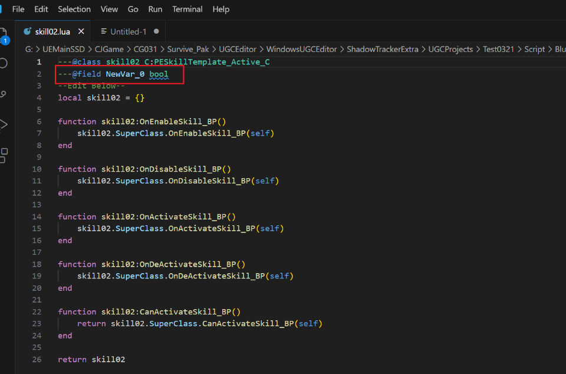

## 添加技能

技能蓝图依赖于 ``PersistClientStateComponent`` 组件才能真正赋予角色，双击打开 ``PlayerPawn`` 的蓝图，找到 ``PersistClientStateComponent`` 技能组件，编辑器已经为角色蓝图默认挂载了该技能组件。

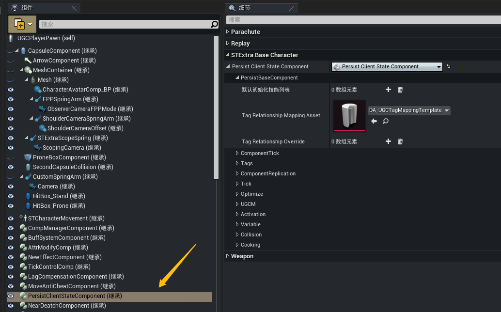

为角色添加技能支持两种方式：通过蓝图的配置添加初始技能和脚本中动态添加技能。

### 通过蓝图配置技能

``PersistClientStateComponent`` 技能组件上可以为角色添加初始技能，进入对局后玩家将自动拥有该技能。

打开 ``PersistClientStateComponent`` 组件的【细节】面板，在 ``默认初始化技能列表`` 属性组下添加一个元素，配置技能蓝图和虚拟技能槽。

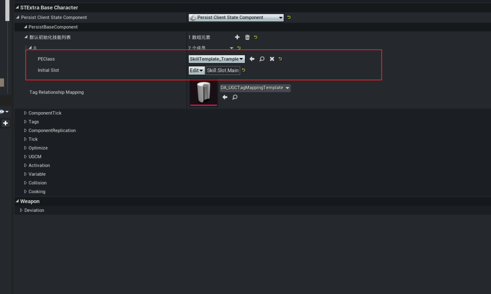

- PEClass：添加的目标技能蓝图
- Initial Slot：虚拟技能槽，优先级高于 ``技能预设槽位`` 的配置

> 拥有技能不代表将技能添加到技能栏UI上，需要通过 ``技能外显信息`` 配置

---

### 动态添加技能

脚本中调用 [``AddSkillByClass``](https://developer.gp.qq.com/api/#/searchContent/UGCPersistEffectSystem?classDetailShow=true&path=class%2Fdetail%2F%E5%92%8C%E5%B9%B3%E5%85%A8%E5%B1%80%E6%8E%A5%E5%8F%A3%2F%E6%8A%80%E8%83%BD%E7%B3%BB%E7%BB%9F%2FUGCPersistEffectSystem.json&isSelect=1&apiEnc=%5B%22%E7%B1%BB%22%5D&apiLabel=UGCPersistEffectSystem&autoJump=AddSkillByClass) 和 [``RemoveSkillInstance``](https://developer.gp.qq.com/api/#/searchContent/UGCPersistEffectSystem?classDetailShow=true&path=class%2Fdetail%2F%E5%92%8C%E5%B9%B3%E5%85%A8%E5%B1%80%E6%8E%A5%E5%8F%A3%2F%E6%8A%80%E8%83%BD%E7%B3%BB%E7%BB%9F%2FUGCPersistEffectSystem.json&isSelect=1&apiEnc=%5B%22%E7%B1%BB%22%5D&apiLabel=UGCPersistEffectSystem&autoJump=RemoveSkillInstance) 可以为角色动态赋予技能：

``` lua
function UGCPlayerController:AddSkill()
    local SkillPath = UGCMapInfoLib.GetRootLongPackagePath() .. "Asset/Blueprint/Prefabs/Skills/death.death_C"
    local SkillClass = UGCObjectUtility.LoadClass(SkillPath)

		local PlayerPawn = UGCGameSystem.GetPlayerPawnByPlayerController(self)
		if PlayerPawn then
			-- 全局变量存储技能实例对象，方便卸载技能
			self.SkillInstance = UGCPersistEffectSystem.AddSkillByClass(PlayerPawn, SkillClass)
		end
end

function UGCPlayerController:RemoveSkill()
		local PlayerPawn = UGCGameSystem.GetPlayerPawnByPlayerController(self)
		if PlayerPawn then
			UGCPersistEffectSystem.RemoveSkillInstance(PlayerPawn, self.SkillInstance)
		end
end
```

## 使用技能

角色拥有技能且将技能绑定到预设的UI插槽时，即可通过UI交互触发技能的释放，考虑到部分场景下可能需要在脚本中触发技能，例如自制技能UI控件，当触发控件的点击事件时释放技能，编辑器提供了 [``ActivateSkill``](https://developer.gp.qq.com/api/#/searchContent/UPersistEffectSkill?classDetailShow=true&path=class%2Fdetail%2FOthers%2FUPersistEffectSkill.json&isSelect=1&apiEnc=%5B%22%E7%B1%BB%22%5D&apiLabel=UPersistEffectSkill&autoJump=ActivateSkill) 和相关的API供开发者调用。

> 如果技能设置为默认不可用，需要先调用 [``EnableSkill``](https://developer.gp.qq.com/api/#/searchContent/UPersistEffectSkill?classDetailShow=true&path=class%2Fdetail%2FOthers%2FUPersistEffectSkill.json&isSelect=1&apiEnc=%5B%22%E7%B1%BB%22%5D&apiLabel=UPersistEffectSkill&autoJump=EnableSkill) 激活后才能够释放技能
