# 被动技能

不同于依靠释放行为的主动技能，被动技能需要在特定的时机或者符合特定的条件时才能自动触发，因此无法通过时间轴的形式编排行为逻辑，技能编辑器针对被动技能设计了一套独立的框架，让开发者也能通过蓝图配置的方式实现完整的被动技能效果。

## 被动技能概述

### 实现机制

通常被动技能的执行时机基于事件驱动或者状态触发，前者属于主动通知，后者强调条件的成立。

- 事件驱动：通过监听特定事件来触发技能效果，具有明确的触发条件，例如：每次普通攻击减少某技能的1秒冷却时间，此时“普攻命中事件”即是触发条件。
- 状态触发：当目标对象处于特定状态下或者状态满足指定条件时触发技能效果，与事件触发的主动通知不同，状态触发依赖对状态的持续监测，例如：当玩家生命值低于20%时提升100%的攻击力，此时需要对玩家的生命值进行持续检测，一旦符合20%的条件即触发技能。

技能编辑器将被动技能的触发到执行的过程拆解为事件（Event）、条件（Condition）和行为（Action）三部分的组合结果。

**事件（Event）**

各类系统功能（如技能、Buff、武器等）在运行过程中产生的特定逻辑触发点，对应以“事件驱动”被动技能的触发，通常以事件作为触发前提。

**条件（Condition）**

条件是动作发生、事物存在或变化的充分必要因素，通常用来描述因果关系或推导关系，例如“状态触发”中玩家生命值低于20%即是触发条件。条件既可以单独作为被动技能触发的直接依据，也可以结合事件以确保触发的时机更加精确，例如：当玩家受到伤害且为暴击伤害时，触发血量恢复，此时“玩家受到伤害”为事件，“本次伤害为暴击伤害”为条件。

**行为（Action）**

行为即当被动技能触发时应该执行的动作，例如“恢复血量”即是一种行为，行为决定了被动技能的具体效果，可以是单一的动作也可以是一系列动作序列。

因此，通过事件、条件和行为的组合就能实现被动技能的触发机制和执行效果。

---

### 结构框架

技能编辑器提供了两种配置被动技能的结构框架：事件触发和状态触发。

#### 事件触发

事件触发类型的被动技能基于事件驱动，首先注册监听指定的事件，当事件触发后即执行对应的动作；也支持在事件下嵌套条件，此时事件的发生作为先决条件，要同时满足指定的条件才会执行后续的动作。

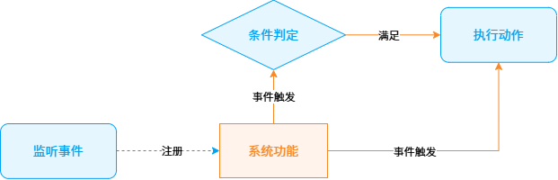

---

#### 状态触发

状态触发类型的被动技能通过Tick机制轮询判断条件是否成立，一旦满足条件则执行动作。

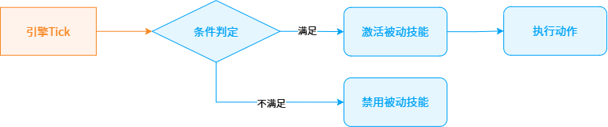

技能编辑器内置了 [技能Event](./20112_技能Event查询手册.md) 和 [技能Condition](./20111_技能Condition查询手册.md) 组件供开发者通过蓝图配置被动技能的触发机制，行为复用 [技能Task](./20094_技能Task查询手册.md) 实现具体的被动效果。

## 被动技能模板

技能编辑器预置了被动技能模板和多个被动技能示例，供开发者参考使用。

**增长**

进入对局即生效，当前血量和最大血量永久增加200点。

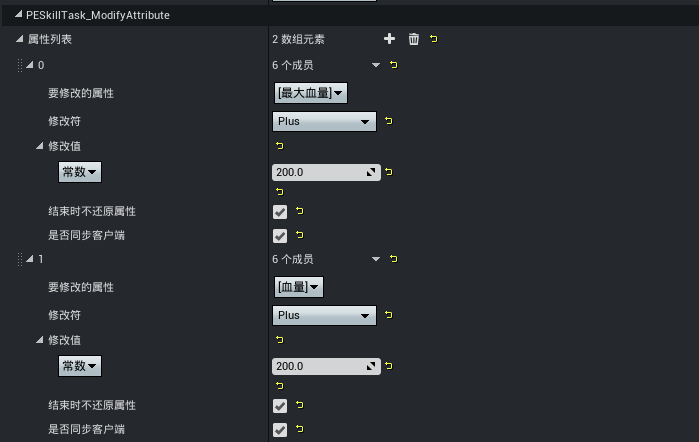

**伤害光环**

对5m内的敌人周期性造成20点伤害。

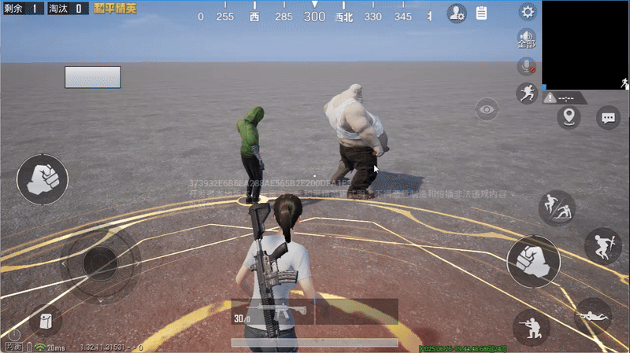

**大还丹**

当生命值低于最大生命值25%时触发，恢复全部生命值，此技能150s内最多触发一次。（为了方便演示将血量修改为75的限额，CD修改为0）

**英勇勋章**

击败一名敌人后，增加5点最大血量和0.5%移动速度倍率，最多增加300最大血量和30%移动速度倍率。

**灵魂燃烧**

击败一名敌人后，有20%的概率在敌人被击败处产生一道持续3s的火龙卷，火龙卷周围半径3m内的敌人被持续吸引至中心，并且每秒受到来自火龙卷的90点伤害。

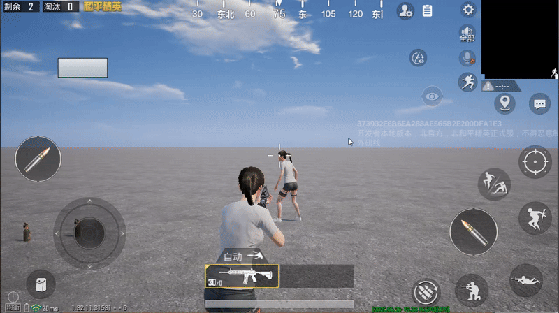

**治疗法球**

击败一名敌人后，有20%的概率掉落一个治疗法球（治疗法球存在15s），拾取后恢复20生命值。

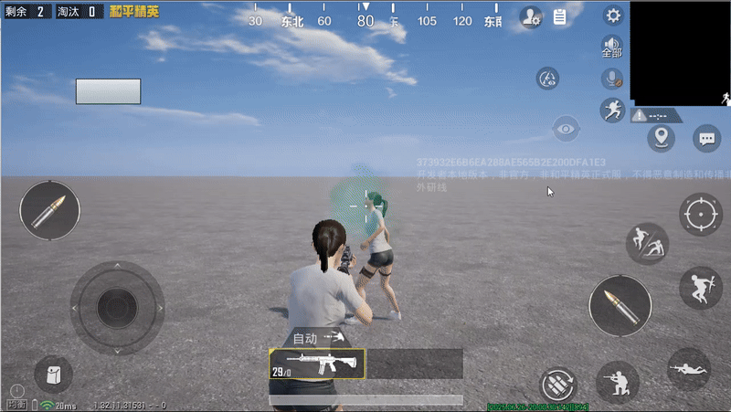

## 被动技能创建流程

### 新建被动技能蓝图

创建被动技能蓝图的步骤与主动技能一致，可参考 [新建技能蓝图](./20091_技能编辑器.md#新建技能蓝图) 相关指引。

---

### 配置被动技能蓝图

被动技能通过 [技能Event](./20112_技能Event查询手册.md) 和 [技能Condition](./20111_技能Condition查询手册.md) 决定触发时机，因此配置形式上不具有 [技能阶段](./20091_技能编辑器.md#技能阶段配置) 和 [序列播放器](./20091_技能编辑器.md#序列播放器配置) 的概念，但是与主动技能一样需要通过 [技能Task](./20094_技能Task查询手册.md) 实现行为逻辑。

被动技能的配置项主要包含 ``ECA配置`` 和 ``技能基础配置``。

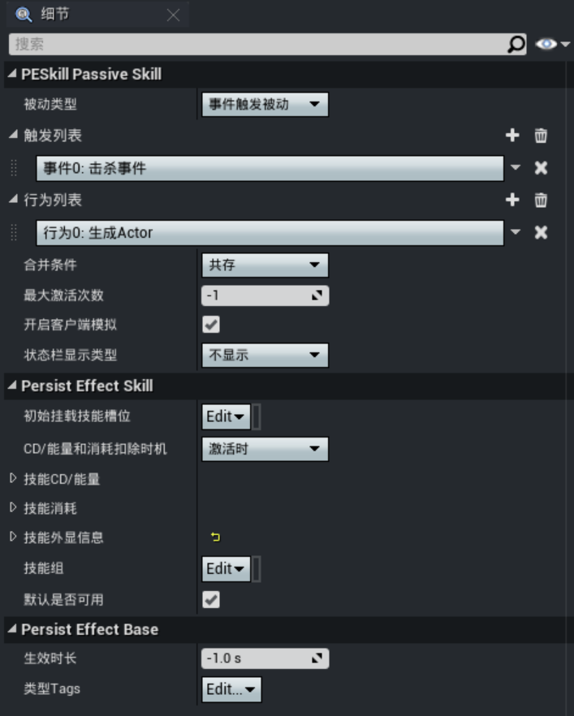

#### ECA配置

ECA的核心配置包含 ``被动类型``、``行为列表``、``合并条件``、``最大激活次数`` 和 ``状态栏显示类型``。

**被动类型**

``被动类型`` 属性的选择分为 ``事件触发被动`` 或者 ``状态触发被动``。

【事件触发被动】

当选择以事件触发时，将出现 ``触发列表`` 配置项，每个元素对应可触发被动技能的事件，多个触发事件为“或”的关系，即每个事件触发时都将执行一次被动技能。

点击右上角【+】按钮出现可选的预置事件，选择事件将添加到触发列表中。

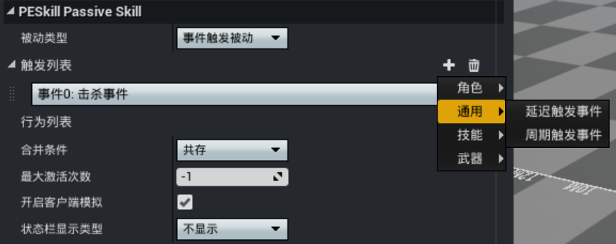

添加后选中该事件，在【配置细节】面板出现事件的参数项，用于指定精确的事件触发时机，部分属性支持 [属性绑定](../20108_技能属性绑定.md)。

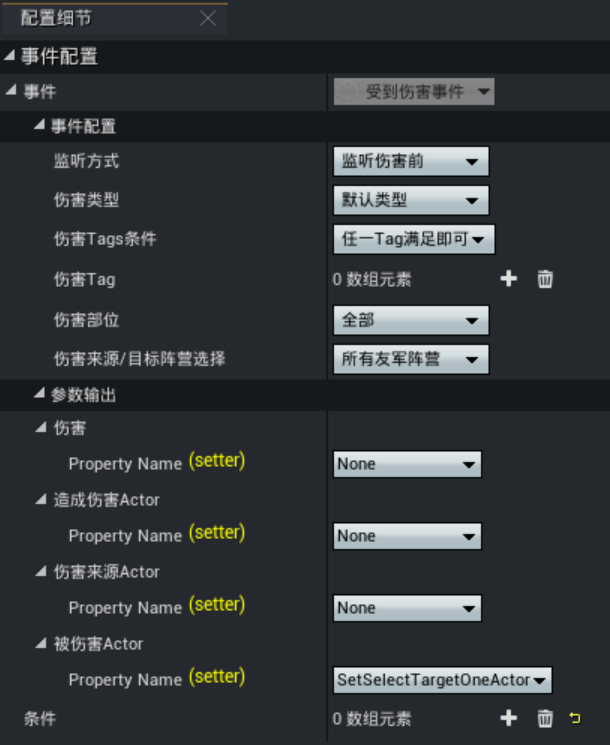

事件配置下允许嵌套条件，支持添加多组条件，且各条件之间允许设置“与或”逻辑关系，事件与条件为“且”的关系，此时当事件触发并且满足所有条件时才会触发被动技能。

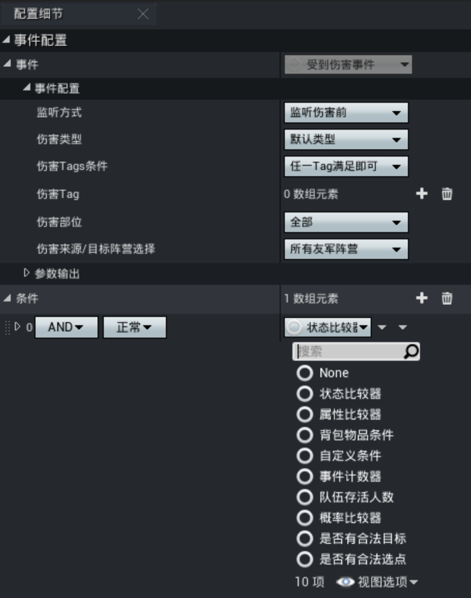

各类型事件的说明及参数详细信息可参见 [技能Event查询手册](./20112_技能Event查询手册.md)。

【状态触发被动】

选择状态触发将出现 ``状态条件`` 配置项，开发者可以添加多个条件，并且指定条件的判定规则：
- 全部满足：所有的条件全部判定成功才允许触发被动技能
- 满足任意一个：任意一个条件判定成功即可触发被动技能

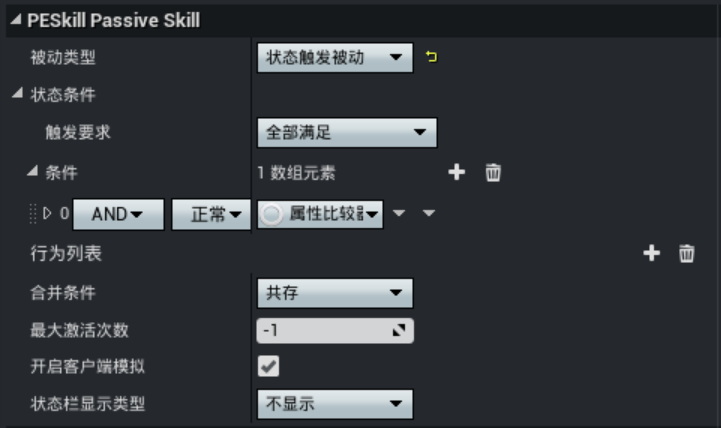

各类型条件的说明及参数详细信息可参见 [技能Condition查询手册](./20112_技能Event查询手册.md)。

---

**行为列表**

点击右上角【+】按钮出现可选的预置技能Task，选择Task将添加到行为列表中，添加后选中Task可以在【配置细节】面板设置Task的详细参数。

当被动技能处于激活状态或是触发后，将按技能Task的配置顺序依次执行各行为逻辑，以此实现被动技能的完整效果。

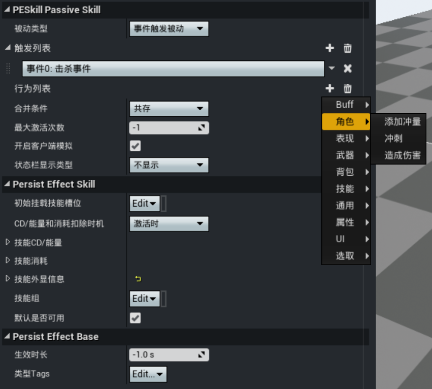

各类型Task的说明及参数详细信息可参见 [技能Task查询手册](./20094_技能Task查询手册.md)。

---

**合并条件**

当角色触发多个同类型的被动技能时，是否需要合并技能效果，合并效果由开发者通过触发的 [``OnMerge_BP``](https://developer.gp.qq.com/api/#/searchContent/UPersistEffectBase?classDetailShow=true&path=class%2Fdetail%2FOthers%2FUPersistEffectBase.json&isSelect=1&apiEnc=%5B%22%E7%B1%BB%22%5D&apiLabel=UPersistEffectBase&autoJump=OnMerge_BP) 覆写函数自行实现逻辑。

- 唯一：后续的被动技能会被合并到第一个被动技能效果上，即同时只能存在一个
- 共存：角色身上可同时存在多个被动技能，且影响状态栏的显示效果

---

**最大激活次数**

针对状态触发类型的属性，通常用于限制被动效果的叠加上限，例如被动技能效果为“每次触发暴击伤害后恢复5%的血量，最多恢复3次”，此时即可通过该属性控制恢复上限；若设置为-1则代表没有限制。

---

**开启客户端模拟**

是否同步被动技能的相关参数到客户端，用于客户端独立模拟技能表现，常用于优化性能使用。

---

**状态栏显示类型**

决定被动技能是否在状态栏显示以及如何显示，状态栏UI位置固定。

> 仅支持 [状态触发](./20110_被动技能.md#状态触发) 类型被动技能

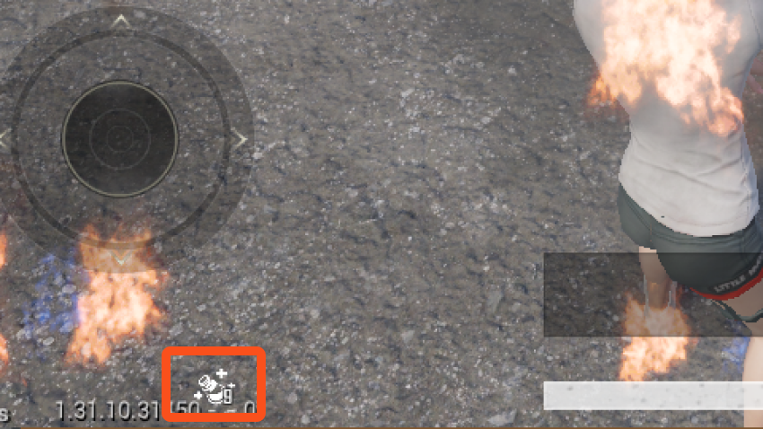

- 不显示：该被动不会出现在状态栏上
- 生效时显示：角色一旦获得该被动技能就会显示在状态栏上
- 激活时显示：被动技能生效时才会显示在状态栏上
- 激活时显示层数：被动技能触发时会在状态栏显示，且每多触发一次，其状态栏下角标+1

#### 技能基础配置

被动技能也能够设置 ``技能预设槽位``、``CD/能量消耗`` 等属性，与 [主动技能基础配置](./20091_技能编辑器.md#技能基础配置) 完全一致，可参考相关文档进行配置。

## 添加被动技能

被动技能也需要主动添加给角色Pawn才能触发生效，同样支持蓝图配置和脚本动态添加的方式，可参见 [添加技能](./20091_技能编辑器.md#添加技能) 部分内容进行配置。

## 实现简易被动技能

下面以一个被动技能为例，从空模板创建被动技能蓝图开始，逐步完成各效果的配置，帮助开发者更好地理解被动技能的创建过程。

目标效果：当玩家受到伤害时，触发加速并且生成逃跑毒气。

1. 打开技能编辑器，选择以 ``空技能模板`` 创建被动技能蓝图。

	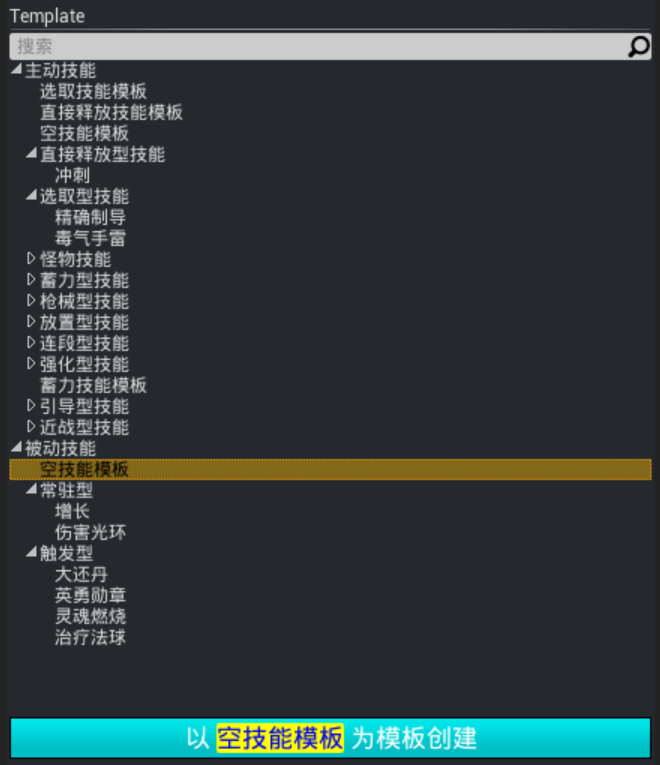

2. 由于被动技能为受到伤害时触发，因此被动类型选择“事件触发被动”，并添加一个 ``受到伤害事件``，将该伤害事件的伤害来源默认为全部。

	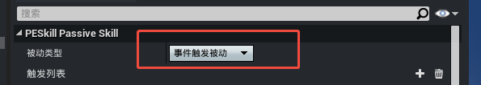
	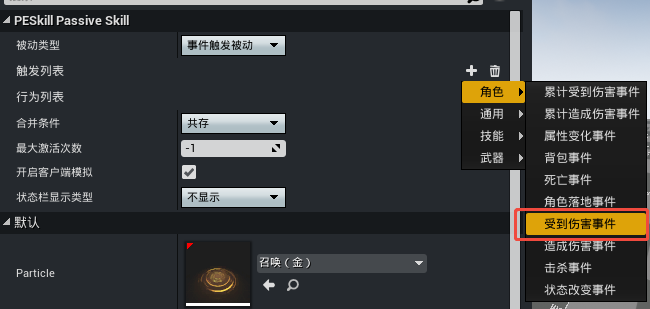
	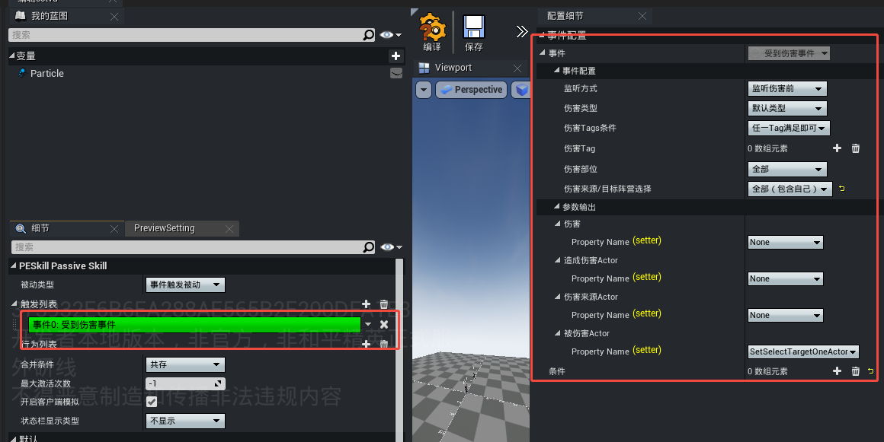

3. 在行为列表中添加一个 ``修改属性`` 的行为，为角色血量回复999点生命值，同时根据当前血量动态调整移动速度：``10 - (当前生命值 × 0.085)``，实现血量越低、移速越快的效果。

	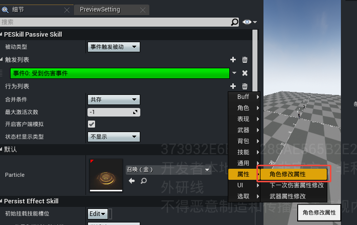
	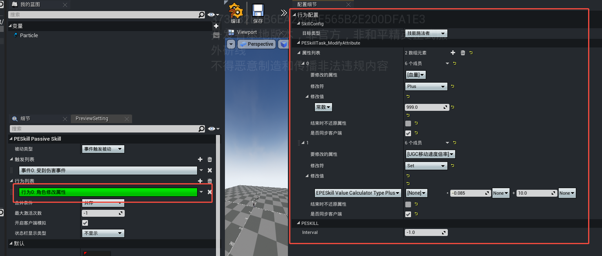

4. 在行为列表中额外添加一个 ``生成Actor`` 行为，选择Actor类为 ``BP_PoisonGas``，这样当受伤时将放出一圈毒气。

	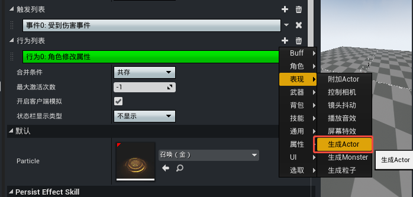
	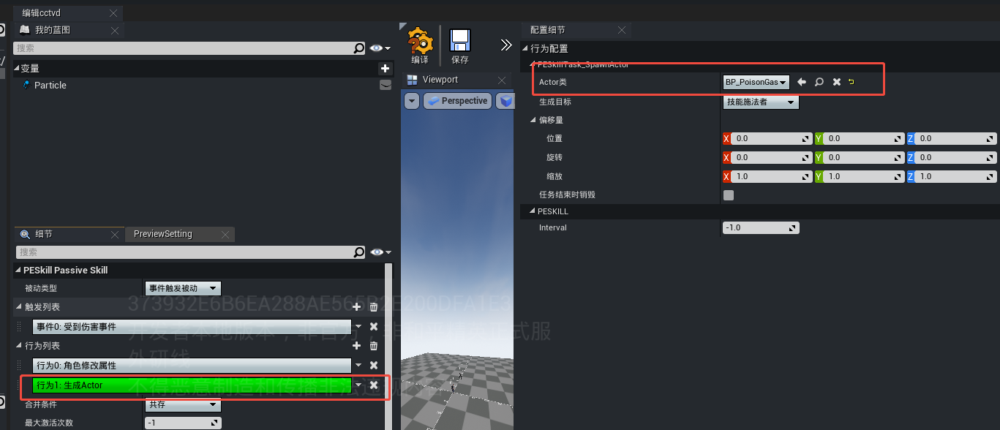

5. 最后配置被动技能的CD、技能名称及图标等基础属性，并将技能添加到角色的技能组件中。

	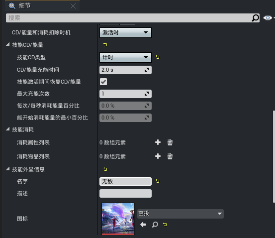
	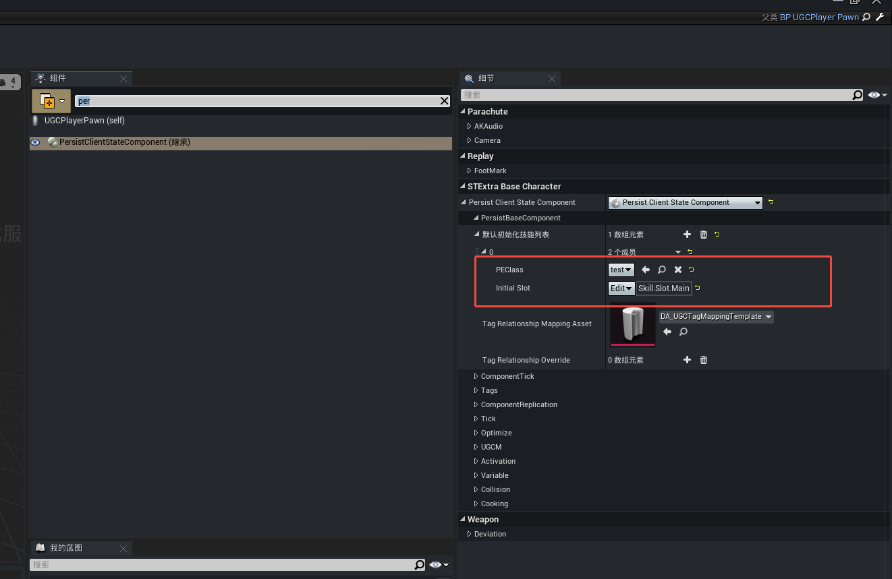

技能效果演示：

