# 技能调试工具

技能调试工具提供运行时查看技能、Buff和角色属性状态的功能，为新技能/Buff编辑器框架而设计，帮助开发者在技能开发过程中快速进行数值和表现的调试和迭代优化。

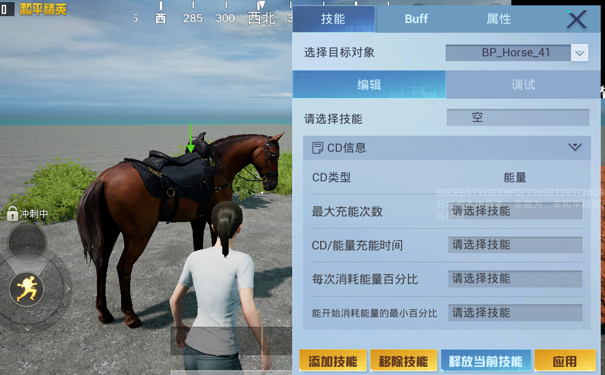

## 启用调试工具

技能调试工具功能通过 [通用GM面板](../../../../绿洲编辑器基础内容/调试游戏/20109_通用GM面板.md) 提供，启动编辑器 [Debug调试](../../../../绿洲编辑器基础内容/调试游戏/307_编辑器Debug调试.md)，找到右上角GM入口并点击。

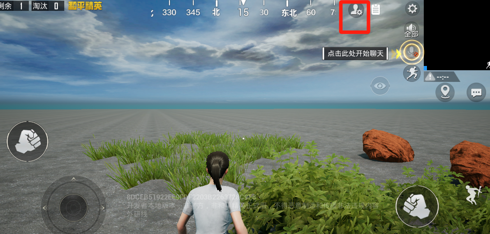

展开GM面板后，点击右侧【调试】页签，切换到调试面板，点击 ``角色调试面板`` 的确定按钮即可打开技能调试工具。

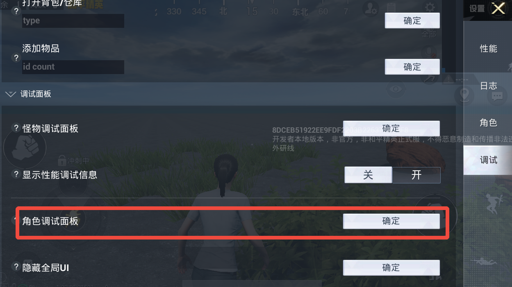

## 调试功能说明

技能调试工具提供了三类调试功能：技能调试、Buff调试与属性调试。

### 技能调试

技能调试面板支持为指定目标添加/移除/释放指定技能、查看技能的运行时数据，甚至可以修改技能配置以调试技能效果。

调试技能前需要先选择调试目标，调试工具会将以玩家自身为中心的球形范围内的Pawn对象纳入可选列表，从【选择目标对象】的下拉列表中选择目标实例对象。

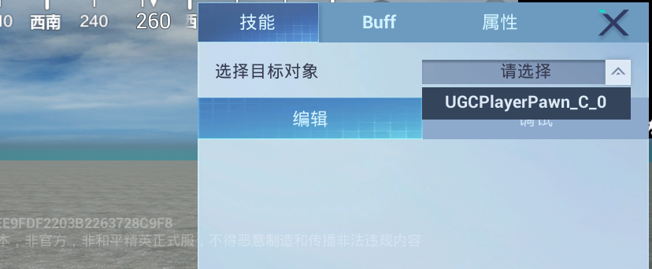

当Pawn对象选择成功后，会通过绿色箭头形式的UI标识当前调试目标。

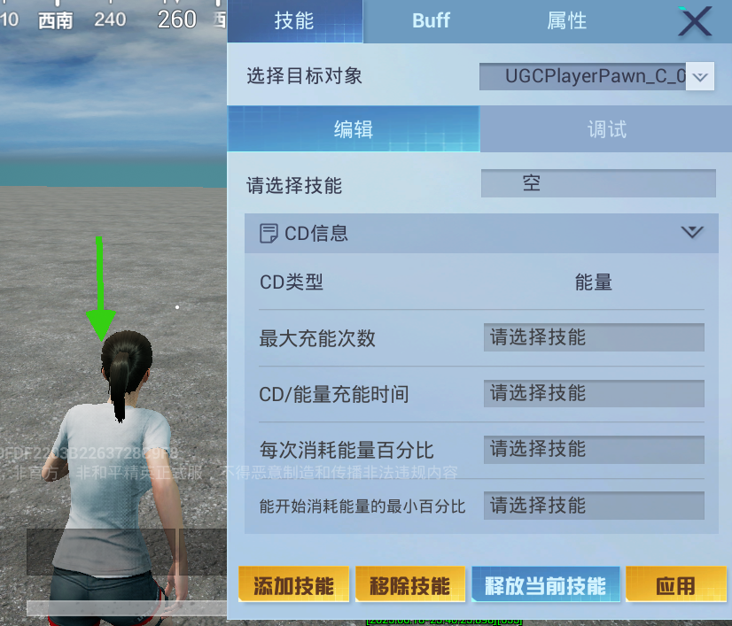

#### 添加技能

点击【添加技能】按钮，在弹出窗口中需要填写要添加的技能和绑定的技能槽位。

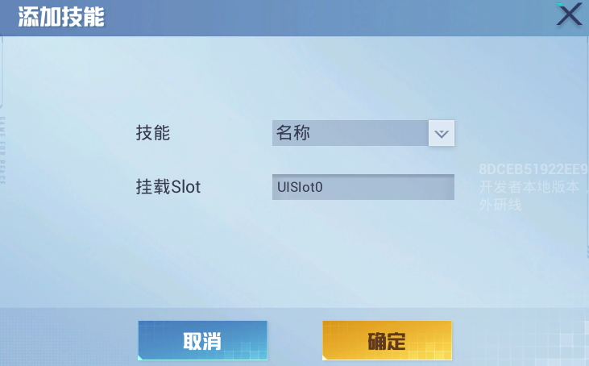

通过 [技能编辑器](./20091_技能编辑器.md#新建技能蓝图) 创建的技能蓝图将出现在下拉列表中，“挂载Slot”为 [预设技能UI槽位](./20091_技能编辑器.md#技能基础配置)。

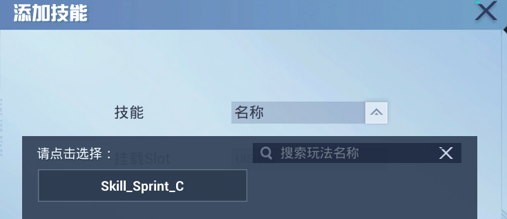

点击【确定】后该技能将添加给目标对象，【编辑】面板将显示该技能的CD消耗与技能消耗配置信息，同时【调试】面板也会显示技能槽位、技能阶段状态、上一次施法结果等更详细的运行时数据。

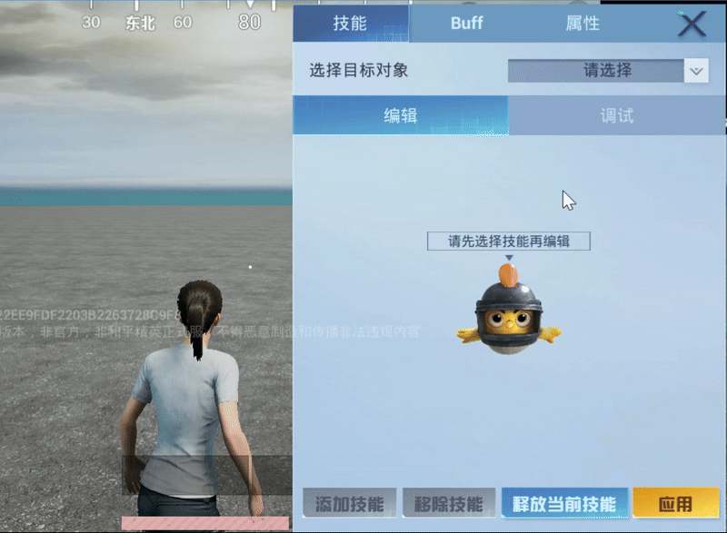

---

#### 释放技能

添加技能时如果绑定的是预设技能UI槽位，则会在界面上显示该技能，此时可以直接点击触发技能。

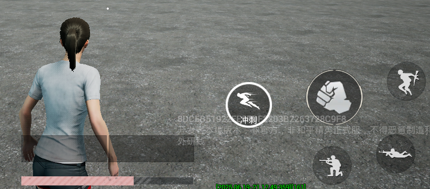

调试工具也提供了添加多种技能下的更便捷的释放方式，在【编辑】面板选中目标技能，点击下方【释放当前技能】按钮即可触发技能。

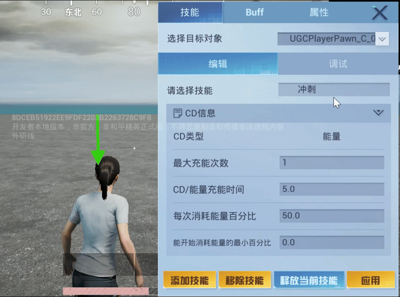

---

#### 修改技能配置

除了释放技能，调试工具还支持修改CD消耗与技能消耗的参数配置，修改后点击【应用】按钮即可生效。

---

#### 移除技能

在选中技能的情况下，点击【移除技能】按钮可以移除该技能，效果等同于 [``RemoveSkillInstance``](https://developer.gp.qq.com/api/#/searchContent/UGCPersistEffectSystem?classDetailShow=true&path=class%2Fdetail%2F%E5%92%8C%E5%B9%B3%E5%85%A8%E5%B1%80%E6%8E%A5%E5%8F%A3%2F%E6%8A%80%E8%83%BD%E7%B3%BB%E7%BB%9F%2FUGCPersistEffectSystem.json&isSelect=1&apiEnc=%5B%22%E7%B1%BB%22%5D&apiLabel=UGCPersistEffectSystem&autoJump=RemoveSkillInstance)。

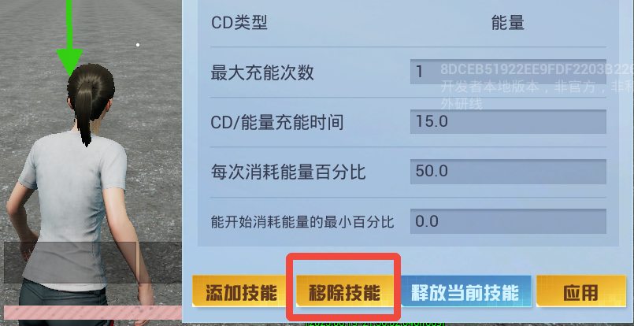

### Buff调试

Buff调试面板默认显示当前玩家角色的Buff状态，如果需要调试其他对象，也需要先选择调试目标，操作与添加技能调试目标相同。

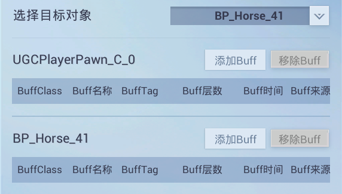

#### 添加Buff

点击【添加Buff】按钮，在弹出窗口中需要填写要添加的目标Buff、Buff来源（Causer）、Buff层数和持续时间，通过 [Buff编辑器](../Buff编辑器2.0/20087_Buff编辑器.md#新建Buff蓝图) 创建的Buff蓝图会出现在可选列表中。

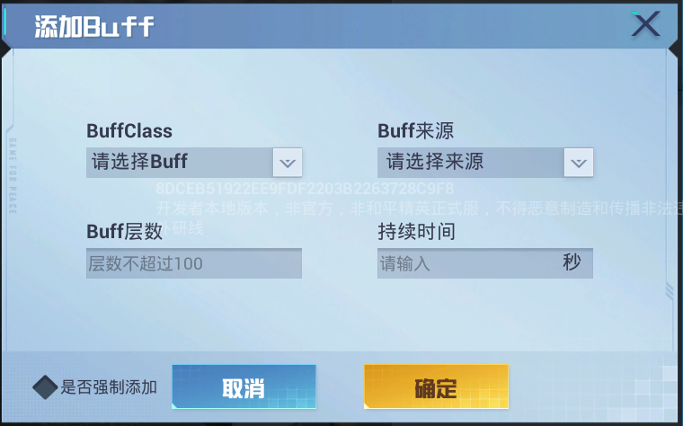

成功添加Buff后将在对应的目标对象的Buff栏实时显示Buff状态信息。

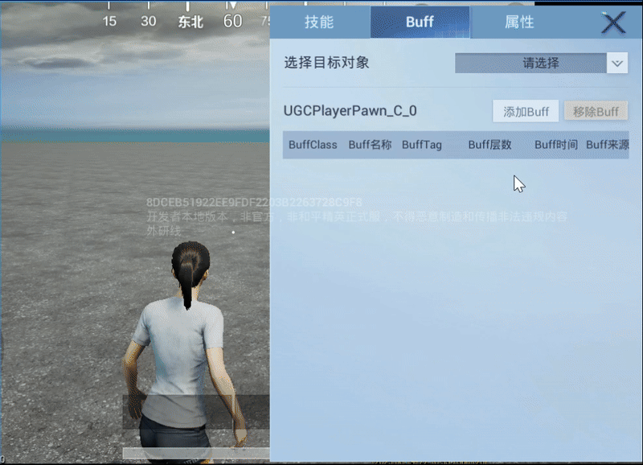

---

#### 移除Buff

在目标对象的Buff栏，选中Buff并点击【移除Buff】按钮即可移除该Buff，效果等同于 [``RemoveBuffByClass``](https://developer.gp.qq.com/api/#/searchContent/UGCPersistEffectSystem?classDetailShow=true&path=class%2Fdetail%2F%E5%92%8C%E5%B9%B3%E5%85%A8%E5%B1%80%E6%8E%A5%E5%8F%A3%2F%E6%8A%80%E8%83%BD%E7%B3%BB%E7%BB%9F%2FUGCPersistEffectSystem.json&isSelect=1&apiEnc=%5B%22%E7%B1%BB%22%5D&apiLabel=UGCPersistEffectSystem&autoJump=RemoveBuffByClass)。

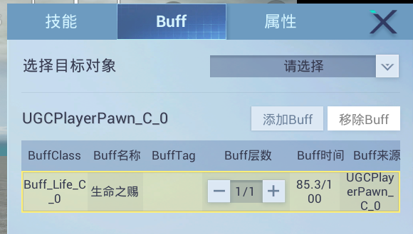

### 属性调试

属性调试面板提供角色基础属性（[固化属性](https://developer.gp.qq.com/wikieditor/#/catalog/20135?autoJump=%E5%9B%BA%E5%8C%96%E5%B1%9E%E6%80%A7)）和 [自定义属性](https://developer.gp.qq.com/wikieditor/#/catalog/20135?autoJump=%E8%87%AA%E5%AE%9A%E4%B9%89%E5%B1%9E%E6%80%A7) 的调试功能，选择调试的目标对象后即显示各项属性信息，开发者可以直接在面板上修改属性值并验证修改效果。

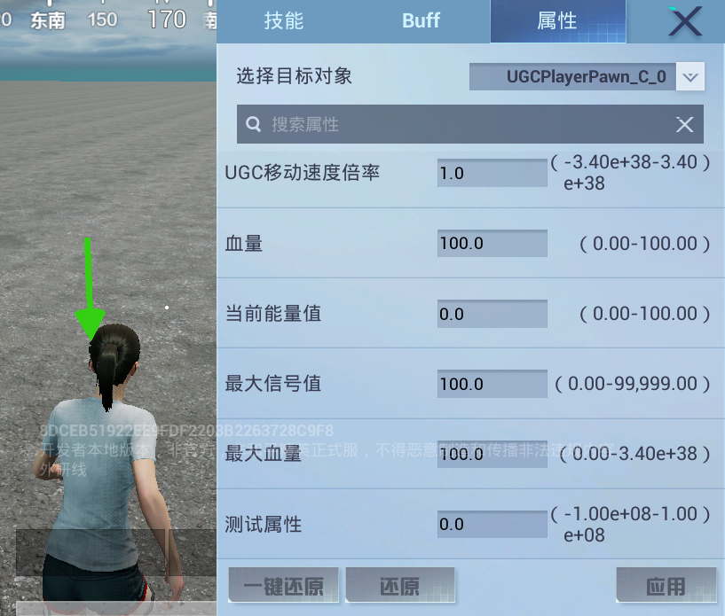

#### 修改属性

以 ``移动速度倍率`` 属性为例，修改属性值后，点击【应用】按钮即可生效。

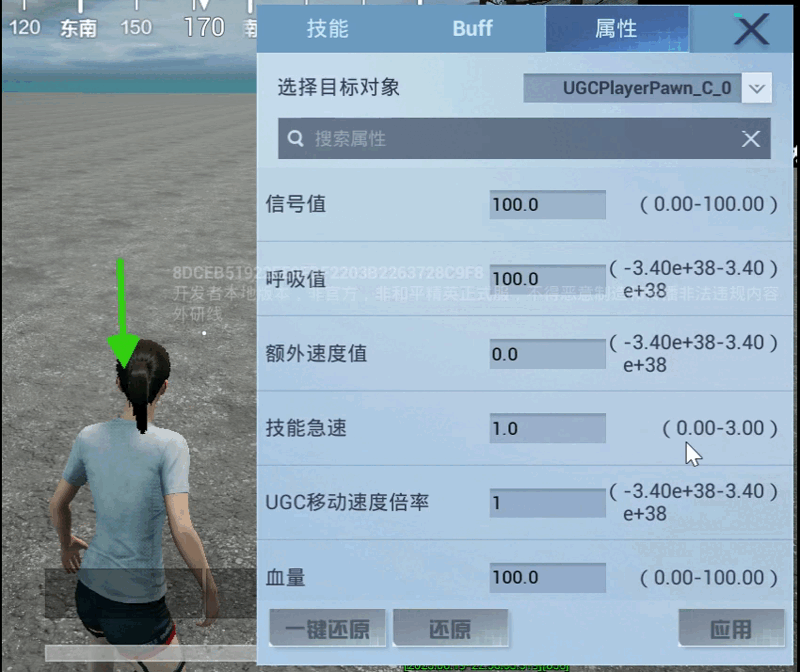

---

#### 还原属性

选中要还原的目标属性，点击【还原】按钮即可将属性值还原为默认值。

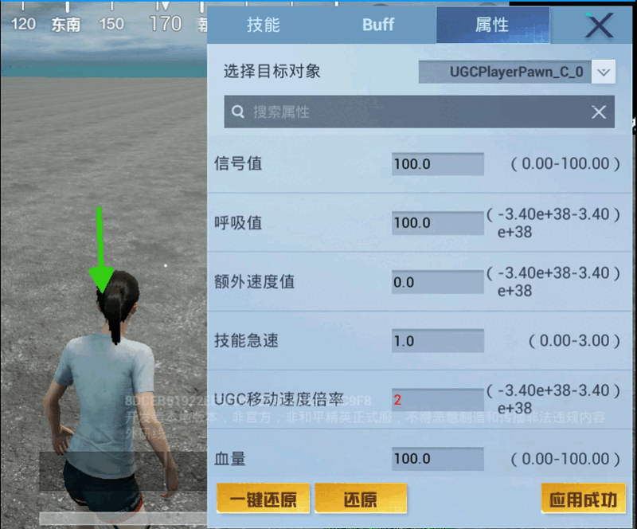

如果修改了多个属性，可以通过【一键还原】按钮进行批量属性的还原。

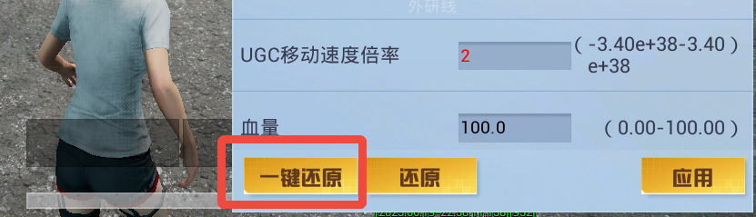
