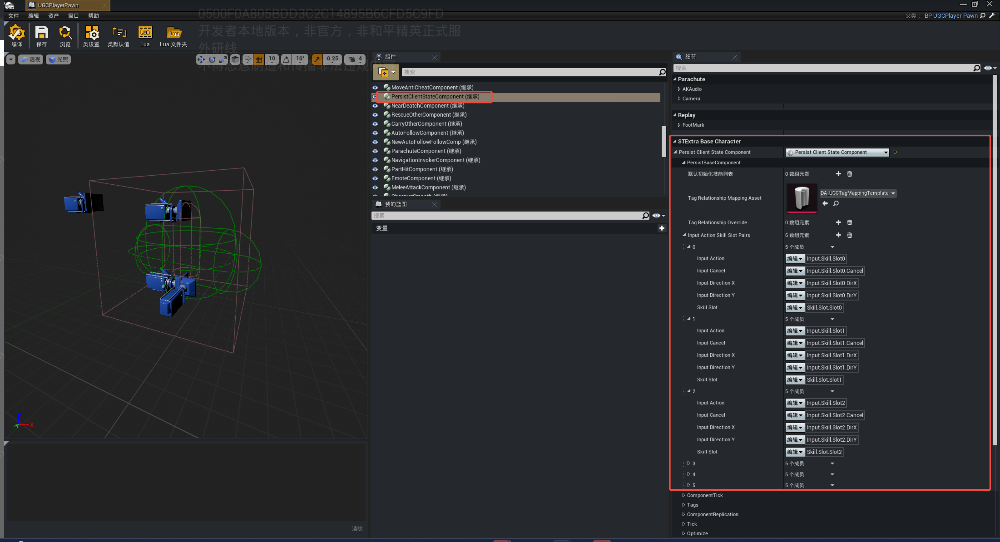
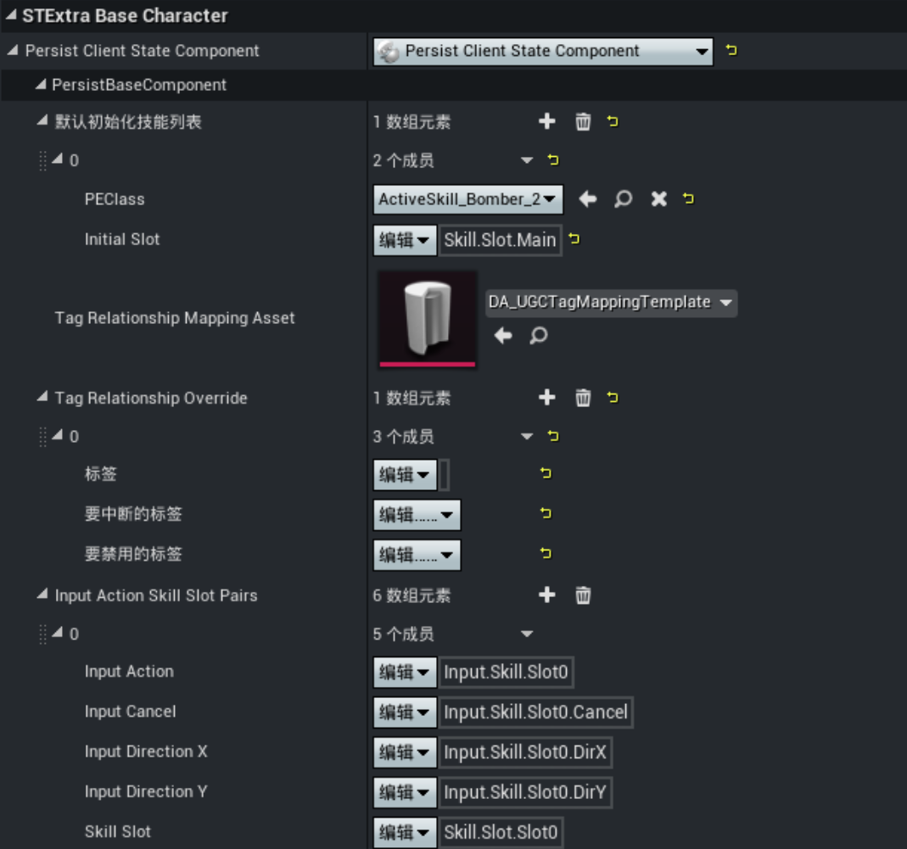
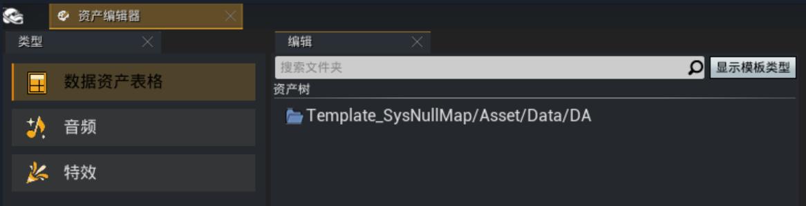

# 技能组件

## 技能组件概述

技能组件即挂载在怪物或是角色身上的PersistClientStateComponent组件，用于承载角色或怪物的技能/Buff管理、释放以及状态互斥等功能，是角色和怪物可以在游戏内进行技能释放的核心组件。

## 技能组件配置

- 默认初始化技能列表：该角色初始就拥有的技能或是Buff列表
	- PEClass：可配置玩家初始的被动技能/主动技能/Buff
	- Initial Slot：主动技能初始挂载的逻辑slot（若不配置，则会使用技能配置项里的配置）

	- TagRelationShip Mapping Asset：状态互斥预设的DA表，该DA表可以用资产编辑器的数据资产表格进行创建
	
	
	> 该表里可以配置一组状态互斥的规则，可以看作一组状态互斥的集合，所有配置的状态互斥规则均会生效
- Tag RelationShip Override：可以在组件上添加的任意多项的状态互斥的覆盖规则，覆盖状态互斥预设表里的 [状态互斥](../20106_状态互斥.md) 规则，可以视为是对状态互斥规则表的一种补充。比如：状态互斥预设表里定义的状态A可以打断状态ABC；而这里配置了状态A可以打断状态AB，则最终在角色上生效的互斥规则以这里为准（状态A打断状态AB）
- InputActionSkillSlotPairs：技能和 [输入Action的映射表](../../../输入系统/20290_输入映射.md#输入映射表:~:text=输入概述-,输入映射表,-配置输入映射)
	- Input Action：技能激活事件对应的Input Tag，该Input Tag的输入被激活时，触发该技能slot上技能的激活事件
	- Input Cancel：技能取消事件对应的Input Tag，该Input Tag的输入被激活时，触发该技能slot上技能的取消事件
	- Input Direction X：技能右摇杆X轴的输入值对应的Input Tag，该技能slot上技能使用右摇杆进行选取的时候，摇杆的X轴输入值来源于该Input Tag的值
	- Input Direction Y：技能右摇杆Y轴的输入值对应的Input Tag，该技能slot上技能使用右摇杆进行选取的时候，摇杆的Y轴输入值来源于该Input Tag的值
	- Skill Slot：该技能输入映射关联的技能逻辑slot
