#  物资编辑器

物资特指在游戏内可以被拾取，装备，放入背包以及被使用的物品，物资编辑器用于创建新的物资，也可编辑已有的物资的相关属性设置。基于物资编辑器内提供的物资基础模板，可以快速创建新的物资，通过为物资绑定`Lua`脚本，可深度定制物资的功能和用途。

物资编辑器提供三方面的配置：属性配置，ItemHandle，PickupWrapper。

> 编辑器默认启用物品编辑器（物资编辑器2.0），如需使用旧物资编辑器，可参考 [旧物编入口开启方式](../../../../版本日志/20175_1.32 Release Notes.md#其他) 说明

## 主界面

点击主界面顶栏**物资编辑**按钮进入物资编辑器主界面：

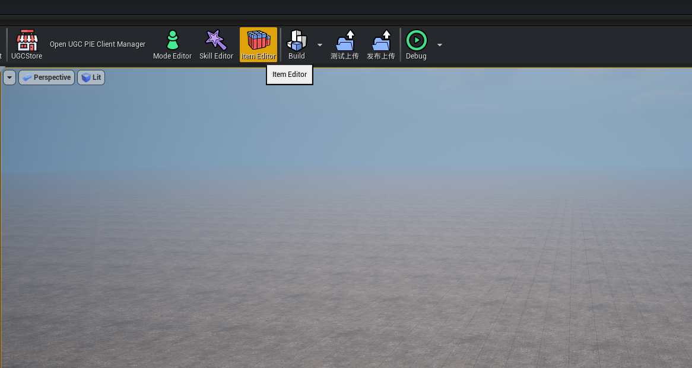
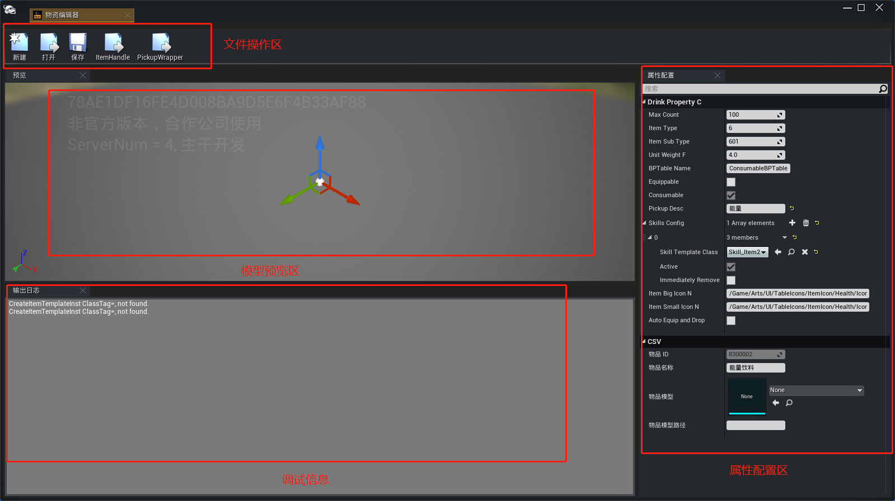

物资编辑器主界面主要分为四个功能区域：文件操作区、模型预览、调试信息和属性配置区。

**文件操作区**

主要对文件进行相关操作，包括**新建物资**，**打开已有物资**，保存当前内容，打开ItemHandle及PickupWrapper配置窗口

**模型预览**

显示当前编辑中的物资模型和特效

**调试信息**

显示编辑过程中物资相关的日志信息

**属性配置区**

显示当前物资的**基础属性参数**，包括，堆叠数量，物资重量，物资类型，描述等

## 基础操作

### 新建物资

点击物资编辑器主界面顶栏**新建按钮**，在物资模板选择窗口选择自己需要的物资模板，并命名自定义物资，选择物资的存储位置

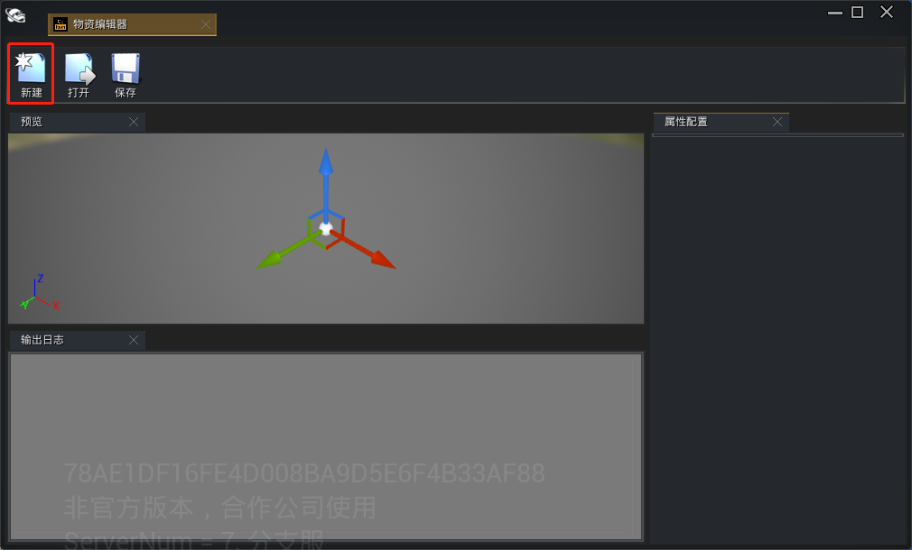
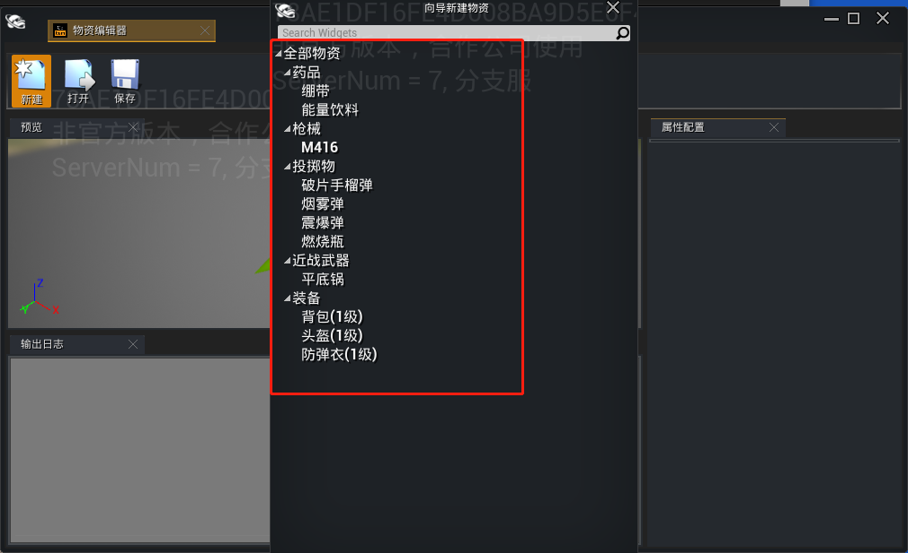
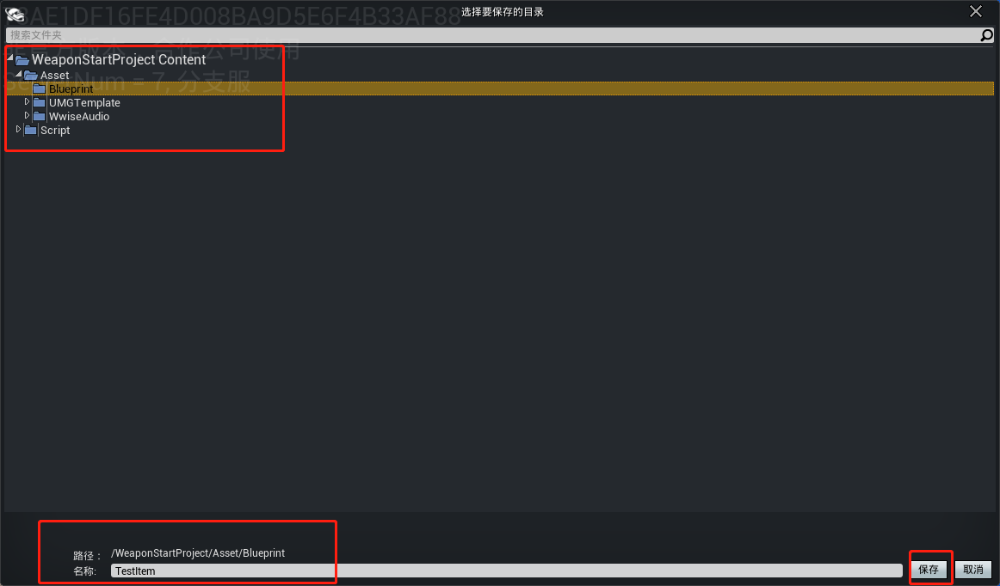
 **强烈建议将自定义物品放在统一的文件夹中，命名方式遵循一定的规范和规律，方便后期对物资的查找** 

### 打开/删除物资

点击**打开按钮**打开已有物资列表，列表会将所有自定义物资展示出来，并可进行打开，删除快捷操作

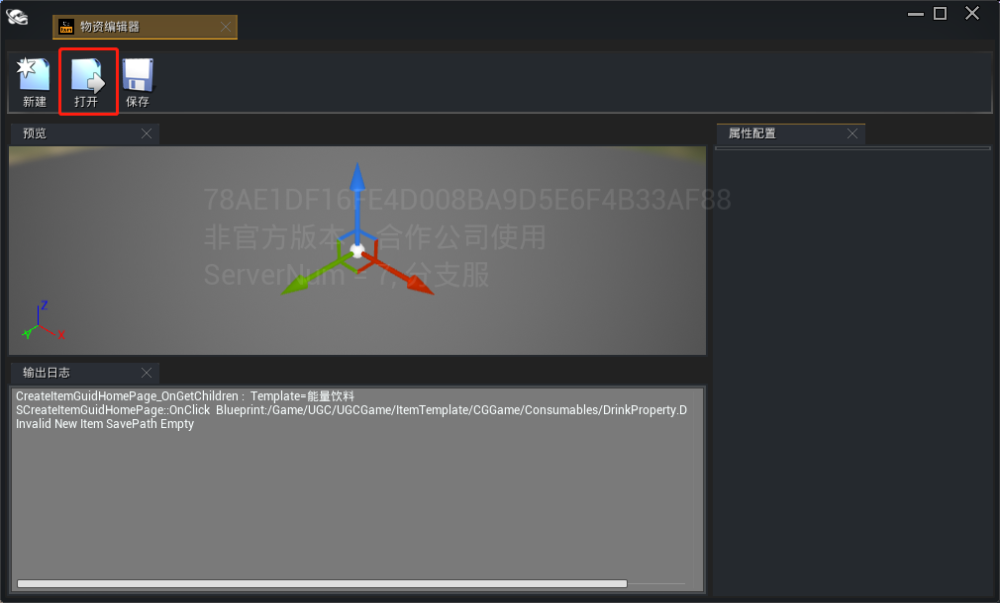
点击**打开按钮**打开已有自定义物资进行编辑，点击**删除按钮**即可删除已有自定义物资

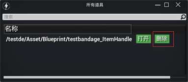

### 编辑物资属性

新建或打开物资后，在右边的**属性配置**面板中配置物资的基础属性

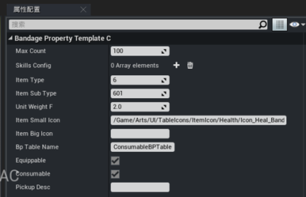

## ItemHandle

ItemHandle用于管理物资在背包中被使用时需要处理的事情，包括使用物资，丢弃物资等。

通过物资编辑主界面顶栏**ItemHandle按钮**即可进入ItemHandle管理界面

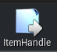
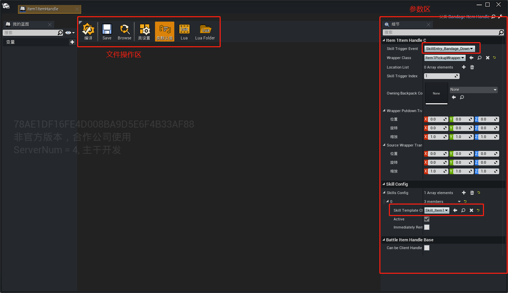

文件操作主要是对当前物资进行**编译**，保存，或是绑定Lua脚本**定制化**功能的功能操作。

在细节面板中可以设置物资相关的一些参数，其中比较重要的是：
- `SkillTriggerEvent`，用于设置收到什么事件后执行物资绑定的技能
- `SkillConfig`，配置物资绑定的技能蓝图

## PickupWrapper

PickupWrapper用于配置物资在场景中可拾取时的参数和表现，可配置更改物资的模型，特效等表现。

点击物资编辑主界面顶栏**PickupWrapper**按钮打开PickupWrapper管理界面

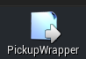
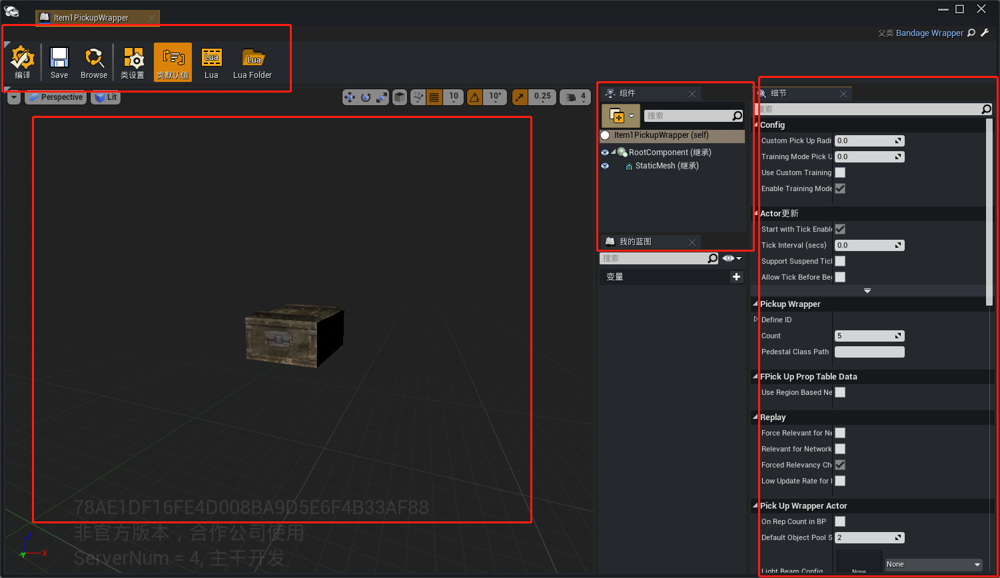

在组件面板下，可以对物资的模型进行更改，或是添加新的组件。
