#  投掷物物资

该部分将以<span style="color: #EE0000">破片手榴弹</span>为模板创建新的投掷物物资

## 创建手雷物资

在物资编辑器中选择 ``投掷物 -> 破片手榴弹`` 创建，新建过程可参考其他类型物资，不再赘述。

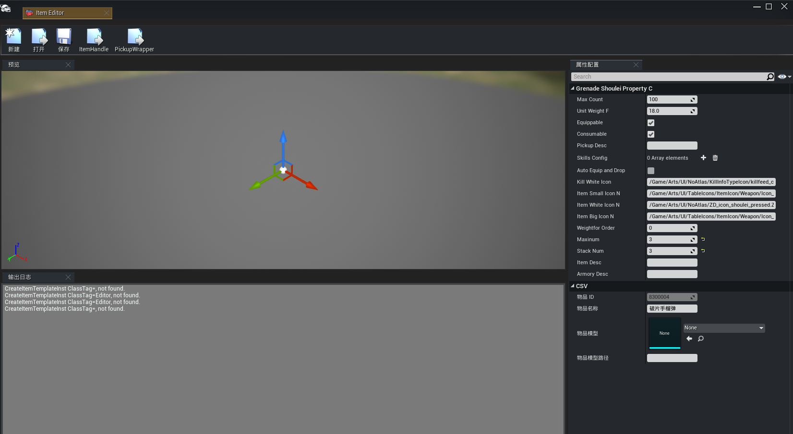

## 自定义配置

如果想要改变手雷的一些属性，例如爆炸延迟时间、瞄准时间等，需要修改手雷物资关联的手雷武器蓝图及手雷抛体蓝图。

### 创建手雷武器蓝图

在手雷的ItemHandle中找到手雷武器蓝图配置项，``WeaponClass``即为手雷武器蓝图类：

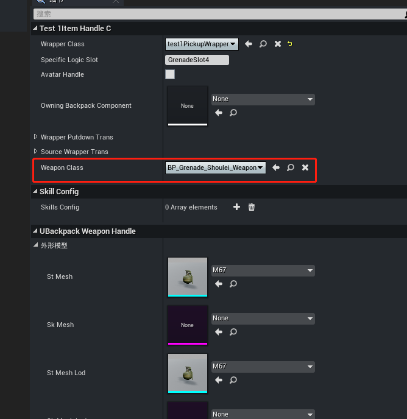

继承自 ``BP_Grenade_Shoulei_Weapon`` 创建新的蓝图类，创建好后，将新的武器蓝图路径配置到 ``Weapon Class`` 属性中引用。

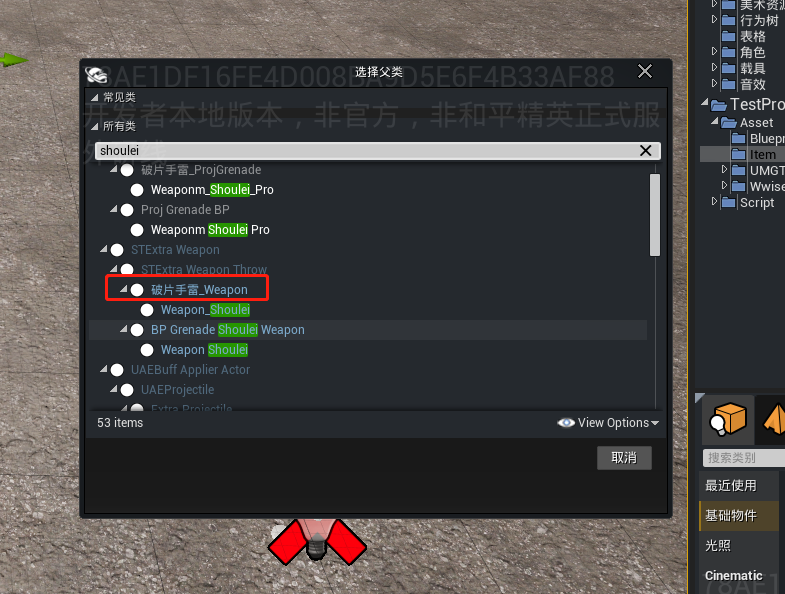

---

### 创建手雷抛体蓝图

```EliteProjectile``` 是手雷抛出时的蓝图类，该蓝图类配置在 ``BP_ThrowComponent`` 组件的 ``Projectile Class`` 属性中。

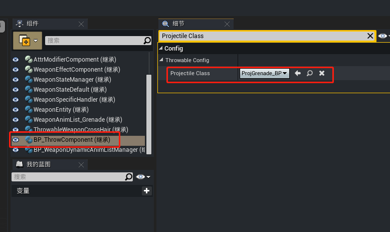

继承自 ``ProjGrenade_BP`` 创建新的抛体蓝图类，将新的抛体蓝图路径配置到``Projectile Class`` 属性中引用。

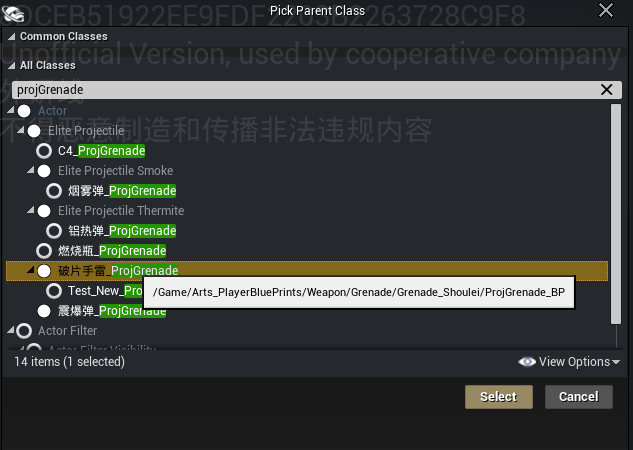

---

### 手雷模型

手雷模型分为三类：手持模型、拾取物模型及抛体模型。

**手持模型**

点击物资编辑器，选择新建的手雷，点击并打开 ```ItemHandle```，属性面板中搜索 ```UBackpack Weapon Handle```，修改 ``St Mesh`` 和 ``St Mesh Lod``：

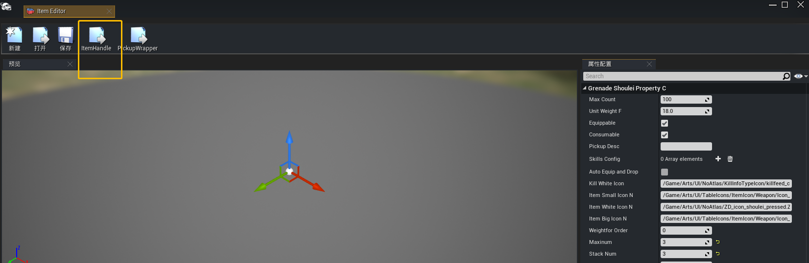

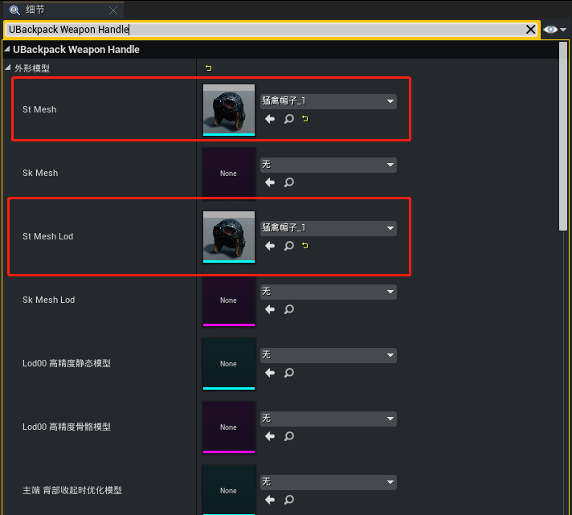

修改完成重新编译并保存，启动调试游戏，装备手雷查看效果：

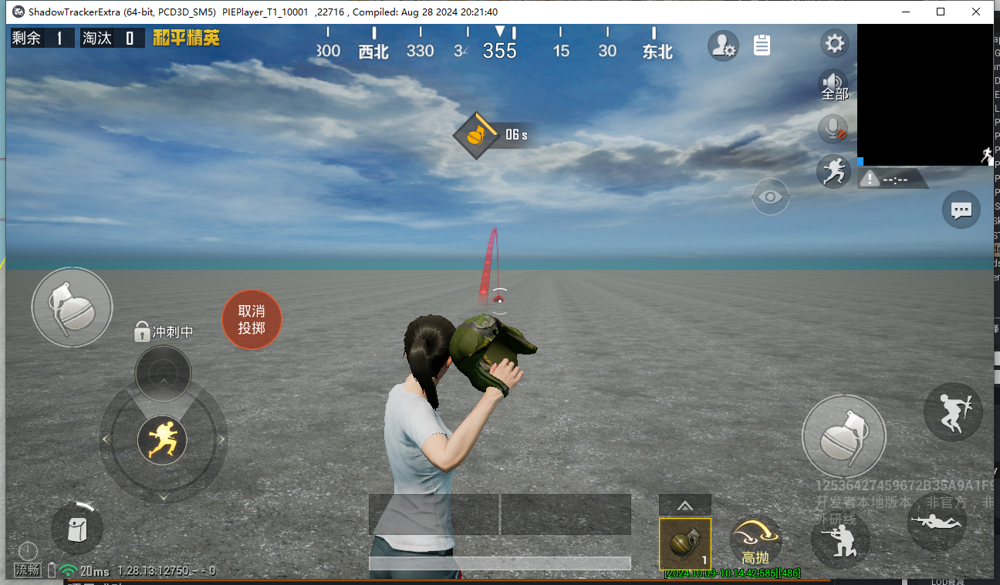

**拾取物模型**

点击物资编辑器，选择新建的手雷，点击并打开 ```PickupWrapper```，找到 ```StaticMesh``` 组件，修改静态网格体与材质：

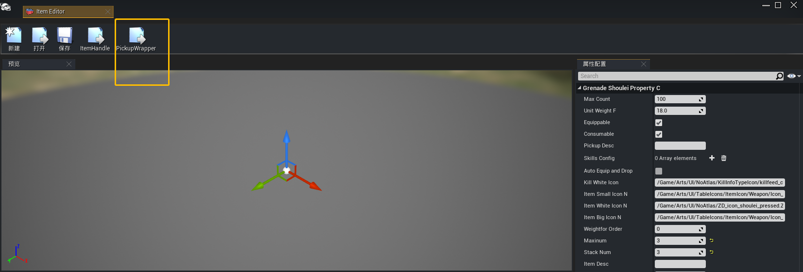

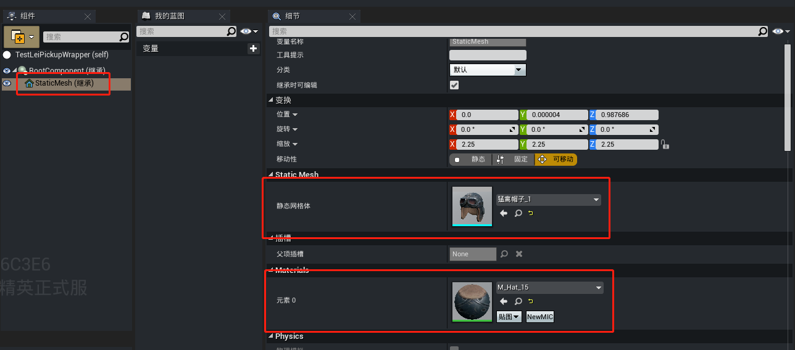

修改完成重新编译并保存，将wrapper蓝图放置在场景中，启动调试游戏，查看模型替换效果：

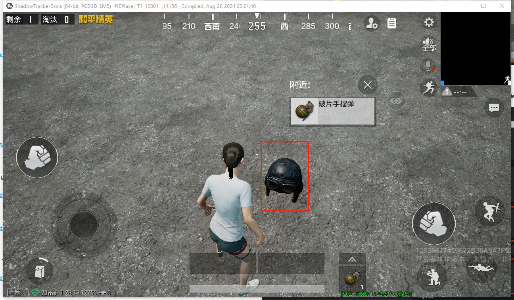

**抛体模型**

双击打开手雷抛体蓝图，找到 ```ProjectileMesh``` 组件，修改静态网格体与材质：

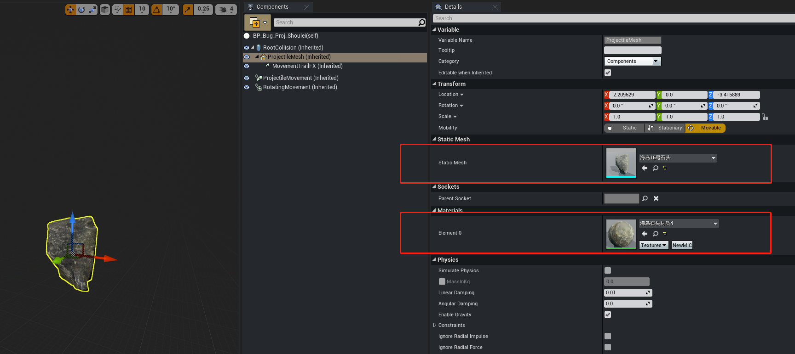

修改完成重新编译并保存，启动调试游戏，将手雷投掷出去查看效果：

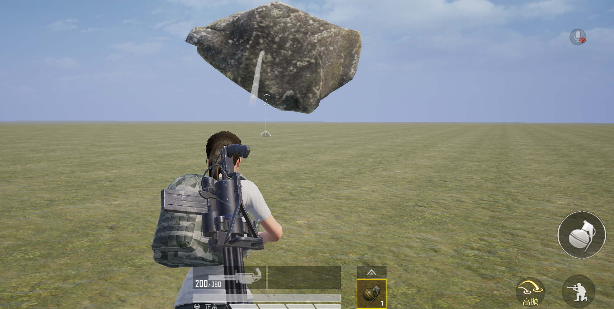

---

### 爆炸延迟时间

确认投掷（拉环）后到爆炸的时间

手雷武器蓝图中 ``BP_ThrowComponent`` 组件的 ``Explosion Delay Oerride`` 属性为爆炸延迟时间参数：

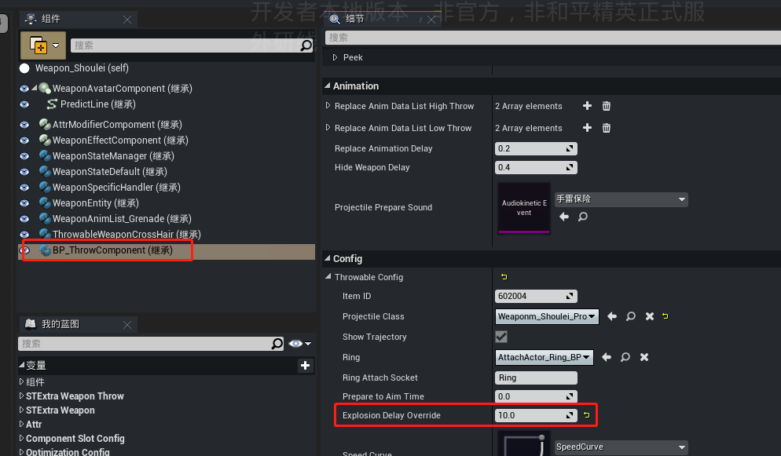

---

### 投掷冷却时间

投掷两枚手雷之间的间隔

手雷武器蓝图中 ``BP_ThrowComponent`` 组件的 ``Throw Cooldown Duration`` 属性为投掷冷却时间参数：

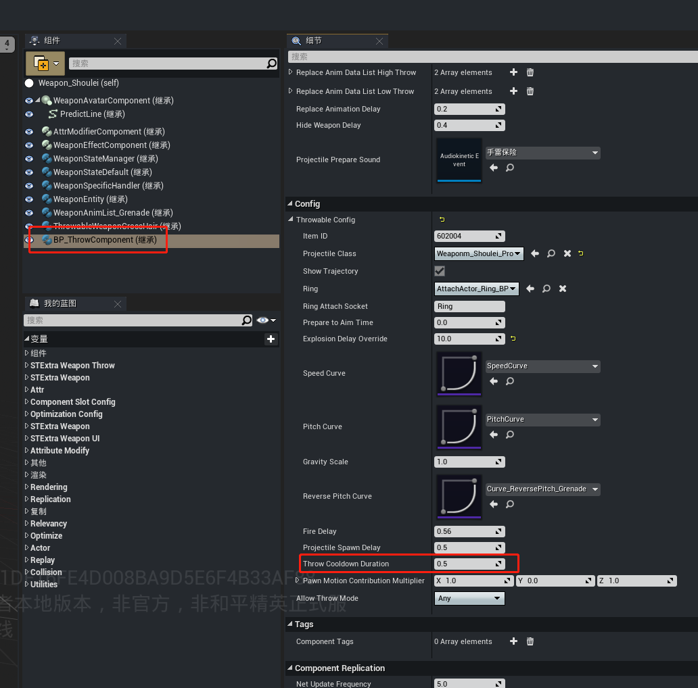

---

### 爆炸范围与伤害

自定义设置手雷的爆炸范围和伤害数值

**修改爆炸范围**

双击打开手雷抛体蓝图，找到 ``Sphere`` 属性配置项，该配置项即代表手雷爆炸时的伤害范围（单位：厘米）

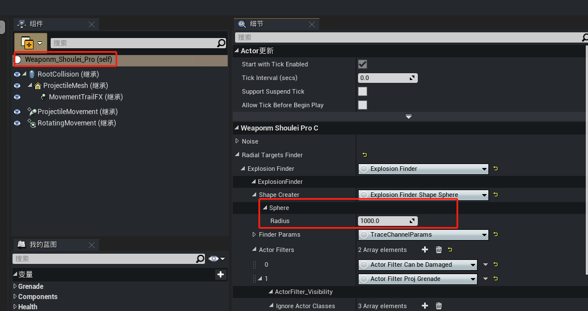

**修改手雷伤害**

手雷的伤害根据距离判定、有衰减，因此一般使用曲线进行配置，在抛体蓝图中找到 ``Damage Curve`` 属性配置项，新建一个曲线，替换该配置

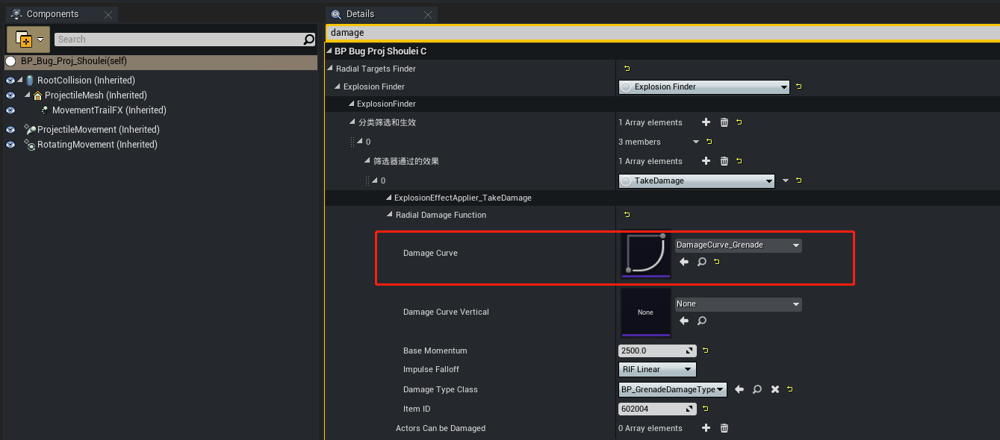
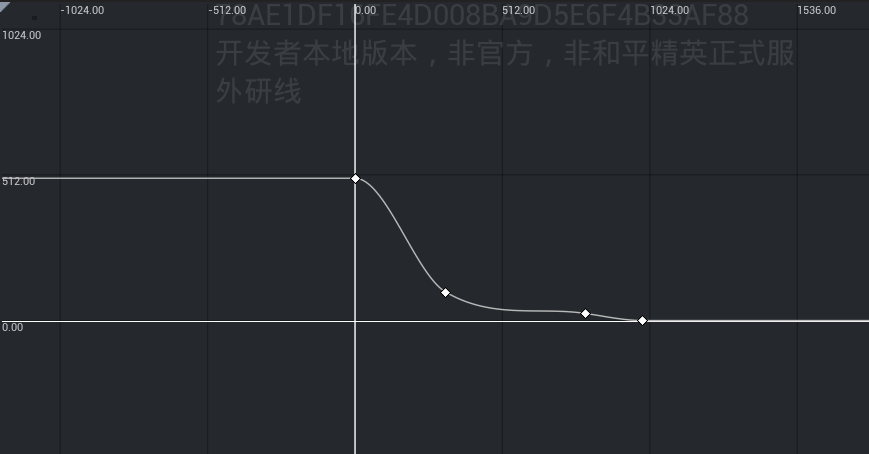

> 横轴为距离，竖轴为伤害

**动态修改爆炸范围与伤害**

打开抛体蓝图关联的lua类文件，脚本中已经内置了可以使用的函数和事件：

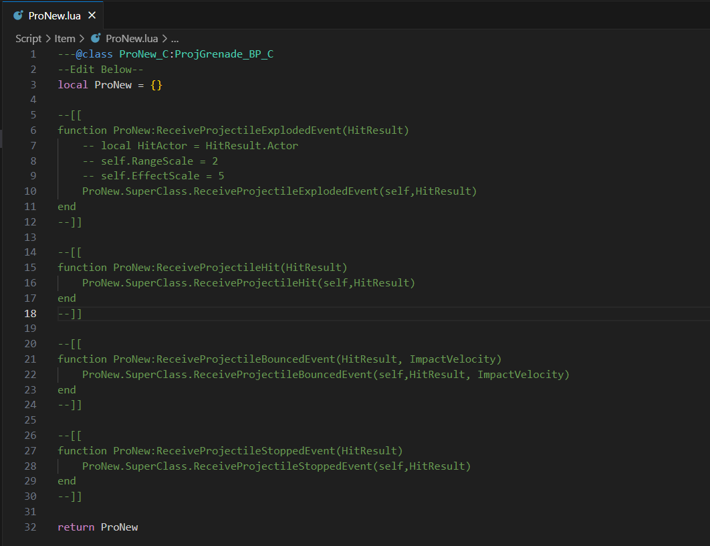

在 ```ReceiveProjectileExplodedEvent``` 事件中可以通过调整 ```RangeScale``` 和 ```EffectScale``` 两个属性值，实现动态修改爆炸范围与伤害的效果。

``` lua
function ProNew:ReceiveProjectileExplodedEvent(HitResult)
    local HitActor = HitResult.Actor
    self.RangeScale = 2 -- 修改爆炸范围
    self.EffectScale = 5 -- 修改伤害效果
    ProNew.SuperClass.ReceiveProjectileExplodedEvent(self,HitResult)
end
```

> 此方式只在C4/烟雾弹/破片手雷/铝热弹/震爆弹中生效
