# 自定义枪械

物品编辑器内置了和平精英常用枪械的实体蓝图模板，基于模板创建的枪械实体提供更丰富的参数供开发者自定义修改，包括开火特效、枪械性能、子弹属性等等，甚至可以为枪械赋予技能，实现个性化的改装效果。

## 创建枪械实体蓝图

以创建M416枪械实体蓝图为例：

1. 从“枪械模板”窗口中选择 ``M416``，下方“选择模板创建”按钮将高亮显示，并更名为“以 ``M416`` 为模板创建”
2. 点击“以 ``M416`` 为模板创建” 按钮，弹出输入名称弹窗，输入枪械名称并点击确定
3. 新建的枪械将添加至“工程物品资源”窗口中，且枪械实体蓝图创建于 ``Asset/Blueprint/Prefabs/Weapons`` 路径下

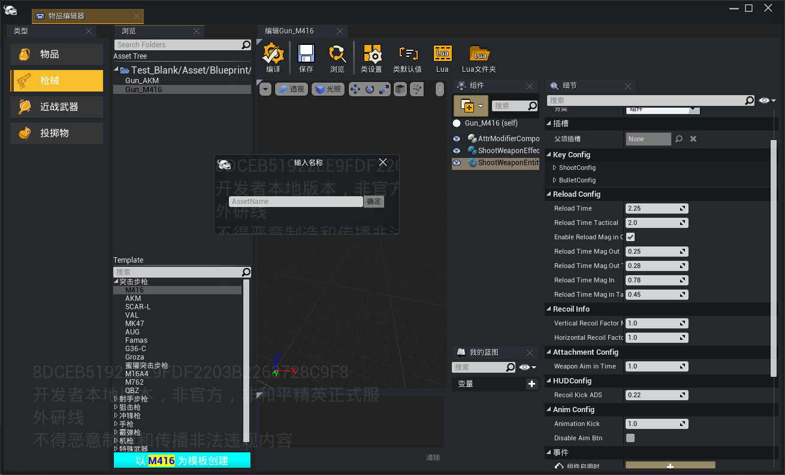

## 修改枪械属性

### 开火特效

枪械实体蓝图的【美术表现】属性类别下可以设置枪械射击时枪口的火焰特效。

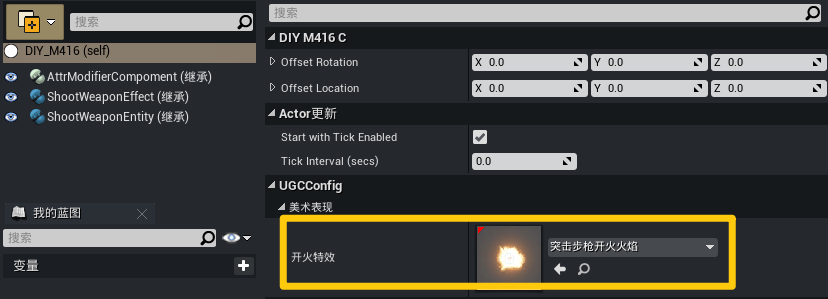

---

### 命中特效和音效

命中特效与音效通过数据资产蓝图配置，内容浏览器右键 ``各种各样 -> 数据资源``，搜索 "Hit Effect Data Asset" 并创建资产蓝图。

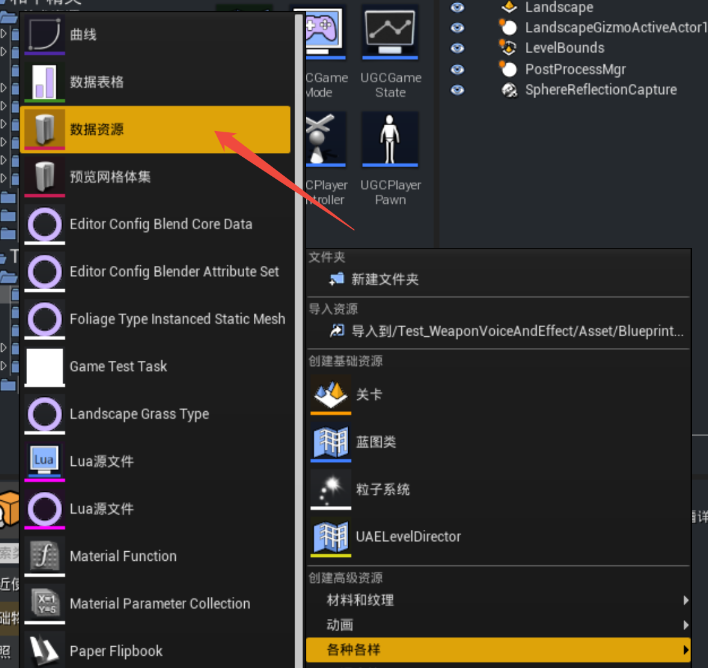
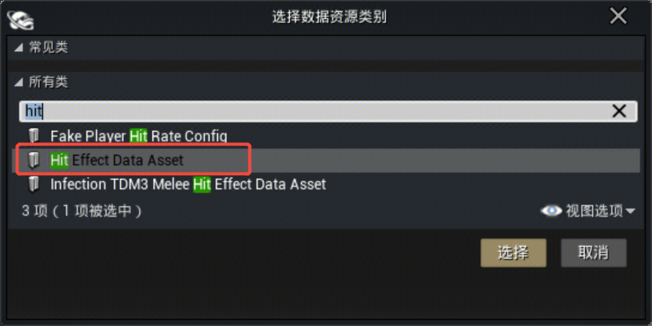

在 【FXConfig】 属性配置对应的命中特效。

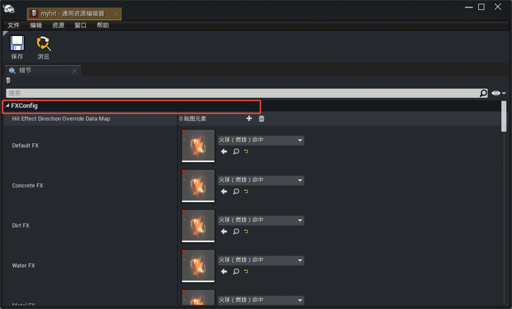

在 【SoundConfig】 属性配置对应的命中音效。

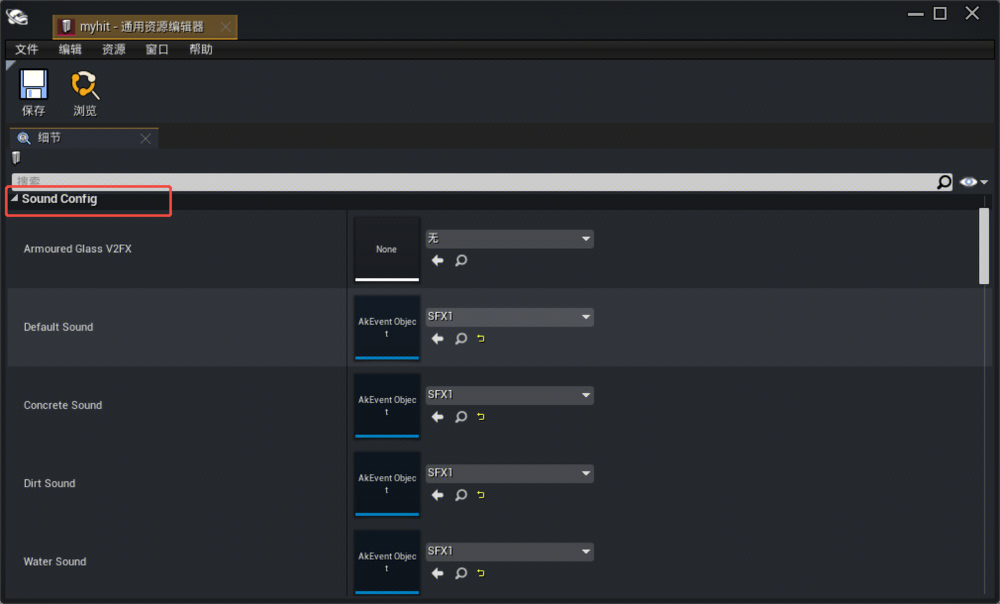

**属性名对照表**

|属性名|属性说明|
|-|-|
|Default|默认|
|Concrete|混凝土|
|Dirt|土|
|Water|水|
|Metal|金属|
|Wood|木|
|Grass|草|
|Glass|玻璃|
|Flesh|躯体|
|Steel|钢铁|
|Sandbag|沙袋|
|Sand|沙子|
|Cloth|布料|
|Plastic|塑料|
|Leather|皮料|
|Ceramics|陶器|
|Paper|纸|
|Stone|石头|
|Snow|雪|
|PopCan|易拉罐|
|Leaf|叶子|
|Car|车|
|Asphalt|柏油路|
|ConcreteTDM|TDM混凝土|
|Ice|冰|
|Food|食物|

在自定义武器的 ``ShootWeaponEntity`` 组件中，找到 【Bullet Config】，将上面配置好的命中效果数据资源配置到 ``OverrideHitEffectDataAsset`` 中。

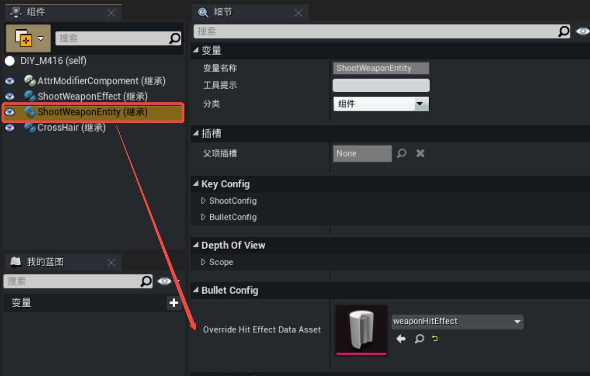

[绑定枪械物品](./20103_自定义枪械.md#绑定枪械物品:~:text=技能配置-,绑定枪械物品,-开发助手) 后，点击调试，给玩家添加该枪械，即可看到效果。

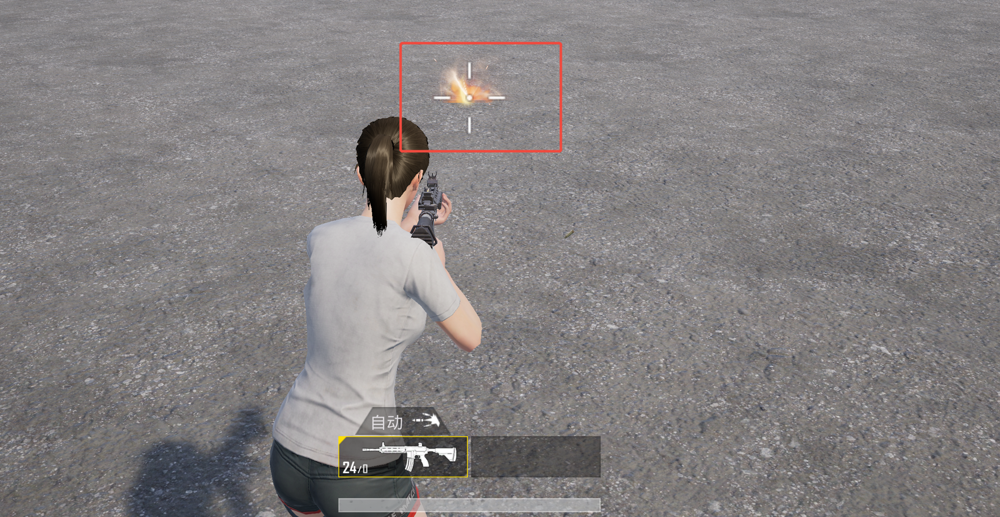

---

### 枪械性能

枪械性能相关参数涵盖射击模式、人机工效、伤害配置和子弹配置等部分的属性。

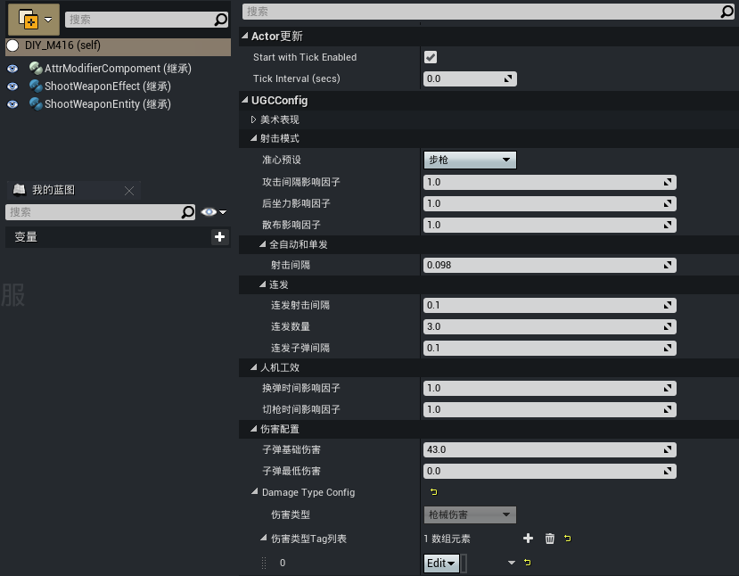

|属性名|属性说明|
|-|-|
|准心预设|准心的UI效果，目前支持步枪、霰弹枪、手枪、榴弹枪四类 【步枪】 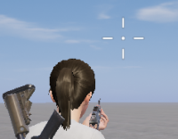 【霰弹枪】 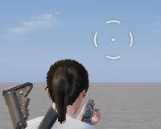 【手枪】 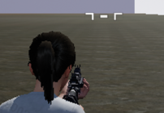 【榴弹枪】 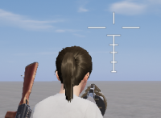|
|攻击间隔影响因子|枪械射击间隔的时间倍率|
|后坐力影响因子|后坐力程度倍率|
|散布影响因子|子弹偏离准心的程度，针对多发子弹类型的枪械，例如霰弹枪|
|射击间隔|单发子弹的射击间隔，对单发类型枪械有效|
|连发射击间隔|连发射击的间隔，对连发类型枪械有效|
|连发数量|连发子弹的数量，对连发类型枪械有效|
|连发子弹间隔|一次连发的子弹射击间隔，对连发类型枪械有效|
|换弹时间影响因子|枪械换弹的时间倍率|
|切枪时间影响因子|背负枪械和手持枪械的切换时间倍率|
|子弹基础伤害|单颗子弹的基础伤害值|
|子弹最低伤害|子弹在距离衰减/穿透之后的伤害最低值|
|伤害类型Tag列表|支持为子弹伤害设置多种Tag，通过 [GameplayTag](../../20102_Gameplay标签.md) 创建|

---

### 子弹属性

枪械实体蓝图的【子弹配置】属性类别下可以设置子弹的基础属性，如果想要枪械能够支持装填和发射更多不同类型的子弹或者抛体，详情见 [枪械物品特性](./20101_物品编辑器.md#枪械物品特性:~:text=类型特性配置-,枪械物品特性,-配件物品特性) 中的额外子弹配置。

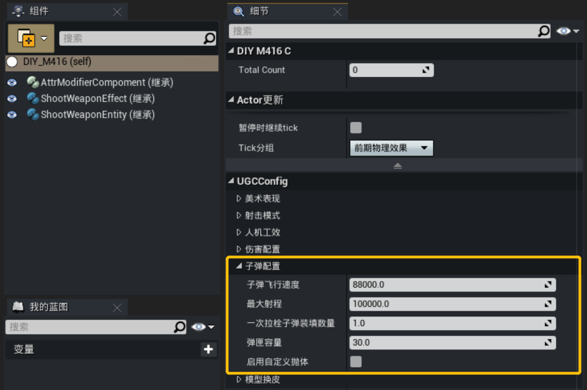

|属性名|属性说明|
|-|-|
|子弹飞行速度|子弹射出枪膛的飞行速度|
|最大射程|子弹的最远射击距离，超出距离子弹被销毁|
|弹匣容量|枪械弹匣内存储的最大子弹数|
|一次拉栓子弹装填数量|栓狙枪械一次填弹的数量，例如98K|
|启用自定义抛体|如果启用，则会按 [通用抛体](../../../../通用功能/20165_通用抛体.md) 的设置额外发射抛体|
|自定义抛体|启用后，设置抛体的蓝图类|

枪械实体蓝图的 ``ShootWeaponEntity`` 组件属性集中，【BulletConfig】控制弹匣初始子弹数和无限弹药的设置。

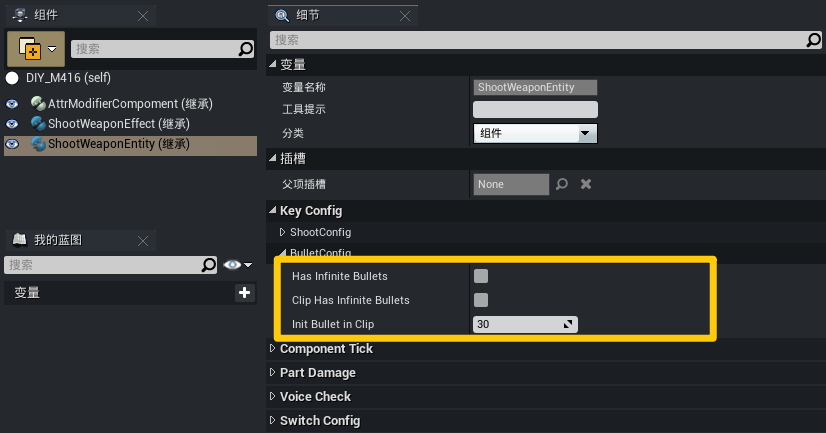

- Has Infinite Bullets：开启后拥有无限弹药，但受制于弹匣的容量仍需换弹
- Clip Has Infinite Bullets：开启后弹匣无容量限制，拥有无限弹药且无需换弹
- Init Bullet in Clip：当玩家获得枪械时，弹匣内的初始子弹数

---

### 技能配置

开发者可以为枪械挂载特定的技能及设定技能的赋予条件和生效时间。

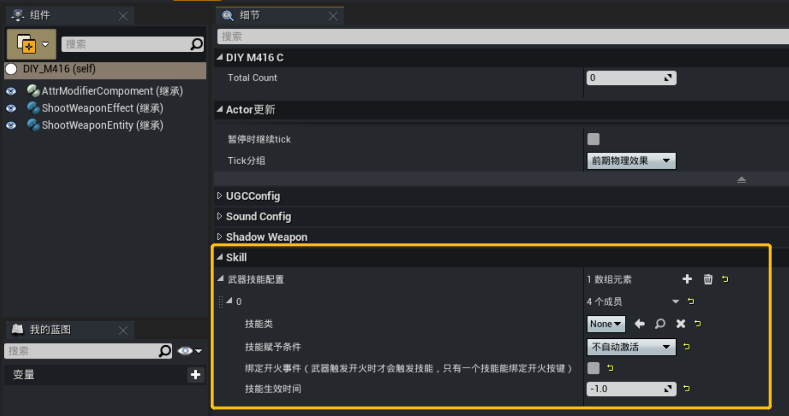

- 技能类：通过 [技能编辑器](../../技能系统/技能编辑器2.0/20091_技能编辑器.md) 创建的技能
- 技能赋予条件：何时为角色添加技能
	- 武器装备激活：当玩家手持该枪械时添加
	- 武器使用激活：当玩家装配该枪械时添加
	- 不自动激活：开发者自行实现添加技能的逻辑
- 绑定开火事件：启用后武器触发开火时才会触发技能，注意只有一个技能能绑定开火按键
- 技能生效时间：以 ``技能赋予条件`` 的时间点开始的有效时长，超过生效时间会自动卸载技能，-1为永久生效

## 绑定枪械物品

枪械实体蓝图无法直接进入背包或者实例化为可拾取物，需要绑定枪械物品才有效，通过物品编辑器 [创建枪械物品](./20101_物品编辑器.md#新建物品蓝图)，将 ``Weapon Class`` 属性设置为该实体蓝图，即得到一把改装后的全新枪械。

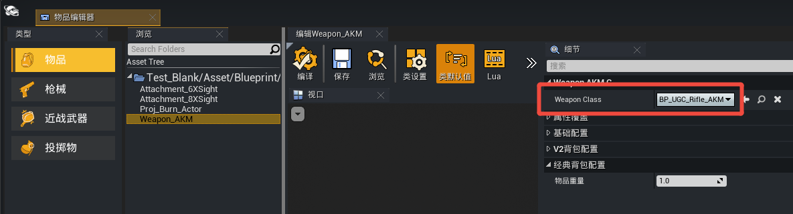

## 技能枪械制作

以AKM枪械改为电击步枪为例，开发者可以熟悉技能枪械的制作流程，实现不同功能和表现的自定义枪械。

### 1. 创建枪械物品

打开【物品编辑器】，在【物品】和【枪械】页签中创建一把AKM枪械物品和对应的武器蓝图，并进行绑定。

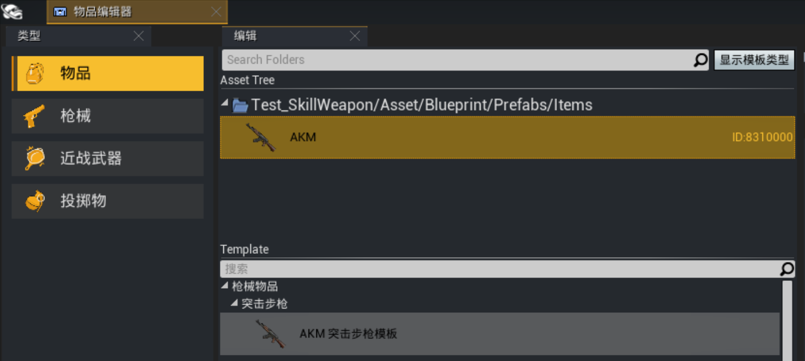
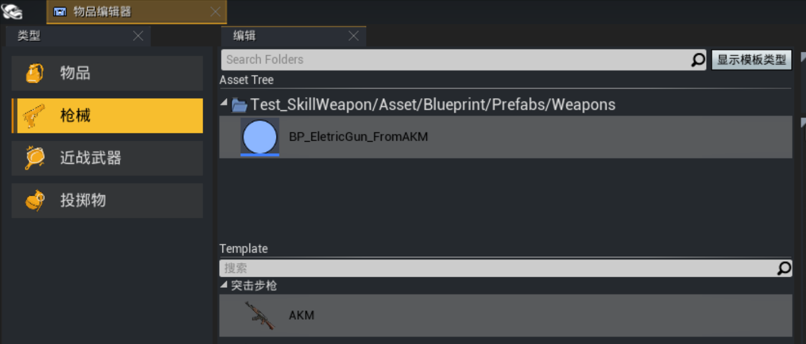
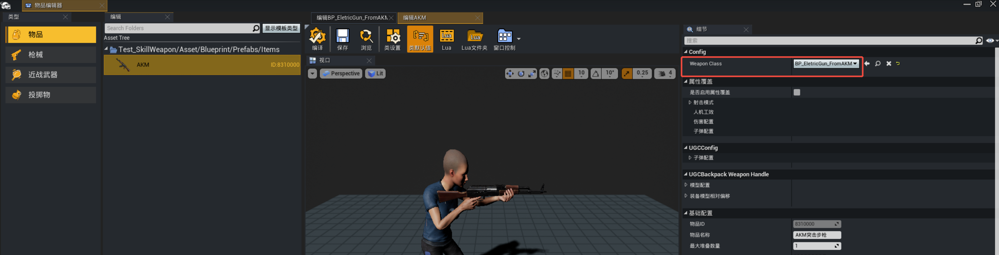

---

### 2. 创建技能蓝图

打开【技能编辑器】，创建一个空技能模板。

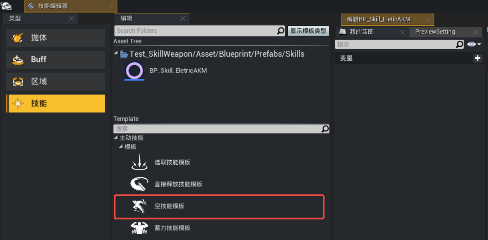

---

### 3. 绑定枪械技能

回到【物品编辑器】AKM枪械的武器蓝图配置面板，将创建的技能赋予给枪械，勾选 ``绑定开火按键`` 使技能能够监听枪械开火的流程，配置详情可参考 [技能配置](./20103_自定义枪械.md#技能配置:~:text=子弹属性-,技能配置,-绑定枪械) 。

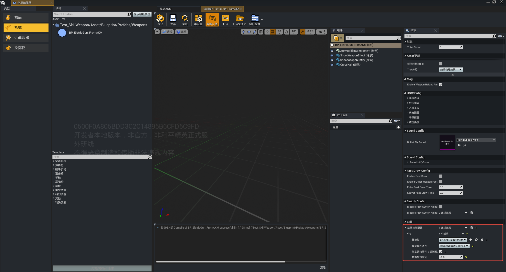

打开枪械蓝图的 ``ShootWeaponEntity`` 组件，找到 ``BulletTemplate`` ，点击【X】清空原来的发射子弹配置。

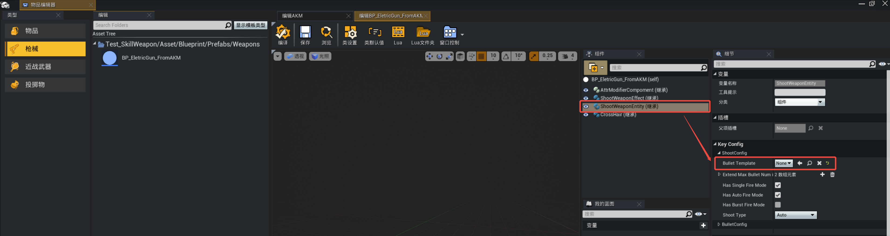

---

### 4. 配置技能逻辑

回到【技能编辑器】中创建的空模板技能，切到【Skill Flow Graph】面板，创建一个 ``State`` 技能节点并命名为 "fire"，创建一个 ``Global Event`` 全局事件节点（暂时不要重命名这个节点，会导致节点功能失效），如图所示进行连接。

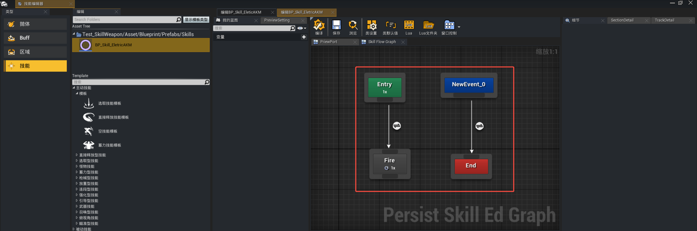

点击 "fire" 技能节点，勾选 ``Loop``，保证按住攻击键时达到持续攻击的效果，再点击下方按钮创建开火技能轨道

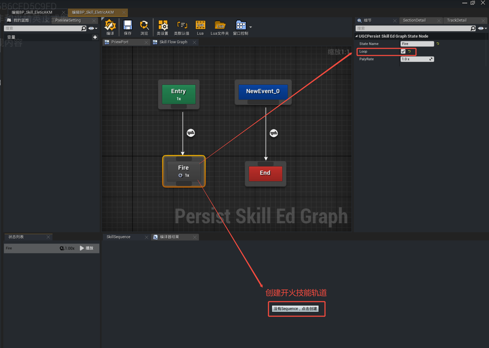

点击 "NewEvent_0" 全局事件节点，选择监听 ``输入事件`` 并配置输入事件为 ``抬起``，详情配置可参考 [技能Event](../../技能系统/技能编辑器2.0/20112_技能Event查询手册.md#通用类事件)。

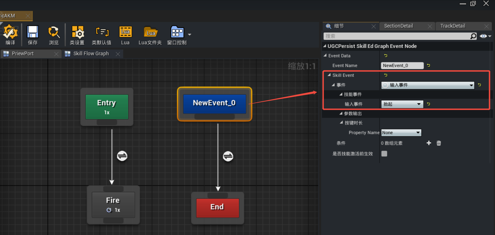

在【序列播放器】中添加 ``选择目标`` 和 ``造成伤害`` 的 [技能task](../../技能系统/技能编辑器2.0/20094_技能Task查询手册.md)，详细配置可参考 [序列播放器配置](../../技能系统/技能编辑器2.0/20091_技能编辑器.md#序列播放器配置:~:text=技能阶段配置-,序列播放器配置,-Task参数设置)

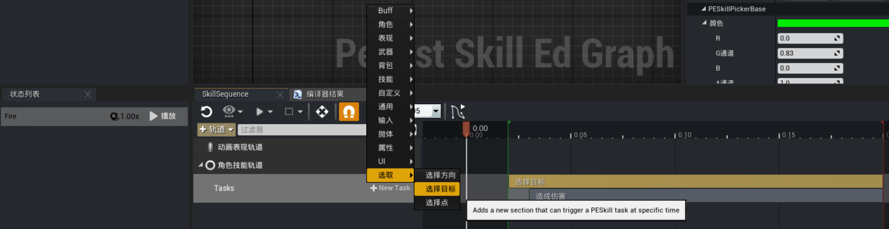

配置两个技能task的参数，【选择器】选择 ``扇形目标选择器``，勾选 ``是否需要可见`` 方便调试，配置伤害轨道的伤害数值，其他配置参数可参考下图。

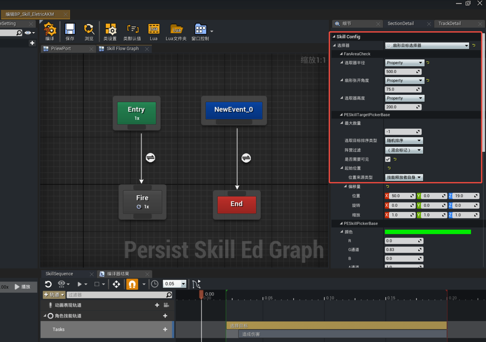
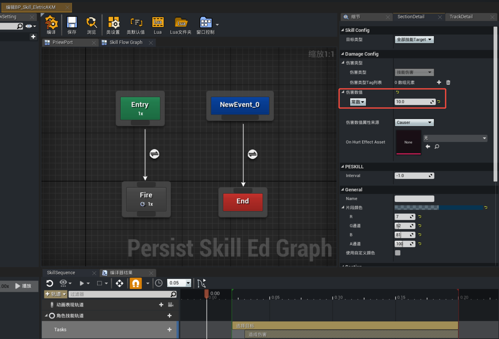

调整两个技能task的 ``开始时间`` 和 ``结束时间``，配置 ``开始时间`` 时间需要往后一点（目前 ``开始时间`` 为0时不能正常触发循环），配置 ``结束时间`` 时间为0.2s。

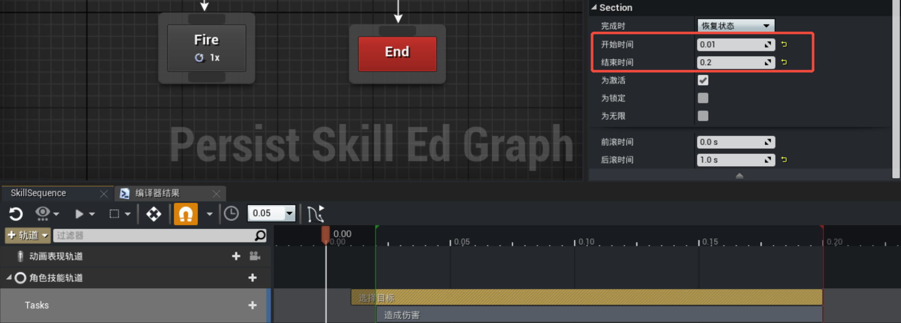

以上配置完成后，点击【编译】和【保存】，返回【PriewPort】面板即可预览效果。

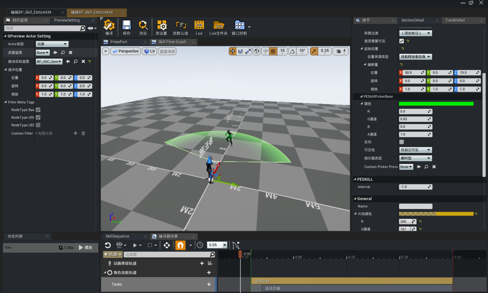

---

### 5. 调整枪械性能

回到【物品编辑器】枪械蓝图中，调整 [枪械性能](./20103_自定义枪械.md#枪械性能:~:text=特效和音效-,枪械性能,-子弹属性) 参数，此技能枪械伤害是跟随技能传递的，子弹伤害需要配置为0。

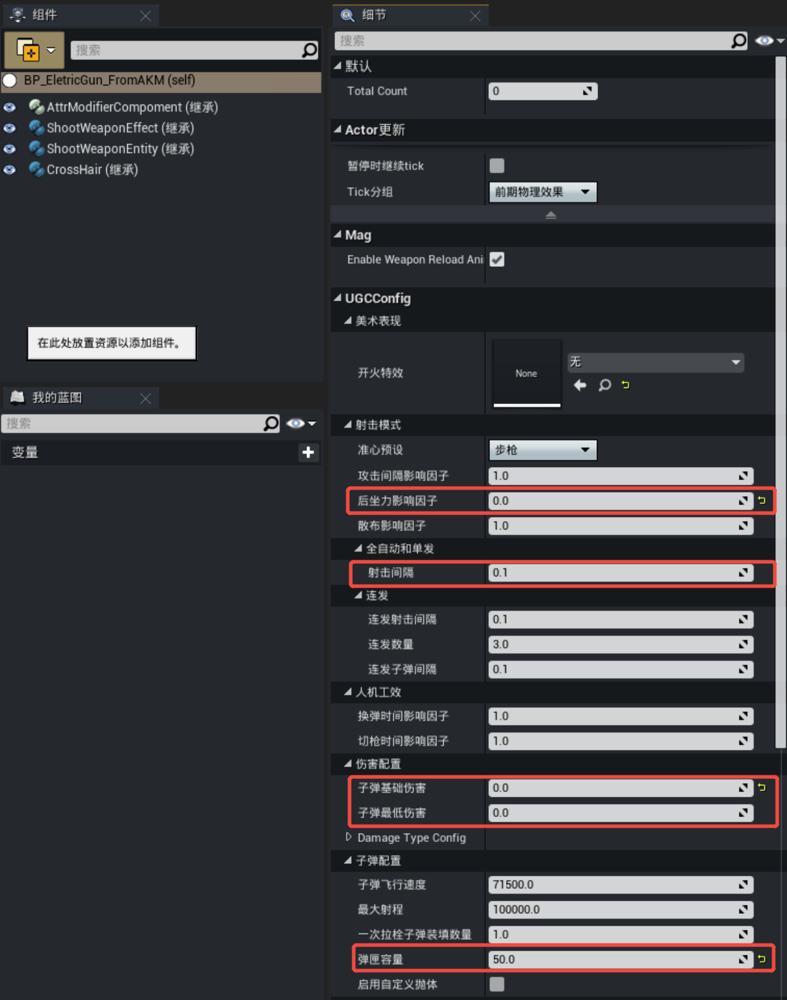

---

### 6. 脚本实现技能表现

技能的轨道逻辑主要在DS上运行，技能的表现逻辑需要通过lua来实现。

回到【技能编辑器】，在【我的蓝图】中添加技能表现所需的变量，此技能表现所需的变量和逻辑代码可以创建一个 ``电击步枪技能`` 模板作为参考。

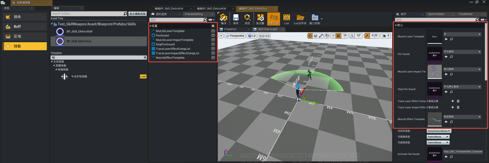

在创建的 ``电击步枪技能`` 模板中，点击【Lua】进入编辑，可见技能表现逻辑。

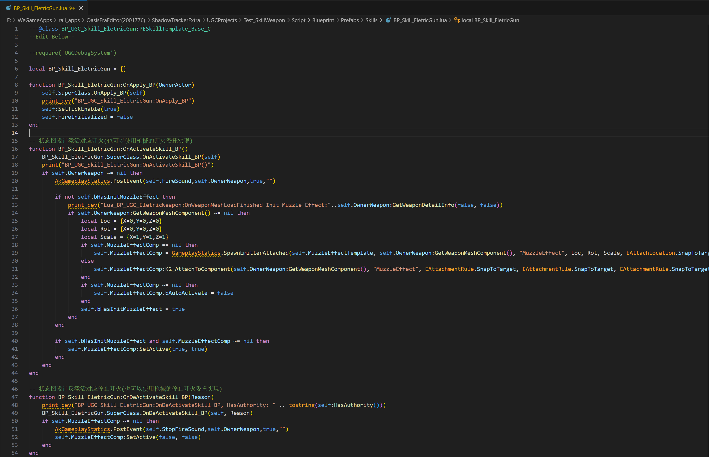

---

### 7. 调试枪械效果

在场景中放置怪物，点击【调试】，给玩家添加这把技能枪械，攻击怪物即可看到效果。

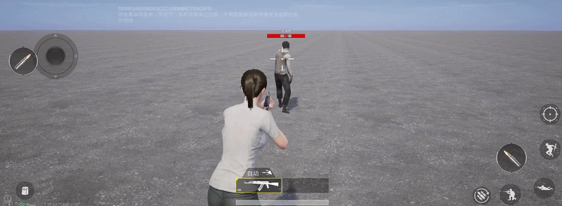
