# 自定义投掷物

物品编辑器内置了和平精英常用投掷物的实体蓝图模板，基于模板创建的投掷物实体提供更丰富的参数供开发者自定义修改，包括投掷基础属性、爆炸属性、不同投掷物的特性属性等等，实现自定义的投掷物效果。

## 创建投掷物实体蓝图

以创建燃烧瓶投掷物实体蓝图为例：

1. 从“投掷物模板”窗口中选择 ``燃烧瓶``，下方“选择模板创建”按钮将高亮显示，并更名为“以 ``燃烧瓶`` 为模板创建”
2. 点击“以 ``燃烧瓶`` 为模板创建” 按钮，弹出输入名称弹窗，输入投掷物名称并点击确定
3. 新建的投掷物将添加至“工程物品资源”窗口中，且投掷物实体蓝图创建于 ``Asset/Blueprint/Prefabs/Throwables`` 路径下

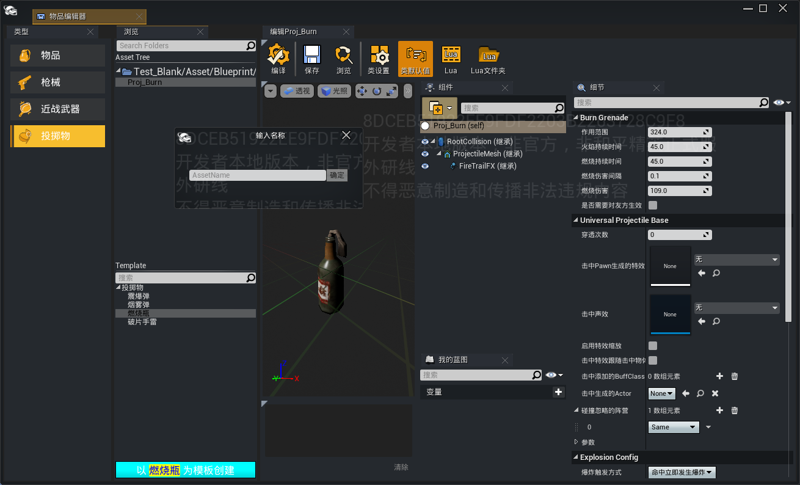

## 修改投掷物属性

### 基础属性

投掷物基础属性包含初始速度、重力系数、命中的各类行为、伤害类型等属性。

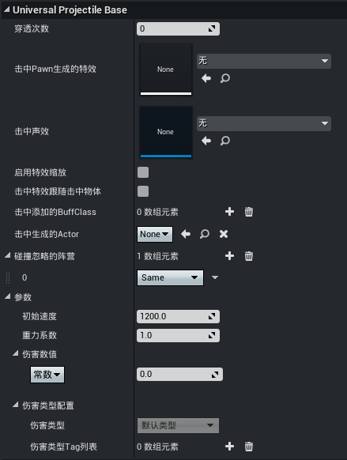

|属性名|属性说明|
|-|-|
|穿透次数|忽略碰撞的目标角色可被穿透的次数|
|击中Pawn生成的特效|击中角色对象时生成的特效资源，生成位置默认为角色的 ``Spine`` 骨骼|
|击中声效|击中角色对象时播放的音效资源|
|启用特效缩放|是否启用击中特效的缩放设置|
|击中特效大小缩放|当启用击中特效缩放时，缩放的比例|
|击中特效跟随击中物体|击中生成的特效是否跟随角色对象移动|
|击中添加的BuffClass|击中角色对象时添加的 [Buff蓝图](../../技能系统/Buff编辑器2.0/20087_Buff编辑器.md)|
|击中生成的Actor|针对投掷物与地面的碰撞，是否在击中点生成指定Actor对象（注意：投掷物落地产生弹射时，每次弹射都会触发生成）|
|碰撞忽略的阵营|忽略指定 [阵营](../../角色系统/20095_队伍与阵营.md#阵营系统) 的碰撞，忽略后对象可被穿透|
|初始速度|投掷物的初始发射速度|
|重力系数|投掷物的重力加速度系数，如果设置为<=-1，则会向上抛射|
|伤害数值|对击中对象造成的伤害值，支持常数或者基于 [自定义属性](../../属性与伤害/20098_通用属性系统.md#自定义属性) 的计算公式|
|伤害类型Tag列表|支持为伤害添加Tag，通过 [GameplayTag](../../20102_Gameplay标签.md) 创建|

---

### 爆炸属性

投掷物爆炸属性支持爆炸触发的方式、爆炸伤害、爆炸范围和特效等属性的配置。

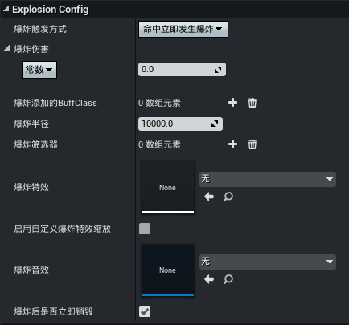

|属性名|属性说明|
|-|-|
|爆炸触发方式|- 不发生爆炸：碰撞后立即销毁（击中效果依然生效），没有爆炸效果 - 命中立即发生爆炸：碰撞后立即触发爆炸 - 停止后开始计时延迟爆炸：投掷物运动停止后，延迟指定时间爆炸 - 弹射后开始计时延迟爆炸：投掷物第一次发生弹射时，开始计时并延迟指定时间爆炸 - 命中Pawn后开始计时延迟爆炸：击中角色对象时，开始计时并延迟指定时间爆炸 - 自定义计时延迟爆炸：即拉栓倒计时，触发拉栓时开始计时并延迟指定时间爆炸|
|爆炸延迟计时|当 ``爆炸触发方式`` 选为延迟爆炸类型时生效，指定需要延迟的时间|
|爆炸伤害|爆炸产生的伤害值，支持常数或者基于 [自定义属性](../../属性与伤害/20098_通用属性系统.md#自定义属性) 的计算公式|
|爆炸添加的BuffClass|爆炸时额外添加的 [Buff蓝图](../../技能系统/Buff编辑器2.0/20087_Buff编辑器.md)|
|爆炸半径|爆炸的圆形范围，该范围内的角色对象都会受到定值伤害|
|爆炸筛选器|支持 [过滤器](../../../../通用功能/20218_通用过滤器.md) 的方式筛选允许受到伤害的对象|
|爆炸特效|发生爆炸时生成的特效资源|
|启用自定义爆炸特效缩放|是否启用爆炸特效的缩放设置|
|爆炸特效缩放|当启用爆炸特效缩放时，缩放的比例|
|爆炸音效|爆炸时播放的音效资源|
|爆炸后是否立即销毁|爆炸后是否直接销毁该投掷物，如果不勾选默认10秒后销毁|

---

### 弹跳属性

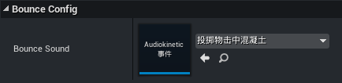

- Bounce Sound：投掷物发生弹射时播放的音效资源

---

### 特性属性

除了投掷物的通用属性，不同类型投掷物还具备独有的特性属性，例如燃烧瓶有燃烧伤害和燃烧持续时间等属性，震爆弹有白屏持续时间等，这部分特性属性也提供给开发者自定义。

#### 震爆弹

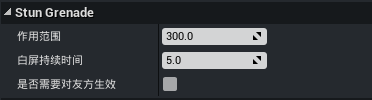

|属性名|属性说明|
|-|-|
|作用范围|指定范围内的角色对象都会受到白屏影响|
|白屏持续时间|白屏效果持续的时长|
|是否需要对友方生效|友方是否会受到白屏的影响|

#### 烟雾弹

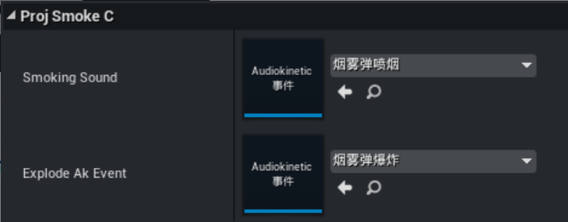

|属性名|属性说明|
|-|-|
|Smoking Sound|烟雾弹喷射烟雾时的音效资源|
|Explode Ak Event|烟雾弹的爆炸音效资源|

烟雾弹实体蓝图的名为 ``Smoking`` 的粒子组件支持替换烟雾粒子特效，修改粒子模板即可实现自定义的烟雾效果。

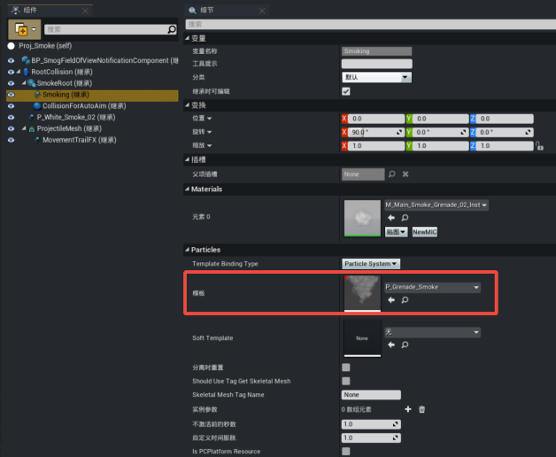
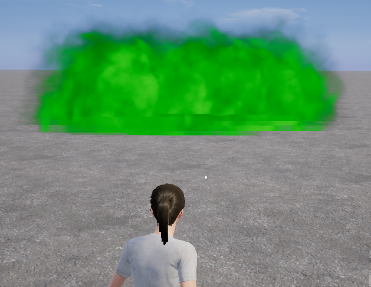

烟雾弹实体蓝图的名为 ``P_White_Smoke_02`` 的粒子组件支持替换投掷尾迹的特效，修改粒子模板即可实现自定义的尾迹效果。

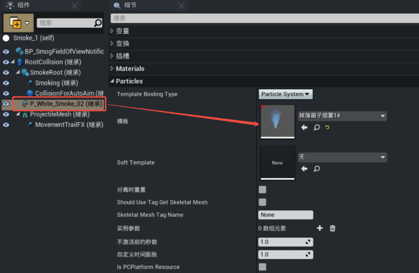
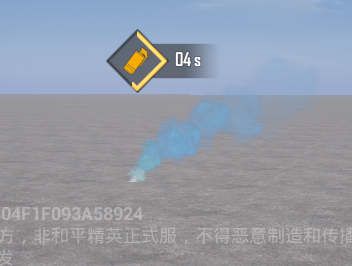

#### 燃烧瓶

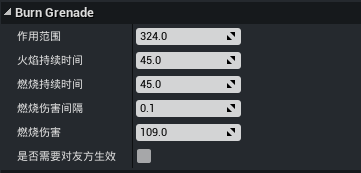

|属性名|属性说明|
|-|-|
|作用范围|燃烧瓶爆炸后产生的燃烧范围|
|火焰持续时间|火焰特效的持续时间|
|燃烧持续时间|被火焰附着燃烧的持续时间|
|燃烧伤害间隔|燃烧伤害的结算周期|
|燃烧伤害|每次燃烧结算的伤害值|
|是否需要对友方生效|友方是否会受到火焰燃烧的影响|

## 绑定投掷物物品

投掷物实体蓝图无法直接进入背包或者实例化为可拾取物，需要绑定投掷物物品才有效，通过物品编辑器 [创建投掷物物品](./20101_物品编辑器.md#新建物品蓝图)，将 ``投掷物`` 属性设置为该实体蓝图，即得到一个自定义的投掷物。

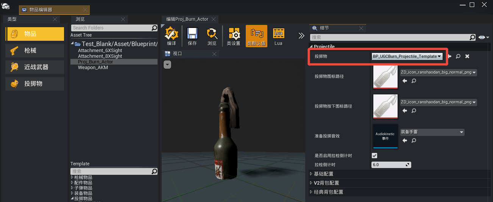
