# 自定义拾取组件

物品编辑器提供了自定义拾取权重和自动拾取数量的配置，开发者能够通过开启自定义拾取组件使其生效，让自定义物品可以按照权重在拾取列表中排序和自动拾取，且支持关闭原有拾取列表UI，启用自定义的拾取物控件交互UI。

## 启用自定义拾取组件

为了兼容默认拾取规则，新的自定义拾取功能需要在【玩法通用设置】-> 【GamePart】 开启 [背包2.0](./20104_背包系统.md:~:text=%E7%89%A9%E5%93%81%E6%8B%BE%E5%8F%96%E8%A7%84%E5%88%99-,%E8%83%8C%E5%8C%85%E7%B3%BB%E7%BB%9F,-%E8%87%AA%E5%AE%9A%E4%B9%89%E6%9E%AA%E6%A2%B0) 系统来使用。

点击编辑器菜单栏的【玩法通用设置】按钮，在【GamePart】中添加【GP_BackpackV2】模块和【GP_PickUpV2List】。

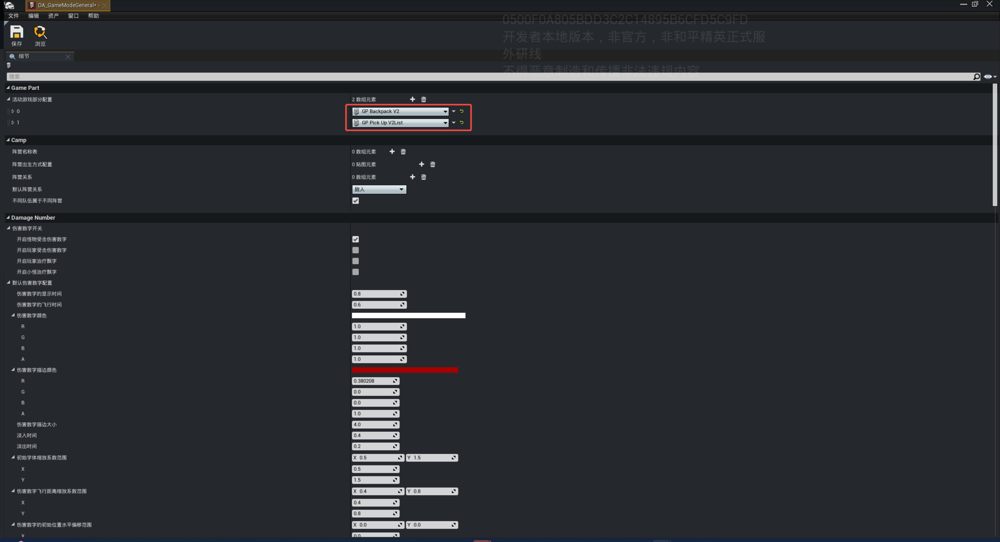

## 配置物品拾取权重和自动拾取数量

打开物品编辑器，创建几个物品模板，找到物品配置中的【UGC拾取配置】。

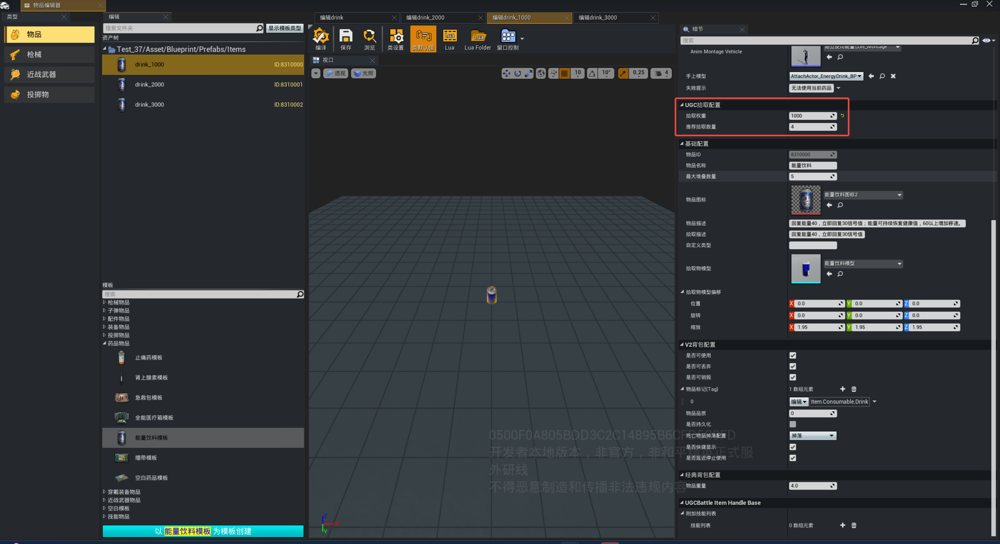

- 拾取权重：排序权重，值越大排序越靠前
- 推荐拾取数量：自动拾取数量，例如值为5，如果背包内物品数量 < 5，会自动拾取。如果 >= 5，则不会自动拾取

## 进入调试验证

根据权重大小配置几个物品的名称，把物品放置在场景中，调试进入拾取范围即可生效。

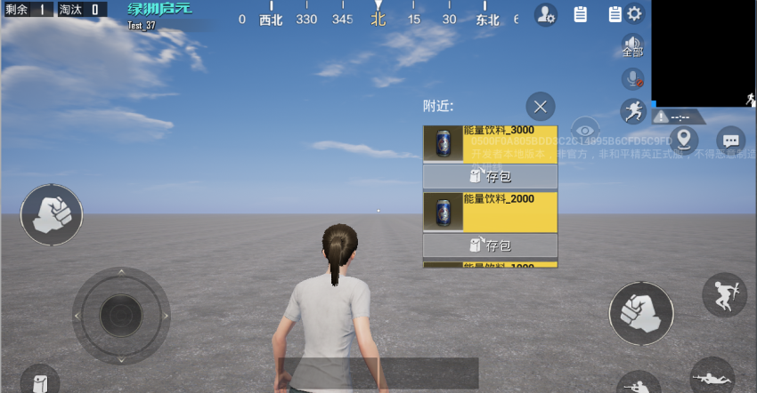

## 自定义拾取排序规则

开启UGC拾取组件后，可以创建一个UGC拾取列表组件用于自定义，进入【Lua】即可自定义拾取物物品排序逻辑。

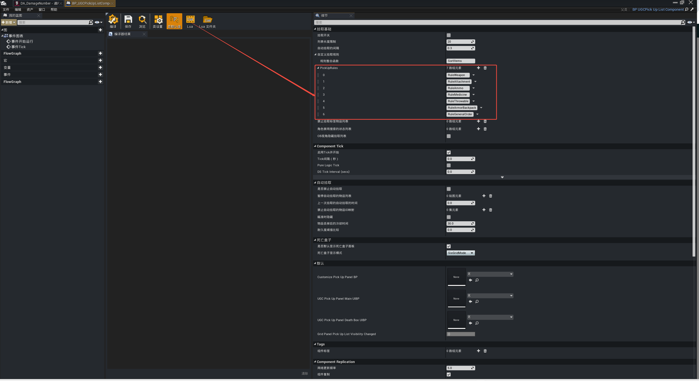
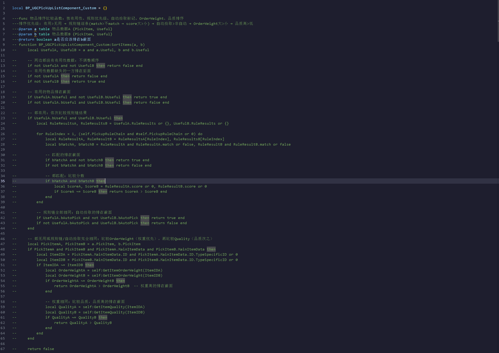

每种物品都会有一套默认的排序规则和拾取规则，下面分类说明。

### 通用排序规则

物品排序会通过配置的物品品质和排序权重计算一个最终排序分，分数越高排序越靠前。

> 计算公式：最终排序分 = 排序权重 * 100 + 物品品质

例如排序权重5000，物品品质3，那么最终排序分 = 5000 * 100 + 3 = 500003，其他物品的最终分数如果低于500003，就会排在这个物品下面。

---

### 武器拾取规则

长枪和手枪的拾取规则，近战武器和弓弩不参与此排序。

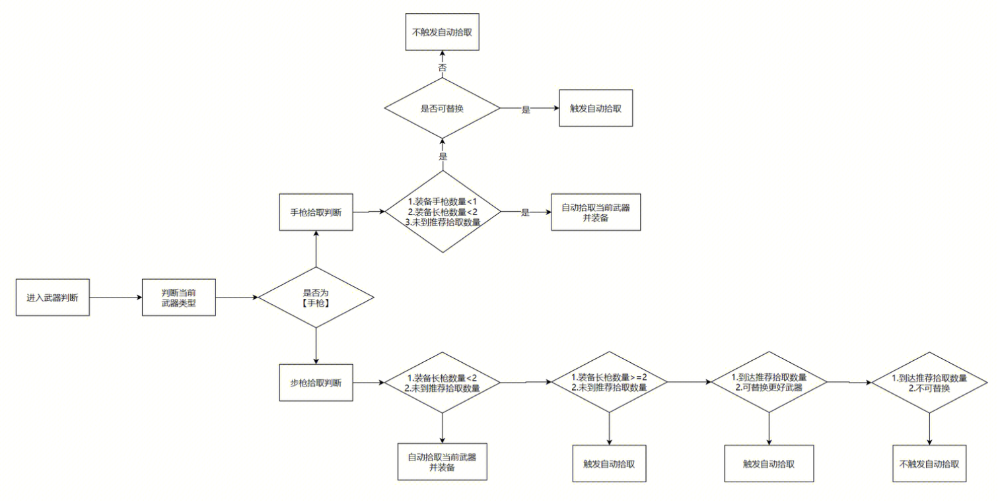

---

### 配件拾取规则

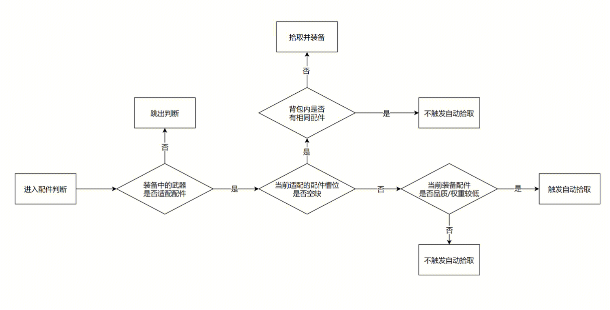

---

### 弹药拾取规则

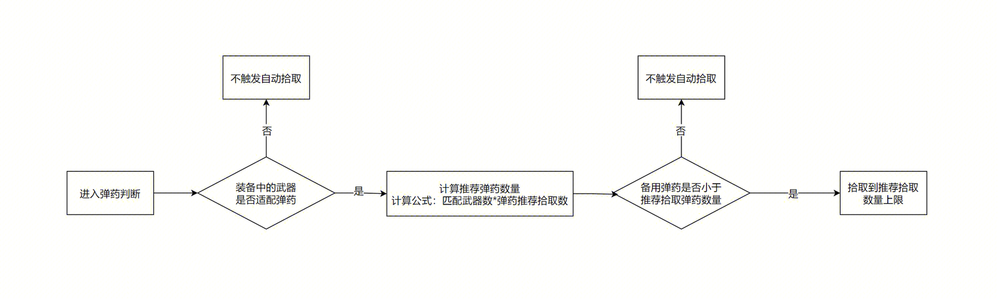

---

### 药品拾取规则

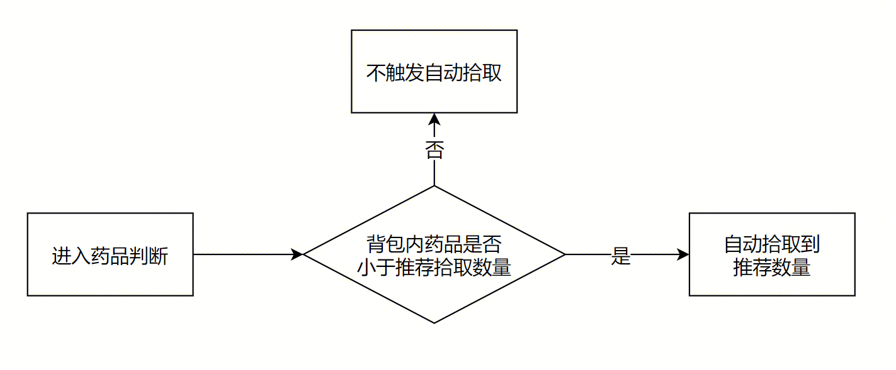

---

### 投掷物拾取规则

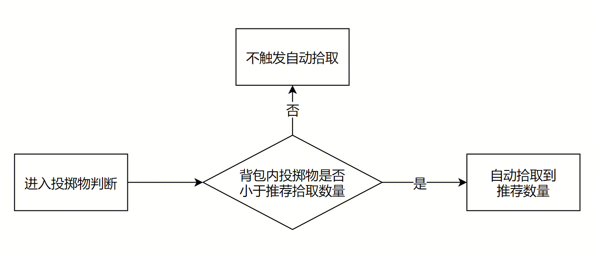

---

### 防具背包拾取规则

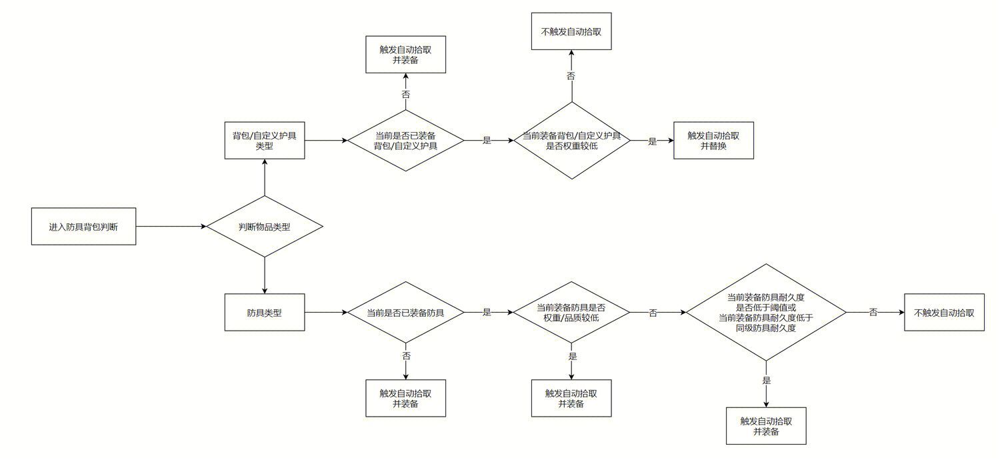

## 自定义拾取物控件交互UI

UGCPickUpWrapperActor（UGC 地面拾取物）新增三项能力：

- 控件配置：在 Actor 上新增 ``bPickUpWidgetEnable`` 、``PickUpWidgetClass`` 等交互控件配置属性
- 控件模板：提供标准控件模板 UGC_WrapperNameWidget_UIBP（Lua），展示名称/数量/品质，支持点击拾取
- 事件开放：新增 ``Event_PickUpWrapperInfoChange`` 事件，DefineID 或 Count 变化时通知控件刷新 UI

> 如果希望通过点击控件来拾取物品，建议关闭自动拾取(在【Gamepart】上挂载【GP_PickUpV2List】中，找到并勾选关闭拾取列表)，避免走近就自动拾取导致控件交互失效。

### 配置流程

1. 在【GP_PickUpV2List】中创建一个新的V2拾取组件，在组件中找到并勾选 ``是否禁用UGC拾取列表UI``：

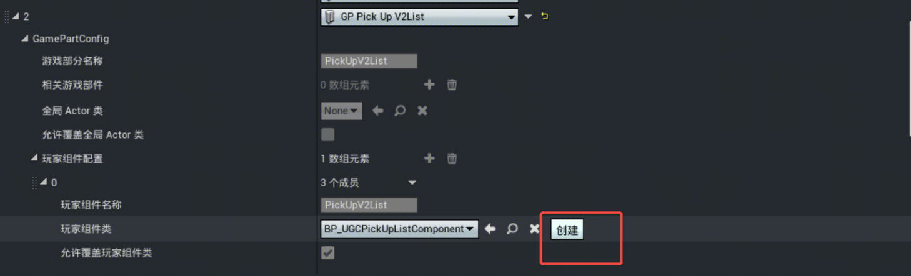

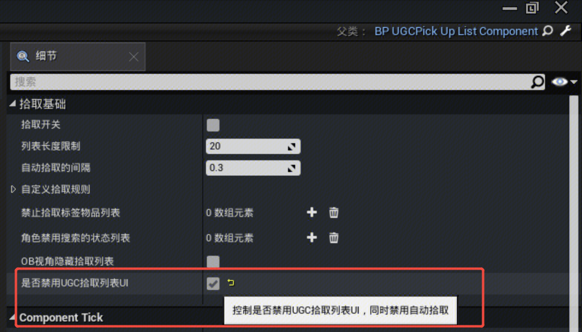

2. 自定义拾取物UI交互控件，在【UI编辑器】中以拾取物名称UI模板创建一个蓝图控件

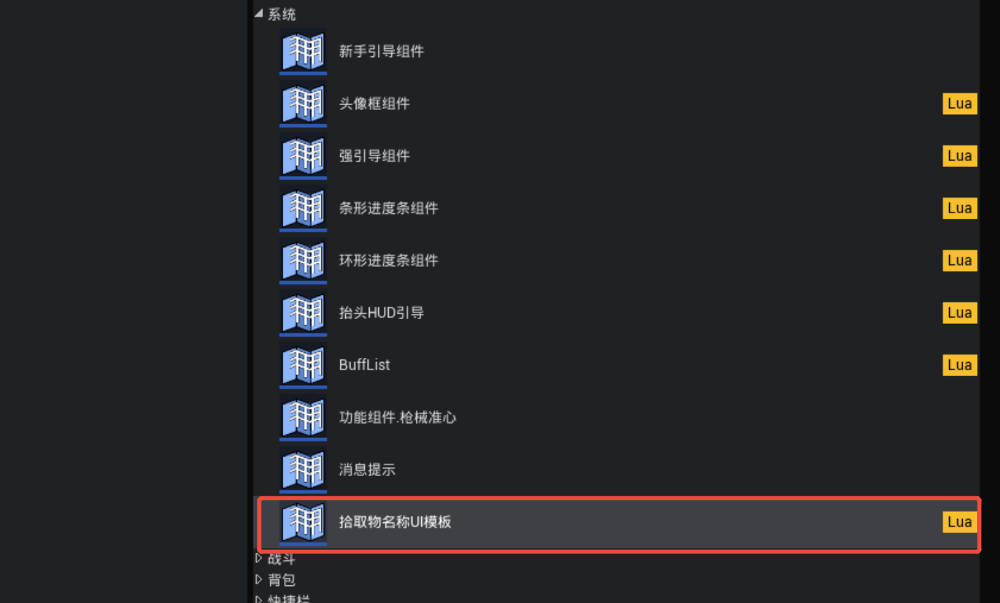

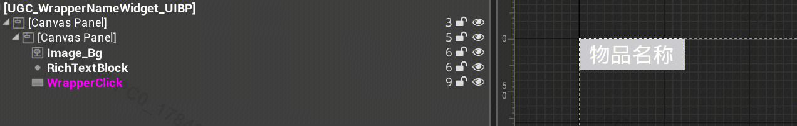

3. 在内容管理器中选择拾取物蓝图父类，创建自定义的 UGCPickupWrapper_BP 拾取物蓝图，进入蓝图配置，勾选 ``启用拾取物控件``，并替换自定义的拾取物UI交互控件蓝图：

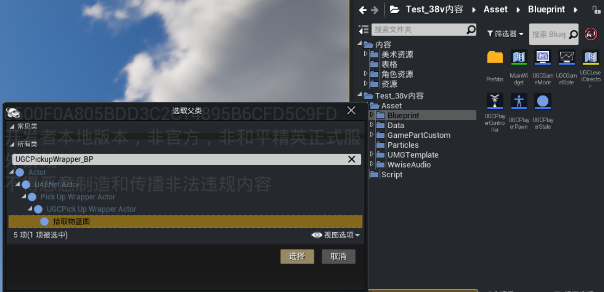

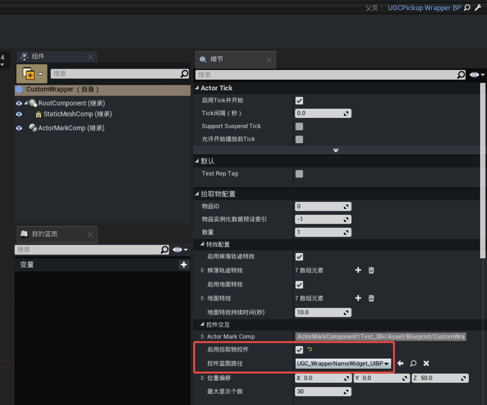

4. 在 UGCGameState 蓝图中替换拾取物蓝图，点击【编译】、【保存】

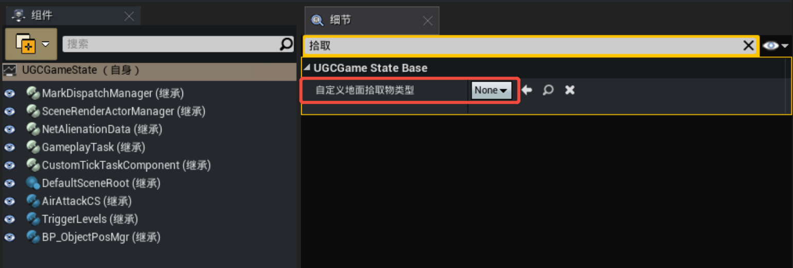

5. 进入调试，添加掉落物查看效果：

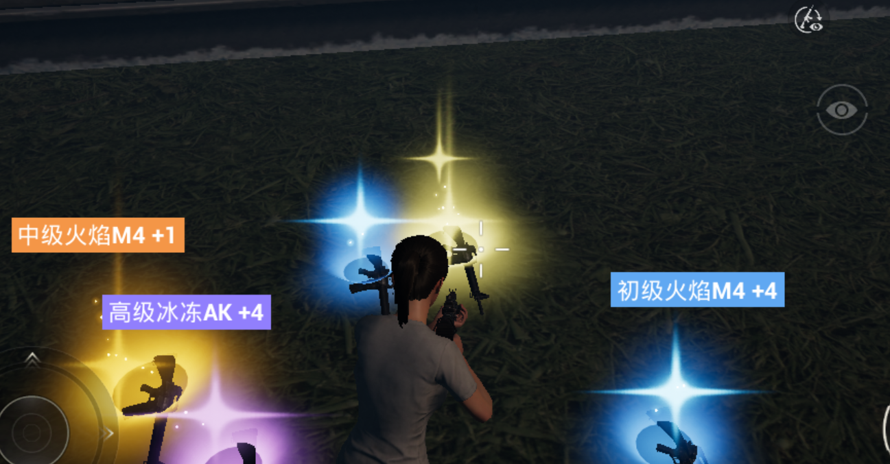

### 拾取物UI交互控件功能

**Event_PickUpWrapperInfoChange 实现**

拾取物信息变化通知，Lua 层重写收到事件后更新名称/数量/品质背景刷新名称/数量/品质

```lua
function UGC_WrapperNameWidget_UIBP:Event_PickUpWrapperInfoChange(ItemDefineID, Count)
    local ItemName = UGCItemSystemV2.GetItemNameV2ByDefineID(ItemDefineID)
    self.RichTextBlock:SetText(ItemName .. " +" .. tostring(Count))

    local Quality = UGCItemSystemV2.GetItemQualityV2ByDefineID(ItemDefineID)
    local QualityBgPath = UGCItemSystemV2.GetQualityBarTexturePath(Quality)
    UGCObjectUtility.AsyncLoadObject(QualityBgPath, function(LoadedTexture)
        if UE.IsValid(self.Image_Bg) and UE.IsValid(LoadedTexture) then
            self.Image_Bg:SetBrushFromTexture(LoadedTexture)
        end
    end)
end
```

**LuaOnWrapperClick 实现**

点击拾取物UI交互控件事件

```lua
function UGC_WrapperNameWidget_UIBP:LuaOnWrapperClick()
    -- 0.1s 冷却防重复点击
    local CurrentTime = os.clock()
    if self.ClickLastTime and (CurrentTime - self.ClickLastTime) < 0.1 then return end
    self.ClickLastTime = CurrentTime

    local PlayerPawn = UGCGameSystem.GetLocalPlayerPawn()
    if not UE.IsValid(PlayerPawn) or not UE.IsValid(self.WrapperActor) then return end

    local DataList = self.WrapperActor:GetDataList()
    if DataList == nil or #DataList <= 0 then return end

    UGCPlayerPawnSystem.PickUpWrapperActor(PlayerPawn, self.WrapperActor, DataList[1] or {}, self.WrapperActor:GetItemCount())
end
```

**自定义控件显示**

自定义控件显示规则（如过滤低品质物品），返回 ``true`` 显示控件

```lua
function UGC_WrapperNameWidget_UIBP:CanShowPickUpWidget()
    if not UE.IsValid(self.WrapperActor) then return false end
    -- 仅显示831开头的UGC物品
    local DefineID = self.WrapperActor:GetDefineID()
    return tostring(DefineID.TypeID):sub(1, 3) == "831"
end
```
