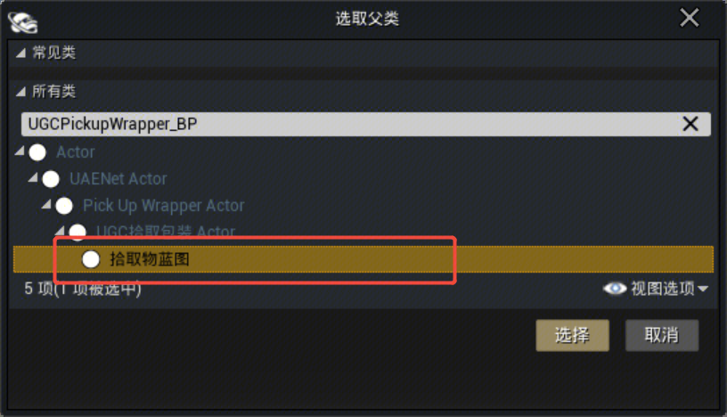
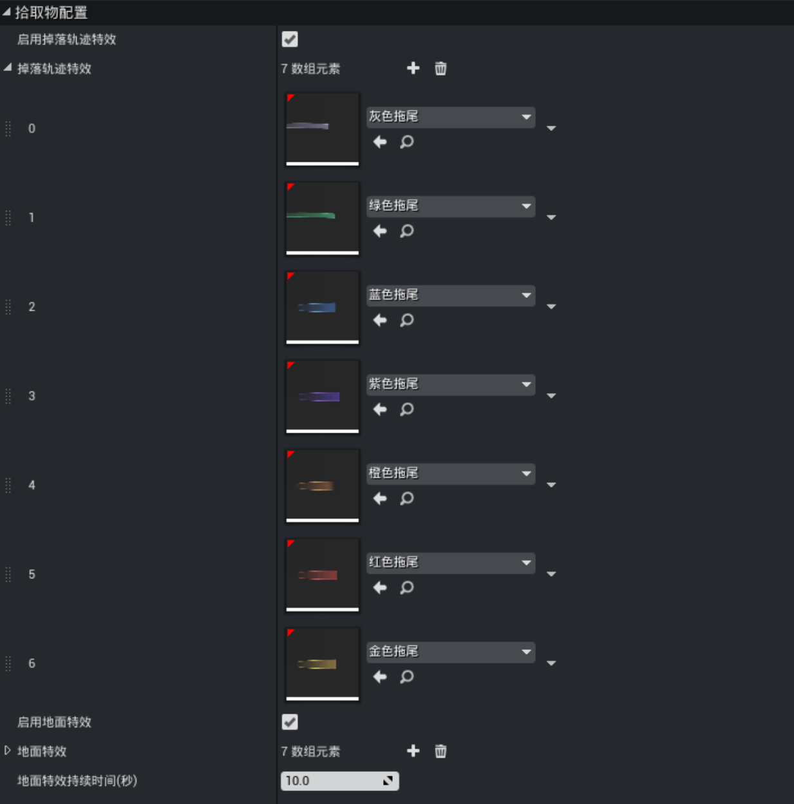
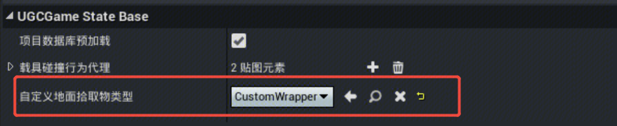

# 自定义掉落效果

拾取物蓝图提供了自定义掉落效果的配置，也自行添加逻辑，以实现多样化的效果。

## 创建拾取物蓝图

在内容管理器中右键新建蓝图类，搜索 ``UGCPickupWrapper_BP`` 选中 ``拾取物蓝图`` 进行创建。

## 配置掉落特效

在创建的拾取物蓝图的细节面板，找到【拾取物配置】。

- 启用掉落轨迹特效：启用拖尾特效，物品掉落时会根据 [物品品质](./20101_物品编辑器.md#V2背包属性配置) 显示对应的拖尾效果
- 掉落轨迹特效：掉落轨迹特效的数组
- 启用地面特效：掉落物停留在地面显示的光柱特效，会根据物品品质显示对应的光柱效果
- 地面特效：地面特效的数组
- 地面特效持续时间：光柱特效在掉落后停留的时长

## 替换拾取物蓝图

打开 UGCameState ，找到自定义地面拾取物类型，替换刚才创建的拾取物蓝图配置到此处。

