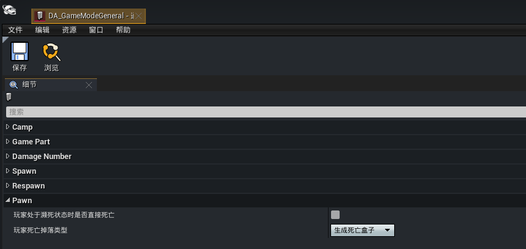
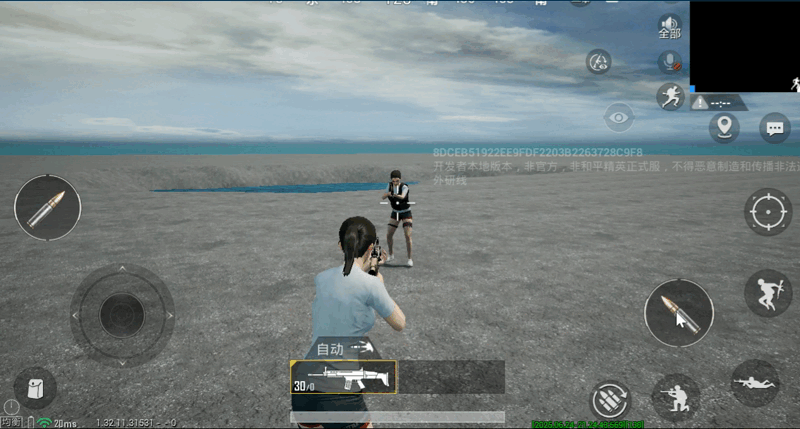
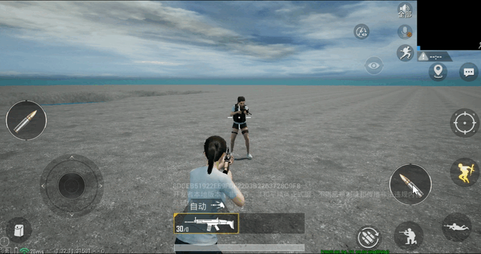
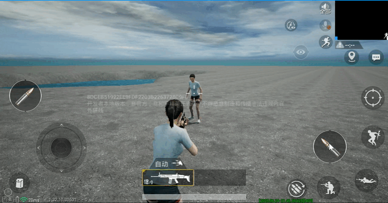
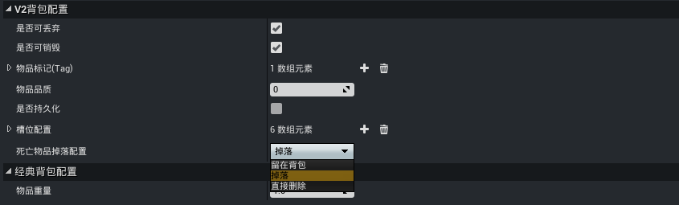

# 物品掉落与保留

和平精英基于大逃杀玩法的机制设计，当玩家死亡时固定以死亡盒子的形式掉落背包物品，为了提高物品掉落策略的灵活性，在物资编辑器2.0的基础上对物品属性及掉落功能进行了扩展，允许开发者自定义玩家角色的物品掉落与保留规则。

## 设置死亡掉落类型

角色物品掉落特指玩家角色死亡时触发的掉落行为，因此需要先指定死亡掉落物品的形式。

点击编辑器菜单栏【玩法通用设置】按钮，在 ``DA_GameModeGeneral`` 数据资产蓝图中找到“Pawn”属性类目，该类别下定义了一个名为 ``玩家死亡掉落类型`` 的属性，该属性决定玩家角色死亡时是否允许掉落背包物品及掉落的形式，开发者需设置合适的掉落类型。



**生成死亡盒子**

默认的掉落类型，背包中能够掉落的物品都收集在盒子中，与和平精英的角色物品掉落方式保持一致。



**散落**

能够掉落的物品将以可拾取物的形态分散掉落在角色死亡的位置附近。



**不生成盒子也不散落**

设置为该类型将禁止角色掉落背包物品。



## 配置物品掉落属性

各类物品模板属性的 [V2背包配置](../物资系统/物资编辑器2.0/20101_物品编辑器.md#V2背包配置) 类目中都具有 ``死亡物品掉落配置`` 属性，该属性决定了此类型的物品能否掉落或者保留，结合死亡掉落类型的组合配置可以实现不同的掉落与保留效果。



| |留在背包|掉落|直接删除|
|:-:|:-:|:-:|:-:|
|**生成死亡盒子**|保留|掉落|✖|
|**散落**|保留|掉落|✖|
|**不生成盒子也不散落**|保留|✖|✖|

## 注意事项

- 以上配置方式仅适用于 [物品编辑器](../物资系统/物资编辑器2.0/20101_物品编辑器.md) 创建的物品，且需要启用新的 [背包系统](../物资系统/物资编辑器2.0/20104_背包系统.md)；对于使用和平原生物品及经典背包的场景，仅支持控制是否生成死亡盒子，通过覆写 **UGCPlayerPawn** 的 ``IsSkipSpawnDeadTombBox`` 函数实现：
	```lua
	function UGCPlayerPawn:IsSkipSpawnDeadTombBox(EventInstigater)
    		return true
	end
	```
- 枪械的配件及子弹也属于独立的物品，因此需要配合枪械单独配置掉落属性，否则会出现保留或掉落效果不一致的现象
