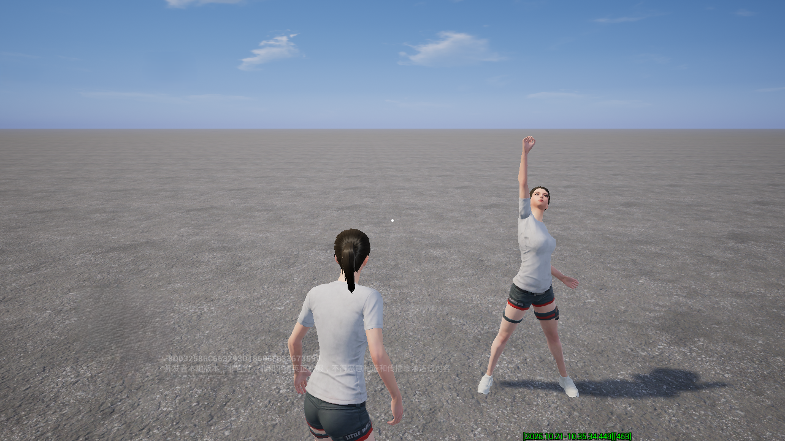
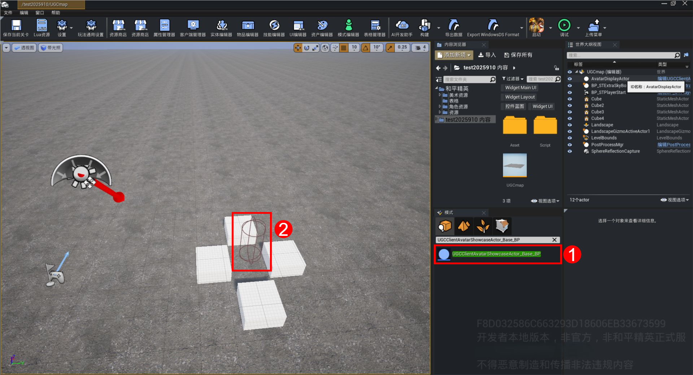
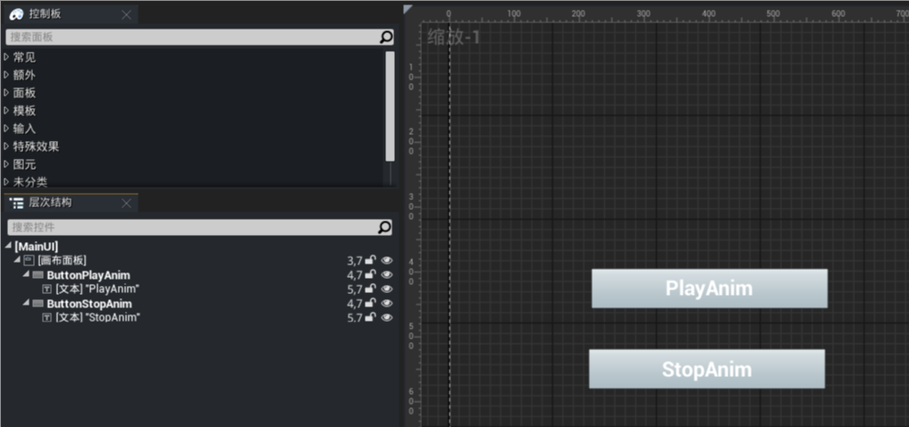
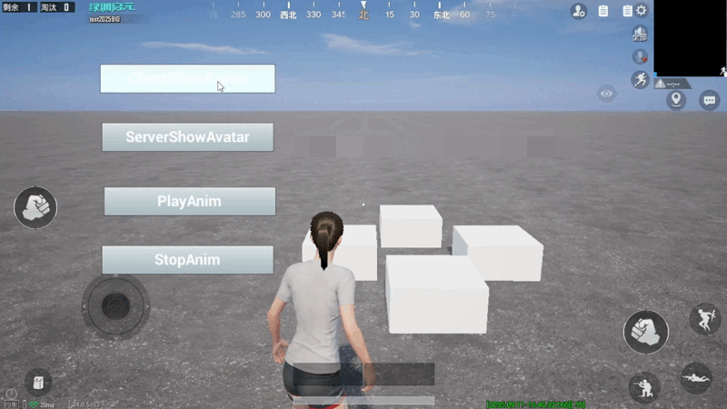
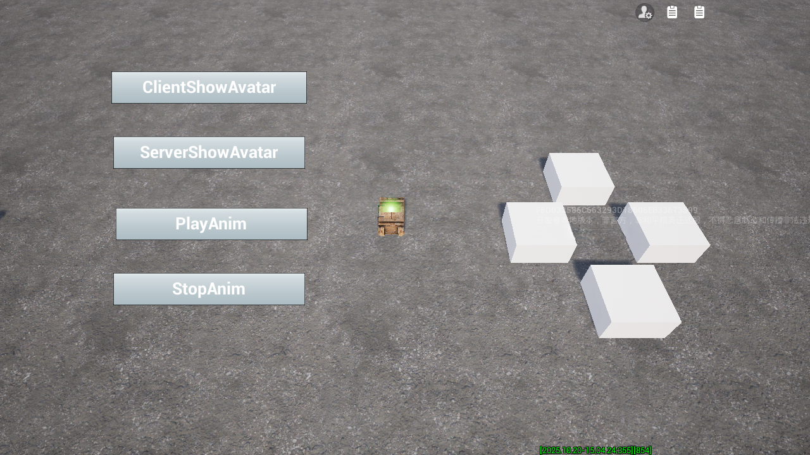
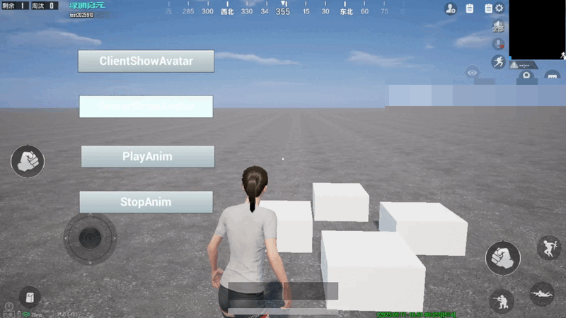
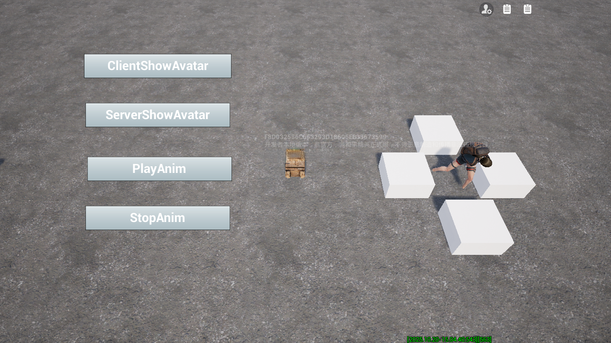
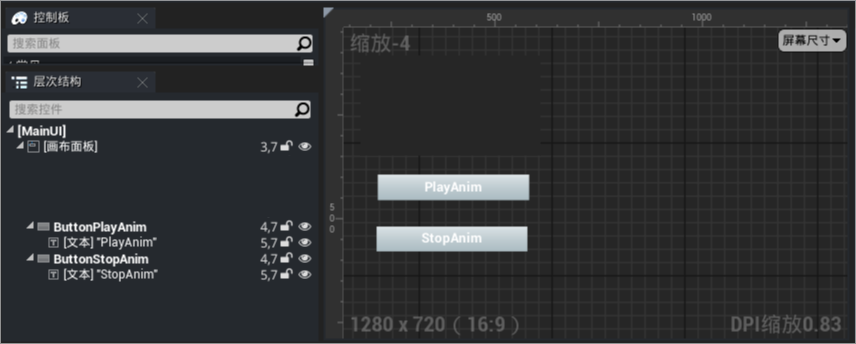
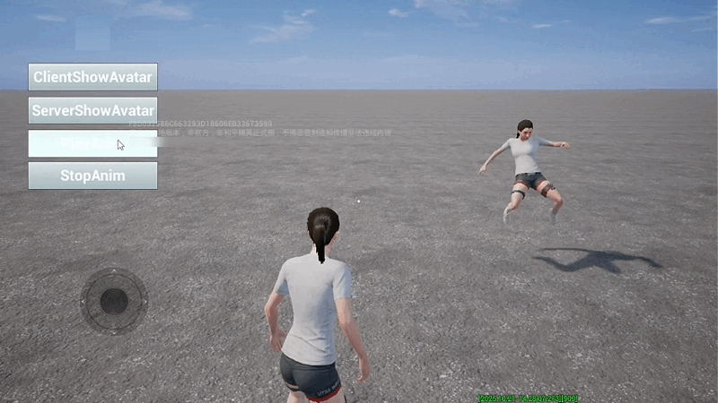
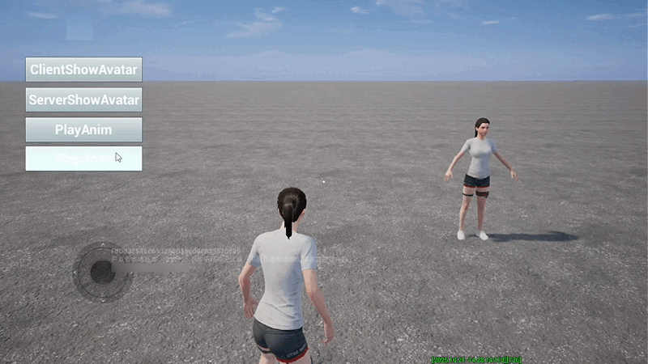

# 角色Avatar复制

编辑器已提供专用于玩家角色Avatar的展示Actor，该Actor属于静态物件，开发者可通过调用特定的API将玩家角色的Avatar复制到此物件中，以实现展示角色Avatar的效果。



## 添加Avatar展示Actor

在【模式】中搜索“UGCClientAvatarShowcaseActor_Base_BP”，将该Actor放置在场景中。



## 复制Avatar

Avatar展示Actor可用于展示角色Avatar，通过API调用实现，目前提供两种方法，适用于不同场景需求：

|方法|生效范围|适用场景|
|:-:|:-:|-|
|[ClientShowAvatar](https://developer.gp.qq.com/api/#/searchContent/UGCCharAvatarShowcaseActor?classDetailShow=true&path=class%2Fdetail%2FOthers%2FUGCCharAvatarShowcaseActor.json&isSelect=1&apiEnc=%5B%22%E7%B1%BB%22%5D&apiLabel=UGCCharAvatarShowcaseActor&autoJump=ClientShowAvatar)|客户端|适用于小场景展示，确保需展示的角色在当前客户端视野范围内且未被剔除|
|[ServerShowAvatar](https://developer.gp.qq.com/api/#/searchContent/UGCCharAvatarShowcaseActor?classDetailShow=true&path=class%2Fdetail%2FOthers%2FUGCCharAvatarShowcaseActor.json&isSelect=1&apiEnc=%5B%22%E7%B1%BB%22%5D&apiLabel=UGCCharAvatarShowcaseActor&autoJump=ServerShowAvatar)|服务器|适用于大场景展示，可确保所有客户端都能看到Avatar展示，需展示的角色不受视野限制|

以下为使用示例，界面设计如下：



为按钮添加对应功能逻辑，点击“ClientShowAvatar”按键的执行代码如下:

``` lua
--Main.lua部分代码

function MainUI:ButtonClientShowAvatarOnClicked()
	ugcprint("客户端执行展示角色");
	--根据ID名称获取Actor
  local AvatarDisplayActor = UGCObjectUtility.FindObject("AvatarDisplayActor");
	--获取客户端当前的 PlayerController
  local PlayerController = UGCGameSystem.GetLocalPlayerController();
	--获取PlayerController对应的Uid
	local Uid = UGCGameSystem.GetUIDByPlayerController(PlayerController);
	--根据Uid展示对应玩家形象（客户端执行）
  AvatarDisplayActor:ClientShowAvatar(Uid);
	return nil;
end

```

点击“ServerShowAvatar”按键的执行代码如下:

``` lua
--Main.lua部分代码

function MainUI:ButtonServerShowAvatarOnClicked()
	ugcprint("服务器执行展示角色");
	--获取客户端当前的 PlayerController
  local PlayerController = UGCGameSystem.GetLocalPlayerController();
	--调用PlayerController的ServerRPC函数
  UnrealNetwork.CallUnrealRPC(PlayerController, PlayerController, "ShowAvatarByServer");
	return nil;
end

--UGCPlayerController.lua部分代码

--接收RPC调用
function UGCPlayerController:GetAvailableServerRPCs()
	return
  "ShowAvatarByServer"
end

function UGCPlayerController:ShowAvatarByServer()
  --根据ID名称获取Actor
  local AvatarDisplayActor = UGCObjectUtility.FindObject("AvatarDisplayActor");
  --获取PlayerController对应的Uid
	local uid = UGCGameSystem.GetUIDByPlayerController(self);
  --根据Uid展示对应玩家形象（服务器执行）
  AvatarDisplayActor:ServerShowAvatar(uid);
end

```

调试效果如下，点击“ClientShowAvatar”按键，Avatar展示Actor显示当前玩家的角色Avatar。



如果在需展示的角色被剔除时再点击“ClientShowAvatar”按键，Avatar展示Actor不会显示Avatar。



点击“ServerShowAvatar”按键，Avatar展示Actor显示当前玩家的角色Avatar，无论角色是否被剔除。




## 播放角色动画

[PlayAnim](https://developer.gp.qq.com/api/#/searchContent/UGCCharAvatarShowcaseActor?classDetailShow=true&path=class%2Fdetail%2FOthers%2FUGCCharAvatarShowcaseActor.json&isSelect=1&apiEnc=%5B%22%E7%B1%BB%22%5D&apiLabel=UGCCharAvatarShowcaseActor&autoJump=PlayAnim) 方法可控制Avatar展示Actor循环播放或停止指定动画。以下为使用示例，界面设计如下：



为按钮添加对应功能逻辑，部分代码如下：

``` lua
--Main.lua部分代码

function MainUI:ButtonPlayAnimOnClicked()
	ugcprint("播放动画");
	--根据路径加载动画资源（该路径对应动画蒙太奇“机动兵投掷物飞行_Montage”）
  local Animation = UE.LoadObject('/Game/Arts_Timeliness/CG005_Hero/Arts_Player/Anim/AgileSoldier/AgileSoldier_Grenade_Fly_Montage.AgileSoldier_Grenade_Fly_Montage');
	--根据ID名称获取Actor
	local AvatarDisplayActor = UGCObjectUtility.FindObject("AvatarDisplayActor");
	--循环播放动画
	AvatarDisplayActor:PlayAnim(Animation, true);
	return nil;
end

function MainUI:ButtonStopAnimOnClicked()
	ugcprint("停止动画");
	--根据路径加载动画资源（该路径对应动画蒙太奇“机动兵投掷物飞行_Montage”）
  local Animation = UE.LoadObject('/Game/Arts_Timeliness/CG005_Hero/Arts_Player/Anim/AgileSoldier/AgileSoldier_Grenade_Fly_Montage.AgileSoldier_Grenade_Fly_Montage');
	--根据ID名称获取Actor
	local AvatarDisplayActor = UGCObjectUtility.FindObject("AvatarDisplayActor");
	--停止播放动画
	AvatarDisplayActor:PlayAnim(Animation, false);
	return nil;
end

```

Avatar展示Actor显示Avatar后，点击“PlayAnim”按键，该Actor会循环播放指定动画。



点击“StopAnim”按键，该Actor播放一次指定动画后停止。


