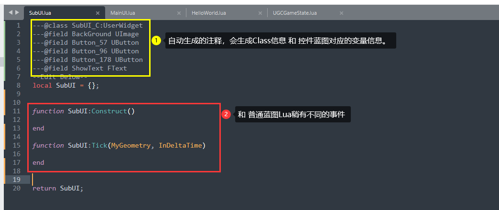
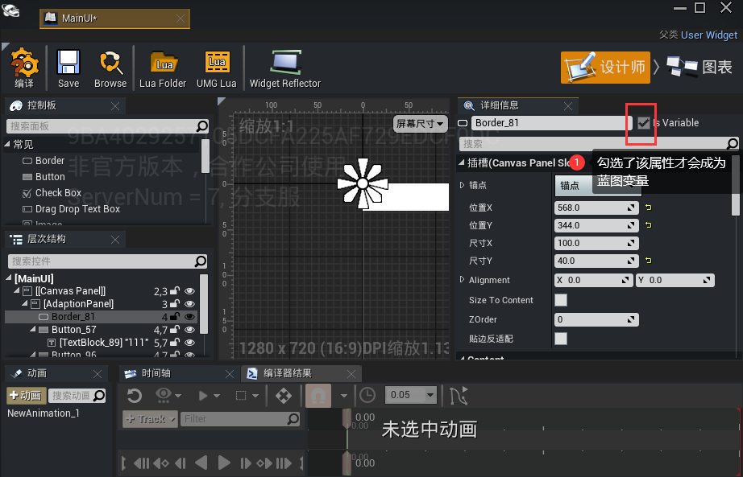

#  UMG Lua的结构

UMG Lua 和 普通的蓝图Lua稍有不同，下面我们介绍一下UMG Lua的文件结构：

---

## 典型文件示例：



## 自动注释：

- UMG Lua 会根据控件蓝图自动生成Class信息 和 变量信息
- Class信息在首行，会以格式 类型信息：“父类类型信息” 生成：
- 变量信息在后面，会以格式： “变量名字 变量类型” 生成，只有勾选了Is Variable 属性的控件才会生成蓝图变量：


## 常用事件：

和 普通的 Lua不同，UMG Lua主要有两个事件：

```
function SubUI:Construct()
end
-- 主要在创建控件蓝图的时候调用，比如在调用 `WidgetBlueprintLibrary.Create` 函数的时候会调用Construct事件。可以在该事件内初始化蓝图。

function SubUI:Tick(MyGeometry, InDeltaTime)
end
-- 会在每一帧调用该事件，相当于 普通蓝图Lua 中的 `ReceiveTick` 函数。
```

具体函数详情可以参考API文档。
