# 基础UI元件

UI元件是基于基础控件封装的一组实现特定显示效果的UI元素组件，UI元件具备易用性、可交互及复用性等特点，开发者可以通过配置实现对UI元件的显示及样式调整，目前提供了四种UI元件：主角血条、怪物血条、新手指引和队伍面板。

## 主角血条

主角血条元件支持配置血条的样式，包括血量值处于不同百分比的显示颜色、预扣除的样式等，也支持扩展额外的属性条。

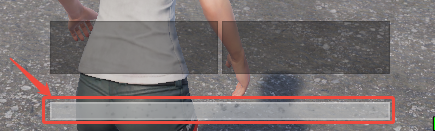

### 创建与配置血条

**1.创建主角血条组件**

右键新建蓝图
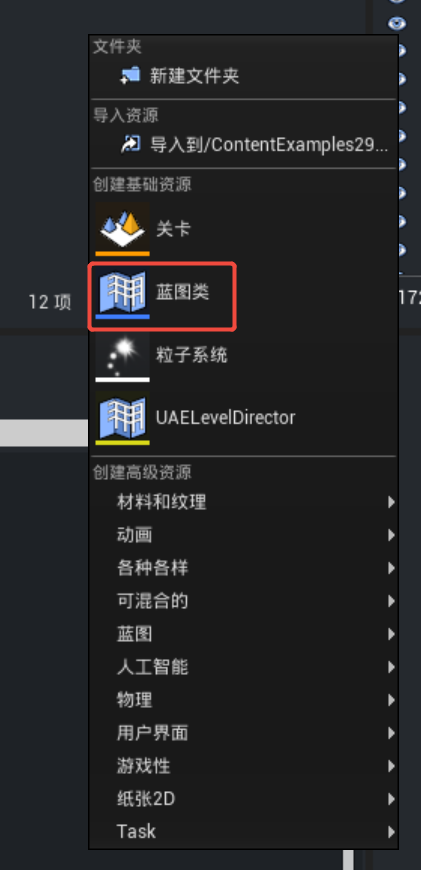

继承UGC_Player_HealthBar_UIBP，选择玩家血条组件进行创建

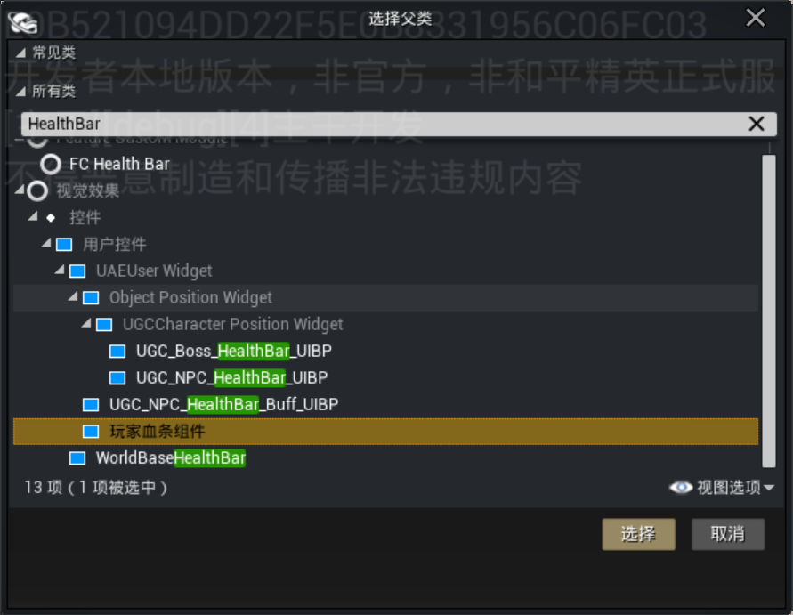

**2.配置主角血条组件**

在左侧Hierarchy栏中选择主角血条组件，即可在右侧的Details栏对其进行配置
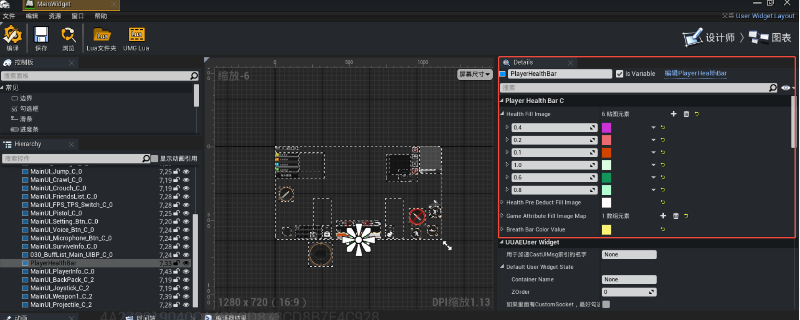
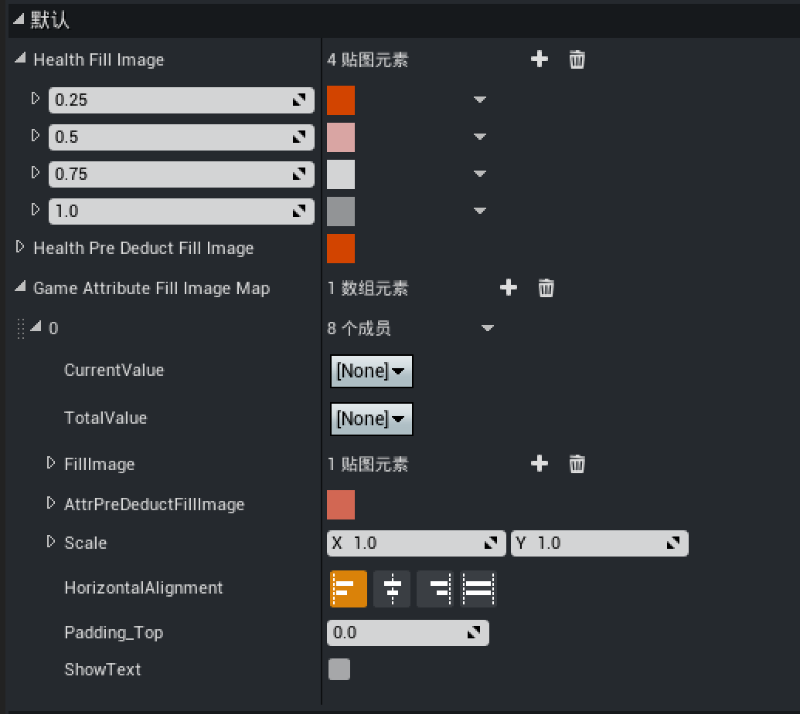

**参数说明：**
|属性|属性说明|
|-|-|
|**Health Fill Image**|血量值百分比与颜色的映射，表示当血量值小于或等于这个百分比时血条所显示的颜色。<br>如：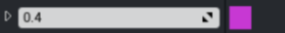表示血量低于或等于40%时血条颜色为紫色<br>展开一组映射后，可以进行更细致的配置，支持配置多组映射。<br>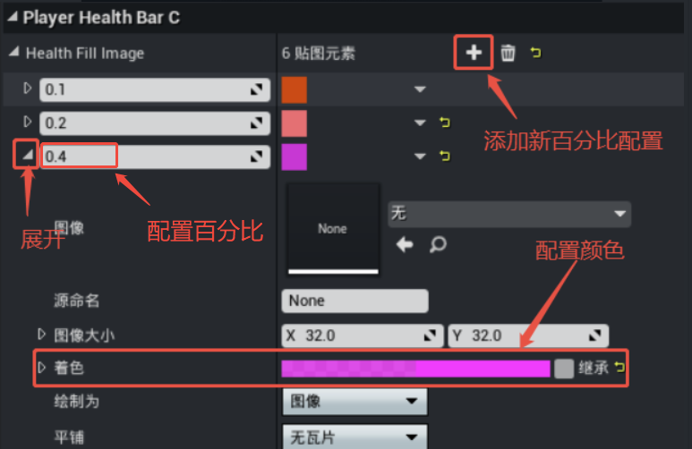|
|**Health Pre Deduct Fill Image**|血条预扣除颜色，表示当血量减少时血条变化量的颜色。<br>如：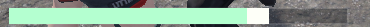其中白色为血条预扣除的颜色|
| **Game Attribute Fill Image Map**|属性值配置，打开后如图所示<br>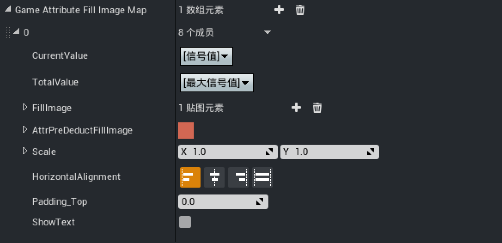<br> **CurrentValue**：属性值，该属性条所配置属性的当前值<br>**TotalValue**：最大属性值，该属性条所配置属性的最大值<br>**FillImage**：属性值百分比/颜色映射，和血条的百分比/颜色映射类似，表示当这个属性值低于或等于这个百分比时属性条所显示的颜色<br>**AttrPreDeductFillImage**：属性值预扣除颜色，和血条与扣除颜色类似，表示该属性值减少时属性条变化量的颜色<br>**Scale**：属性条缩放比，相对于血条的宽高比，取值0~1<br>**HorizontalAlignment**：属性条相对于血条对齐方式<br>**Padding_Top**：属性条间距，此属性条相对于上一条属性条的距离 <br>**ShowText**：是否显示属性数值，此项仅对怪物血条有效<br>**注意：一条属性条的属性值与其最大值需要一一对应，如CurrentValue填的是信号值，TotalValue就应该是最大信号值**|

### 添加血条元件

#### 基于widgetLayout添加

**将创建好的主角血条组件加入主UI**

打开UGCPlayerController


搜索Main UIClass，可以看到主UI配置
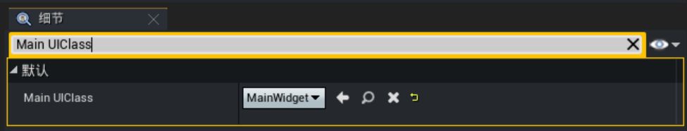

打开主UI
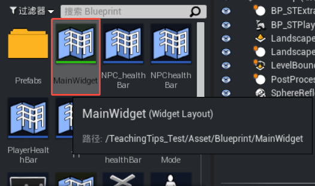

在左侧搜索栏处输入创建的玩家血条组件的名字（由用户命名的名字）
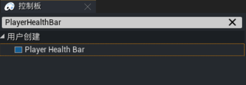

将其拖入主UI中
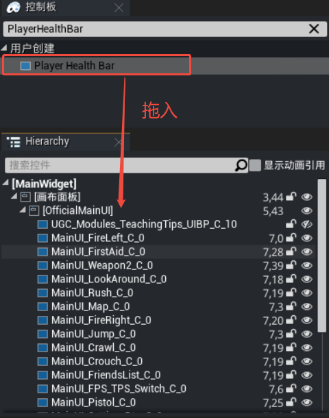

**调整主角血条组件位置，隐藏原血条组件**

选择主角血条组件，在Detials中搜索Layout即可调整其位置，也可以在画布中拖动调整

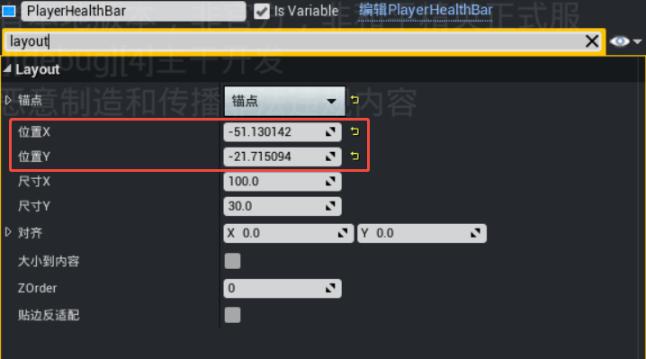

调整好后，在左侧Hierarchy栏中选择MainUI_PlayerInfo_C_0
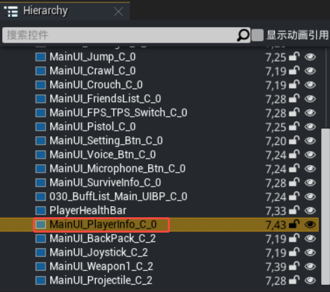

在其Detials中搜索Behavior，在其可视性下拉框选择“已折叠”或者“隐藏”，即可把MainWidget原来的血条隐藏掉，只显示所配置的主角血条组件
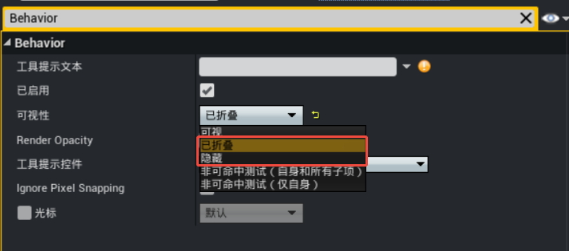

**5.编译和保存**
配置完成后，编译并保存方可生效
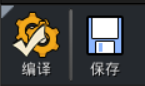

经过配置后可以达到如图效果，新加的属性条会出现在血条的上方
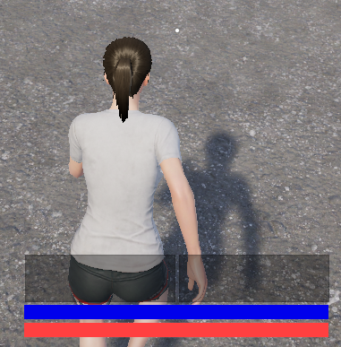

#### 脚本动态添加
主角血条也可以动态添加，步骤如下：
1.创建一个```widgetLayout```
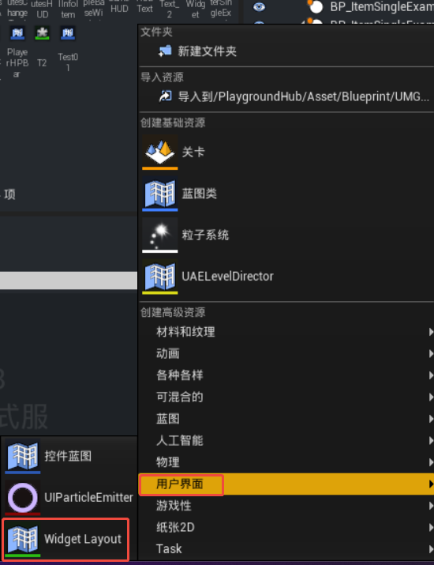
2.打开刚创建```widgetLayout```，在控制板处搜索创建好的血条蓝图，将其拖入画布
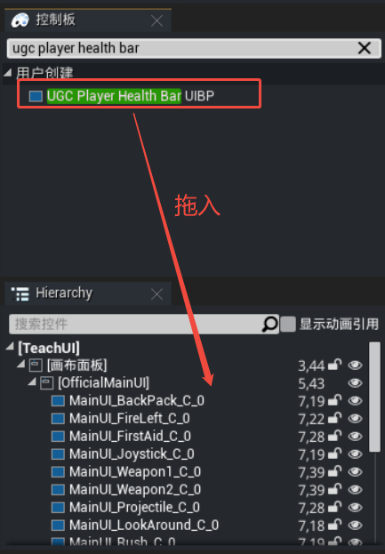
3.配置主角血条
调整好血条UI位置，配置完各项参数后需编译并保存，具体配置方法可参考[创建和配置主角血条](./20149_基础UI元件.md#创建与配置血条)
4.动态加载```widgetLayout```
在有需要的时机可以动态加载出刚创建的```widgetLayout```，动态加载方法可参考[加载与卸载WidgetLayout](./20019_和平主界面控件布局.md#加载与卸载WidgetLayout)
以下为在UGCGameState中ReceiveBeginPlay时机调用主角血条UI的示例：
```
function UGCGameState:ReceiveBeginPlay()

    local path = UGCGameSystem.GetUGCResourcesFullPath('Asset/Blueprint/PlayerHealthBarUI.PlayerHealthBarUI_C')
    UGCWidgetManagerSystem.LoadMainUIWidgetLayoutByPath(path)

end
```

------------------------------------

## 新手引导

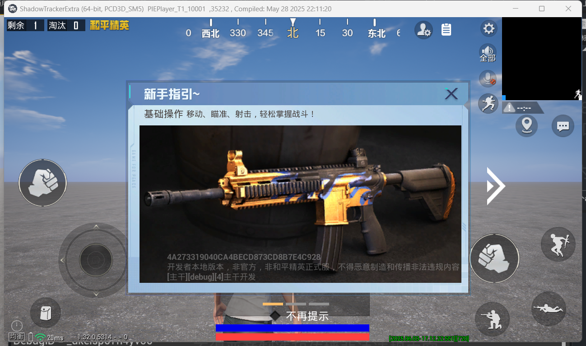
新手引导组件可配置大标题、小标题、内容和图片

### 前置依赖
新工程要使用新手引导组件，需要先找到以下路径：和平精英/资源/UI资源/UI模板/提示/新手教程，打开新手教程（需要先打开一遍，才可以搜索到）
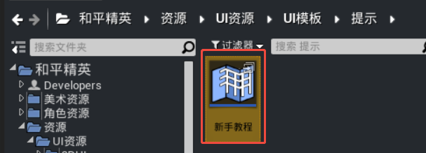
### 添加新手引导元件
#### 基于WidgetLayout添加

这里展示的是在主UI加载时，显示新手引导组件的方法
**1.将新手引导组件加入主UI**

主UI可在UGCPlayerController中找到
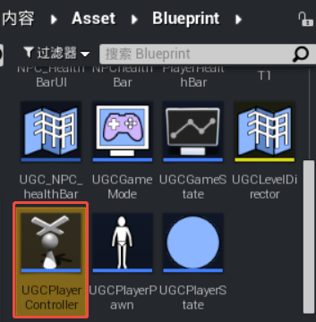

打开后细节中搜索Main UIClass，可以看到主UI配置
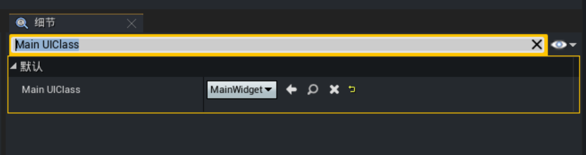

打开主UI
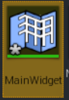

左上角搜索UGC Modules Teaching Tips UIBP，将其拖入主UI
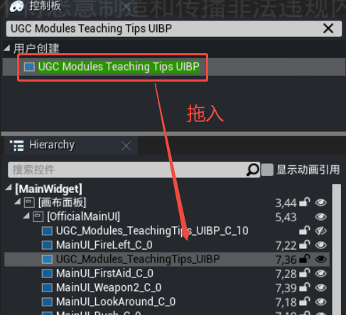

**2.配置其在主UI的位置**
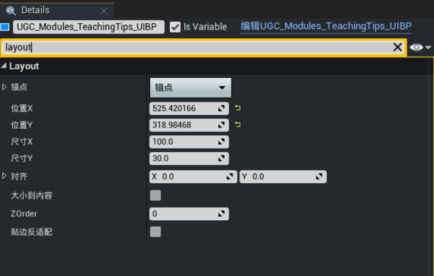

**3.主要内容配置**
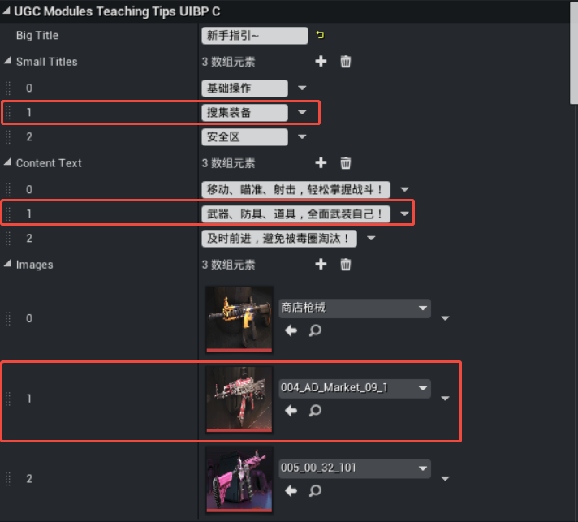
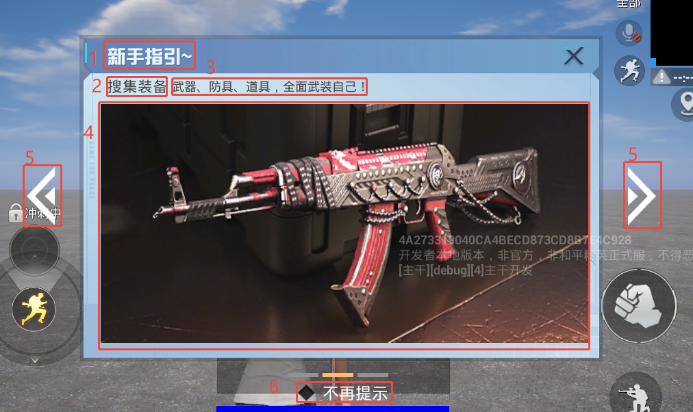
**参数说明**：
1.**Big Title**：**大标题**
2.**Small Titles**：**小标题**
3.**Content Text**：**内容文本**
4.**Images**：**图片**
**注意：每个下标一样的数组的【小标题-内容文本-图片】为一组展示在同一页中，如图所示**
5.**翻页按钮**
6.**不再提示勾选按钮**
**【不再提示】功能以Big Title为准，如果创建了多个新手引导，注意不要让Big Title一样**
**这里展示的是三页的新手引导，如有需求可以自行增加**
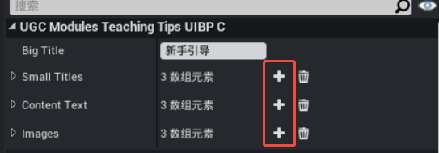
**4.编译并保存**
配置完成后，编译并保存方可生效
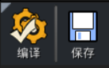

#### 脚本动态添加

新手引导组件也可以在合适的时机动态添加，步骤如下：
1.创建一个```widgetLayout```

2.打开刚创建```widgetLayout```，在控制板处搜索```UGC Modules Teaching Tips```，将其拖入画布
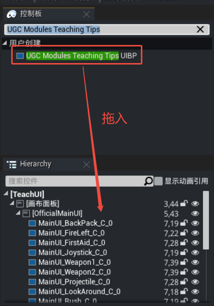
3.调整新手引导组件大小和位置，配置好各项参数后编译并保存
4.动态加载```widgetLayout```
在有需要的时机可以动态加载出刚创建的```widgetLayout```，动态加载方法可参考[加载与卸载WidgetLayout](./20019_和平主界面控件布局.md#加载与卸载WidgetLayout)
以下为在UGCGameState中ReceiveBeginPlay时机调用新手引导UI的示例：
```
function UGCGameState:ReceiveBeginPlay()

    local path = UGCGameSystem.GetUGCResourcesFullPath('Asset/Blueprint/TeachUI.TeachUI_C')
    UGCWidgetManagerSystem.LoadMainUIWidgetLayoutByPath(path)

end
```

------------------------------------

## 队伍信息面板
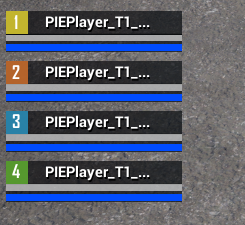
队伍信息组件可以配置血量值或属性值百分比与颜色的映射、多条属性值、队伍排序方式

### 使用前置
**1.打开UGCPlayerController，确认主UI**

在细节搜索Main UIClass，可以看到主UI，推荐将队伍信息组件放入主UI使用


**2.打开UGCGameMode**
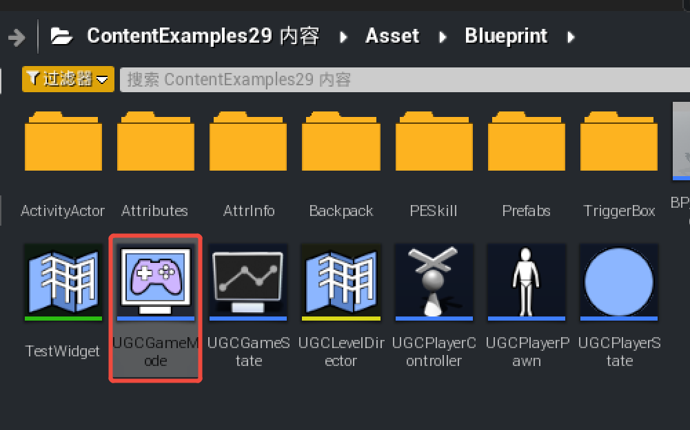
细节中搜索UIModule Prefab，在UI模块预制中填入UGCMainTeamModule
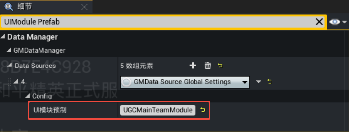
**注意：在世界设置中，选择的Game Mode要和打开的一致**
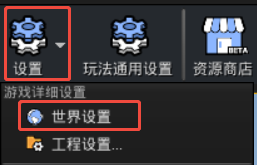
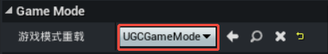

**3.打开PlayerState需设置属性条要用到的属性**
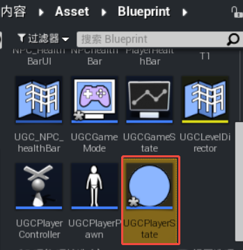
在细节中搜索Synced Attribute Pairs，添加需要用到的属性，需填写其当前值和最大值
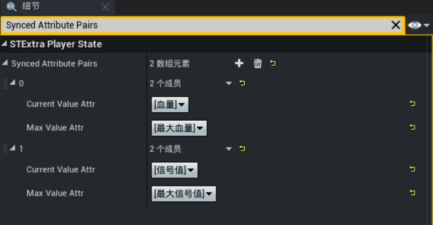

### 使用方法
**1.打开主UI**
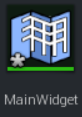
在左上角搜索UGC Ingame Team Panel New BP将其拖入主UI中
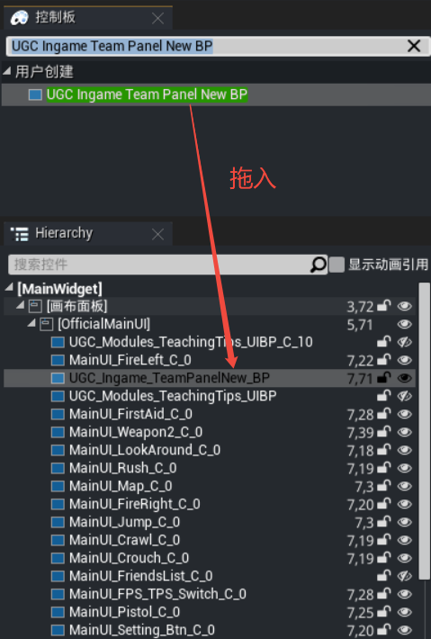

**2.配置组件**
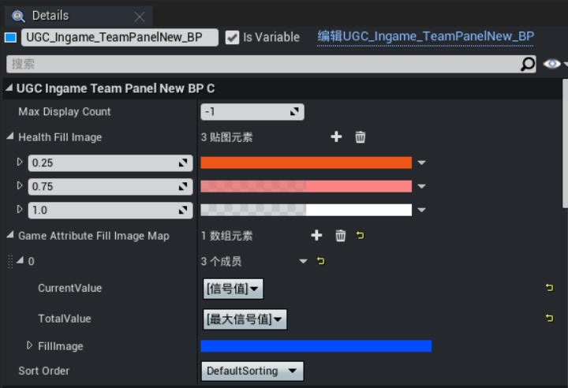
	**参数说明：**
- **Max Display Count**：最大显示个数，即最大显示多少个队友的信息，小于0表示不限制，当前只能支持最多8人
- **Health Fill Image** ：血量值百分比与颜色的映射，配置方法参考[主角血条](./20149_基础UI元件.md#使用方法)组件
- **Game Attribute Fill Image Map**：属性值百分比/颜色映射，配置方法参考[主角血条](./20149_基础UI元件.md#使用方法)组件
**注意：这里要让额外的属性条显示生效，必须在PlayerState中设置好，具体在使用前置可见；额外属性条的多少开发者可自行决定，过多的属性条会占用更多的屏幕空间**
- **Sort Order**：队伍排序方式，这里提供了两种排序方式：
	DefaultSorting：和平默认规则
	PlayerNameSorting：玩家ID字符串排序，值越小越靠前
**队伍信息组件暂不支持调整位置和大小功能，在其Layout中如何更改都不会奏效**

**3.编译并保存**
配置完成后，编译并保存方可生效

