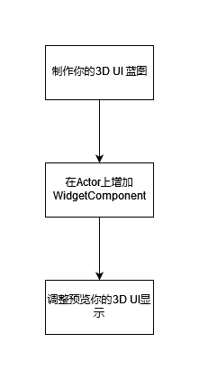
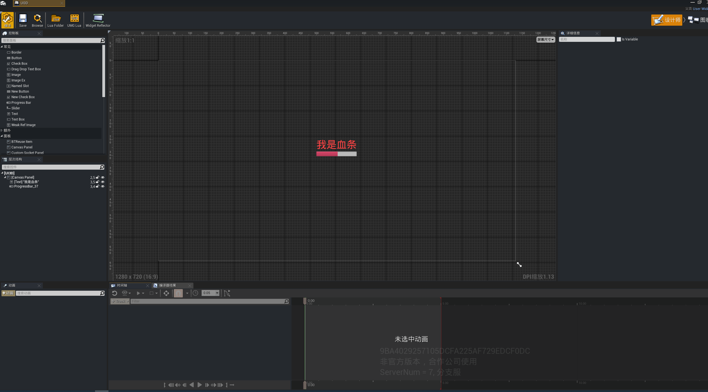
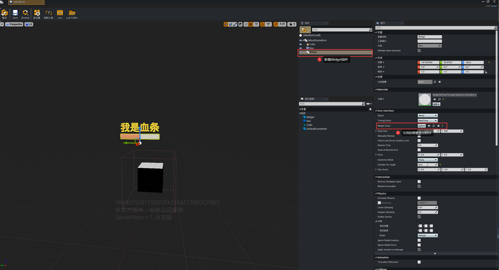
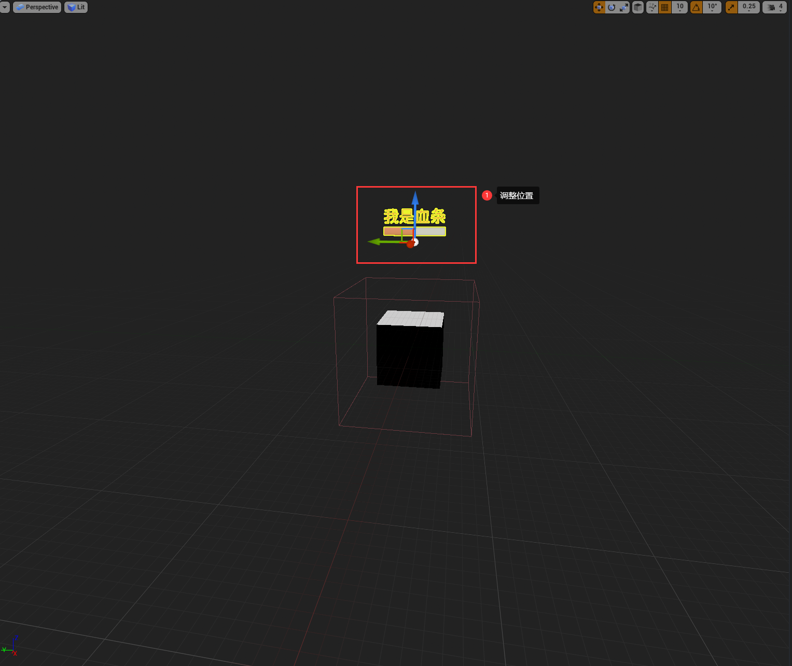
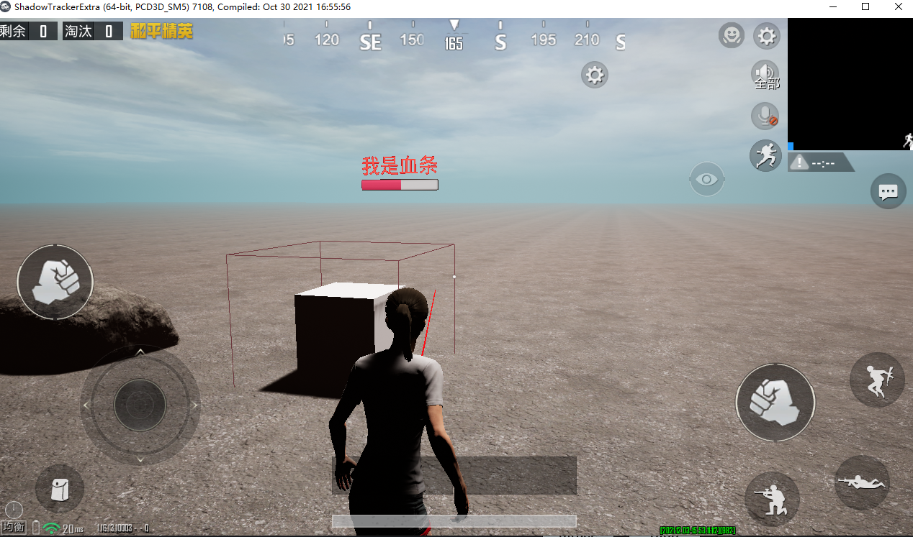

#  创建3D UI

在游戏中，我们经常要显示怪物的血条，这时候3D UI就派上用场了，下面我们简单介绍一下3D UI的使用方法。

---

## 流程

---

## 实战演练

1.制作你想要显示的3DUI，这里简单制作了一个想要显示的血条：

2.在你想要显示的Actor上显增加widget组件，并引用你刚才制作的UI蓝图：

3.在蓝图编辑视口中预览和调整UI的显示到合适位置：

4.启动游戏，你会发现3D UI已经正常显示了：

附件：

<a href="https://cgugc-video-test-1258633575.cos.ap-shanghai.myqcloud.com/wiki_picture/UI3D.zip">UI3D.zip</a>
