# UI自适应屏幕

制作UI界面时，如果想要保证UI在不同分辨率的设备上以固定的比例正常显示，需要提前对UI进行自适应适配，否则可能出现缩放比例不正确或者非预期的控件间隔现象。

## 设置层次结构

创建并进入【控件蓝图】界面（具体操作可参考 [UI系统快速入门](./347_快速入门.md)），将屏幕分辨率设定为1920*1080（16：9）或点击 ``设计师 -> 屏幕尺寸`` 设定为“Apple iPhone 6+(Landscape)”。

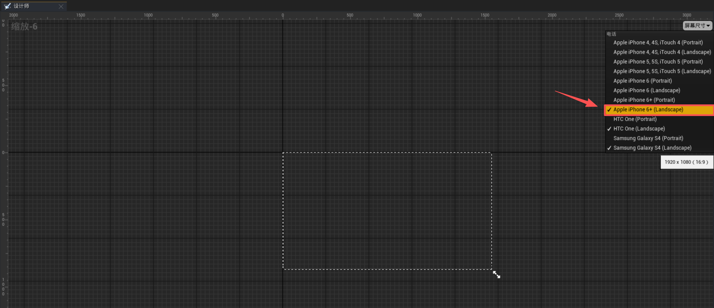

右键 ``画布面板 -> 包裹 -> 尺寸框`` 在承载UI界面的“画布面板”外包裹一层“尺寸框”。

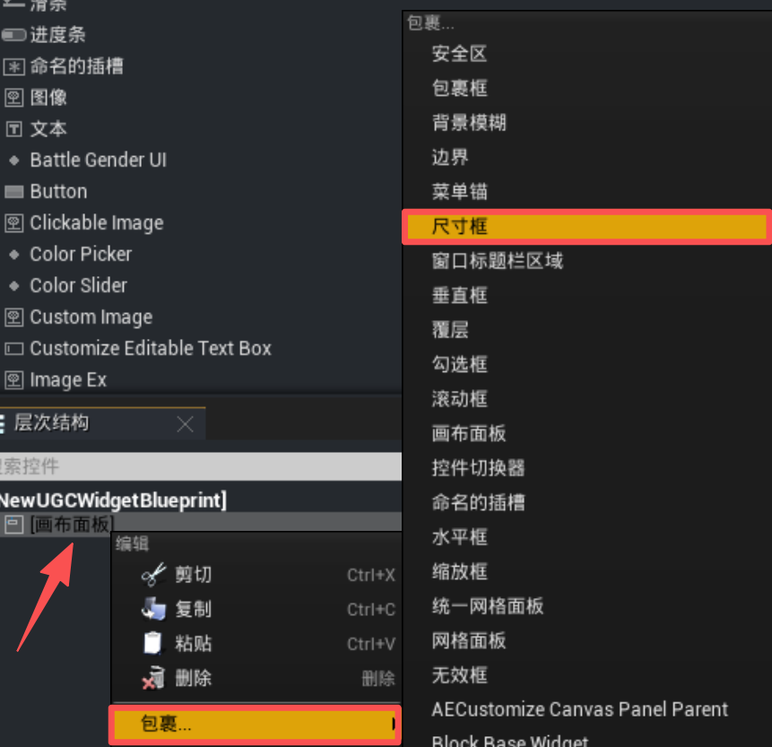

右键 ``尺寸框 -> 包裹 -> 缩放框`` 在“尺寸框”外包裹一层“缩放框”。

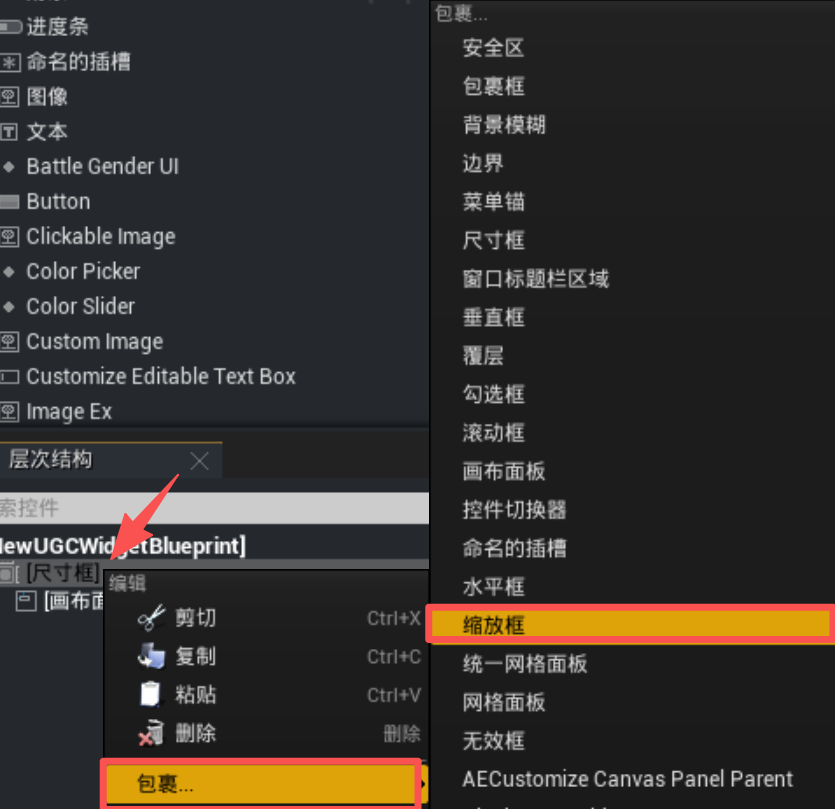

右键 ``缩放框 -> 包裹 -> 画布面板`` 在“缩放框”外包裹一层“画布面板”。

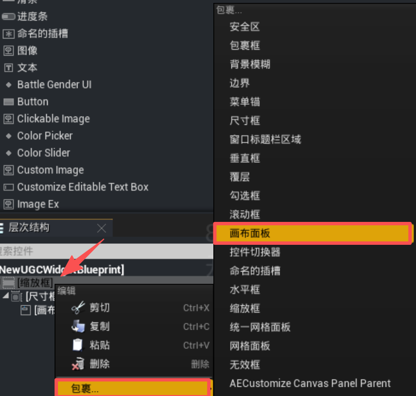

最终层次结构如图所示。

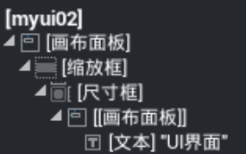

## 相关参数设置

在 ``层次结构`` 中点击缩放框，在【详细信息】中将 ``锚点`` 更改为“四向拉伸”，并将“偏移左侧”、“偏移顶部”、“偏移右侧”和“偏移底部”数值均设置为0。

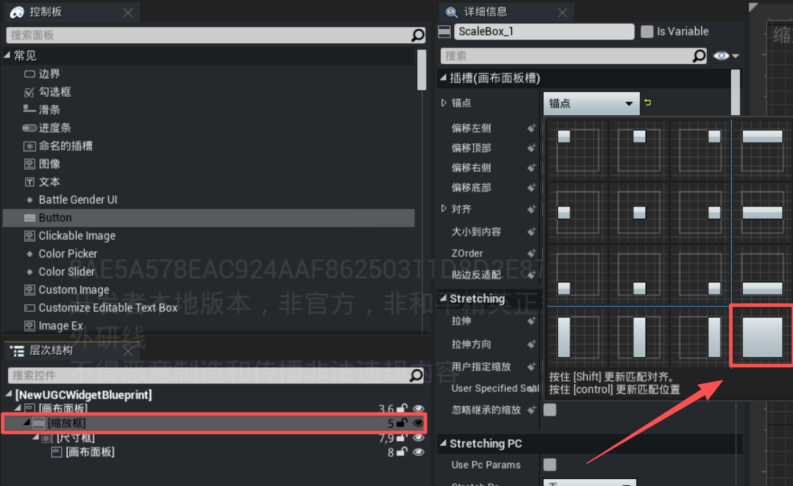

点击尺寸框，在【详细信息】中对尺寸框的尺寸进行设置，``宽度重载`` 设定为1920，``高度重载`` 设定为1080。

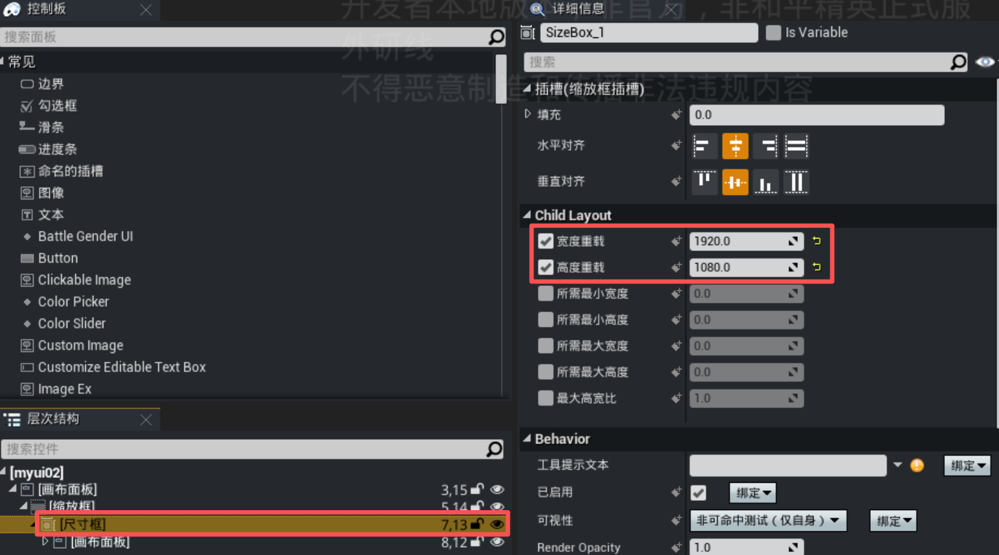

点击画布面板，在【详细信息】中将 ``水平对齐`` 设定为“水平对齐填充”，``垂直对齐`` 为“垂直居中填充”。

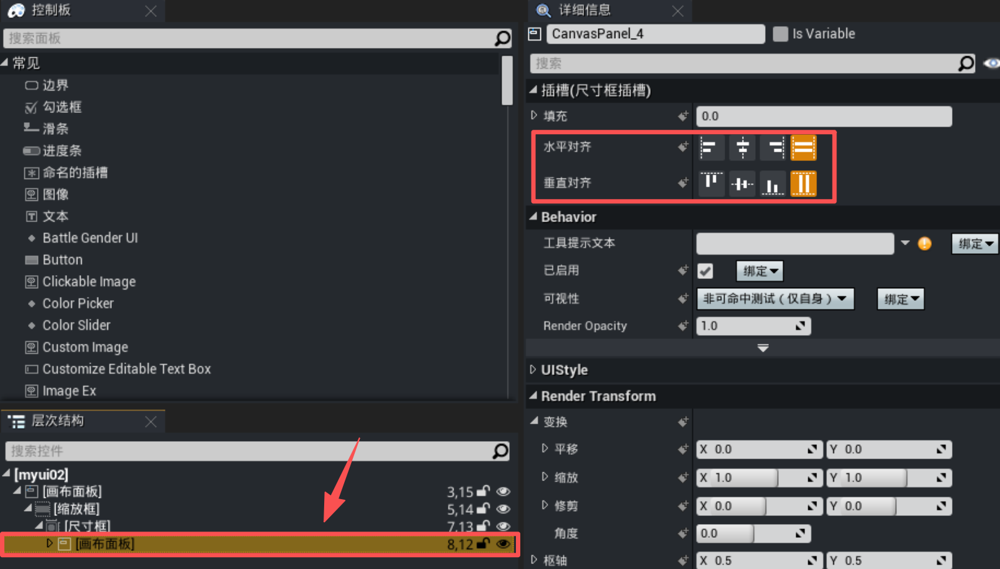

---

### 居中型控件

若属于道具弹窗这类无需贴边的UI，调整尺寸框的 ``水平对齐`` 为水平对齐居中，``垂直对齐`` 为垂直居中对齐。

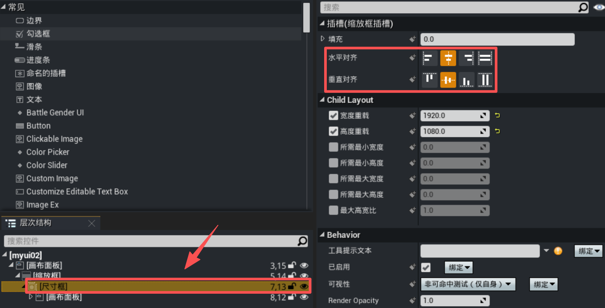
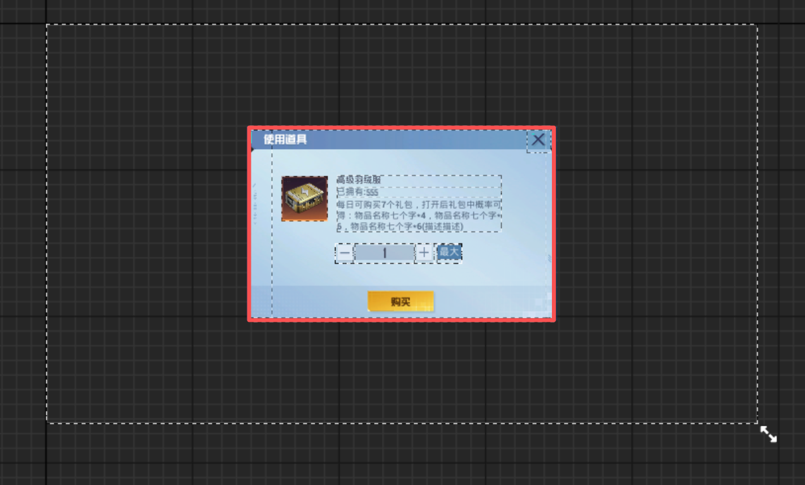

---

### 贴边型控件

若按钮有贴边需求，则调整尺寸框的 ``水平对齐`` 为水平右对齐，``垂直对齐`` 为垂直居中对齐。

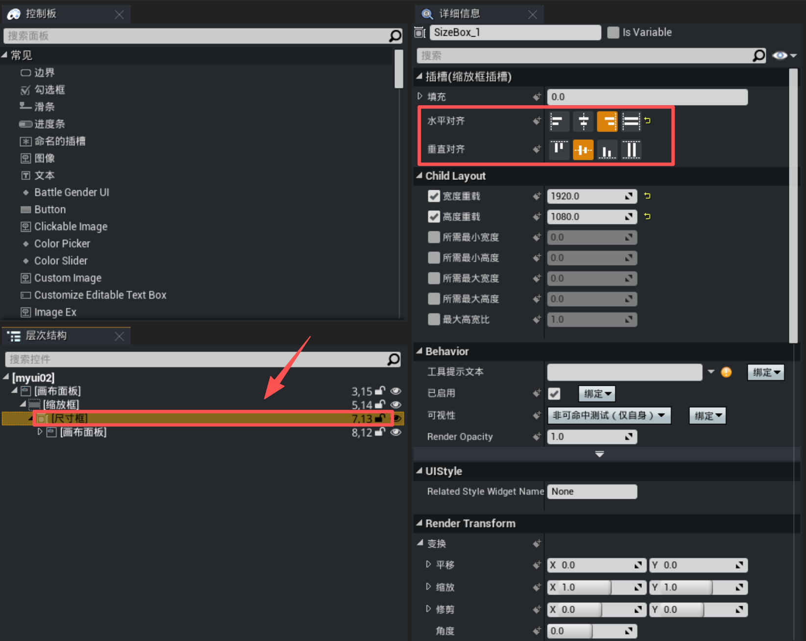
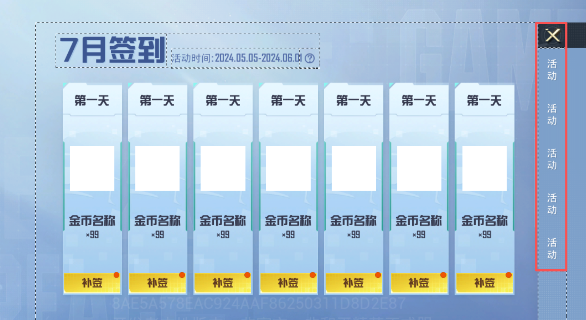

## 实现UI界面

完成以上层级结构设置后，开发者根据自身需要添加UI控件元素，该控件蓝图即带有自适应缩放效果。

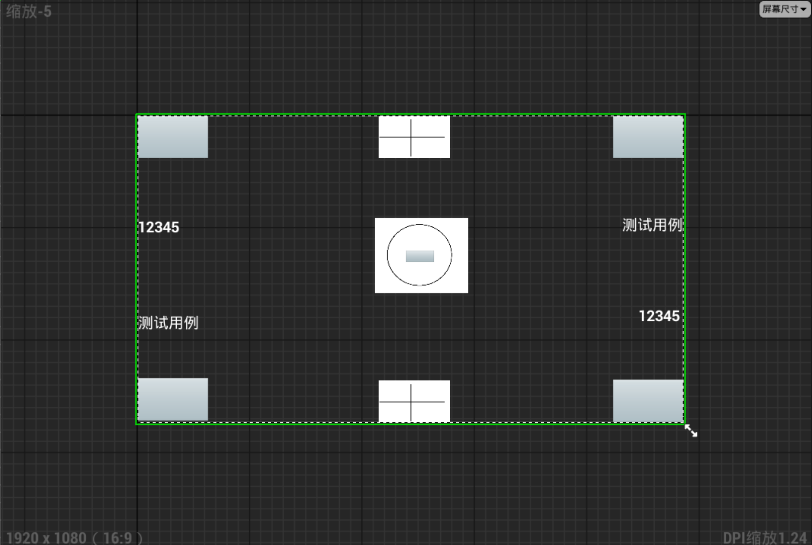
