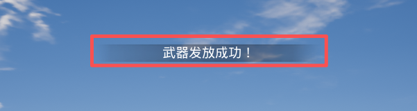
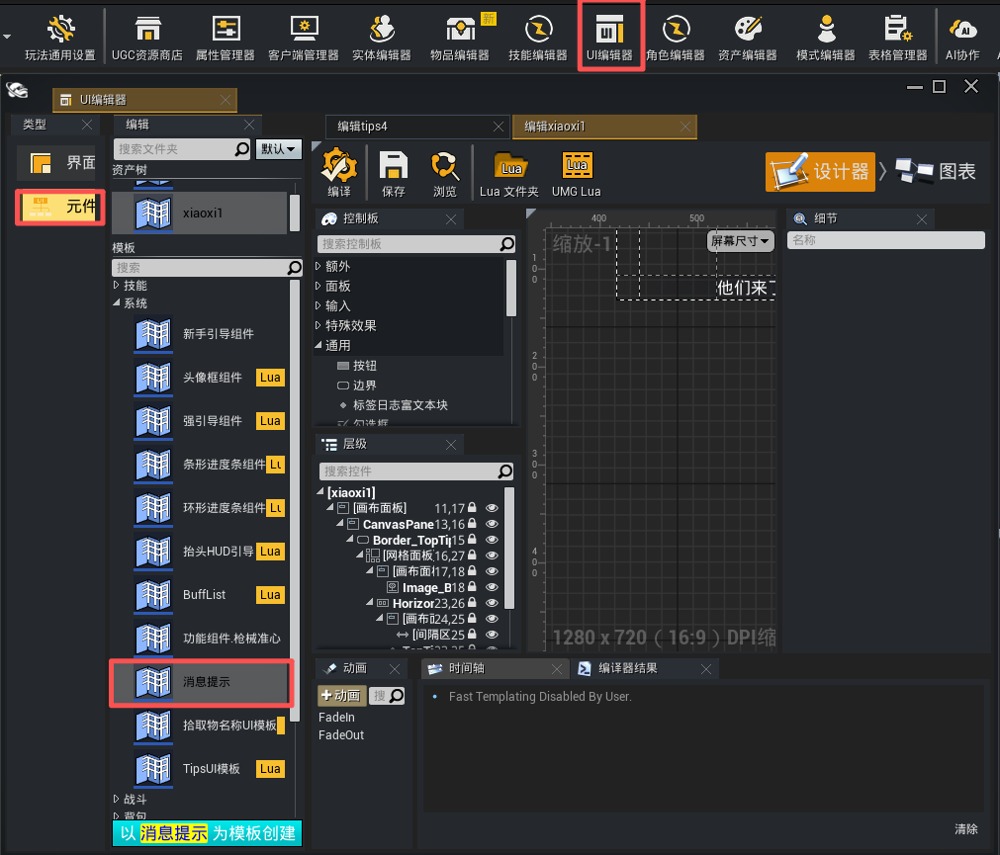
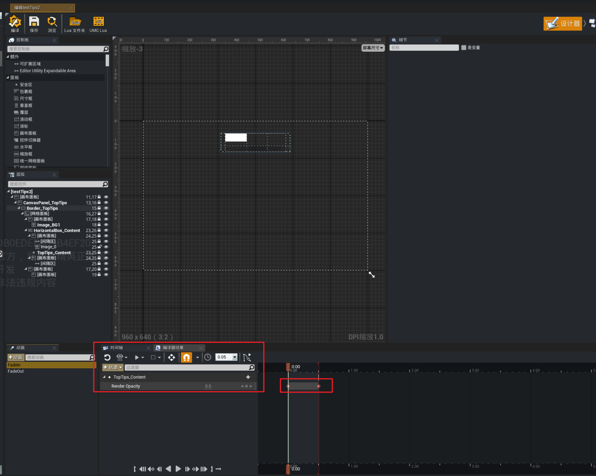

# Tips系统

可以基于该系统，配置游戏中常见的弹框消息提示，通常用于一些任务的提示、功能的引导。



## Tips表

点击【表格管理器】->【功能表格】->【Tips表】创建TIps表进行Tips的相关配置。


参数说明：
+ TipsID：Tips的ID，在代码里用接口显示对应Tips时，依赖ID进行查询。
+ 优先级：当下一条Tips进行显示，而前一条Tips还未完全隐藏时，依赖该优先级确定是否顶替。若优先级更大，则会进行顶替。优先级最大支持到3。即该优先级配置只能配置为0，1，2，3。
+ 是否可以被同等级顶替：如果两条Tips优先级一样，勾选该选项时，可以被优先级一致的Tips顶替。
+ 持续时间：tips的持续时间，优先级低于`Tips调用接口`。
+ 默认文本：该Tips的默认文本，可以使用富文本。
+ TipsUI蓝图：显示Tips的UI蓝图。支持在工程内使用对应UI模板创建自定义的Tips覆盖默认Tips蓝图。

---

### Tips调用接口

**客户端调用**

```lua
---生效范围：客户端
-- @param ID Tips表ID
-- @param TipsContent Tips的覆盖文本。若有，则会用该文本覆盖原本表里配置的默认文本
-- @param ExtraParam 动态黑板参数，可以构造动态参数传入Tips蓝图。
function UGCWidgetManagerSystem.ShowCustomTipsByID(ID, TipsContent, ExtraParam)
```

在对应客户端，根据ID找Tips表里定义的Tips，显示对应Tips。

```lua
function test:Button_3_OnClicked()
	UGCWidgetManagerSystem.ShowCustomTipsByID(1, "击杀成功！")
	return nil;
end
```

**服务端调用**

```lua
---生效范围：服务端
-- @param ID Tips表ID
-- @param TipsContent Tips的覆盖文本。若有，则会用该文本覆盖原本表里配置的默认文本
-- @param PlayerController 对应显示该Tips的玩家的Controller
function UGCWidgetManagerSystem.ShowCustomTipsByIDWithPC(ID, TipsContent, PlayerController)
```
在服务端，根据对应PlayerController，给对应玩家显示相应Tips。

```lua
function UGCGameState:ReceiveTick(DeltaTime)
    self.Timer = (self.Timer or 0) + DeltaTime
    if self.Timer >= 5.0 then
        self.Timer = self.Timer - 5.0
        local GameState = UGCGameSystem.GameState
        if GameState and GameState.PlayerArray then
            for _, PlayerState in pairs(GameState.PlayerArray) do
                if UE.IsValid(PlayerState) then
                    local PlayerKey = PlayerState:GetPlayerKey()
                    if PlayerKey then
                        local PC = ScriptGameplayStatics.GetPlayerControllerByPlayerKey(GameState, PlayerKey)
                        if UE.IsValid(PC) then
                            UGCWidgetManagerSystem.ShowCustomTipsByIDWithPC(1, "Boss 即将出现！", PC)
                        end
                    end
                end
            end
        end
    end
end
```

## 自定义Tips扩展

### UI模板

点击【UI编辑器】->【元件】->【消息提示】创建自定义TipsUI蓝图。可基于该蓝图进行自定义扩展。



---

### 数据结构
`BPDoActionsWhenNewTipBegin`是TipsUI刚显示进行构造时调用的函数，会传入一个data数据。

```lua
function testTips2:BPDoActionsWhenNewTipBegin(data)
    self.TopTips_Content:SetText(tostring(data.FinalContext))
    if CheckObjectContainsField(self, 'FadeIn') then
        self:StopAnimation(self.FadeIn)
        self:PlayAnimation(self.FadeIn, 0, 1, EUMGSequencePlayMode.Forward, 1)
    end
    if self.Timer then
        UGCGameSystem.ClearTimer(self, self.Timer)
        self.Timer = nil
    end
    local SelfWeakObjectPtr = WeakObjectPtr(self)
    self.Timer = UGCGameSystem.SetTimer(self,
        function ()
            local self = SelfWeakObjectPtr:Get()
            if self == nil then return end
            if CheckObjectContainsField(self, 'FadeOut') then
                self:StopAnimation(self.FadeOut)
                self:PlayAnimation(self.FadeOut, 0, 1, EUMGSequencePlayMode.Forward, 1)
            end
        end,
    data.PlayLength - 0.5,
    false)
end
```

以下为data数据含义参考。

```lua
    data.FinalContext      -- FText 最终文本
    data.ExtraParam        -- UUAEBlackboard* 调用方传入的额外参数
    data.PlayLength        -- float 持续时间
    data.Priority          -- uint8 优先级
    data.bCanBeReplaced    -- bool 可否被顶替
    data.TopTipWidget      -- TSoftClassPtr 覆盖的 Widget 类引用
		data.Offset            -- FVector2D 偏移量
		data.AnimationName     -- string 播放动画名
```

`BPDoActionsWhenNewTipEnd`是TipsUI持续时间结束，被隐藏时调用的函数事件。

---

### 淡入淡出动画

可参考Tips模板里的用法，在UI编辑器里配置对应组件的动画效果。



在TipsUI构造时，使用[`PlayAnimation`](https://developer.gp.qq.com/api/#/searchContent/UUserWidget?classDetailShow=true&path=class%2Fdetail%2FOthers%2FUUserWidget.json&isSelect=1&apiEnc=%5B%22%E7%B1%BB%22%5D&apiLabel=UUserWidget&autoJump=PlayAnimation)进行淡入淡出动画的播放。
> 淡出动画的延迟播放时间=tips持续时间 - 淡出动画时间

```lua
function testTips2:BPDoActionsWhenNewTipBegin(data)
  if CheckObjectContainsField(self, 'FadeIn') then
          self:StopAnimation(self.FadeIn)
          self:PlayAnimation(self.FadeIn, 0, 1, EUMGSequencePlayMode.Forward, 1)
      end
      self.Timer = UGCGameSystem.SetTimer(self,
                  function ()
                      if CheckObjectContainsField(self, 'FadeOut') then
                      self:StopAnimation(self.FadeOut)
                      self:PlayAnimation(self.FadeOut, 0, 1, EUMGSequencePlayMode.Forward, 1)
                      end
                  end,
                  data.PlayLength - 0.5,
                  false)
end
```

---

### 使用动态黑板参数

可以利用黑板透传Tips的动态参数。
调用时构造黑板并传入。

```lua
local BlackBoardClass = LoadClass("/Script/UAESharedModule.UAEBlackboard")
local BlackBoard = ScriptGameplayStatics.NewObject(self, BlackBoardClass)
BlackBoard:SetValueAsInt({SelectedKeyName = "ImageIndex"}, 2, true)
UGCWidgetManagerSystem.ShowCustomTipsByID(1, nil, BlackBoard)
```

构造TipsUI时使用传入的黑板参数。

```lua
function testTips2:BPDoActionsWhenNewTipBegin(data)
    self.TopTips_Content:SetText(tostring(data.FinalContext))
    local ExtraParam = data.ExtraParam
    if ExtraParam then
        local ColorIndex = ExtraParam:GetValueAsInt({SelectedKeyName = "ImageIndex"})
        local Color = self.ImageIndexs[ColorIndex]
        self.Image_0:SetColorAndOpacity(Color)
    end
end
```
