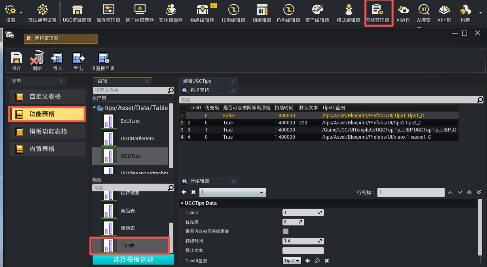
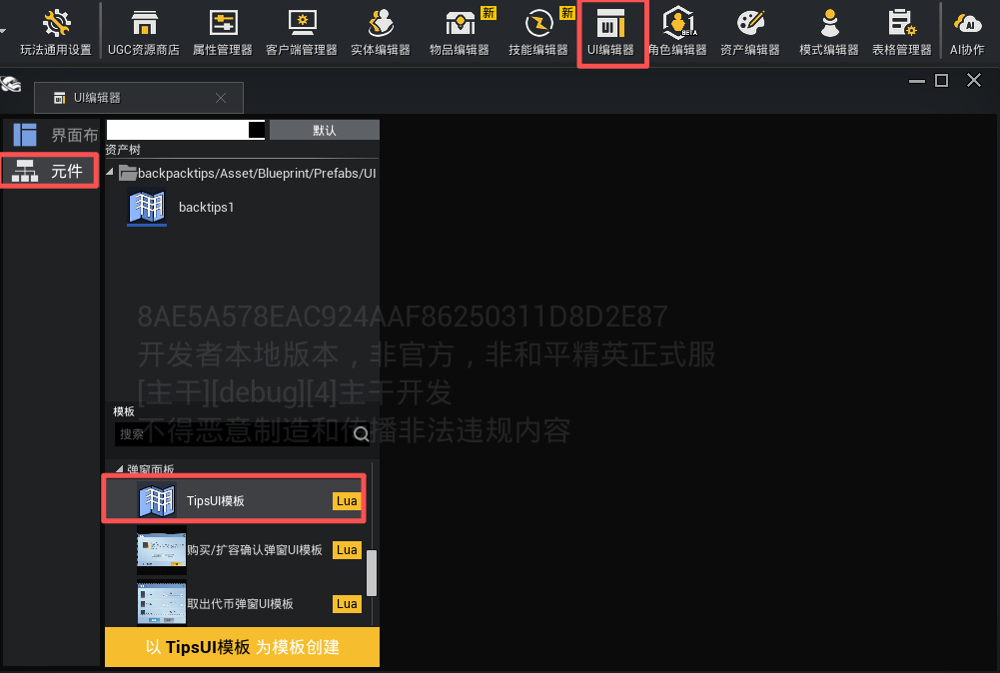
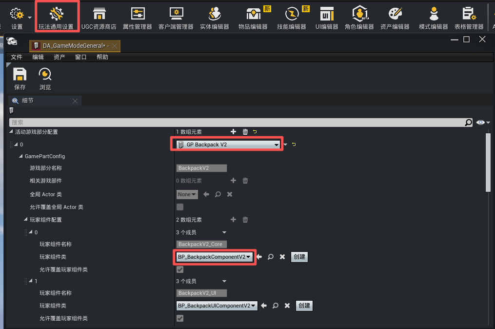
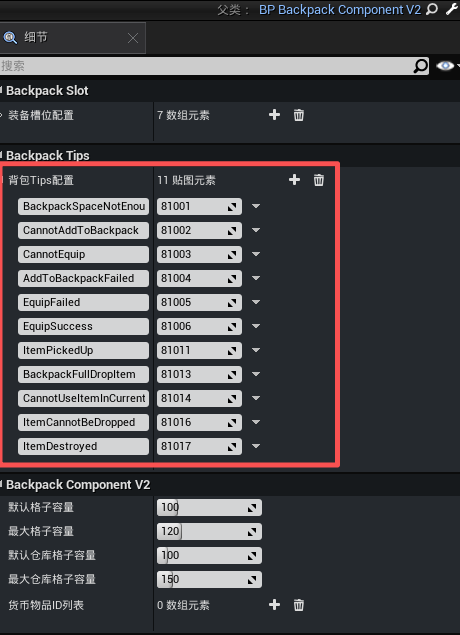
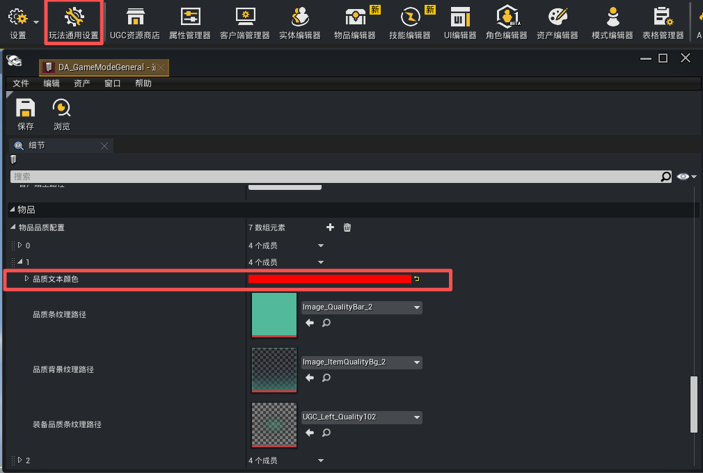

# 背包Tips系统

可以基于该系统，配置与背包系统相关的弹框信息提示。


## Tips表

点击【表格管理器】->【功能表格】->【Tips表】创建TIps表进行Tips的相关配置。



参数说明：
+ TipsID：Tips的ID，在代码里用接口显示对应Tips时，依赖ID进行查询。
+ 优先级：当下一条Tips进行显示，而前一条Tips还未完全隐藏时，依赖该优先级确定是否顶替。若优先级更大，则会进行顶替。优先级最大支持到3。即该优先级配置只能配置为0，1，2，3。
+ 是否可以被同等级顶替：如果两条Tips优先级一样，勾选该选项时，可以被优先级一致的Tips顶替。
+ 持续时间：tips的持续时间，优先级低于Tips调用接口。
+ 默认文本：该Tips的默认文本，可以使用富文本。
+ TipsUI蓝图：显示Tips的UI蓝图。支持在工程内使用[TipsUI模板](./20463_背包Tips系统.md#TipsUI模版)创建自定义的Tips覆盖默认Tips蓝图。

## TipsUI模版

点击【UI编辑器】->【元件】->【TipsUI模版】创建背包Tips系统蓝图。可基于该蓝图进行自定义扩展。



## 背包Tips系统的配置

点击【玩法通用设置】按钮，[启用背包系统](../GamePlay系统/物资系统/物资编辑器2.0/20104_背包系统.md#启用背包系统)，添加“GP_BackpackV2”模块，创建并打开`背包组件（BP_BackpackComponentV2）`。




在【细节】->【Backpack Tips】->【背包Tips配置】中将默认TipsID更改为Tips表中的TipsID。

|背包映射key|默认TipsID|默认文本|触发场景|
|-|-|-|-|
|BackpackSpaceNotEnough|81001|背包空间不足!|背包容量满，添加物品失败时|
|CannotAddToBackpack|81002|无法加入背包!|背包容量满，拾取物品失败时|
|CannotEquip|81003|无法装备!|装备不符合装备条件的装备时|
|AddToBackpackFailed|81004|加入背包失败!|添加物品失败时|
|EquipFailed|81005|装备失败!|装备物品失败时|
|EquipSuccess|81006|成功装备%s!|装备物品成功时|
|ItemPickedUp|81011|已拾取%s|拾取物品时|
|BackpackFullDropItem|81013|背包容量不足，自动丢弃%s|背包容量不足，自动丢弃物品时|
|CannotUseItemInCurren|81014|当前状态无法使用%s|使用当前状态无法使用的物品时|
|ItemCannotBeDropped|81016|该物品无法被丢弃|丢弃无法丢弃物品时|
|ItemDestroyed|81017|已销毁%s|物品被销毁时|

> %s 会被替换为对应的物品名称

+ 物品名称的文本颜色将以【玩法通用设置】->【物品品质配置】中的【品质文本颜色】显示。




---

### Tips相关接口

获取背包Tips配置值

```lua
---通过Key查询BackpackTipsConfig TMap中对应的整型配置值
---生效范围：服务器&客户端
---@param Player PlayerPawn | PlayerController @玩家角色或者玩家控制器
---@param Key string @Tips配置Key
---@return number|nil @对应TipsID，未找到返回nil
function UGCBackpackSystemV2.GetBackpackTipsConfig(Player, Key) end
```

弹出背包Tips

```lua
---func 服务端/客户端调用
---@param TipKey string Tips配置Key（对应BackpackTipsConfig中的键）
---@param ItemDefineID userdata 物品DefineID
---@param Count number 物品数量，默认0
---@param Reason number EUGCCommonItemReason 通用操作原因，默认Default
 function BP_BackpackComponentV2_Custom:DisplayBackpackTipsV2(TipKey, ItemDefineID, Count, Reason)
    BP_BackpackComponentV2_Custom.SuperClass.DisplayBackpackTipsV2(self, TipKey, ItemDefineID, Count, Reason);
 end
```
