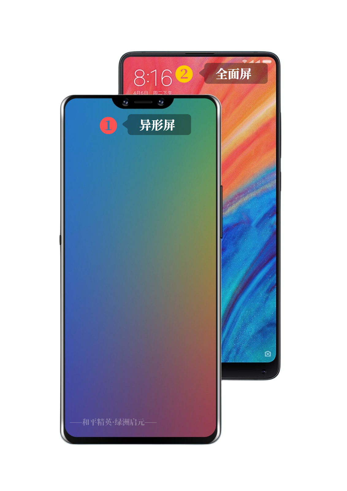
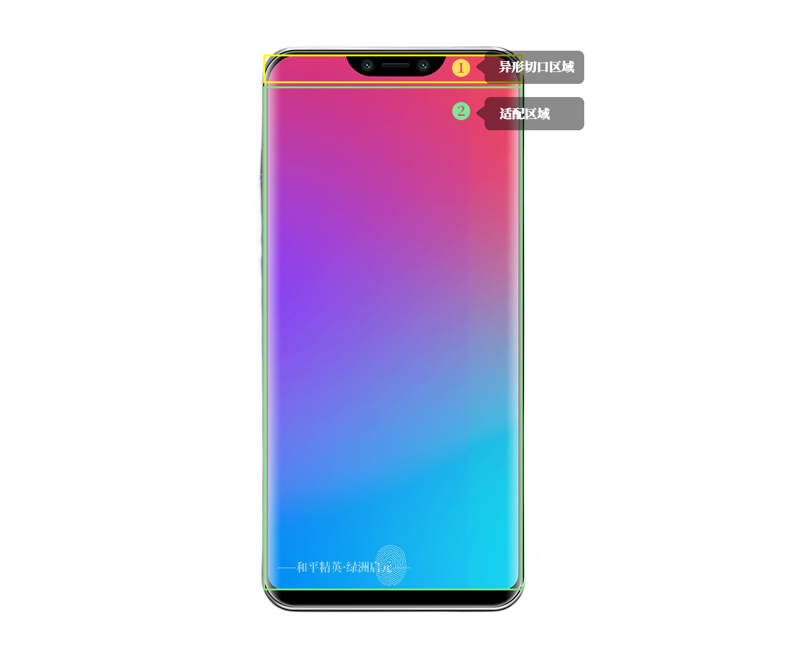
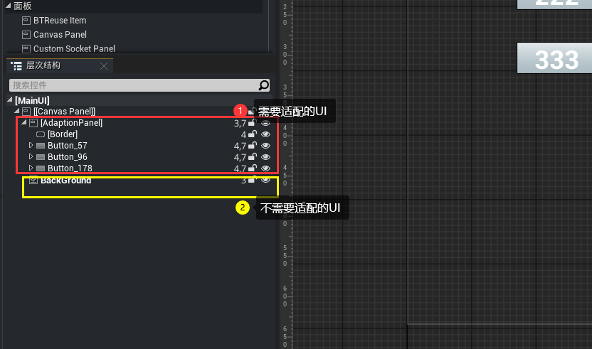

#  异形屏适配

在绿洲启元编辑器完成UI制作后，如果想要适配异形屏，可以参考如下步骤调整UI。

## 异形屏介绍

什么是异形屏？如下图所示：



异形屏的结构：



## 适配流程

调整UI层次结构，参考如下结构：



 在适当时机调用函数适配UI，例如在Construct事件中调用（已设置AdaptionPanel 的 Is Variable属性）：

```
function MainUI:Construct()
   ...
   UICommonFunctionLibrary.SetAdaptation(self.AdaptionPanel, self);
end
```

## 注意事项

所有主UI都需要适配一遍。
