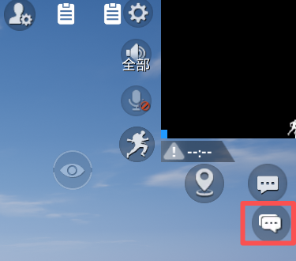
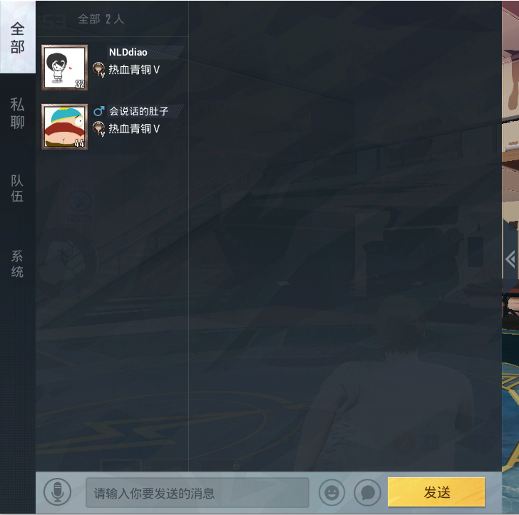
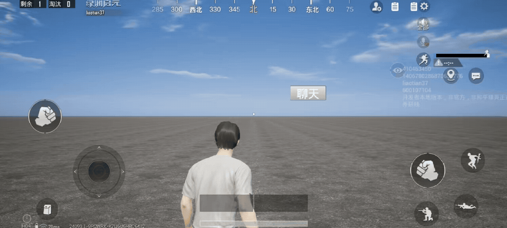
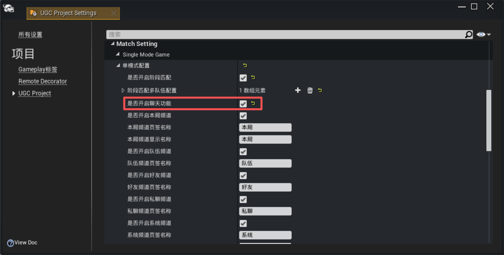
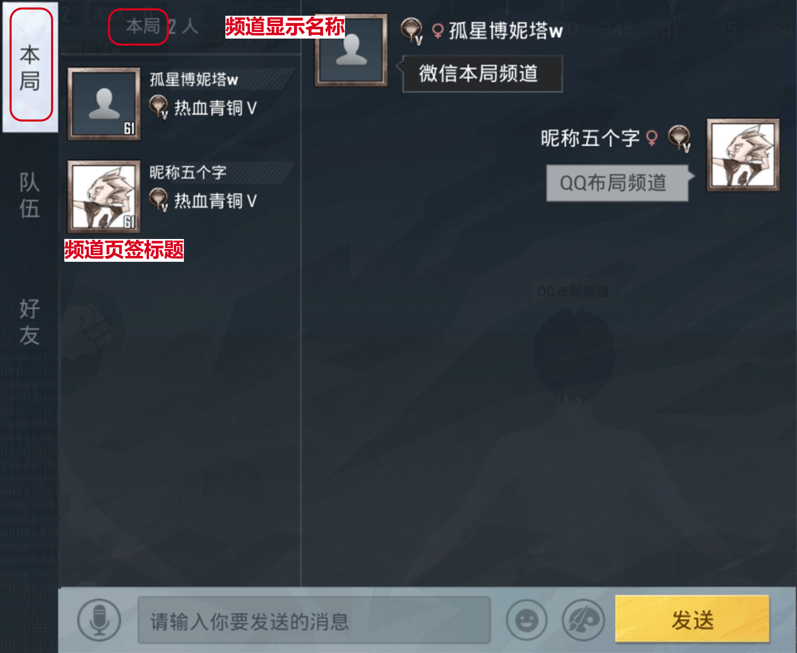
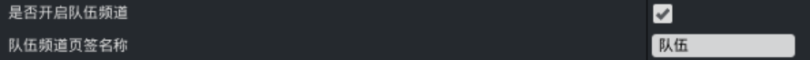
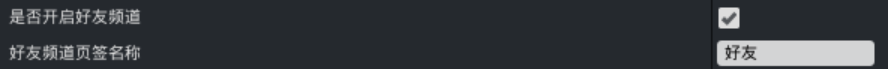
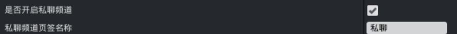
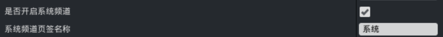
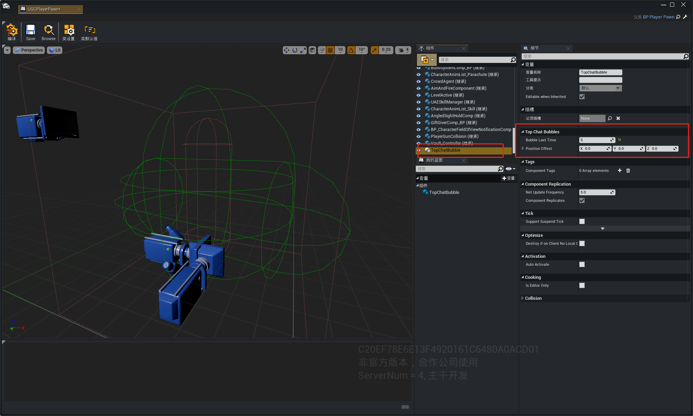

# 聊天系统

## 功能介绍
和平精英的聊天系统是和平精英和绿洲玩法内置功能，主要用于局内玩家文字交流。
该功能由开发者在工程设置中选择是否开启，若开启聊天功能，将在UI内显示聊天入口。



点击聊天入口可以打开聊天界面（PIE调试阶段不会弹出聊天界面，需上传玩法后在手机查看）。



可在创建的按钮中调用[`LoadLobbyChatFrameUI`](https://developer.gp.qq.com/api/#/searchContent/UGCWidgetManagerSystem?classDetailShow=true&path=class%2Fdetail%2F%E5%92%8C%E5%B9%B3%E5%85%A8%E5%B1%80%E6%8E%A5%E5%8F%A3%2FUI%20%E7%95%8C%E9%9D%A2%2FUGCWidgetManagerSystem.json&isSelect=1&apiEnc=%5B%22%E7%B1%BB%22%5D&apiLabel=UGCWidgetManagerSystem&autoJump=LoadLobbyChatFrameUI)，实现使用自定义UI打开聊天界面的效果。



## 使用说明
聊天系统通过【编辑】->【项目设置】->【Match Setting】中的配置选项来控制。勾选后，游戏中将开启聊天功能。

|页签标题|频道功能定义|可见范围与权限|微信、qq平台互通|手机端、pc端互通|
|:---|:---|:---|:---|:---|
|本局|玩法本局聊天频道|仅当前对局内玩家（需等级大于10级）可查看并发言|互通|互通|
|队伍|队伍内部聊天频道|仅同队伍成员（需等级大于10级）可查看并发言|互通|互通|
|好友|一对一好友聊天频道|仅互为好友的双方可发起聊天|||
|私聊|一对一聊天频道|同对局内双方玩家可私信，不限好友/陌生玩家|互通|互通|
|系统|系统通知频道|开发者可通过接口向频道推送系统消息，玩家仅可查看|

+ 聊天频道页签顺序为和平聊天默认固定顺序，不支持修改：本局频道>>队伍频道>>好友频道>>私聊频道>>系统频道

---

### 本局频道
支持开发者自定义页签名称，仅允许输入中文字符，长度上限为4个中文字符。
支持开发者自定义频道显示名称，仅允许输入中文字符，长度上限为2个中文字符。



---

### 队伍频道
支持开发者自定义页签名称，仅允许输入中文字符，长度上限为4个中文字符。



---

### 好友频道
支持开发者自定义页签名称，仅允许输入中文字符，长度上限为4个中文字符。



---

### 私聊频道
支持开发者自定义页签名称，仅允许输入中文字符，长度上限为4个中文字符。



---

### 系统频道
支持开发者自定义页签名称，仅允许输入中文字符，长度上限为 4 个中文字符。
可以使用接口将期望发送的系统消息发送至聊天界面的系统频道内。



```
-- 将系统消息发送给所有玩家
-- @param MessageTag 系统消息标签，如“系统通知”
-- @param MessageContent 系统消息内容
UGCMessageSystem.SendSystemMessageToAll(String MessageTag, String MessageContent)

-- 将系统消息发送给指定玩家
-- @param PlayerKey 玩家的PlayerKey值
-- @param MessageTag 系统消息标签，如“系统通知”
-- @param MessageContent 系统消息内容
UGCMessageSystem.SendSystemMessageToPlayer(int PlayerKey, String MessageTag, String MessageContent)
```

## 聊天气泡
若想开启聊天内容发送后，将聊天内容显示在玩家的头顶气泡内，则需要添加聊天气泡功能。打开玩家控制的Pawn，添加组件TopChatBubble，并配置组件参数。
组件参数分别为：

1.保留时间：气泡显示时间，之后将消失，直到再次发送聊天内容；
2.显示位置：气泡的补偿位置，可以用于调整气泡位置；


