# 绿洲启元段位和赛季接入指南

## 绿洲启元段位和赛季简介

1. 玩法可以根据实际的玩法需求，定制适合玩法自身的段位方案，让玩家在此玩法中能匹配更合适的队友以及对手，也能帮助玩家在玩法中建立更好的长期追求和目标。
2. 与段位配套的还有赛季，玩法可以根据运营需求，设置赛季，并在赛季更替时，定制段位重置规则。

下文中【绿洲启元玩法段位】和【绿洲启元段位积分】将统一简称【段位】和【积分】，区别于和平精英原本的段位和积分，仅单独作用于绿洲启元中的玩法。

## 绿洲启元管理平台数据配置
在 ``项目管理 - 项目列表 - 项目操作`` 中，可以创建，修改或者提审玩法段位。

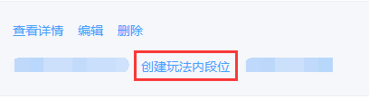

### 添加段位
1. 首先设置【段位积分上限】以防止玩家段位分数无限上涨。

> 玩家初始段位积分为2000，请以此积分为基础设计段位积分

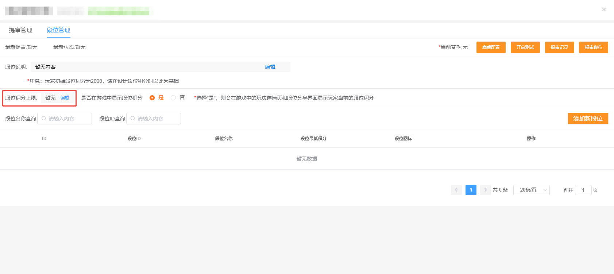

2. 点击【添加新段位】按钮，给当前项目添加新的段位配置。

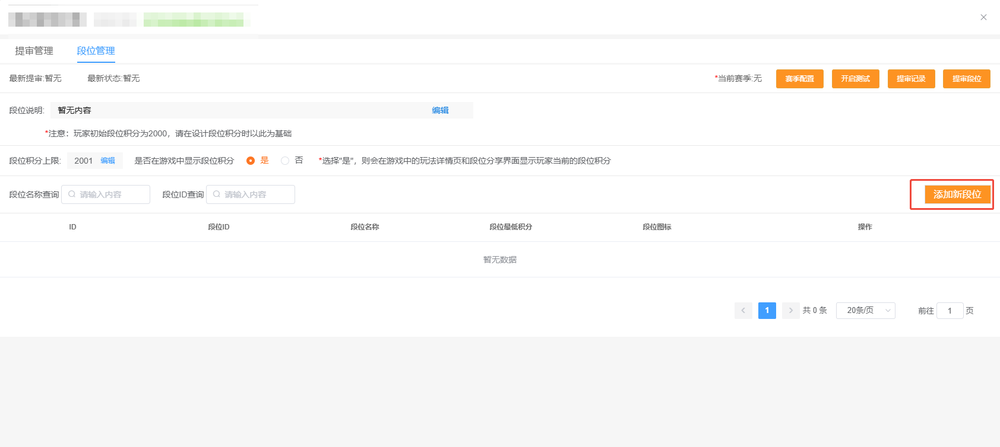

段位配置界面如下图所示。

> 首个段位最低分需为0

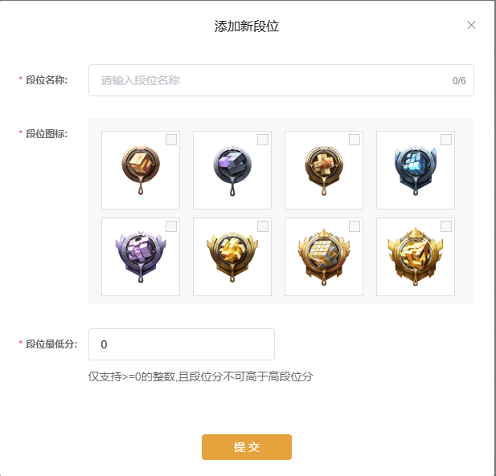

3. 如需要在游戏内的玩法详情页和段位分享界面显示玩家当前的段位积分，则选"是"，不需要则选”否“。

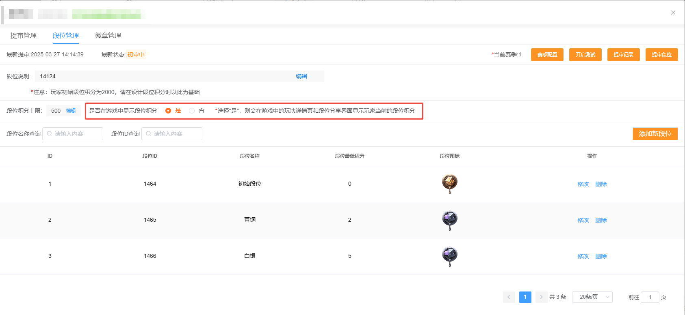

---

### 添加赛季

1. 点击【赛季配置】按钮，进入赛季配置界面

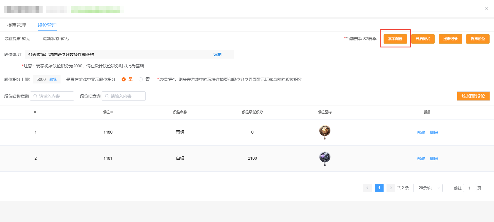

2. 赛季配置界面如下图所示，该界面展示当前的赛季配置。

> 赛季ID从小到大排列，ID最大的为当前赛季，绿洲大厅仅展示当前赛季的段位

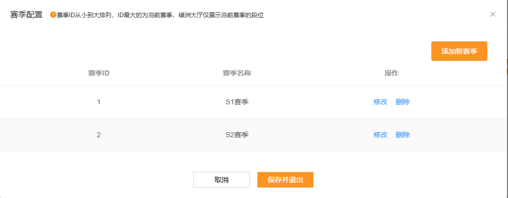

3. 点击【添加新赛季】按钮进入新赛季配置页面，给当前玩法配置赛季信息。

> 为方便玩家理解，建议在配置赛季名称时，后缀添加"赛季"两个字

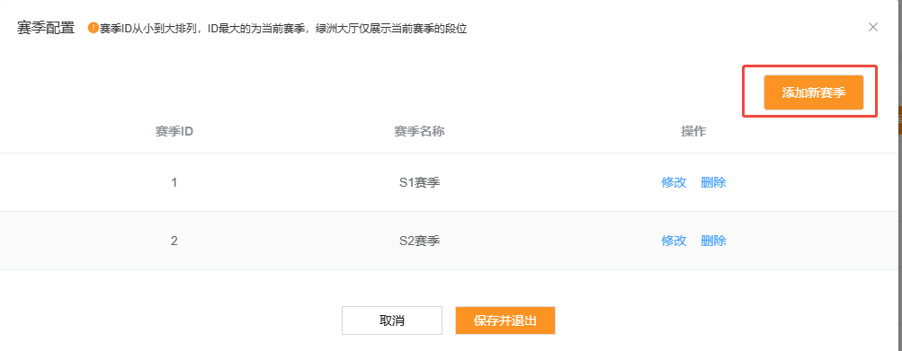
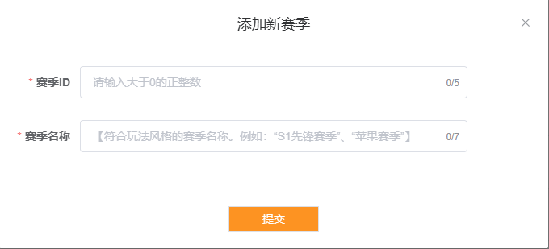

---

### 段位测试

1. 在【提审管理】tab栏添加测试账号，操作步骤可以参见 [上传工程与真机测试](../../绿洲编辑器基础内容/上传和发布玩法/372_上传工程与真机测试.md) 中的“玩法测试”部分内容。

> 此时不点击“开启测试”

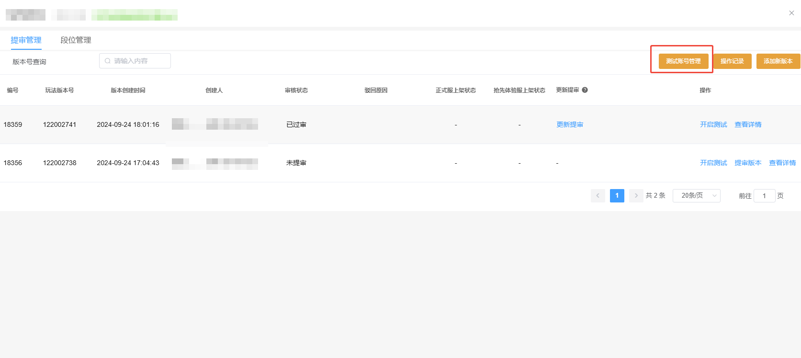

2. 确认玩法已配置【段位配置】、【赛季配置】、【段位说明】后，在【段位管理】tab栏里点击【开启测试】按钮。

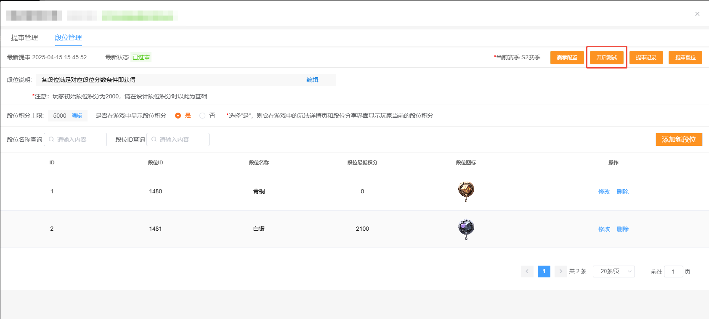

3. 回到【提审管理】tab栏，点击【开启测试】。

> 提审管理的"开启测试"必须是最后开启

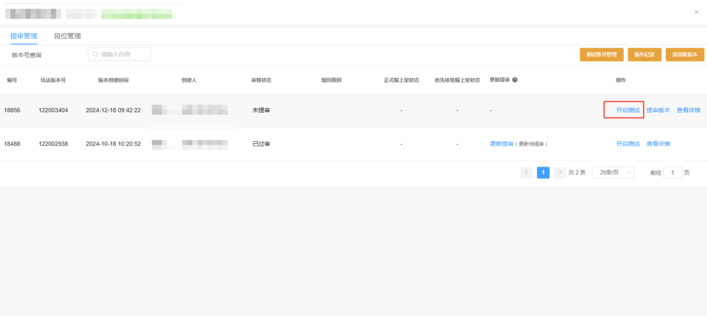

4. 点击【段位管理】tab栏的【测试详情】，即可查看正在测试中的段位内容，如下图所示：

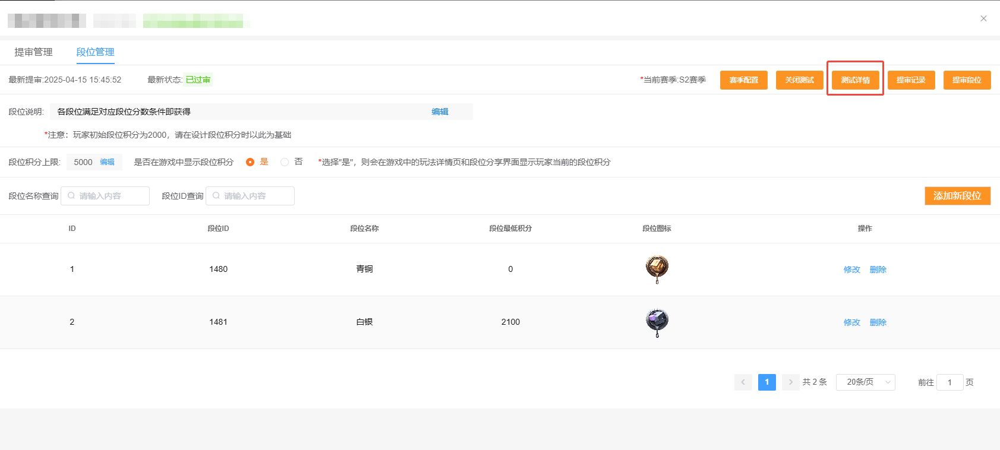
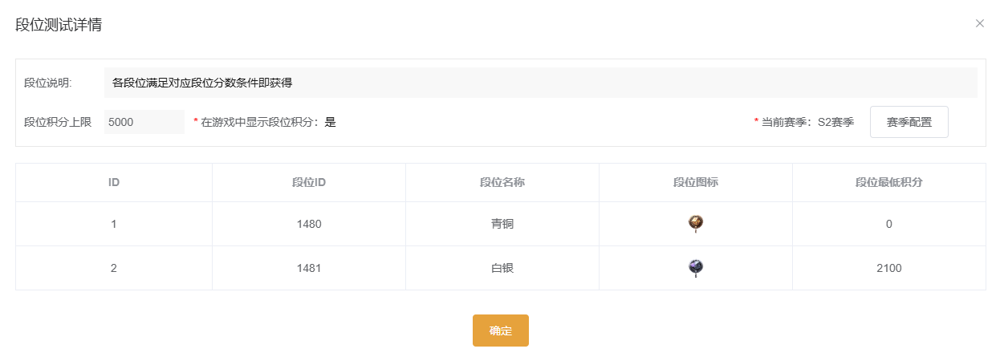

---

### 段位提审

1. 点击【提审段位】按钮，将现有的赛季配置和段位配置提交审核。

> 赛季的提审包含在段位提审中，如果有段位信息的修改，会一起提交

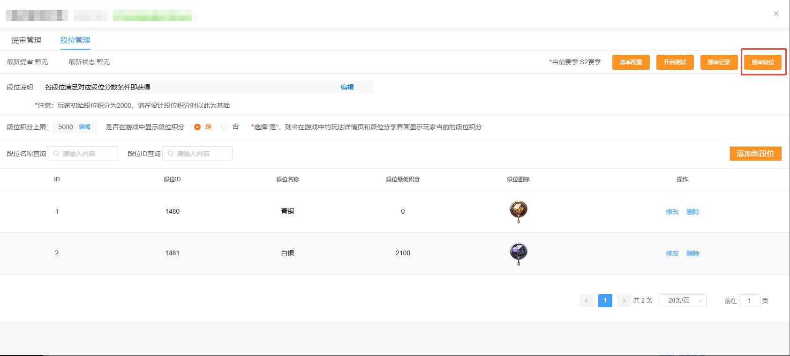

2. 赛季和段位的【审核状态】和【上架状态】可以在【提审记录】界面看，如下图所示：

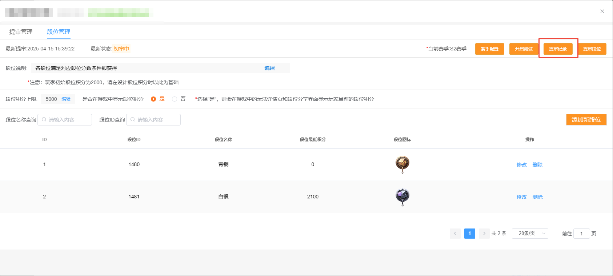
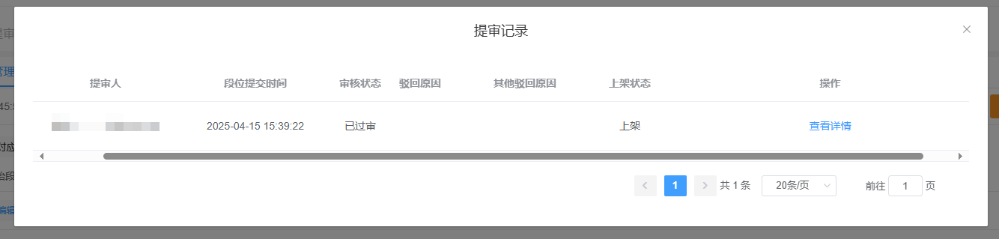

3. 段位审核通过并上架后，可以在游戏内接入段位接口进行后续开发测试，以及在绿洲大厅内看到玩法相关的段位展示。

## 战斗内段位赛季系统接入流程

### 核心接口

**1. 获取玩家积分**

- 此接口仅在【战斗服务器】生效。
- 此接口用于获取玩家进入玩法时的段位积分，本场战斗内多次获取也不会变化。

```lua
---查询段位分
---生效范围：S
---@return UGCRankRate float @实际伤害
---@param Count int  @段位分
function UGCRankSystem.GetUGCRank(PlayerKey)
end
```

**2. 改变玩家积分**

- 此接口仅在【战斗服务器】生效。
- Count为需要增加或者减少的段位积分数量。

```lua
---修改段位分
---生效范围：S
---@param PlayerKey int  @玩家PlayerKey
---@param Count int  @段位分
function UGCRankSystem.AddRanktProgress(PlayerKey, Count)
end
```

**3. 赛季重置段位接口**

- 此接口仅在【战斗服务器】生效。
- 此接口为PlayerController的接口，需要在PlayerController中进行重载，PlayerController的基类必须为`BP_UGCPlayerController`。

```lua
---重置新赛季玩家段位分
---生效范围：S
---@param GameSeasonId int  @当前玩法的赛季Id
---@param PlayerSeasonId int  @玩家账户所处的赛季Id
---@param PlayerRank int  @玩家账户当前段位分数
---@return NewSeasonRank int  @玩家账户在新赛季重置后的段位分数
function PlayerController：GetUGCPlayerNewSeasonRankInNewGameSeason(GameSeasonId, PlayerSeasonId, PlayerRank)
    ...
    return NewSeasonRank
end
```

### 段位基础接入流程
1. 根据玩法实际场景，调用`UGCRankSystem.AddRanktProgress()`接口,增加或减少玩家的段位分数。

2. 游戏结束时，确保`UGCGameSystem.SendPlayerSettlement()`被调用，否则玩家在本局的积分变化将不被结算。

3. 客户端调用`UGCGameSystem.ShowUGCRankAndAchievementUI()`接口，显示段位结算界面，若本局段位积分变化为0， 也依然会显示段位结算界面。

4. 根据赛季需要，在PlayerController脚本中，重载`PlayerController：GetUGCPlayerNewSeasonRankInNewGameSeason`接口，根据玩家之前赛季id和段位积分，返回新赛季玩家段位积分，若未重载，则默认直接保留玩家之前段位积分。

## 注意事项
-  `UGCGameSystem.ShowUGCRankAndAchievementUI`需要保证在`UGCGameSystem.SendPlayerSettlement()`调用后再调用,否则结算界面不会正确显示。
-  未游玩过玩法的新玩家不受赛季重置积分影响。

**FAQ：我的玩法有自己的结算界面，结算流程应该如何接入段位结算界面?**

1. 确保战斗服务器内已调用`UGCGameSystem.SendPlayerSettlement()`接口。

2. 客户端正常显示【自己实现的结算界面】。

3. 结算界面隐藏【返回大厅】按钮。

4. 结算界面中监听委托`UGCGameSystem.NotifyUGCRankAndAchievementUIDelegate`，委托被触发时执行逻辑显示【返回大厅】按钮。

5. 当徽章，段位结算界面关闭，或被判定为不显示情况下，都会触发委托`UGCGameSystem.NotifyUGCRankAndAchievementUIDelegate`。

6. 调用`UGCGameSystem.ShowUGCRankAndAchievementUI`接口显示段位以及徽章结算界面。
