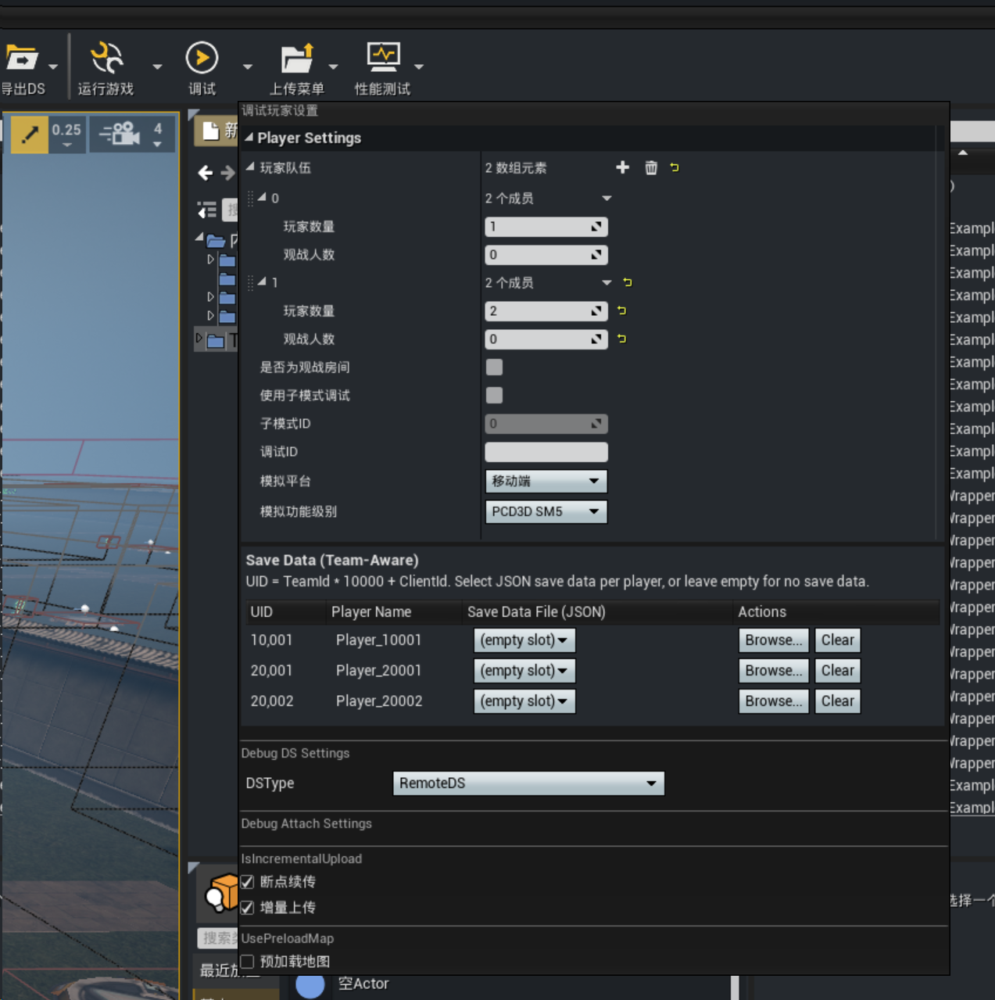
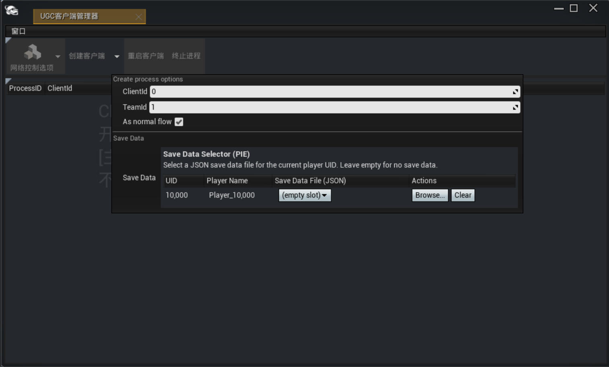

# PIE 本地存档

绿洲启元编辑器在 PIE（Play In Editor）模式下提供一套完整的存档系统：DS（Dedicated Server）侧的玩家存档数据可与本地 `.json` 文件双向同步，编辑器侧提供基于 UID 的存档选择器 UI，让每个 PIE 客户端在启动时独立指定使用哪份存档。本文档面向玩法开发者的日常 PIE 调试场景，覆盖 UID 计算规则、启动 PIE 时选档、运行中新增客户端、存档文件格式与排障日志关键词等关键链路。<br>

## 一、功能概述

UGC PIE 存档系统支持在 PIE 模式下，将 DS（Dedicated Server）上的玩家存档数据与本地文件互相同步，并提供基于 UID 的选择器 UI，让用户为每个 PIE 客户端独立指定使用哪份存档。

核心能力：

- **上传存档**：将本地 `.json` 存档文件上传到 DS，DS 接收后分块存储。
- **下载存档**：DS 主动推送存档数据到编辑器，编辑器写入本地 `.json` 文件，实现 PIE 跨局存档继承的能力。
- **多玩家支持**：每个 PIE 客户端持有独立 UID，可独立选择不同存档，互不干扰。

## 二、UID 计算规则

UID 是存档系统的核心标识，用于区分不同玩家的存档数据。
>本节主要面向排查 UID 冲突、理解存档文件名含义的场景；仅关心"如何选档 + 跑 PIE"的开发者可跳过本节。

### 2.1 普通玩家

```text
UID = TeamId × UIDMultiplier + ClientId
UIDMultiplier = 10000
```
其中 `UIDMultiplier = 10000`，为固定常量，目的是保证不同队伍的 UID 区段不重叠。

| 参数 | 类型 | 说明 |
|------|------|------|
| `TeamId` | `int32` | 队伍编号，从 `1` 开始 |
| `ClientId` | `int32` | 队伍内的客户端编号，从 `1` 开始 |
| `UIDMultiplier` | `int32` | 固定常量 `10000` |

示例：

| TeamId | ClientId | UID |
|--------|----------|-----|
| 1 | 1 | 10001 |
| 1 | 2 | 10002 |
| 1 | 3 | 10003 |
| 2 | 1 | 20001 |
| 3 | 1 | 30001 |

### 2.2 队伍内 OB（观察者）

OB 玩家的 UID 紧跟本队普通玩家 UID 之后分配，避免与普通玩家冲突：
```text
OB_UID = TeamId × UIDMultiplier + PlayerCount + OBIndex + 1
```
| 参数 | 类型 | 说明 |
|------|------|------|
| `TeamId` | `int32` | 队伍编号 |
| `PlayerCount` | `int32` | 该队伍中普通玩家总数 |
| `OBIndex` | `int32` | OB 在该队伍中的序号，从 `0` 开始 |
| `+1` | — | 偏移量保证 OB UID 紧跟最后一个普通玩家 UID |

示例：某队伍 `PlayerCount = 4`，OB 共 2 个（`OBIndex` 分别为 `0`、`1`）：

| TeamId | PlayerCount | OBIndex | OB_UID |
|--------|-------------|---------|--------|
| 1 | 4 | 0 | 10005 |
| 1 | 4 | 1 | 10006 |
| 2 | 4 | 0 | 20005 |

> `PlayerCount` 配置必须准确，否则 OB UID 会与下一 UID 区段的玩家产生冲突。

### 2.3 房间 OB

`RoomOB_UID = 10000`（固定值）

房间 OB 全局唯一，始终占用 `TeamId=1` 区段内、`ClientId=0` 之后的位置（`10000`），表示房间级别的观察者，与队伍内 OB 区分开。

## 三、启动 PIE 时使用存档

### 3.1 操作步骤

在编辑器中启动 PIE 调试时，通过 **PIE Client Manager Toolbar** 完成玩家配置与存档选择。

1. 在绿洲启元编辑器主界面打开 **PIE Client Manager Toolbar**（PIE 客户端管理工具栏）。
2. 在工具栏中配置本次 PIE 的玩家信息：`TeamCount`（队伍数）、`PlayerCount`（每队玩家数）、`OB` 数量等。
3. 为每个玩家（每个 UID 槽位）选择存档文件：
   - **ComboBox 下拉列表**：自动扫描本地 `ArchiveData` 目录下的 `.json` 文件，并以文件名（UID）形式列出可选存档。
   - **留空槽位**：表示不指定本地存档，系统在 DS Ready 后等待 DS 推送该 UID 的存档数据。
4. 点击 **Start** 启动 PIE，DS 启动后即按选择规则处理存档。



### 3.2 存档选择规则

| 槽位状态 | 处理动作 |
|----------|----------|
| 选择了一个本地 `.json` 文件 | 读取本地 `.json`，解析后上传到 DS，DS 分块存储。存档将以该本地文件内容为初始值。 |
| 留空（未选择） | 该 UID 加入「待拉取列表」；DS Ready 后，DS 主动推送存档数据到编辑器，编辑器写入本地 `.json` 文件（覆盖或新建，取决于本机是否已有同名文件）。 |

## 四、运行中加入新客户端

PIE 运行中如有新客户端加入，系统通过 **PIE Manager** 窗口单独处理新客户端的存档，**不影响已运行的存量客户端**。<br>

### 4.1 操作步骤

1. **新客户端 UID 自动计算**：根据 `TeamId`、`ClientId` 按普通玩家（§2.1）或 OB（§2.2）规则计算。
2. **追加到存档选择列表**：新 UID 槽位默认追加在列表末尾，默认状态为空（`（无）`），由开发者在工具栏中按需选择。
3. **针对单 UID 上传**：单独处理新增 UID 的上传，不影响已运行的其他客户端存档。
4. **存档服务未就绪处理**：若 DS 此刻未 Ready，该 UID 进入「待上传队列」，DS Ready 后由系统统一触发上传。



### 4.2 与「Start」场景的区别

| 场景 | 处理范围 | 对存量客户端影响 |
|------|----------|------------------|
| Start | 一次性处理所有 UID（含房间 OB） | — |
| 运行中 Join | 只处理新增的单一 UID | 完全不影响；存量客户端存档不会被重传或覆盖 |

## 五、存档文件

### 5.1 保存实机

存档文件将在开始存档请求[SavePlayerArchiveData](https://developer.gp.qq.com/api/#/searchContent/UGCPlayerStateSystem?classDetailShow=true&path=class%2Fdetail%2F%E5%92%8C%E5%B9%B3%E5%85%A8%E5%B1%80%E6%8E%A5%E5%8F%A3%2F%E8%A7%92%E8%89%B2%E7%B3%BB%E7%BB%9F%2FUGCPlayerStateSystem.json&isSelect=1&apiEnc=%5B%22%E7%B1%BB%22%5D&apiLabel=UGCPlayerStateSystem&autoJump=SavePlayerArchiveData)时，自动进行更新保存

### 5.2 保存目录

存档文件保存在项目 Saved 目录下的 `ArchiveData/{ProjectName}/` 目录：
```text
{ProjectSavedDir}/ArchiveData/{ProjectName}/{uid}.json
```
示例（含 OB 文件）：

```text
O:\O\Trunk\Saved\ArchiveData\MyProject\
    ├── 10000.json   # 房间 OB
    ├── 10001.json   # TeamId=1, ClientId=1 的存档
    ├── 10002.json   # TeamId=1, ClientId=2 的存档
    ├── 20001.json   # TeamId=2, ClientId=1 的存档
    └── 10005.json   # TeamId=1 的第一个 OB 存档
```

| 路径段 | 说明 |
|--------|------|
| `{ProjectSavedDir}` | 项目 Saved 目录，通常形如 `......\Saved\` |
| `ArchiveData` | 存档数据根目录，**固定名称** |
| `{ProjectName}` | 项目名称，用于隔离不同项目 |
| `{uid}` | 玩家 UID，作为文件名（按 §二 计算） |

### 5.3 文件格式

存档文件采用 JSON 格式，呈「三层嵌套」结构 `uid → seq → chunk object`，第三层为任意键值对：

```json
{
  "10001": {
    "1": {
      "write_count": 5,
      "timestamp": 1785407758
    }
  }
}
```

| 层级 | 键类型 | 说明 |
|------|--------|------|
| 第一层 | `uid` (`string`) | 玩家 UID。**JSON 中使用字符串键**，即便 UID 是数字 |
| 第二层 | `seq` (`string`) | 分块序号，从 `1` 开始递增 |
| 第三层 | 任意键 | 分块数据。键和值的含义由游戏逻辑定义，无固定字段模式 |

## 六、常见使用场景

### 场景一：单人功能测试

- **配置**：1 队 1 人；UID = `10001`
- **存档选择**：可选一份现成本地 `.json`（覆盖），或留空从 DS 拉取
- **适用**：单人功能验证、存档读写调试、断点排查

### 场景二：多人对战测试

- **配置**：2 队各 4 人；UID `10001~10004`、`20001~20004`
- **存档选择**：每个 UID 可独立选档，便于复现「队伍 A 有背包、队伍 B 无背包」这种非对称初始状态
- **适用**：多人对战逻辑测试、存档隔离验证

### 场景三：带观察者测试

- **配置**：1 队 4 玩家 + 2 OB + 1 房间 OB
  - 普通玩家 UID：`10001~10004`
  - 队伍内 OB UID：`10005`、`10006`
  - 房间 OB UID：`10000`
- **适用**：观战系统测试、OB 端存档独立性验证、OB 行为与玩家行为差异验证

## 七、注意事项

- **编码一致性**：本地存档必须为 **UTF-8** 编码的 JSON 文件，否则解析失败，会导致 DS 端拒绝存储或读取异常。
- **UID 唯一性**：`UIDMultiplier=10000` 保证普通玩家 UID 区段不重叠；OB UID 紧跟本队普通玩家，**`PlayerCount` 配置必须准确**（少配会导致 OB UID 与下一 UID 区段的玩家产生冲突）。
- **存档文件清理**：系统**不会自动删除** `ArchiveData` 目录下的旧存档，需开发者手动清理；残留旧文件可能导致下次 PIE 自动加载到非预期的存档。
- **PIE 运行中 Join 的存量保护**：§四的 Join 流程只处理新 UID，**不会**触发存量 UID 的存档重传或覆盖，请勿担心 Join 操作影响已在跑的客户端。

## 八、诊断与排障

存档系统在日志中提供以下关键关键词，便于 QA / 开发者排查问题。建议在 PIE 启动前打开 [PIE 日志面板](../../性能优化及异常处理/20353_PIE日志面板.md)，用关键词过滤存档相关事件：

| 日志关键词 | 含义 |
|------------|------|
| `[UGCSaveData] LogUidListSummary` | 输出本次 PIE 注册的所有 UID 概览（`UIDCount`、`UIDs` 排序列表、`Changed` 标志） |
| `[UGCSaveData] ValidateChunkDataTable` | 验证上传前存档分块数据完整性（`SeqCount`、`ValidChunks`、`InvalidChunks`） |
| `[UGCSaveData] BuildChunkDataSummary` | 生成存档数据结构化摘要，避免日志过长；超过上限时截断并标注 `...（共 N 个，仅显示前 M 个）` |

> 摘要默认上限：最多展示 6 个 UID 的详细数据、每个 UID 最多 6 个分块、每个分块最多 8 个字段。日志不全时，可在 PIE 日志面板调整过滤或提高日志等级。

排查思路参考：

1. **存档未上传 / ComboBox 选了文件但 DS 端没有读到**：先看 `LogUidListSummary` 是否包含该 UID；再看 `ValidateChunkDataTable` 是否有 `InvalidChunks`；最后检查本地 `.json` 编码是否为 UTF-8。
2. **DS 端有存档但 PIE 客户端没有拉到**：先看 PIE 是否运行到 DS Ready 之后；再看是否有 `[UGCSaveData]` 拉取类日志（如有 `Pull From DS`）；如仍无日志，可参考 [PIE 调试失败原因与解决方案](../../常见问题/20391_PIE调试失败原因与解决方案.md)。
3. **存档加载到错误的 UID**：核对 `PlayerCount` / `TeamCount` 配置与 §二的 UID 公式，常见错误是 `PlayerCount` 配少了导致 OB UID 撞到下一 UID 区段。
