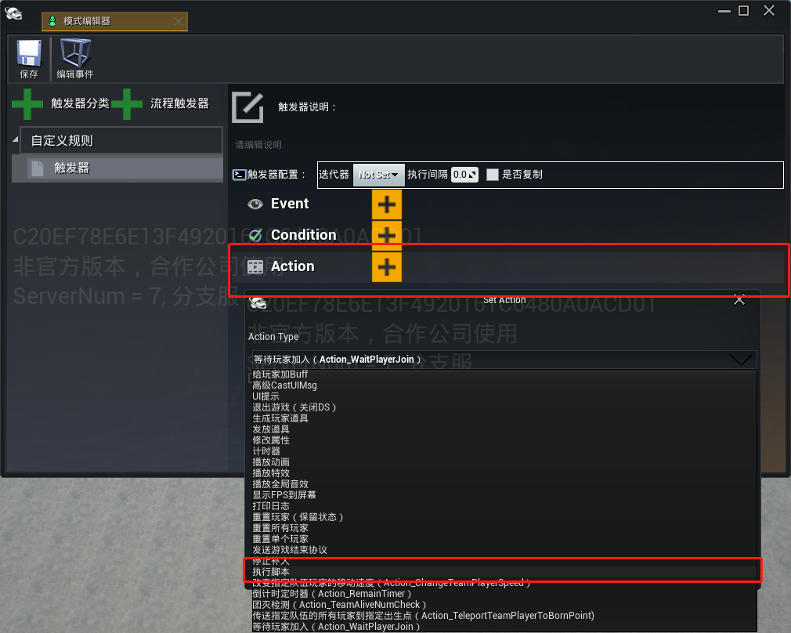
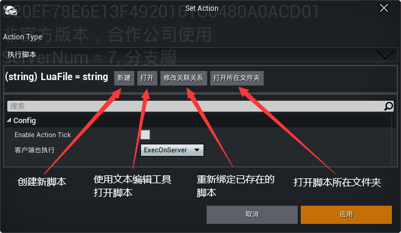
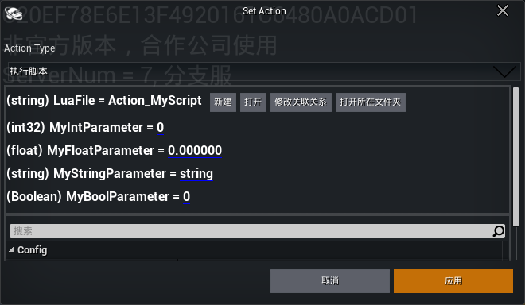
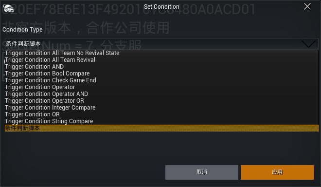
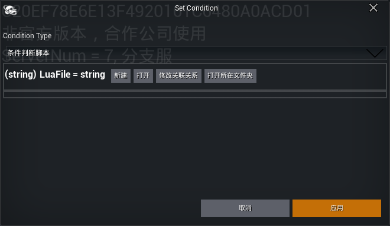
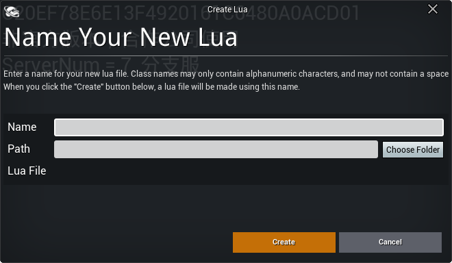
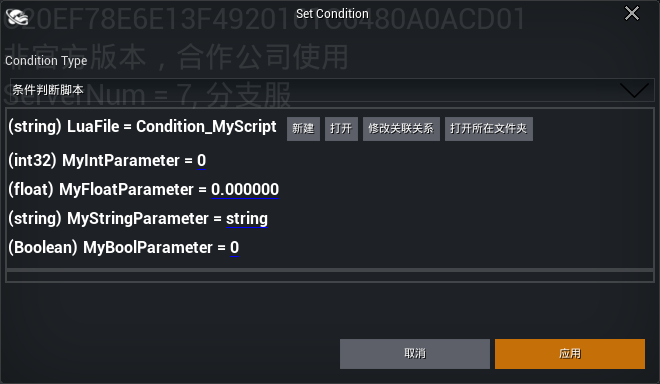

# 使用脚本创建全新的规则

在使用模式编辑器创建游戏规则时，可以使用lua脚本来自定义触发器的动作和条件，从而更加灵活自由地自定义游戏的规则。

## 创建Action脚本

---

### 1. 创建执行脚本Action

编辑触发器的Action，选择执行脚本的Action。





---

### 2. 创建Action脚本

新建脚本需要填写脚本名称和放置路径，点击Create将创建脚本并将新建的脚本绑定至Action。


---

### 3. 绑定Action脚本

也可以先在文件夹中实现lua脚本，然后将lua脚本绑定至Action。
默认情况下，Action脚本放置路径为：项目目录\Script\gamemode

---

### 4.实现脚本逻辑

---

在触发器中创建的每个Action都是一个Action对象，Action对象由触发器来进行管理，所以创建Action脚本的过程就是创建各种Action类。

### 5.Action类

触发器在激活时，将使用Action对象中固定的接口来处理Action对象的行为。

```
local Action_MyScript =
{
    -- Action参数
    ...
}

-- 触发器激活时，调用Action的Execute
function Action_MyScript:Execute()

    ...

    return true;
end

-- 触发器激活后，若Action打开了tick，那么将在每个tick调用Action的Update，直到Action关闭tick
function Action_MyScript:Update(DeltaTime)

    ...

end

return Action_MyScript
```

---

### 6.参数定义

在Action类中，可以定义配置参数。在Action类中定义的配置参数，会自动显示在Action配置界面中，并根据默认值显示参数类型。

```
local Action_MyScript =
{
    -- Action参数
    MyIntParameter = 0;         --整型参数
	MyFloatParameter = 0.0;     --浮点数参数
    MyStringParameter = "";     --字符串参数
    MyBoolParameter = false;    --布尔参数
    ...
}

...

end

return Action_MyScript
```

---



## 创建Condition脚本

---

### 1. 添加条件判断脚本

编辑触发器的Condition，选择条件判断脚本。





---

### 2. 创建Condition脚本

新建脚本需要填写脚本名称和放置路径，点击Create将创建脚本并将新建的脚本绑定至Action。



---

### 3. 绑定Condition脚本

也可以先在文件夹中实现lua脚本，然后将lua脚本绑定至Condition。

默认情况下，Condition脚本的放置路径也是：项目目录\Script\gamemode

### 4.实现脚本逻辑

在触发器中创建的每个Condition同样也是一个Condition对象，Condition对象由触发器来进行管理，所以创建Condition脚本就是创建各种Condition类。

### Condition类

触发器在激活时，将调用Condition对象中固定的接口，并通过返回的值来判断是否要执行触发器。

```
local Condtion_MyScript =
{
    --Conditon参数
    ...
}

function Condtion_MyScript:IsSatisfy()
    if ... then
        ...
        return true
    else
        ...
        return false
    end
    ...
    return false
end

return Condtion_MyScript
```

---

### 5.参数定义和配置

在Condition类中，定义和配置参数与Action脚本完全相同，参数也会自动显示在模式编辑器的Condition配置界面中。

```
local Condtion_MyScript =
{
    -- Conditon参数
    MyIntParameter = 0;         --整型参数
	MyFloatParameter = 0.0;     --浮点数参数
    MyStringParameter = "";     --字符串参数
    MyBoolParameter = false;    --布尔参数
    ...
}

...

return Condtion_MyScript
```



---

## 游戏接口

在脚本中，可以使用绿洲启元编辑器提供的接口访问绿洲启元编辑器游戏逻辑框架中其他的功能模块。
[UGC专用接口库 (qq.com)](https://developer.gp.qq.com/api/#/)
