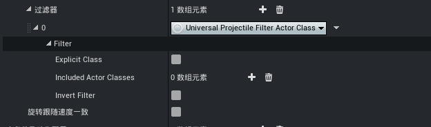
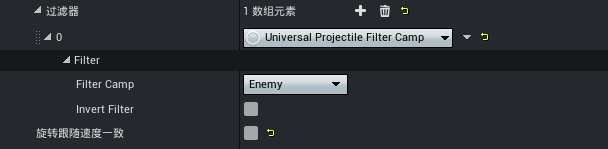
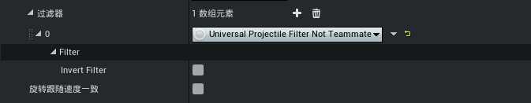
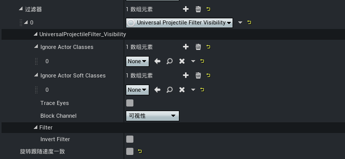
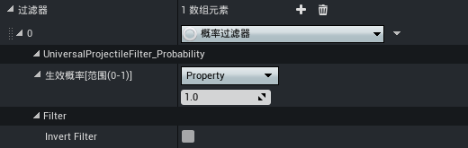
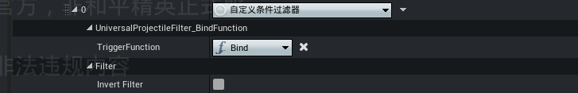
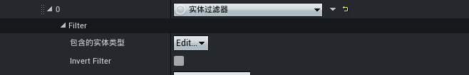

# 通用过滤器

通用过滤器从给定的输入内容经过指定的过滤方式和筛选条件，输出满足要求的结果集，适合作为属性组配置应用在需要筛选结果的功能蓝图中。

## 过滤条件

过滤器输出结果的必要条件，结果依应用场景的语境不同而具备不同的含义，通常条件包含两种：

- 全部满足：所有的过滤器条件全部满足才能作为输出结果
- 满足任意一个：满足任意一个过滤器条件即可作为输出结果之一

## 过滤类型

### Actor类过滤器

按指定的Actor类进行目标过滤。

- Explicit Class：当启用该选项时，系统将仅检测当前指定的Actor类；否则，检测范围会自动包含Actor类的所有派生子类
- Included Actor Classes：指定的Actor类列表
- Invert Filter：是否对过滤结果取反

---

### 阵营过滤器

基于阵营对目标进行过滤。

- Filter Camp：仅选择该阵营的目标
- Invert Filter：是否对过滤结果取反

---

### 非队友过滤器

过滤目标是否排除队友。

- Invert Filter：是否对过滤结果取反，即允许选择队友

---

### 可见性过滤器

基于射线检测的方法对Actor对象的可见性进行目标过滤。

- Ignore Actor Classes：在射线检测时忽略的特定Actor类
- Ignore Actor Soft Classes：射线可见性检测忽略的Actor类（软引用），通常建议配置此参数
- Trace Eyes：若勾选，则射线从眼球为起点发射；否则，从Pawn位置为起点发射
- Block Channel: 会阻挡可见性的通道类型
- Invert Filter：是否对过滤结果取反，即选择不可见的目标

---

### 概率过滤器

每次检测时，系统将根据预设的概率，随机返回 True 或 False 。

- 生效概率：该过滤器每次检测，有多大的概率为True，支持 [属性绑定](../进阶内容/GamePlay系统/技能系统/20108_技能属性绑定.md)
- Invert Filter：是否对随机结果取反

> 属性绑定数据类型：float

---

### 自定义条件过滤器

允许绑定一个返回布尔值的外部函数，执行过滤时，将调用此函数，并将其返回值直接作为过滤结果。

- TriggerFunction：该过滤器绑定的自定义函数
- Invert Filter：是否对返回值的结果取反

---

### 实体过滤器

根据预设的实体类型列表进行检测，若目标的实体类型匹配列表中任一类型，则返回true。

- 包含的实体类型：需要配置实体类型对应的不同 [GameplayTag](../进阶内容/GamePlay系统/20102_Gameplay标签.md)
- Invert Filter：是否对匹配的结果取反
