# 假人系统

本文档将介绍绿洲启元 UGC 编辑器 “假人（人机）” 如何配置实现以及使用说明。

---

## 概述

假人/人机（FakePlayer）是绿洲启元 UGC 编辑器 “”提供的一种 AI 控制的角色，外观和行为类似真人玩家，可用于：

- 填充对局人数：在玩家不足时补充队伍成员
- PvE 对手：作为敌人供玩家对抗
- 靶场训练：作为射击训练的标靶
- 剧情 NPC：在场景中扮演特定角色
- 陪玩/引导：辅助新手玩家上手

### 假人支持的功能

|能力|说明|
|-|-|
|移动（走/跑/蹲/趴）|通过行为树控制|
|射击/换弹/切武器|需配置武器和弹药|
|近战攻击|需在蓝图中开启近战组件|
|投掷物（手雷等）|需背包中有投掷物|
|使用药品/饮料|需背包中有对应物品|
|阵营敌我识别|通过队伍和阵营系统配置|
|转身朝向目标|UGC 专属能力|
|自定义行为树|可配置自定义行为树，配置方式见下文|

## 配置假人

### 创建假人模板

在 **实体编辑器** 中的 **假人** 页签下可以看到预制的 通用控制器模板 与 通用角色模板，分别为这两个模板创建蓝图。

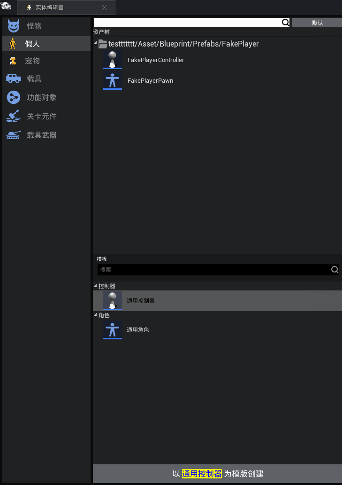

对创建好的 假人控制器 配置 假人角色

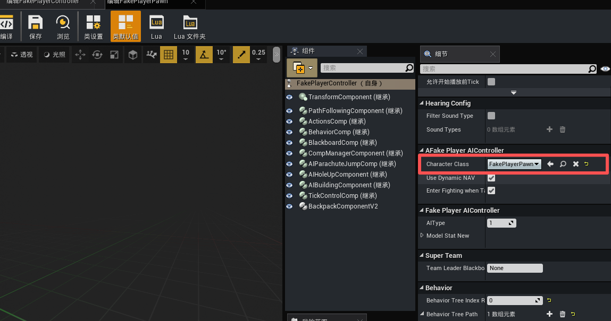

### 假人 Controller 配置

#### AI 类型配置

在细节面板找到 **AI** 配置项下找到 `AI类型` 。有三种可选配置：

|值|说明|应用场景|
|-|-|-|
|DefaultFakePlayer|默认假人|UGC 玩法通用|
|EscapeFakePlayer|逃脱模式假人|仅逃脱子模式使用|
|LostTombFakePlayer|失落古墓模式假人|仅古墓子模式使用|

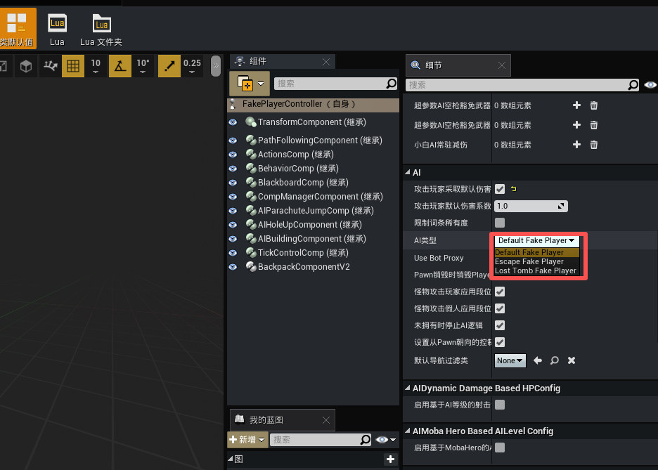

------------------------------------

#### 默认伤害系数配置

在细节面板找到 **AI** 配置项下打开 `攻击玩家采取默认伤害系数（bUseDefaultDamageScale）`开关,并按照需求修改 `攻击玩家默认伤害系数` :

|难度|推荐值|说明|
|-|-|-|
|新手友好|0.3~0.5|给玩家充分容错|
|普通难度|0.7~1.0|接近真人对抗|
|硬核难度|1.2~1.5|高压迫感|
|靶场练习|0.0|假人只展示不伤害|

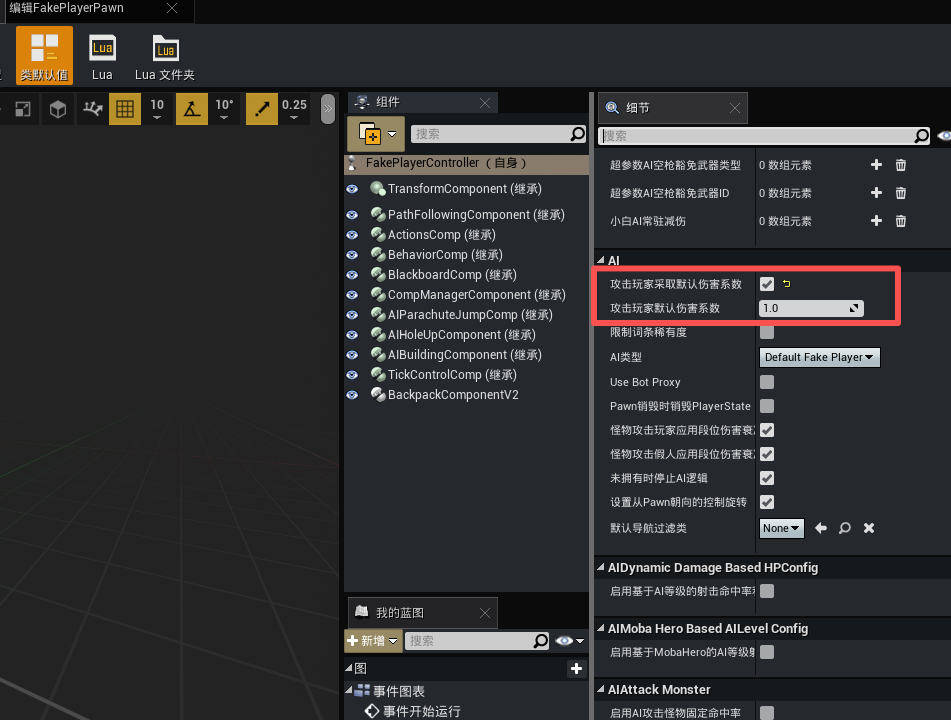

>必须配合 UGC 工程的全局伤害公式正确配置，确保伤害公式兼容 AIController，否则假人攻击会无效

------------------------------------

#### 初始随机装备

在细节面板找到 **Config** 配置项下添加 `初始随机装备`，从配置的多个组中随机选一组发放。

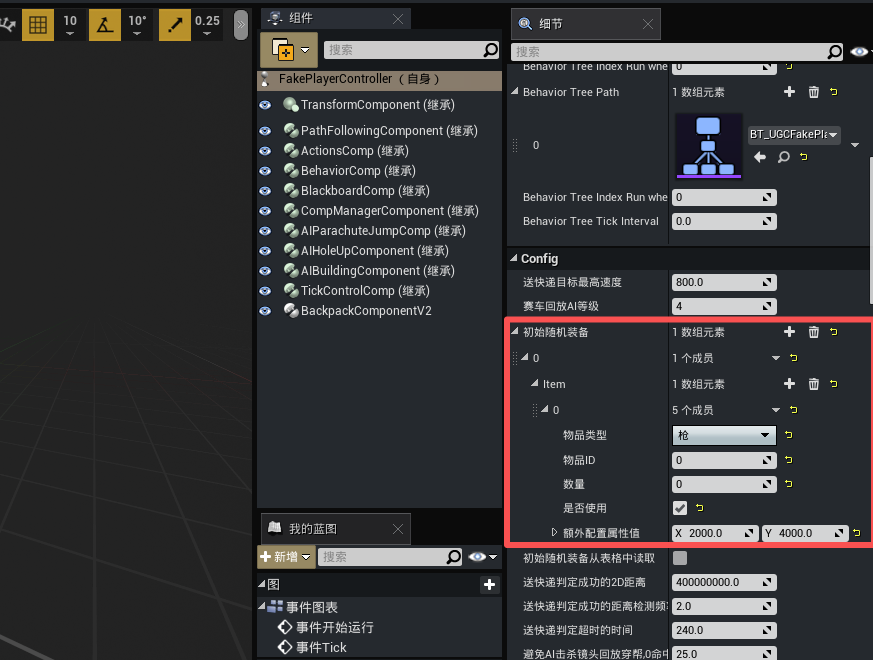

|字段|说明|
|-|-|
|物品类型|武器选"枪"（Shoot_Weap）；背包选"背包"（Backpack）；弹药/配件/药品/投掷物选"其他物品"（other）。只有选"枪"才会触发黑板武器变量更新，其余两种运行时无差异|
|物品ID|填写物品表中的 TypeSpecificID（如 831101001）。填 0 会被拦截报错|
|数量|武器填 1，弹药/药品填实际数量|
|是否使用|true = 拾取后自动装备/使用；false = 仅入背包不自动装备。武器/防具/背包填 true，弹药/配件可填 false|
|额外配置属性值|已废弃，填默认值 (2000, 4000) 即可，不影响任何逻辑|

### 配置GameMode

打开 `UGCGameMode` 蓝图，该蓝图默认位于工程的 `Asset/Blueprint` 目录下。

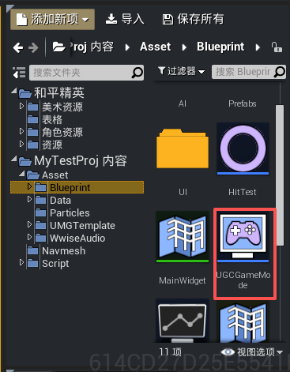

在细节面板找到 `UGCGame Mode Base` 分类,将 `UGCAIController` 字段设置为刚才创建的模板蓝图

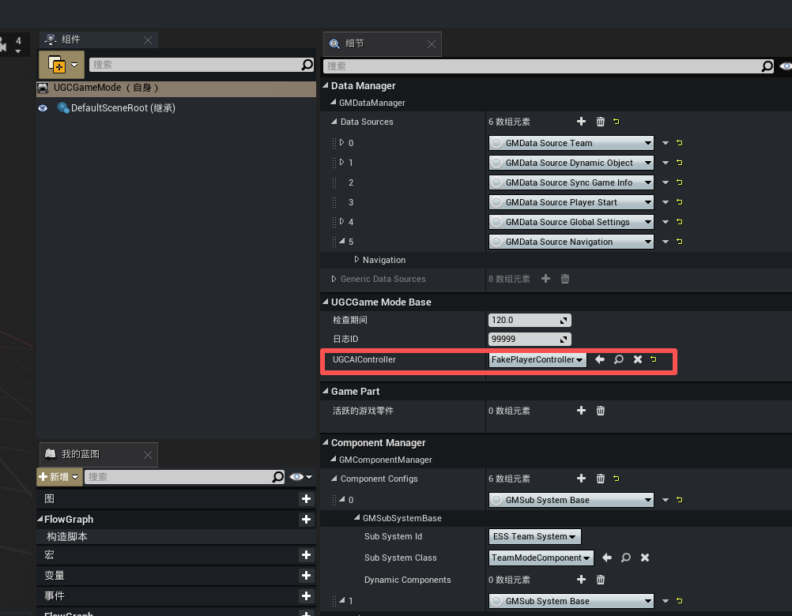

### 队伍与阵营配置

假人的敌我识别通过两层体系实现：队伍（TeamID） → 阵营（CampID） → 阵营关系（友好/中立/敌对）

- 队伍：假人属于哪个队伍，通过 TeamID 标识
- 阵营：队伍属于哪个阵营，通过 CampID 标识
- 阵营关系：不同阵营之间的关系（友好/中立/敌对），决定假人是否能攻击对方

假人的阵营不能直接在细节面板配置，必须通过 UGCCampSystem 设置队伍与阵营的映射关系。

**创建阵营**

``` Lua
-- 创建名为"红方"的阵营，返回 CampID
local RedCampID = UGCCampSystem.AddCamp("红方")

-- 创建名为"蓝方"的阵营
local BlueCampID = UGCCampSystem.AddCamp("蓝方")
```
**设置队伍所属阵营**
``` Lua
-- 队伍 1 属于红方阵营
UGCCampSystem.SetCampForTeam(1, RedCampID)

-- 队伍 2 属于蓝方阵营
UGCCampSystem.SetCampForTeam(2, BlueCampID)
```

**设置阵营关系**

``` Lua
-- 红方和蓝方为敌对关系（3=敌对）
UGCCampSystem.SetCampRelation(RedCampID, BlueCampID, 3)

-- 设置默认阵营关系为中立（2=中立）
UGCCampSystem.SetDefaultCampRelation(2)
```

|阵营关系值|含义|
|-|-|
|1|友好|
|2|中立|
|3|敌对|

**生成时设置假人队伍**

在 `SpawnFakePlayer` 时传入 TeamID：

``` Lua
-- 生成队伍 1 的假人
UGCFakePlayerSystem.SpawnFakePlayer(AIPlayerKey, 1)

-- 生成队伍 2 的假人
UGCFakePlayerSystem.SpawnFakePlayer(AIPlayerKey2, 2)
```

**运行时修改队伍**

``` Lua
-- 将假人切换到队伍 2
UGCTeamSystem.ChangePlayerTeamID(FakePlayerKey, 2)
```

> 假人的阵营通过 TeamID → CampID 映射表动态查询，必须使用 UGCCampSystem.SetCampForTeam 注册映射关系，否则假人的 GeneralCampID 会返回 -1，导致阵营关系与伤害结算失效

### 背包与道具管理

本版本人机不接入 V2 背包，只保留经典背包 `UGCBackPackSystem`。

**添加道具**

``` Lua
-- 给假人添加 1 个物品
UGCBackPackSystem.AddItem(FakePlayerPawn, ItemID, 1)

-- 给假人添加 10 个弹药
UGCBackPackSystem.AddItem(FakePlayerPawn, AmmoItemID, 10)
```

**使用道具**

``` Lua
-- 假人使用药品
UGCBackPackSystem.UseItem(FakePlayerPawn, MedicineItemID)
```

**停止使用道具**

``` Lua
-- 假人停止使用药品
UGCBackPackSystem.DisuseItem(FakePlayerPawn, MedicineItemID)
```

**掉落道具**

``` Lua
-- 假人掉落 1 个物品到地面
UGCBackPackSystem.DropItem(FakePlayerPawn, ItemID, 1, false)

-- 假人直接销毁 1 个物品（不掉落地面）
UGCBackPackSystem.DropItem(FakePlayerPawn, ItemID, 1, true)
```

**查询物品数量**

``` Lua
-- 查询假人背包中有多少个指定物品
local Count = UGCBackPackSystem.GetItemCount(FakePlayerPawn, ItemID)
```

**获取背包组件**

``` Lua
-- 获取假人的背包组件
local BackpackComp = UGCBackPackSystem.GetBackpackComponent(FakePlayerPawn)
```

**按子类型/类别查询（经典背包扩展能力）**

``` Lua
-- 获取所有武器
local Weapons = UGCBackPackSystem.GetWeaponListInBackpack(FakePlayerPawn)

-- 获取所有消耗品
local Consumables = UGCBackPackSystem.GetAllConsumableDataInBackpack(FakePlayerPawn)

-- 判断物品是否为枪械
local IsGun = UGCBackPackSystem.IsGun(FakePlayerPawn, ItemID)
```

### 行为树配置

在 **实体编辑器** 打开之前创建好的 `通用控制器` 蓝图，在细节面板中找到 `Behavior` 配置可以发现，绿洲编辑器默认预制了一个可使用的假人行为树 `BT_UGCFakePlayer`

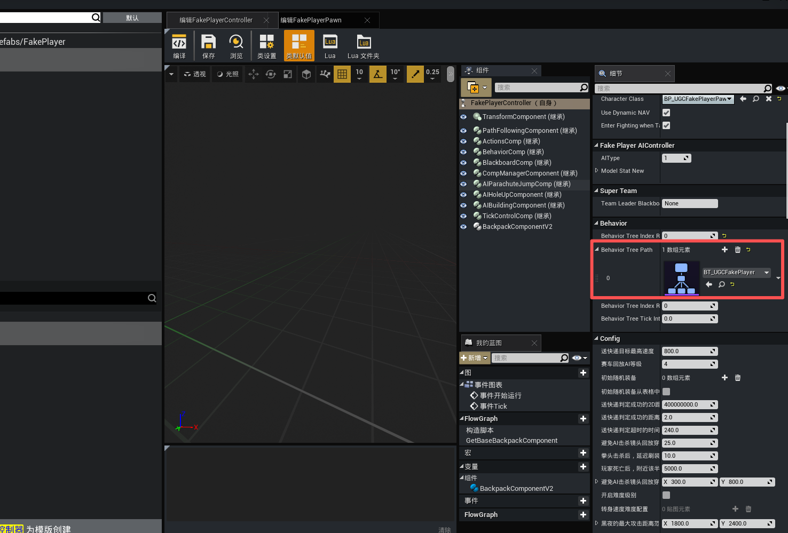
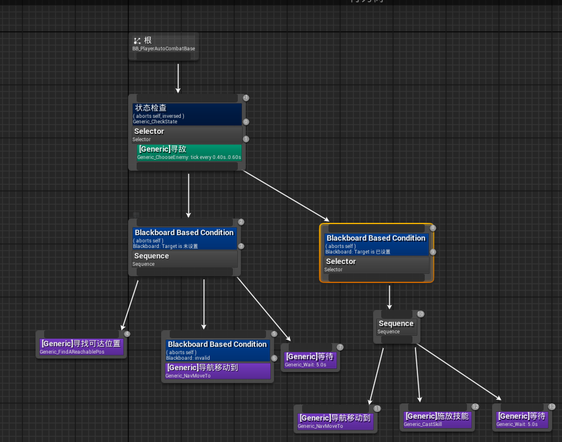

**自定义行为树**

若需使用自定义行为树：
- 确保行为树使用的黑板包含 `TargetEnemyActor` / `IsCanNotSeeTarget` 两个键
- 在行为树中添加 `FakeCharacter` → `寻敌服务` 节点
- 将该行为树资产赋值到 `BP_UGCFakePlayerController` 的 `Behavior Tree Path[0]`

**假人行为树节点**

假人共 9 个专用行为树节点，全部位于 FakeCharacter 编辑器分类下。所有参数详解、行为机制请参考下文 `行为树节点说明`

|节点类型|外显名称|用途|
|-|-|-|
|Service|寻敌|搜索敌人并写入黑板|
|Decorator|弹药是否充足|判断当前武器弹药是否足够|
|Decorator|当前姿势|判断假人当前是否为指定姿势|
|Task|收枪|装备或收枪|
|Task|移动|移动到黑板值定目标|
|Task|换单|执行换弹动作|
|Task|设置姿势|切换站/蹲/趴/跳|
|Task|开火|朝目标开火（含自动换弹）|
|Task|切换武器|切换到指定武器槽|

## API说明

- 假人相关所有接口仅在服务器（DS）端生效，客户端调用无效
- 假人生成后不要立即操作，可能有几秒延迟，建议通过定时器延迟操作
- 假人生成后会自动出现在队伍列表中（PC 模拟器中可见），如需隐藏需自行处理 UI

### 生成随机 AIPlayerKey

[GetRandomAIPlayerKey](https://developer.gp.qq.com/api/#/searchContent/UGCFakePlayerSystem?classDetailShow=true&path=class%2Fdetail%2F%E5%92%8C%E5%B9%B3%E5%85%A8%E5%B1%80%E6%8E%A5%E5%8F%A3%2F%E6%80%AA%E7%89%A9%E7%B3%BB%E7%BB%9F%2FUGCFakePlayerSystem.json&isSelect=1&apiEnc=%5B%22%E7%B1%BB%22%5D&apiLabel=UGCFakePlayerSystem&autoJump=GetRandomAIPlayerKey) ：生成随机AIPlayerKey，用于UGCFakePlayerSystem.SpawnFakePlayer接口参数

### 生成假人 SpawnFakePlayer

|参数|说明|
|-|-|
|AIPlayerKey|假人唯一标识，建议用 `GetRandomAIPlayerKey` 生成|
|TeamID|队伍 ID，必须大于 0 |

### 销毁假人 DestroyFakePlayer

|参数|说明|
|-|-|
|AIPlayerKey|要销毁的假人的 AIPlayerKey|

## 假人行为树节点说明

### Service 节点

**寻敌服务**

每帧（Tick）自动运行，搜索场景中的潜在敌人并写入黑板变量。

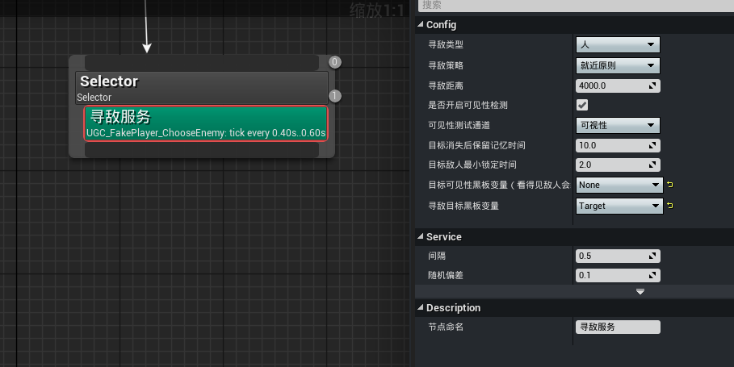

参数说明：

|参数（显示名）|类型 / 可选值|说明|
|-|-|-|
|寻敌类型 ChooseEnemyType|枚举：人 怪物 人和怪物 / 怪物和人|决定搜索哪类目标。只能选「人」|
|寻敌策略 ChooseEnemyStrategy|枚举：就近原则 / 范围内随机原则|多个候选时如何选|
|寻敌距离 SenseRadius|浮点（厘米）|候选目标的最大距离（40 米）|
|是否开启可见性检测 bCheckVisibility|布尔|开启后，遮挡的目标不会被选中|
|可见性测试通道 TraceTestChannel|碰撞通道|做视线射线检测时使用的碰撞通道|
|目标消失后保留记忆时间 MemoryTime|浮点（秒）|看不见目标后最多记忆多久|
|目标敌人最小锁定时间 MinTimeLockTarget|浮点（秒）|锁定后最少保持多久不切换|
|目标可见性黑板变量 OutIsCanNotSeeTarget|黑板键（Bool）|写入「是否看不见」|
|寻敌目标黑板变量 OutTargetEnemyActor|黑板键（Object/Actor）|写入「找到的敌人 Actor」|

>寻敌类型只能选「人」：怪物 人和怪物 怪物和人 等选项当前不适用——编辑器中的怪物仍为老版怪物。如需假人攻击新版怪物，请自行实现自定义服务节点

### Decorator 节点

**弹药是否充足**

判断当前武器的弹药是否达到指定百分比，常用于「无弹时换弹」「弹药低时撤退」等分支条件。

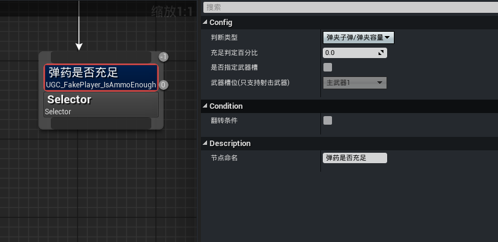

参数说明：

|参数|类型 / 可选值|说明|
|-|-|-|
|判断类型 AmmoEnoughType|枚举：弹夹子弹/弹夹容量 / 背包子弹/弹夹容量|用弹夹内子弹数还是背包内总弹药数对比|
|充足判定百分比 EnoughPercent|浮点（0-100）|当前弹药百分比 ≥ 此值视为充足|
|是否指定武器槽 bSpecifyWeaponSlot|布尔|是否只判断某个特定槽位的武器弹药|
|武器槽位 WeaponSlot|枚举（仅射击武器槽）|要判断的武器槽位（仅当勾选指定武器槽时生效）|

------------------------------------

**当前姿势**

判断假人 Pawn 当前的姿势状态。

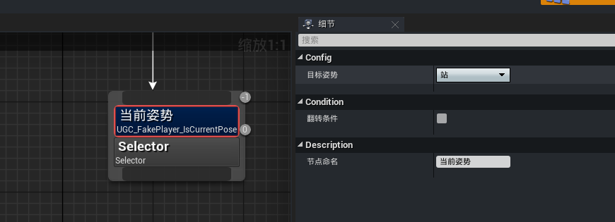

参数说明：

|参数|类型 / 可选值|说明|
|-|-|-|
|目标姿势 Pose	|枚举：站/蹲/趴/跳/左侧身/右侧身|要判断的姿势|

### Task 节点

**收枪**

装备主武器槽 1 → 2 → 副武器，或收枪。

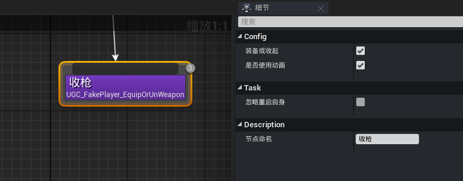

参数说明：

|参数|说明|
|-|-|
|装备或收起 Equip|true=装备武器；false=收枪|
|是否使用动画|装备武器/收枪时是否使用动画|

------------------------------------

**移动**

将假人移动到黑板指定的目标位置（Actor 或 Vector）。

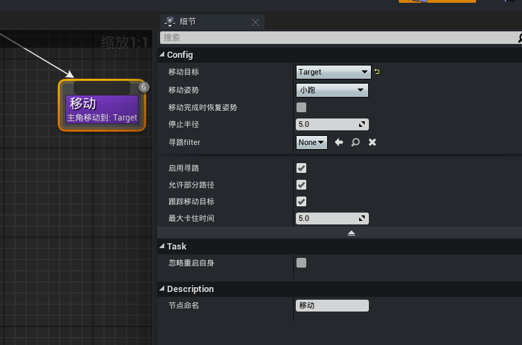

参数说明：
|参数|类型/可选值|说明|
|-|-|-|
|移动目标 TargetBlackboardKey|黑板键（Object/Actor 或 Vector）|要移动到的目标|
|移动姿势 MovePose|枚举：小跑/疾跑/蹲疾跑/保持当前姿势 |移动时使用的姿势|
|移动完成时恢复姿势 bRestorePoseAfterFinished|布尔|任务结束后是否恢复到执行前的姿势|
|停止半径 AcceptableRadius|浮点（厘米）|视为到达目标的半径|
|寻路filter FilterClass|NavigationFilter类|寻路时使用的过滤器（仅 bUsePathFinding=true 时生效）|
|启用寻路 bUsePathFinding|布尔|是否使用 NavMesh 寻路|
|允许部分路径 bAllowPartialPath|布尔|找不到完整路径时是否接受部分路径（仅 bUsePathFinding=true 时生效）|
|跟踪移动目标 bTrackMovingGoal|布尔|目标为 Actor 时，是否持续跟踪其移动（否则锁定到目标当前坐标）|
|最大卡住时间 MaxBlockTime|浮点（秒）|速度持续为 0 超过此值则任务失败|

------------------------------------

**换弹**

让假人执行换弹动作。

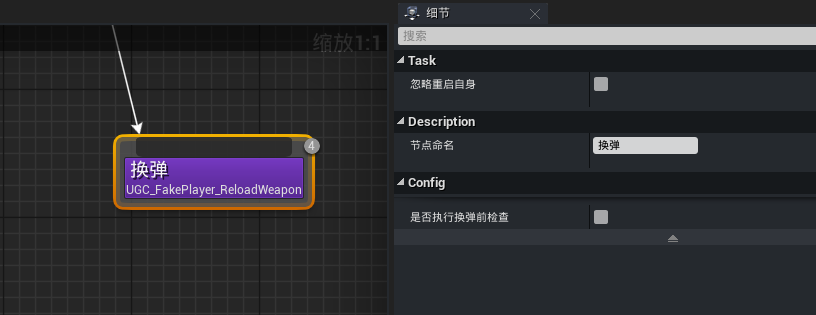

参数说明：
|参数|说明|
|-|-|
|是否执行换弹前检查 bJudgeBeforeReload|是否仅在「必须换弹」时才执行|

------------------------------------

**设置姿势**

将假人切换到指定姿势（站/蹲/趴/跳）。

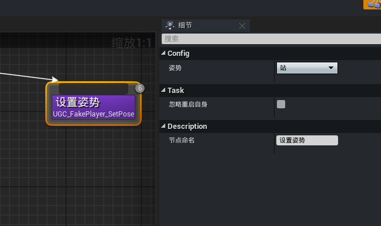

参数说明：
|参数|类型/可选值|说明|
|-|-|-|
|姿势 Pose|枚举：站/蹲/趴/跳/左侧身/右侧身/结束侧身|目标姿势|

------------------------------------

**开火**

朝目标开火，支持精准度调节和自动换弹。

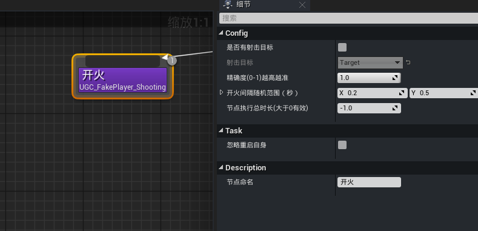

参数说明：
|参数|类型 / 可选值|说明|
|-|-|-|
|是否有射击目标 bHasShootingTarget|布尔|是否指定目标 Actor（不勾选则朝正前方开火）|
|射击目标 TargetBlackboardKey|黑板键（Object/Actor）|目标 Actor（仅 bHasShootingTarget=true 时生效）|
|精确度(0-1)越高越准 Precision|浮点（0-1）|命中的概率。1=全部命中；0.3=仅 30% 概率命中（其余落点在目标周围矩形）|
|开火间隔随机范围（秒） RandomShootFreqRange|Vector2D（X,Y）|两次开火之间的随机间隔区间|
|节点执行总时长(大于0有效) Duration|浮点（秒）|设置后任务在该时长后自动完成（≤0 表示无限时长）|

------------------------------------

**切换武器**

将假人切换到指定武器槽位的武器。

 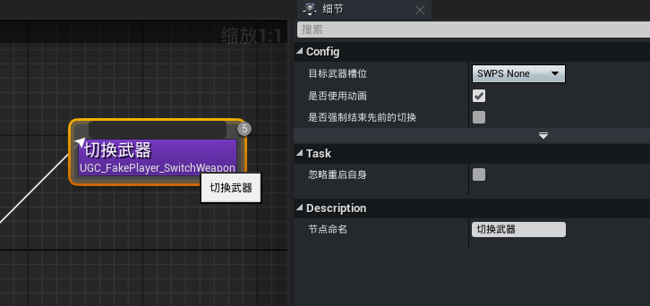

参数说明：

|参数|类型 / 可选值|说明|
|-|-|-|
|目标武器槽位 WeaponSlot|枚举（武器槽位）|要切换到的武器槽位|
|是否使用动画 bUseAnimation|布尔|是否播放切枪动画|
|是否强制结束先前的切换 bForceFinishPreviousSwitch|布尔|强制打断上一次正在进行的切枪动作|
|切换超时时间 SwitchTimeout|浮点（秒）|切枪动作总超时时间（Advanced）|
|状态结束延迟时间 StateEndDelayTime|浮点（秒）|切枪状态结束后延迟多久完成任务（Advanced）|
